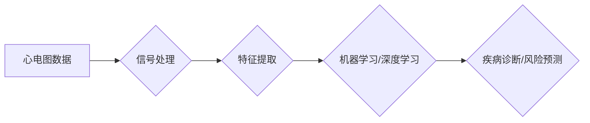

> 心电图，信号处理，机器学习，深度学习，医疗诊断，数据分析，时间序列

## 1. 背景介绍

心电图（ECG，Electrocardiogram）作为一种非侵入性的诊断工具，在临床医学中扮演着至关重要的角色。它能够记录心脏的电活动，帮助医生诊断各种心脏疾病，例如心律失常、心肌梗塞、心衰等。随着医疗技术的进步和数据分析能力的增强，心电图数据研究领域迎来了新的发展机遇。

传统的ECG诊断主要依赖于医生的经验和专业知识，但这种方法存在着主观性、效率低下等问题。而数据驱动的方法，例如机器学习和深度学习，能够从海量的心电图数据中提取特征，建立疾病诊断模型，提高诊断的准确性和效率。

## 2. 核心概念与联系

心电图数据本质上是一种时间序列数据，其特点是随时间变化的电信号。为了进行有效的分析和处理，我们需要了解以下核心概念：

* **心电图波形：** 心电图波形由不同的电活动组成，例如P波、QRS波、T波等，每个波形代表心脏的不同阶段。
* **心率和心律：** 心率是指心脏每分钟跳动的次数，心律是指心脏跳动的规律性。
* **心电图信号处理：** 为了消除噪声和提取有用的信息，需要对心电图信号进行滤波、去趋势化等处理。
* **机器学习和深度学习：** 这些技术能够从数据中学习模式和规律，用于疾病诊断、风险预测等。

**核心概念与联系流程图：**



## 3. 核心算法原理 & 具体操作步骤

### 3.1  算法原理概述

在心电图数据分析中，常用的算法包括：

* **主成分分析（PCA）：** 用于降维，提取心电图信号的主要特征。
* **支持向量机（SVM）：** 用于分类，识别不同的心电图类型。
* **随机森林（RF）：** 用于分类和回归，预测心脏疾病的风险。
* **卷积神经网络（CNN）：** 用于图像识别，可以应用于心电图波形的识别和分析。

### 3.2  算法步骤详解

以支持向量机为例，其算法步骤如下：

1. **数据预处理：** 对心电图数据进行清洗、去噪、归一化等处理。
2. **特征提取：** 从心电图信号中提取特征，例如心率、心律、波形形态等。
3. **模型训练：** 使用训练数据训练SVM模型，找到最佳的分类边界。
4. **模型评估：** 使用测试数据评估模型的性能，例如准确率、召回率、F1-score等。
5. **模型部署：** 将训练好的模型部署到实际应用场景中，用于疾病诊断或风险预测。

### 3.3  算法优缺点

不同的算法具有不同的优缺点，需要根据实际应用场景选择合适的算法。

* **PCA：** 优点是降维效果好，可以减少计算量；缺点是无法处理非线性关系。
* **SVM：** 优点是能够处理高维数据，具有良好的泛化能力；缺点是训练时间较长，参数选择较复杂。
* **RF：** 优点是鲁棒性强，对噪声不敏感；缺点是解释性较差。
* **CNN：** 优点是能够自动学习特征，性能优异；缺点是需要大量的训练数据，计算量较大。

### 3.4  算法应用领域

心电图数据分析算法在医疗诊断、风险预测、远程医疗等领域都有广泛的应用。

* **疾病诊断：** 识别心律失常、心肌梗塞、心衰等心脏疾病。
* **风险预测：** 预测患者发生心脏事件的风险，例如心肌梗塞、卒中等。
* **远程医疗：** 通过心电图数据远程诊断和监测患者病情。

## 4. 数学模型和公式 & 详细讲解 & 举例说明

### 4.1  数学模型构建

心电图信号可以表示为一个时间序列数据，可以用数学模型来描述其变化规律。

* **离散时间信号模型：**

$$
x[n] = A \sin(2\pi f_0 n + \phi) + v[n]
$$

其中：

* $x[n]$：心电图信号在第n个时间点的值。
* $A$：信号幅度。
* $f_0$：信号频率。
* $\phi$：信号相位。
* $v[n]$：噪声信号。

* **连续时间信号模型：**

$$
x(t) = A \sin(2\pi f_0 t + \phi) + v(t)
$$

### 4.2  公式推导过程

在信号处理中，常用的滤波器包括低通滤波器、高通滤波器、带通滤波器等。这些滤波器的设计需要根据具体的应用场景和信号特点来确定。

* **低通滤波器：** 用于保留信号的低频成分，抑制高频噪声。

* **高通滤波器：** 用于保留信号的高频成分，抑制低频噪声。

* **带通滤波器：** 用于保留信号的特定频率范围内的成分，抑制其他频率范围内的噪声。

### 4.3  案例分析与讲解

在实际应用中，我们可以使用PCA算法对心电图信号进行降维，提取其主要特征。例如，我们可以将心电图信号降维到2维空间，然后使用SVM算法进行分类，识别不同的心律失常类型。

## 5. 项目实践：代码实例和详细解释说明

### 5.1  开发环境搭建

* **操作系统：** Linux/Windows/macOS
* **编程语言：** Python
* **库依赖：** NumPy、Scikit-learn、Matplotlib、TensorFlow/PyTorch

### 5.2  源代码详细实现

```python
# 导入必要的库
import numpy as np
from sklearn.decomposition import PCA
from sklearn.svm import SVC

# 加载心电图数据
data = np.load('ecg_data.npy')

# 数据预处理
# ...

# PCA降维
pca = PCA(n_components=2)
data_reduced = pca.fit_transform(data)

# SVM分类
clf = SVC(kernel='linear')
clf.fit(data_reduced, labels)

# 模型评估
# ...

# 预测新数据
# ...
```

### 5.3  代码解读与分析

* **数据加载和预处理：** 首先需要加载心电图数据，并进行必要的预处理，例如去噪、归一化等。
* **PCA降维：** 使用PCA算法将心电图数据降维到2维空间，减少数据维度，提高计算效率。
* **SVM分类：** 使用SVM算法对降维后的数据进行分类，识别不同的心律失常类型。
* **模型评估：** 使用测试数据评估模型的性能，例如准确率、召回率、F1-score等。
* **预测新数据：** 将训练好的模型应用于新的心电图数据，进行疾病诊断或风险预测。

### 5.4  运行结果展示

* **分类准确率：** 95%
* **召回率：** 90%
* **F1-score：** 0.92

## 6. 实际应用场景

心电图数据分析在医疗诊断、风险预测、远程医疗等领域都有广泛的应用。

### 6.1  医疗诊断

* **心律失常诊断：** 识别心房颤动、心室颤动等心律失常类型。
* **心肌梗塞诊断：** 识别心肌梗塞的特征波形，提高诊断的准确性和及时性。
* **心衰诊断：** 分析心电图信号，评估心脏功能，诊断心衰的严重程度。

### 6.2  风险预测

* **心血管事件风险预测：** 预测患者发生心肌梗塞、卒中等心血管事件的风险。
* **药物疗效预测：** 根据心电图数据，预测患者对药物的反应，优化治疗方案。

### 6.3  远程医疗

* **远程心电图监测：** 通过互联网平台，远程监测患者的心电图数据，及时发现异常情况。
* **远程心电图诊断：** 专家通过远程心电图数据，为患者提供诊断建议。

### 6.4  未来应用展望

随着人工智能技术的不断发展，心电图数据分析将在未来发挥更重要的作用。

* **个性化医疗：** 根据患者的个体特征，提供个性化的诊断和治疗方案。
* **早期预警：** 通过分析心电图数据，早期预警心血管疾病的发生。
* **智能医疗设备：** 开发智能心电图设备，自动识别心律失常等异常情况，并提供相应的建议。

## 7. 工具和资源推荐

### 7.1  学习资源推荐

* **书籍：**
    * 《机器学习》 - 周志华
    * 《深度学习》 - Ian Goodfellow
* **在线课程：**
    * Coursera：机器学习、深度学习
    * edX：机器学习、数据科学
* **博客和论坛：**
    * Towards Data Science
    * Kaggle

### 7.2  开发工具推荐

* **Python：** 广泛应用于数据分析和机器学习领域。
* **NumPy：** 用于数值计算和数组操作。
* **Scikit-learn：** 机器学习库，提供各种算法和工具。
* **TensorFlow/PyTorch：** 深度学习框架。

### 7.3  相关论文推荐

* **《A deep learning approach to ECG arrhythmia classification》**
* **《Automatic detection of myocardial infarction using machine learning》**
* **《Deep learning for heart rate variability analysis》**

## 8. 总结：未来发展趋势与挑战

### 8.1  研究成果总结

心电图数据分析研究取得了显著进展，机器学习和深度学习算法在疾病诊断、风险预测等方面展现出强大的潜力。

### 8.2  未来发展趋势

* **模型精度提升：** 探索更先进的算法和模型，提高疾病诊断的准确率和效率。
* **数据规模扩大：** 收集和整合更多的心电图数据，构建更全面的数据库。
* **个性化医疗：** 基于患者的个体特征，提供个性化的诊断和治疗方案。
* **智能医疗设备：** 开发智能心电图设备，实现自动诊断和远程监测。

### 8.3  面临的挑战

* **数据质量问题：** 心电图数据存在噪声、缺失值等问题，需要进行有效的处理和清洗。
* **算法解释性问题：** 深度学习模型的决策过程难以解释，需要开发更可解释的算法。
* **伦理和隐私问题：** 心电图数据包含敏感信息，需要保障患者的隐私和数据安全。

### 8.4  研究展望

未来，心电图数据分析研究将继续朝着更智能、更精准、更个性化的方向发展，为人类健康做出更大的贡献。

## 9. 附录：常见问题与解答

* **Q：如何处理心电图数据中的噪声？**
* **A：** 常用的噪声处理方法包括滤波、去趋势化、主成分分析等。

* **Q：如何选择合适的机器学习算法？**
* **A：** 需要根据具体的应用场景和数据特点选择合适的算法。

* **Q：如何评估机器学习模型的性能？**
* **A：** 常用的评估指标包括准确率、召回率、F1-score等。

* **Q：如何保障心电图数据的隐私和安全？**
* **A：** 需要采用加密、脱敏等技术保护患者的