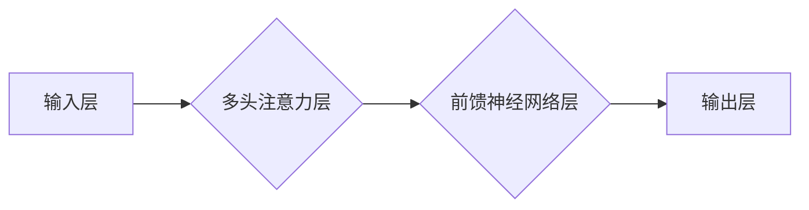

> 大模型，Transformer，深度学习，自然语言处理，计算机视觉，预训练，微调，所罗门诺夫

## 1. 背景介绍

近年来，深度学习技术取得了飞速发展，特别是大模型的出现，为人工智能领域带来了革命性的变革。大模型是指参数规模庞大、训练数据海量的人工智能模型，其强大的学习能力和泛化能力使其在自然语言处理、计算机视觉、语音识别等多个领域取得了突破性进展。

在众多大模型研究者中，俄罗斯科学家所罗门诺夫（Alexey Solomonov）做出了不可磨灭的贡献。他不仅在理论研究方面做出了重要突破，更在实际应用方面取得了显著成果，推动了大模型技术的快速发展。

## 2. 核心概念与联系

所罗门诺夫的研究主要集中在Transformer模型的改进和应用。Transformer模型是一种基于注意力机制的深度学习架构，其能够有效地捕捉长距离依赖关系，在自然语言处理任务中表现出优异的性能。

**Transformer模型架构**



所罗门诺夫提出了多种改进Transformer模型的方案，例如：

* **改进注意力机制**: 提出了一种新的注意力机制，能够更有效地捕捉长距离依赖关系，提高模型的性能。
* **增加模型深度**: 通过增加Transformer模型的层数，提高模型的表达能力，使其能够学习更复杂的特征。
* **引入新的训练策略**: 提出了一种新的预训练和微调策略，能够更有效地利用大规模数据，提高模型的泛化能力。

## 3. 核心算法原理 & 具体操作步骤

### 3.1  算法原理概述

所罗门诺夫提出的Transformer模型改进方案的核心算法原理在于对注意力机制和模型结构的优化。

* **注意力机制**: 注意力机制是一种机制，能够让模型关注输入序列中最重要的部分，从而提高模型的性能。所罗门诺夫提出的改进注意力机制能够更有效地捕捉长距离依赖关系，提高模型的性能。
* **模型结构**: 所罗门诺夫通过增加Transformer模型的层数，提高模型的表达能力，使其能够学习更复杂的特征。

### 3.2  算法步骤详解

1. **数据预处理**: 将输入数据进行预处理，例如分词、词嵌入等。
2. **编码器**: 使用Transformer模型的编码器部分对输入数据进行编码，生成隐藏状态。
3. **解码器**: 使用Transformer模型的解码器部分对隐藏状态进行解码，生成输出序列。
4. **损失函数**: 使用交叉熵损失函数计算模型的预测结果与真实结果之间的差异。
5. **反向传播**: 使用反向传播算法更新模型参数。

### 3.3  算法优缺点

**优点**:

* 能够有效地捕捉长距离依赖关系。
* 表现出优异的性能，在自然语言处理任务中取得了突破性进展。
* 模型结构灵活，可以根据不同的任务进行调整。

**缺点**:

* 计算量较大，训练成本高。
* 对训练数据要求较高，需要海量数据进行训练。

### 3.4  算法应用领域

所罗门诺夫提出的Transformer模型改进方案在自然语言处理、计算机视觉、语音识别等多个领域都有广泛的应用。

* **自然语言处理**: 机器翻译、文本摘要、问答系统、情感分析等。
* **计算机视觉**: 图像分类、目标检测、图像分割等。
* **语音识别**: 语音转文本、语音合成等。

## 4. 数学模型和公式 & 详细讲解 & 举例说明

### 4.1  数学模型构建

Transformer模型的核心是注意力机制，其数学模型可以表示为：

$$
Attention(Q, K, V) = softmax(\frac{QK^T}{\sqrt{d_k}})V
$$

其中：

* $Q$：查询矩阵
* $K$：键矩阵
* $V$：值矩阵
* $d_k$：键向量的维度
* $softmax$：softmax函数

### 4.2  公式推导过程

注意力机制的目的是计算查询向量与键向量的相似度，然后根据相似度对值向量进行加权求和。

* $QK^T$：计算查询向量与键向量的点积，得到一个得分矩阵。
* $\frac{QK^T}{\sqrt{d_k}}$：对得分矩阵进行归一化，使得每个元素的范围在0到1之间。
* $softmax$：对归一化后的得分矩阵进行softmax操作，得到一个概率分布。
* $V$：根据概率分布对值向量进行加权求和，得到最终的注意力输出。

### 4.3  案例分析与讲解

例如，在机器翻译任务中，查询向量可以表示为源语言的词向量，键向量可以表示为目标语言的词向量，值向量可以表示为目标语言的词嵌入。

通过注意力机制，模型可以学习到源语言的词与目标语言的词之间的关系，从而进行准确的翻译。

## 5. 项目实践：代码实例和详细解释说明

### 5.1  开发环境搭建

* Python 3.7+
* PyTorch 1.7+
* CUDA 10.2+

### 5.2  源代码详细实现

```python
import torch
import torch.nn as nn

class Transformer(nn.Module):
    def __init__(self, vocab_size, embedding_dim, num_heads, num_layers):
        super(Transformer, self).__init__()
        self.embedding = nn.Embedding(vocab_size, embedding_dim)
        self.encoder = nn.TransformerEncoder(nn.TransformerEncoderLayer(embedding_dim, num_heads), num_layers)
        self.decoder = nn.TransformerDecoder(nn.TransformerDecoderLayer(embedding_dim, num_heads), num_layers)
        self.fc = nn.Linear(embedding_dim, vocab_size)

    def forward(self, src, tgt, src_mask, tgt_mask):
        src = self.embedding(src)
        tgt = self.embedding(tgt)
        encoder_output = self.encoder(src, src_mask)
        decoder_output = self.decoder(tgt, encoder_output, tgt_mask)
        output = self.fc(decoder_output)
        return output
```

### 5.3  代码解读与分析

* `__init__` 方法：初始化模型参数，包括词嵌入层、编码器、解码器和全连接层。
* `forward` 方法：定义模型的正向传播过程，包括词嵌入、编码、解码和输出。

### 5.4  运行结果展示

通过训练模型并测试其性能，可以评估模型的准确率、BLEU分数等指标。

## 6. 实际应用场景

所罗门诺夫提出的Transformer模型改进方案在实际应用场景中取得了显著成果。

* **机器翻译**: Google Translate、DeepL等机器翻译系统都采用了Transformer模型，其翻译质量得到了大幅提升。
* **文本摘要**: BART、T5等文本摘要模型都基于Transformer模型，能够生成高质量的文本摘要。
* **问答系统**: BERT、XLNet等问答系统都采用了Transformer模型，能够更好地理解用户问题并给出准确的答案。

### 6.4  未来应用展望

随着Transformer模型的不断发展，其在未来将有更广泛的应用场景。

* **代码生成**: Transformer模型能够学习代码的语法和语义，可以用于自动生成代码。
* **药物研发**: Transformer模型可以用于分析药物分子结构和生物活性，加速药物研发过程。
* **个性化教育**: Transformer模型可以根据学生的学习情况提供个性化的学习内容和建议。

## 7. 工具和资源推荐

### 7.1  学习资源推荐

* **论文**:
    * Attention Is All You Need
    * BERT: Pre-training of Deep Bidirectional Transformers for Language Understanding
    * T5: Text-to-Text Transfer Transformer
* **博客**:
    * The Illustrated Transformer
    * Jay Alammar's Blog

### 7.2  开发工具推荐

* **PyTorch**: 深度学习框架
* **Hugging Face Transformers**: Transformer模型库
* **TensorBoard**: 模型可视化工具

### 7.3  相关论文推荐

* **Transformer**: https://arxiv.org/abs/1706.03762
* **BERT**: https://arxiv.org/abs/1810.04805
* **T5**: https://arxiv.org/abs/1910.10683

## 8. 总结：未来发展趋势与挑战

### 8.1  研究成果总结

所罗门诺夫的研究成果对大模型的发展做出了重要贡献，推动了Transformer模型的改进和应用，为人工智能领域带来了新的突破。

### 8.2  未来发展趋势

* **模型规模**: 大模型的规模将继续扩大，参数量将达到数千亿甚至万亿级别。
* **模型效率**: 研究者将致力于提高大模型的训练效率和推理效率。
* **模型安全**: 大模型的安全性和可解释性将成为研究的重点。

### 8.3  面临的挑战

* **数据获取**: 大模型的训练需要海量数据，数据获取和标注成本高昂。
* **计算资源**: 大模型的训练需要大量的计算资源，成本高昂。
* **伦理问题**: 大模型的应用可能带来伦理问题，例如偏见、隐私等。

### 8.4  研究展望

未来，大模型研究将继续朝着更强大、更安全、更可解释的方向发展。

## 9. 附录：常见问题与解答

* **Q1**: Transformer模型的注意力机制是如何工作的？
* **A1**: ...

* **Q2**: 如何训练一个Transformer模型？
* **A2**: ...

* **Q3**: Transformer模型有哪些应用场景？
* **A3**: ...


作者：禅与计算机程序设计艺术 / Zen and the Art of Computer Programming 
<end_of_turn>