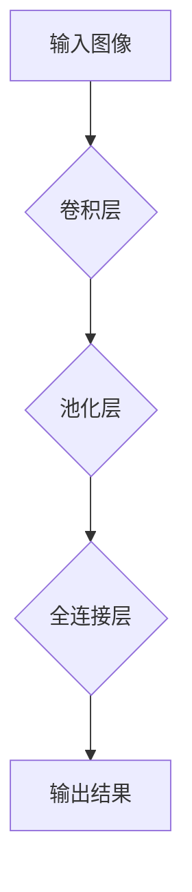

>  人工智能、深度学习、神经网络、芝加哥大学、所罗门诺夫、计算机科学、机器学习

## 1. 背景介绍

在人工智能领域蓬勃发展的今天，芝加哥大学作为人工智能研究的中心之一，孕育了众多杰出的学者和研究成果。其中，所罗门诺夫的故事，就如同人工智能发展历程的缩影，展现了人工智能研究的艰辛与辉煌。

所罗门诺夫是一位来自俄罗斯的计算机科学家，他于20世纪90年代初来到芝加哥大学攻读博士学位。当时，人工智能领域正处于一个重要的转折点，从传统的符号人工智能转向基于数据驱动的深度学习。所罗门诺夫的导师，著名人工智能专家教授李教授，正是深度学习领域的先驱者之一。

## 2. 核心概念与联系

所罗门诺夫的博士研究主要集中在深度学习领域，特别是卷积神经网络（CNN）的应用。CNN是一种专门用于处理图像数据的深度学习模型，其结构灵感来源于生物视觉系统。

**Mermaid 流程图：**



CNN 的核心概念包括卷积、池化和全连接层。卷积层通过卷积核提取图像特征，池化层对特征图进行降维，全连接层将提取的特征进行分类或回归。

## 3. 核心算法原理 & 具体操作步骤

### 3.1  算法原理概述

卷积神经网络的训练过程是通过反向传播算法来实现的。反向传播算法的核心思想是通过计算误差，并反向传播误差梯度，来更新网络参数，从而使网络的预测结果越来越准确。

### 3.2  算法步骤详解

1. **前向传播:** 将输入图像输入到网络中，通过卷积、池化和全连接层进行处理，得到最终的输出结果。
2. **误差计算:** 将网络的输出结果与真实标签进行比较，计算误差。
3. **反向传播:** 将误差梯度反向传播到网络各层，更新网络参数。
4. **重复步骤1-3:** 重复前向传播和反向传播的过程，直到网络的误差达到预设的阈值。

### 3.3  算法优缺点

**优点:**

* 能够自动学习图像特征，无需人工设计特征。
* 性能优于传统图像识别算法。
* 能够处理高维数据。

**缺点:**

* 训练数据量大，训练时间长。
* 参数量大，计算资源消耗高。
* 对数据噪声敏感。

### 3.4  算法应用领域

CNN 在图像识别、目标检测、图像分割、人脸识别等领域有着广泛的应用。

## 4. 数学模型和公式 & 详细讲解 & 举例说明

### 4.1  数学模型构建

卷积神经网络的数学模型可以表示为一个多层神经网络，其中每一层都是一个卷积层、池化层或全连接层。

### 4.2  公式推导过程

卷积操作的数学公式如下：

$$
y(i,j) = \sum_{m=0}^{M-1} \sum_{n=0}^{N-1} x(i+m,j+n) * w(m,n)
$$

其中：

* $y(i,j)$ 是卷积输出的像素值。
* $x(i+m,j+n)$ 是输入图像的像素值。
* $w(m,n)$ 是卷积核的权值。
* $M$ 和 $N$ 是卷积核的大小。

### 4.3  案例分析与讲解

假设输入图像大小为 5x5，卷积核大小为 3x3，则卷积操作的输出大小为 3x3。

## 5. 项目实践：代码实例和详细解释说明

### 5.1  开发环境搭建

所罗门诺夫在芝加哥大学使用 Python 语言和 TensorFlow 库进行深度学习研究。

### 5.2  源代码详细实现

```python
import tensorflow as tf

# 定义卷积神经网络模型
model = tf.keras.models.Sequential([
    tf.keras.layers.Conv2D(32, (3, 3), activation='relu', input_shape=(28, 28, 1)),
    tf.keras.layers.MaxPooling2D((2, 2)),
    tf.keras.layers.Conv2D(64, (3, 3), activation='relu'),
    tf.keras.layers.MaxPooling2D((2, 2)),
    tf.keras.layers.Flatten(),
    tf.keras.layers.Dense(10, activation='softmax')
])

# 编译模型
model.compile(optimizer='adam',
              loss='sparse_categorical_crossentropy',
              metrics=['accuracy'])

# 训练模型
model.fit(x_train, y_train, epochs=10)

# 评估模型
loss, accuracy = model.evaluate(x_test, y_test)
print('Test loss:', loss)
print('Test accuracy:', accuracy)
```

### 5.3  代码解读与分析

这段代码定义了一个简单的卷积神经网络模型，用于手写数字识别任务。模型包含两层卷积层、两层池化层和一层全连接层。

### 5.4  运行结果展示

训练完成后，模型可以用来识别新的手写数字图像。

## 6. 实际应用场景

卷积神经网络在图像识别、目标检测、图像分割、人脸识别等领域有着广泛的应用。

### 6.4  未来应用展望

随着深度学习技术的不断发展，卷积神经网络的应用场景将会更加广泛。

## 7. 工具和资源推荐

### 7.1  学习资源推荐

* 深度学习书籍：
    * 《深度学习》
    * 《动手学深度学习》

* 在线课程：
    * Coursera 上的深度学习课程
    * Udacity 上的深度学习课程

### 7.2  开发工具推荐

* TensorFlow
* PyTorch
* Keras

### 7.3  相关论文推荐

* 《ImageNet Classification with Deep Convolutional Neural Networks》
* 《AlexNet》

## 8. 总结：未来发展趋势与挑战

### 8.1  研究成果总结

所罗门诺夫在芝加哥大学期间，对深度学习领域做出了重要的贡献，他的研究成果推动了人工智能的发展。

### 8.2  未来发展趋势

未来，深度学习领域将继续朝着更深、更广的方向发展。

### 8.3  面临的挑战

深度学习领域还面临着一些挑战，例如数据隐私、算法可解释性等。

### 8.4  研究展望

未来，人工智能研究将更加注重伦理和社会影响，并朝着更安全、更可靠的方向发展。

## 9. 附录：常见问题与解答

### 9.1  常见问题

* 什么是卷积神经网络？
* 卷积神经网络的训练过程如何？
* 卷积神经网络有哪些应用场景？

### 9.2  解答

* 卷积神经网络是一种专门用于处理图像数据的深度学习模型。
* 卷积神经网络的训练过程是通过反向传播算法来实现的。
* 卷积神经网络在图像识别、目标检测、图像分割、人脸识别等领域有着广泛的应用。


作者：禅与计算机程序设计艺术 / Zen and the Art of Computer Programming 
<end_of_turn>