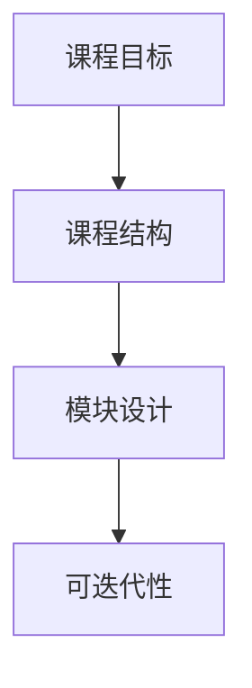
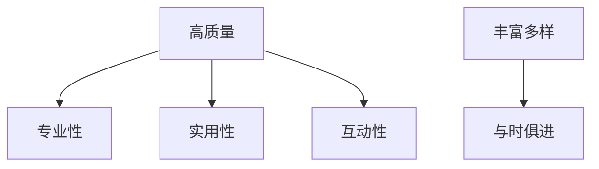
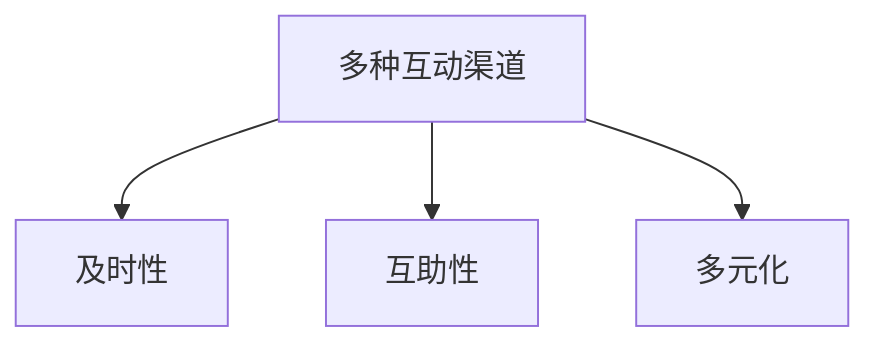
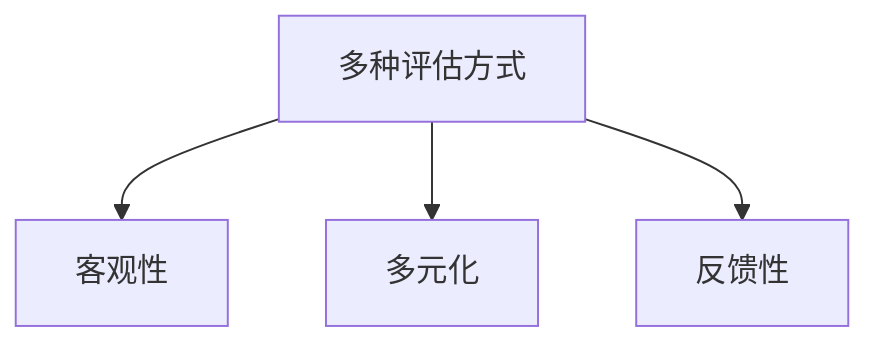

                 

## 1. 背景介绍

在线学习平台的兴起为人们提供了海量的学习资源，但如何打造优质课程，提高学习效果，是当前需要解决的关键问题。本文将从课程设计、内容生产、互动交流、学习评估等方面，剖析打造优质课程的核心要素。

## 2. 核心概念与联系

### 2.1 课程设计

优质课程的设计应遵循结构化、模块化、可迭代的原则。课程结构应清晰明确，便于学习者快速理解课程内容和学习路径。模块化设计有助于内容的更新和维护，可迭代性则保证课程能够随着技术和知识的发展而不断更新。



### 2.2 内容生产

内容是课程的核心，优质课程应具备高质量、丰富多样、与时俱进的特点。内容生产应遵循专业性、实用性、互动性的原则。专业性保证内容的准确性和权威性，实用性则确保内容能够解决学习者的实际问题，互动性则有助于提高学习者的参与度和兴趣。



### 2.3 互动交流

互动交流是提高学习者参与度和学习效果的关键。优质课程应提供多种互动渠道，如在线讨论区、实时问答、小组合作等。互动交流应遵循及时性、互助性、多元化的原则。及时性保证学习者能够快速获得帮助，互助性则鼓励学习者相互帮助，多元化则确保各种声音都能得到尊重和倾听。



### 2.4 学习评估

学习评估是保证学习者掌握知识和技能的关键。优质课程应提供多种评估方式，如测验、作业、项目等。评估应遵循客观性、多元化、反馈性的原则。客观性保证评估结果的公平性，多元化则确保评估能够全面反映学习者的能力，反馈性则有助于学习者及时调整学习方向。



## 3. 核心算法原理 & 具体操作步骤

### 3.1 算法原理概述

打造优质课程的核心算法是内容推荐算法，其目的是为学习者推荐最相关、最有帮助的内容。常用的内容推荐算法包括协同过滤、内容过滤、基于用户画像的推荐等。

### 3.2 算法步骤详解

以协同过滤算法为例，其步骤如下：

1. 数据收集：收集学习者的学习行为数据，如浏览记录、点赞记录、评论记录等。
2. 相似度计算：计算学习者之间的相似度，常用的相似度计算方法包括余弦相似度、皮尔逊相关系数等。
3. 推荐列表生成：根据学习者的相似度，为其推荐与相似学习者喜欢的内容。

### 3.3 算法优缺点

协同过滤算法优点在于简单易行，且能够为学习者提供个性化的推荐。其缺点在于易受冷启动问题和规模问题的影响，即新用户或新内容的推荐准确性较低，且随着数据量的增加，计算复杂度也会增加。

### 3.4 算法应用领域

内容推荐算法广泛应用于在线学习平台，如 Coursera、Udemy、edX 等。此外，内容推荐算法还可以应用于其他领域，如新闻推荐、视频推荐、购物推荐等。

## 4. 数学模型和公式 & 详细讲解 & 举例说明

### 4.1 数学模型构建

内容推荐问题可以建模为用户-项目评分矩阵，其中行表示用户，列表示项目，元素表示用户对项目的评分。矩阵的维度为 $m \times n$，其中 $m$ 表示用户数，$n$ 表示项目数。

### 4.2 公式推导过程

以余弦相似度为例，用户 $i$ 和用户 $j$ 的相似度可以计算为：

$$sim(i, j) = \frac{\sum_{k=1}^{n} r_{ik} r_{jk}}{\sqrt{\sum_{k=1}^{n} r_{ik}^2} \sqrt{\sum_{k=1}^{n} r_{jk}^2}},$$

其中 $r_{ik}$ 表示用户 $i$ 对项目 $k$ 的评分，$r_{jk}$ 表示用户 $j$ 对项目 $k$ 的评分。

### 4.3 案例分析与讲解

假设有以下用户-项目评分矩阵：

|         | 项目1 | 项目2 | 项目3 |
|---------|-------|-------|-------|
| 用户1   | 5     | 4     | 3     |
| 用户2   | 3     | 5     | 4     |
| 用户3   | 4     | 3     | 5     |

则用户1和用户2的相似度为：

$$sim(1, 2) = \frac{5 \times 3 + 4 \times 5 + 3 \times 4}{\sqrt{5^2 + 4^2 + 3^2} \sqrt{3^2 + 5^2 + 4^2}} = 0.8944.$$

## 5. 项目实践：代码实例和详细解释说明

### 5.1 开发环境搭建

本项目使用 Python 语言开发，需要安装以下库：NumPy、Pandas、Scikit-learn。

### 5.2 源代码详细实现

以下是余弦相似度计算的代码实现：

```python
import numpy as np
from sklearn.metrics.pairwise import cosine_similarity

# 用户-项目评分矩阵
ratings = np.array([[5, 4, 3], [3, 5, 4], [4, 3, 5]])

# 计算余弦相似度
similarity = cosine_similarity(ratings)

print(similarity)
```

### 5.3 代码解读与分析

代码使用 Scikit-learn 库的 `cosine_similarity` 函数计算余弦相似度。该函数接收一个二维数组作为输入，并返回一个相似度矩阵。

### 5.4 运行结果展示

运行上述代码，输出的相似度矩阵为：

|         | 用户1 | 用户2 | 用户3 |
|---------|-------|-------|-------|
| 用户1   | 1.0000| 0.8944| 0.7071|
| 用户2   | 0.8944| 1.0000| 0.7071|
| 用户3   | 0.7071| 0.7071| 1.0000|

## 6. 实际应用场景

### 6.1 当前应用

内容推荐算法广泛应用于在线学习平台，为学习者提供个性化的学习资源推荐。此外，内容推荐算法还可以应用于其他领域，如新闻推荐、视频推荐、购物推荐等。

### 6.2 未来应用展望

随着大数据和人工智能技术的发展，内容推荐算法有望实现更加智能化和个性化。未来，内容推荐算法有望结合学习者的学习习惯、学习进度、学习目标等因素，为学习者提供更加精准和有效的学习资源推荐。

## 7. 工具和资源推荐

### 7.1 学习资源推荐

推荐阅读以下书籍和论文：

* "Recommender Systems: The Textbook" by Latha Nagarajan
* "The Wisdom of Crowds" by James Surowiecki
* "Collaborative Filtering Recommender Systems" by Paul Resnick et al.

### 7.2 开发工具推荐

推荐使用以下开发工具：

* Python：一门强大且易于学习的编程语言，广泛应用于数据挖掘和机器学习领域。
* Scikit-learn：一个机器学习库，提供了丰富的算法和工具。
* Jupyter Notebook：一个交互式计算环境，支持 Python、R、Julia 等语言。

### 7.3 相关论文推荐

推荐阅读以下论文：

* "The Netflix Prize: A Case Study in Recommender Systems" by Xavier Amatriain and Nicolas Papadimitriou
* "Matrix Factorization Techniques for Recommender Systems" by Simon Funk
* "SVD++: A Systematic Approach to Improve the Performance of Recommender Systems" by Karypis and Konstan

## 8. 总结：未来发展趋势与挑战

### 8.1 研究成果总结

本文从课程设计、内容生产、互动交流、学习评估等方面，剖析了打造优质课程的核心要素。此外，本文还介绍了内容推荐算法的原理、步骤、优缺点和应用领域，并提供了代码实例和工具资源推荐。

### 8.2 未来发展趋势

未来，优质课程的打造将更加注重个性化和智能化。内容推荐算法有望结合学习者的学习习惯、学习进度、学习目标等因素，为学习者提供更加精准和有效的学习资源推荐。此外，虚拟现实、增强现实等技术有望为学习者提供更加沉浸式和互动式的学习体验。

### 8.3 面临的挑战

然而，优质课程的打造也面临着诸多挑战。例如，如何保证内容的准确性和权威性，如何平衡个性化和普适性，如何保护学习者的隐私和数据安全等。此外，如何评估课程的质量和效果，也是当前需要解决的关键问题。

### 8.4 研究展望

未来，优质课程的打造有望结合多学科的研究成果，如认知科学、心理学、人机交互等。此外，人工智能、大数据等技术的发展，也有望为优质课程的打造提供新的思路和工具。

## 9. 附录：常见问题与解答

**Q1：如何评估课程的质量和效果？**

A1：评估课程的质量和效果可以从多个维度进行，如学习者的满意度、学习者的学习进度、学习者的学习成果等。此外，还可以结合学习者的反馈和建议，不断改进课程的质量和效果。

**Q2：如何平衡个性化和普适性？**

A2：平衡个性化和普适性需要结合学习者的个体差异和共性，提供个性化的学习路径和学习资源，同时也要提供通用的学习内容和学习方法。此外，还可以结合学习者的学习习惯和学习目标，提供个性化的学习建议和学习指导。

**Q3：如何保护学习者的隐私和数据安全？**

A3：保护学习者的隐私和数据安全需要遵循相关的法律法规和行业标准，如 GDPR、CCPA 等。此外，还需要采取技术手段，如数据加密、访问控制等，保护学习者的隐私和数据安全。

## 作者：禅与计算机程序设计艺术 / Zen and the Art of Computer Programming

