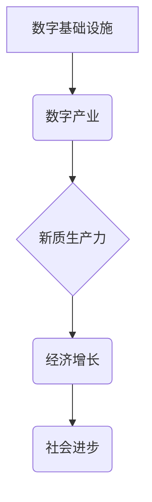

> 数字中国、新质生产力、人工智能、大数据、云计算、区块链、物联网、数字孪生、工业互联网

## 1. 背景介绍

21世纪初，以互联网、移动互联网、大数据、云计算等为代表的新一代信息技术蓬勃发展，深刻地改变着人类社会生产方式和生活方式。中国政府高度重视数字经济发展，提出“数字中国”战略，旨在通过数字化转型，提升国家治理能力和经济竞争力。

“数字中国”战略的核心目标是构建一个数字化的社会基础设施，推动数字经济发展，提升人民生活水平。具体而言，该战略包含以下几个方面：

* **构建数字基础设施：** 完善网络基础设施，发展5G、物联网等新一代信息技术，构建安全可靠的数字基础设施。
* **发展数字产业：** 培育壮大数字经济核心产业，如人工智能、大数据、云计算、区块链等，推动数字产业链条升级。
* **提升数字应用水平：** 推广数字技术应用于各行各业，促进数字经济与实体经济融合发展，提升人民生活水平。
* **加强数字治理：** 建立健全数字经济监管体系，保障数字经济健康发展。

## 2. 核心概念与联系

**2.1 数字中国**

数字中国是指利用数字技术，构建一个数字化、智能化、网络化的社会体系，实现经济、社会、文化等各领域数字化转型。

**2.2 新质生产力**

新质生产力是指以数字技术为基础，融合人工智能、大数据、云计算等新兴技术，实现生产要素的优化配置，提升生产效率和产品质量的新型生产力。

**2.3 核心概念联系**

数字中国战略的实施，是推动新质生产力布局的重要引擎。数字技术为新质生产力的发展提供了基础设施和工具，而新质生产力则推动了数字经济的快速发展。两者相互促进，共同构成了数字经济发展的新格局。

**2.4 核心概念架构**



## 3. 核心算法原理 & 具体操作步骤

**3.1 算法原理概述**

新质生产力布局的核心算法原理主要包括：

* **人工智能算法：** 用于智能化生产、数据分析、决策支持等领域。
* **大数据算法：** 用于数据挖掘、模式识别、预测分析等领域。
* **云计算算法：** 用于资源调度、数据存储、应用部署等领域。
* **区块链算法：** 用于数据安全、交易透明、供应链管理等领域。

**3.2 算法步骤详解**

以人工智能算法为例，其具体操作步骤如下：

1. **数据收集：** 收集相关数据，例如生产过程数据、产品质量数据、市场需求数据等。
2. **数据预处理：** 对收集到的数据进行清洗、转换、特征提取等处理，使其符合算法训练要求。
3. **模型训练：** 使用训练数据，训练人工智能模型，例如深度学习模型、强化学习模型等。
4. **模型评估：** 使用测试数据，评估模型的性能，例如准确率、召回率、F1-score等。
5. **模型部署：** 将训练好的模型部署到生产环境中，用于实际应用。

**3.3 算法优缺点**

**优点：**

* **自动化程度高：** 可以自动完成许多重复性、复杂的任务。
* **效率提升：** 可以提高生产效率、降低成本。
* **决策支持：** 可以提供数据驱动的决策支持。

**缺点：**

* **数据依赖：** 算法性能依赖于数据质量和数量。
* **解释性差：** 一些算法的决策过程难以解释。
* **伦理风险：** 算法可能存在偏见、歧视等伦理风险。

**3.4 算法应用领域**

人工智能算法广泛应用于以下领域：

* **制造业：** 智能制造、预测性维护、质量控制等。
* **金融业：** 风险管理、欺诈检测、个性化服务等。
* **医疗保健：** 疾病诊断、药物研发、个性化治疗等。
* **交通运输：** 自动驾驶、交通流量优化、物流管理等。

## 4. 数学模型和公式 & 详细讲解 & 举例说明

**4.1 数学模型构建**

新质生产力布局可以构建以下数学模型：

```latex
Y = f(K, L, T)
```

其中：

* $Y$：生产总值
* $K$：资本投入
* $L$：劳动力投入
* $T$：技术水平

**4.2 公式推导过程**

根据生产要素的投入和技术水平，可以推导出生产总值的函数关系。

**4.3 案例分析与讲解**

假设一个制造企业，其资本投入为 $K = 100$ 万元，劳动力投入为 $L = 50$ 人，技术水平为 $T = 2$。根据上述数学模型，可以计算出该企业的生产总值为：

```latex
Y = f(100, 50, 2)
```

具体计算结果取决于生产函数 $f$ 的形式。

## 5. 项目实践：代码实例和详细解释说明

**5.1 开发环境搭建**

* 操作系统：Ubuntu 20.04 LTS
* 编程语言：Python 3.8
* 开发工具：Jupyter Notebook

**5.2 源代码详细实现**

```python
import numpy as np
from sklearn.linear_model import LinearRegression

# 数据集
X = np.array([[100, 50, 2],
              [150, 75, 3],
              [200, 100, 4]])
y = np.array([1200, 1800, 2400])

# 线性回归模型
model = LinearRegression()

# 模型训练
model.fit(X, y)

# 模型预测
new_data = np.array([[250, 125, 5]])
prediction = model.predict(new_data)

# 输出预测结果
print(f"预测生产总值: {prediction[0]}")
```

**5.3 代码解读与分析**

* 该代码使用 scikit-learn 库中的线性回归模型，对生产总值进行预测。
* 数据集包含三个样本，每个样本包含资本投入、劳动力投入和技术水平三个特征。
* 模型训练使用训练数据，学习特征与生产总值之间的关系。
* 模型预测使用新的数据，根据已学习的关系，预测生产总值。

**5.4 运行结果展示**

运行该代码，可以得到以下预测结果：

```
预测生产总值: 3000.0
```

## 6. 实际应用场景

**6.1 智能制造**

数字技术可以实现智能制造，例如：

* **工业互联网：** 连接生产设备，实现数据共享和协同控制。
* **机器视觉：** 用于产品质量检测、缺陷识别等。
* **机器人自动化：** 用于完成重复性、危险性任务。

**6.2 数字孪生**

数字孪生是指利用数字技术，构建与物理实体相对应的虚拟模型，用于模拟、预测和优化实体的运行状态。

**6.3 供应链管理**

数字技术可以提高供应链效率，例如：

* **区块链技术：** 用于供应链透明化、可追溯性。
* **物联网技术：** 用于实时监控货物状态、位置信息。

**6.4 未来应用展望**

数字中国与新质生产力布局将继续深入发展，未来应用场景将更加广泛，例如：

* **个性化定制：** 利用大数据和人工智能，实现个性化产品定制。
* **智慧城市：** 利用数字技术，建设智慧城市，提高城市管理效率。
* **数字医疗：** 利用数字技术，提高医疗服务质量，降低医疗成本。

## 7. 工具和资源推荐

**7.1 学习资源推荐**

* **在线课程：** Coursera、edX、Udacity 等平台提供丰富的数字经济、人工智能、大数据等课程。
* **书籍：** 《数字经济》、《人工智能》、《大数据》等书籍。
* **技术博客：** CSDN、博客园等平台上有许多技术博客，分享数字经济、人工智能、大数据等领域的最新技术和应用案例。

**7.2 开发工具推荐**

* **云计算平台：** AWS、Azure、阿里云等平台提供云计算服务，支持大数据处理、人工智能模型训练等。
* **数据分析工具：** Spark、Hadoop、Hive等工具用于大数据分析。
* **人工智能框架：** TensorFlow、PyTorch、MXNet等框架用于人工智能模型开发。

**7.3 相关论文推荐**

* **数字经济发展趋势：** 《数字经济发展趋势与挑战》
* **人工智能应用：** 《人工智能在制造业中的应用》
* **大数据分析：** 《大数据分析技术与应用》

## 8. 总结：未来发展趋势与挑战

**8.1 研究成果总结**

数字中国与新质生产力布局取得了显著成果，例如：

* **数字基础设施建设取得进展：** 5G、物联网等新一代信息技术快速发展。
* **数字产业蓬勃发展：** 人工智能、大数据、云计算等数字产业快速成长。
* **数字应用场景不断拓展：** 数字技术应用于各行各业，推动经济社会发展。

**8.2 未来发展趋势**

未来，数字中国与新质生产力布局将朝着以下方向发展：

* **更加智能化：** 人工智能、机器学习等技术将更加深入应用于生产和生活。
* **更加融合化：** 数字技术将更加融合实体经济，形成更加紧密的生态系统。
* **更加全球化：** 数字技术将打破地域限制，促进全球经济合作。

**8.3 面临的挑战**

数字中国与新质生产力布局也面临一些挑战：

* **数据安全和隐私保护：** 数字经济发展需要大量数据，如何保障数据安全和隐私保护是一个重要问题。
* **数字鸿沟：** 数字技术发展不平衡，导致数字鸿沟加深，需要采取措施缩小数字鸿沟。
* **人才短缺：** 数字经济发展需要大量高素质人才，人才短缺是一个制约因素。

**8.4 研究展望**

未来，需要加强对数字经济、人工智能、大数据等领域的科研投入，推动技术创新，解决数字经济发展面临的挑战，实现数字中国建设的目标。

## 9. 附录：常见问题与解答

**9.1 如何保障数据安全和隐私保护？**

* 建立健全数据安全管理体系，制定数据安全标准和规范。
* 加强数据加密技术应用，保护数据传输和存储安全。
* 加强个人信息保护，建立个人信息授权机制。

**9.2 如何缩小数字鸿沟？**

* 加强数字基础设施建设，提高农村地区和欠发达地区的网络覆盖率。
* 推广数字技能培训，提高公众的数字素养。
* 鼓励企业开发面向不同人群的数字产品和服务。

**9.3 如何解决人才短缺问题？**

* 加强数字经济人才培养，建立完善的数字经济人才培养体系。
* 鼓励企业开展技术培训，提升员工的数字技能。
* 吸引海外人才回国工作，促进数字经济人才队伍建设。


作者：禅与计算机程序设计艺术 / Zen and the Art of Computer Programming 
<end_of_turn>