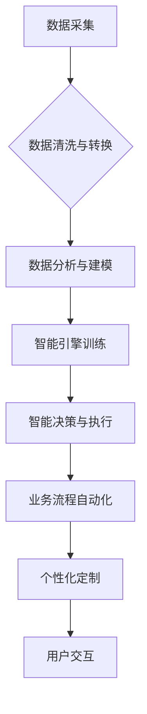

> 数字实体、自动化、人工智能、机器学习、数据驱动、业务流程、智能化、未来趋势

## 1. 背景介绍

数字经济时代，数据已成为重要的生产要素，而数字实体作为数据化的实体，在推动经济数字化转型中扮演着越来越重要的角色。数字实体是指通过数字化技术将物理世界或抽象概念映射到数字空间中的虚拟表示，它可以是产品、服务、流程、组织甚至整个生态系统。

随着人工智能、机器学习等技术的快速发展，数字实体的自动化呈现出前所未有的机遇。自动化可以帮助我们更高效地管理、运营和创新数字实体，从而释放其更大的价值。

## 2. 核心概念与联系

**2.1 数字实体的构成**

数字实体通常由以下几个核心要素构成：

* **数据模型:** 描述数字实体的结构、属性和行为的数据模型，例如产品规格、服务功能、流程步骤等。
* **数据资产:** 数字实体所包含的各种数据，例如产品图片、服务评价、流程日志等。
* **智能引擎:** 利用人工智能、机器学习等技术，赋予数字实体智能感知、决策和执行能力的引擎。
* **交互接口:** 数字实体与外部系统和用户进行交互的接口，例如API、UI等。

**2.2 自动化与数字实体的关联**

自动化可以应用于数字实体的各个环节，例如：

* **数据采集与处理:** 自动化数据采集、清洗、转换和分析，为数字实体提供高质量的数据支撑。
* **智能决策与执行:** 利用机器学习算法，训练数字实体的智能引擎，使其能够自动做出决策并执行相应的操作。
* **流程优化与自动化:** 自动化数字实体相关的业务流程，提高效率和降低成本。
* **个性化定制:** 根据用户的需求和行为，自动定制数字实体的属性和功能。

**2.3 自动化技术与数字实体的融合**

自动化技术与数字实体的融合，将推动数字实体的智能化发展，使其能够更加智能、高效、灵活和个性化。

**Mermaid 流程图**



## 3. 核心算法原理 & 具体操作步骤

**3.1 算法原理概述**

数字实体的自动化主要依赖于人工智能和机器学习算法。常见的算法包括：

* **监督学习:** 利用标记数据训练模型，预测未来结果。例如，根据历史销售数据预测未来销量。
* **无监督学习:** 从未标记数据中发现模式和结构。例如，将客户进行聚类，识别不同类型的客户。
* **强化学习:** 通过试错学习，让智能体在环境中获得最大奖励。例如，训练机器人完成特定任务。

**3.2 算法步骤详解**

以监督学习为例，其步骤如下：

1. **数据收集与预处理:** 收集相关数据，并进行清洗、转换和特征工程等预处理工作。
2. **模型选择:** 根据任务需求选择合适的模型，例如线性回归、决策树、支持向量机等。
3. **模型训练:** 利用标记数据训练模型，调整模型参数，使其能够准确预测结果。
4. **模型评估:** 使用测试数据评估模型的性能，例如准确率、召回率、F1-score等。
5. **模型部署:** 将训练好的模型部署到生产环境中，用于实际应用。

**3.3 算法优缺点**

不同的算法具有不同的优缺点，需要根据具体任务选择合适的算法。

* **监督学习:** 优点：准确率高，可以解决明确的问题。缺点：需要大量标记数据，难以处理未知情况。
* **无监督学习:** 优点：不需要标记数据，可以发现隐藏的模式。缺点：难以评估模型性能，结果解释性较差。
* **强化学习:** 优点：可以解决复杂的任务，具有适应性强。缺点：训练时间长，需要大量的试错学习。

**3.4 算法应用领域**

数字实体的自动化算法广泛应用于各个领域，例如：

* **电商:** 商品推荐、价格预测、库存管理等。
* **金融:** 风险评估、欺诈检测、客户服务等。
* **医疗:** 疾病诊断、药物研发、个性化治疗等。
* **制造业:** 质量控制、生产优化、设备维护等。

## 4. 数学模型和公式 & 详细讲解 & 举例说明

**4.1 数学模型构建**

数字实体的自动化可以利用数学模型来描述和预测其行为。例如，可以使用线性回归模型来预测产品的销量，可以使用决策树模型来判断客户是否会购买产品。

**4.2 公式推导过程**

以线性回归模型为例，其目标是找到一条直线，使得预测值与实际值之间的误差最小。

假设我们有n个数据点，每个数据点包含一个输入特征x和一个输出特征y。线性回归模型的公式如下：

$$y = wx + b$$

其中，w和b分别是模型的参数，需要通过训练数据来确定。

**4.3 案例分析与讲解**

假设我们想预测产品的销量，已知产品的价格x和历史销量y的数据。我们可以使用线性回归模型来建立预测模型。

通过训练数据，我们可以得到模型参数w和b。然后，我们可以使用这个模型来预测新产品的销量。

例如，如果新产品的价格为100元，我们可以使用以下公式来预测其销量：

$$y = wx + b$$

其中，w和b是训练得到的模型参数。

## 5. 项目实践：代码实例和详细解释说明

**5.1 开发环境搭建**

* 操作系统：Windows/macOS/Linux
* Python版本：3.6+
* 必要的库：pandas、numpy、scikit-learn等

**5.2 源代码详细实现**

```python
import pandas as pd
from sklearn.linear_model import LinearRegression

# 加载数据
data = pd.read_csv('sales_data.csv')

# 划分训练集和测试集
X = data[['price']]
y = data['sales']
from sklearn.model_selection import train_test_split
X_train, X_test, y_train, y_test = train_test_split(X, y, test_size=0.2, random_state=42)

# 创建线性回归模型
model = LinearRegression()

# 训练模型
model.fit(X_train, y_train)

# 预测测试集数据
y_pred = model.predict(X_test)

# 评估模型性能
from sklearn.metrics import mean_squared_error
mse = mean_squared_error(y_test, y_pred)
print(f'Mean Squared Error: {mse}')

# 使用模型预测新产品的销量
new_price = 100
new_sales = model.predict([[new_price]])
print(f'Predicted sales for price {new_price}: {new_sales[0]}')
```

**5.3 代码解读与分析**

* 代码首先加载数据，并划分训练集和测试集。
* 然后，创建线性回归模型，并使用训练集训练模型。
* 接着，使用测试集评估模型性能。
* 最后，使用模型预测新产品的销量。

**5.4 运行结果展示**

运行代码后，会输出模型的性能指标（例如MSE）以及新产品的预测销量。

## 6. 实际应用场景

**6.1 数字产品个性化定制**

数字实体的自动化可以帮助企业根据用户的需求和行为，自动定制数字产品的属性和功能。例如，电商平台可以根据用户的购买历史和浏览记录，推荐个性化的商品和服务。

**6.2 智能客服系统**

数字实体的自动化可以帮助企业构建智能客服系统，自动回答用户的常见问题，提高客户服务效率。例如，银行可以利用智能客服系统，自动回答客户关于账户余额、交易记录等方面的查询。

**6.3 自动化流程管理**

数字实体的自动化可以帮助企业自动化流程管理，提高效率和降低成本。例如，制造业企业可以利用数字实体的自动化，自动完成生产计划、物料采购、生产调度等流程。

**6.4 未来应用展望**

数字实体的自动化将应用于越来越多的领域，例如：

* **虚拟现实和增强现实:** 数字实体可以用于构建虚拟世界和增强现实体验，例如虚拟旅游、虚拟购物等。
* **数字孪生:** 数字实体可以用于构建数字孪生系统，模拟现实世界中的物理系统，例如工厂、城市等。
* **区块链:** 数字实体可以与区块链技术结合，实现数据安全、可追溯和透明。

## 7. 工具和资源推荐

**7.1 学习资源推荐**

* **书籍:**
    * 《深度学习》
    * 《机器学习实战》
    * 《Python机器学习》
* **在线课程:**
    * Coursera: 深度学习
    * edX: 机器学习
    * Udacity: 人工智能工程师

**7.2 开发工具推荐**

* **Python:** 广泛应用于人工智能和机器学习开发。
* **TensorFlow:** 开源深度学习框架。
* **PyTorch:** 开源深度学习框架。
* **Scikit-learn:** Python机器学习库。

**7.3 相关论文推荐**

* 《Attention Is All You Need》
* 《BERT: Pre-training of Deep Bidirectional Transformers for Language Understanding》
* 《Generative Adversarial Networks》

## 8. 总结：未来发展趋势与挑战

**8.1 研究成果总结**

数字实体的自动化取得了显著的进展，人工智能和机器学习算法在数字实体的智能化发展中发挥着关键作用。

**8.2 未来发展趋势**

* **更智能的数字实体:** 数字实体将更加智能，能够更好地理解和响应用户的需求。
* **更广泛的应用场景:** 数字实体的自动化将应用于更多领域，例如医疗、教育、交通等。
* **更安全的数字实体:** 数字实体的安全性和隐私性将得到进一步保障。

**8.3 面临的挑战**

* **数据质量:** 数字实体的自动化依赖于高质量的数据，数据质量问题将影响模型的性能。
* **算法解释性:** 一些机器学习算法的决策过程难以解释，这可能会导致信任问题。
* **伦理问题:** 数字实体的自动化可能会带来一些伦理问题，例如算法偏见、数据隐私等。

**8.4 研究展望**

未来，数字实体的自动化研究将继续深入，重点关注以下几个方面：

* **开发更智能、更鲁棒的算法:** 研究更先进的机器学习算法，提高数字实体的智能化水平。
* **解决数据质量问题:** 研究数据清洗、转换和增强等技术，提高数据质量。
* **提高算法解释性:** 研究可解释机器学习算法，提高数字实体的透明度和可信度。
* **探讨数字实体的伦理问题:** 研究数字实体的伦理问题，制定相应的规范和政策。

## 9. 附录：常见问题与解答

**9.1 如何选择合适的数字实体自动化算法？**

选择合适的算法需要根据具体任务需求和数据特点进行选择。例如，如果需要预测连续值，可以使用回归算法；如果需要分类数据，可以使用分类算法。

**9.2 如何评估数字实体自动化模型的性能？**

常用的评估指标包括准确率、召回率、F1-score、AUC等。

**9.3 如何解决数字实体自动化中的数据质量问题？**

可以采用数据清洗、转换、增强等技术来提高数据质量。

**9.4 数字实体自动化会取代人类工作吗？**

数字实体的自动化可以提高效率和降低成本，但不会完全取代人类工作。人类仍然需要发挥创造力、判断力和解决复杂问题的能力。


作者：禅与计算机程序设计艺术 / Zen and the Art of Computer Programming 
<end_of_turn>