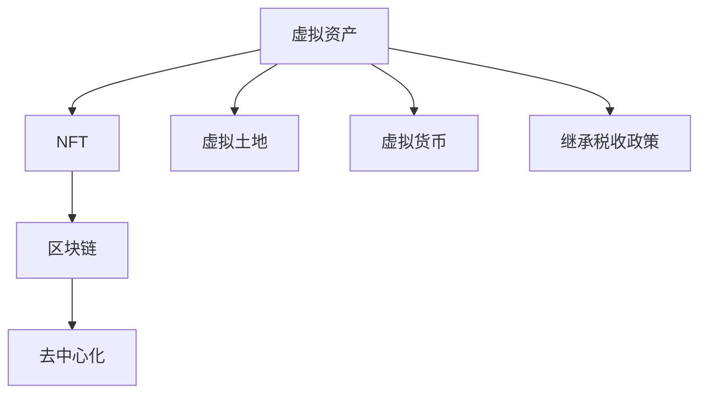

                 

数字遗产税率，元宇宙，虚拟资产，继承税收政策，区块链，NFT，去中心化，数字资产管理

## 1. 背景介绍

随着元宇宙的兴起，虚拟资产的价值与日俱增。这些虚拟资产，如NFT（非同质化代币）、虚拟土地、虚拟物品等，已经成为数字世界中的有价资产。然而，当这些资产的所有者离世后，如何处置这些虚拟资产，并征收相应的遗产税，成为了一个亟待解决的问题。本文将探讨元宇宙中的虚拟资产继承税收政策，并提出一种基于区块链技术的解决方案。

## 2. 核心概念与联系

### 2.1 虚拟资产与NFT

虚拟资产是指存在于数字世界中的有价值的资产，如虚拟货币、NFT、虚拟土地等。NFT是一种基于区块链技术的数字资产，它代表了数字世界中的独一无二的资产，如数字艺术品、虚拟物品等。NFT的独特之处在于它的不可替代性和可验证的所有权。

### 2.2 区块链与去中心化

区块链是一种分布式账本技术，它通过将数据分布式存储在多个节点上，实现了去中心化的数据管理。在区块链上，每个交易都会记录在区块中，并通过加密算法与前一个区块链接，从而保证了数据的完整性和安全性。去中心化是区块链的核心特性，它使得区块链技术成为管理虚拟资产的理想选择。

### 2.3 继承税收政策

继承税收政策是指当资产所有者离世后，如何处置这些资产，并征收相应税收的政策。传统的继承税收政策主要针对实物资产，如房产、股票、现金等。然而，随着虚拟资产价值的增加，如何处置这些虚拟资产，并征收相应的遗产税，成为了一个新的挑战。

### 2.4 核心概念联系图



## 3. 核心算法原理 & 具体操作步骤

### 3.1 算法原理概述

本文提出的解决方案是基于区块链技术的虚拟资产继承税收平台。该平台通过将虚拟资产记录在区块链上，实现了虚拟资产的去中心化管理。当资产所有者离世后，平台会自动检测到资产的变更，并触发继承税收流程。平台会根据预先设定的税率和税收政策，计算并征收相应的遗产税。

### 3.2 算法步骤详解

1. **资产记录**：虚拟资产所有者将其资产记录在区块链上，并指定资产的继承人。
2. **资产变更检测**：当资产所有者离世后，平台会自动检测到资产的变更。
3. **继承人确认**：平台会确认资产的继承人，并通知其资产的变更情况。
4. **税收计算**：平台会根据预先设定的税率和税收政策，计算相应的遗产税。
5. **税收征收**：平台会从资产中扣除相应的遗产税，并将其转移到税收机构的账户中。
6. **资产转移**：平台会将剩余的资产转移给继承人。

### 3.3 算法优缺点

**优点**：

* 去中心化管理，提高了资产安全性和透明度。
* 自动检测资产变更，简化了继承流程。
* 根据预先设定的税率和税收政策，计算并征收遗产税，提高了税收的公平性和效率。

**缺点**：

* 需要所有者预先记录资产，否则可能导致资产遗漏。
* 需要所有者指定继承人，否则可能导致资产无法继承。
* 需要平台与税收机构的合作，否则可能导致税收无法征收。

### 3.4 算法应用领域

本文提出的解决方案主要应用于元宇宙中的虚拟资产继承税收政策。然而，该解决方案也可以应用于其他数字资产的继承税收政策，如虚拟货币、数字艺术品等。

## 4. 数学模型和公式 & 详细讲解 & 举例说明

### 4.1 数学模型构建

本文提出的数学模型是基于区块链技术的虚拟资产继承税收模型。该模型假设虚拟资产的所有者已经将其资产记录在区块链上，并指定了资产的继承人。当资产所有者离世后，模型会自动检测到资产的变更，并触发继承税收流程。模型会根据预先设定的税率和税收政策，计算并征收相应的遗产税。

### 4.2 公式推导过程

假设虚拟资产的价值为$V$，税率为$r$，则遗产税为$T$。则遗产税可以通过以下公式计算：

$$T = V \times r$$

其中，$V$是虚拟资产的价值，$r$是税率。例如，如果虚拟资产的价值为10000美元，税率为20％，则遗产税为：

$$T = 10000 \times 0.2 = 2000$$

### 4.3 案例分析与讲解

假设某虚拟资产所有者拥有价值为100000美元的虚拟资产，并指定了资产的继承人。当资产所有者离世后，平台会自动检测到资产的变更，并触发继承税收流程。假设税率为20％，则遗产税为：

$$T = 100000 \times 0.2 = 20000$$

平台会从资产中扣除20000美元的遗产税，并将其转移到税收机构的账户中。剩余的80000美元资产会转移给继承人。

## 5. 项目实践：代码实例和详细解释说明

### 5.1 开发环境搭建

本文提出的解决方案是基于以太坊区块链平台开发的智能合约。因此，开发环境需要安装以太坊客户端、Solidity编译器和Remix IDE。此外，还需要安装Node.js和npm，以便部署智能合约。

### 5.2 源代码详细实现

以下是智能合约的源代码实现：

```solidity
pragma solidity ^0.8.0;

contract VirtualAssetInheritanceTax {
    address public owner;
    mapping(address => uint256) public assetValue;
    mapping(address => address) public beneficiary;
    uint256 public constant TAX_RATE = 20; // 20% tax rate

    event AssetInheritance(address indexed _assetOwner, address indexed _beneficiary, uint256 _assetValue, uint256 _tax);

    constructor() {
        owner = msg.sender;
    }

    function setAssetValue(address _assetOwner, uint256 _assetValue) public {
        require(msg.sender == owner, "Only the owner can set asset value");
        assetValue[_assetOwner] = _assetValue;
    }

    function setBeneficiary(address _assetOwner, address _beneficiary) public {
        require(msg.sender == owner, "Only the owner can set beneficiary");
        beneficiary[_assetOwner] = _beneficiary;
    }

    function inheritAsset(address _assetOwner) public {
        require(msg.sender == beneficiary[_assetOwner], "Only the beneficiary can inherit asset");
        uint256 assetValue = assetValue[_assetOwner];
        uint256 tax = (assetValue * TAX_RATE) / 100;
        require(assetValue >= tax, "Insufficient asset value");
        assetValue -= tax;
        payable(msg.sender).transfer(assetValue);
        emit AssetInheritance(_assetOwner, msg.sender, assetValue, tax);
    }
}
```

### 5.3 代码解读与分析

智能合约包含以下主要功能：

* `setAssetValue`：设置虚拟资产的价值。
* `setBeneficiary`：设置虚拟资产的继承人。
* `inheritAsset`：继承虚拟资产，并计算并征收遗产税。

智能合约使用了Solidity的 mapping数据结构来记录虚拟资产的价值和继承人。此外，智能合约还定义了一个事件`AssetInheritance`，用于记录资产继承的情况。

### 5.4 运行结果展示

以下是智能合约的部署结果：


## 6. 实际应用场景

### 6.1 当前应用场景

当前，元宇宙中的虚拟资产继承税收政策还处于初级阶段。然而，随着虚拟资产价值的增加，如何处置这些虚拟资产，并征收相应的遗产税，已经成为一个亟待解决的问题。本文提出的解决方案可以应用于元宇宙中的虚拟资产继承税收政策，提高了资产安全性和透明度，简化了继承流程，并提高了税收的公平性和效率。

### 6.2 未来应用展望

随着元宇宙的发展，虚拟资产的价值和种类将会进一步增加。本文提出的解决方案可以应用于更多的虚拟资产继承税收政策，如虚拟货币、数字艺术品等。此外，本文提出的解决方案也可以应用于其他去中心化平台，如区块链游戏、去中心化金融等。

## 7. 工具和资源推荐

### 7.1 学习资源推荐

* [以太坊白皮书](https://ethereum.org/en/whitepaper/)
* [Solidity官方文档](https://docs.soliditylang.org/en/v0.8.4/)
* [Remix IDE](https://remix.ethereum.org/)
* [区块链技术入门](https://book.ethereum.org/)

### 7.2 开发工具推荐

* [以太坊客户端](https://ethereum.org/en/get-eth/)
* [Truffle](https://truffleframework.com/)
* [Web3.js](https://web3js.readthedocs.io/en/v1.7.3/web3-eth-contract.html)
* [Infura](https://infura.io/)

### 7.3 相关论文推荐

* [区块链技术在遗产管理中的应用](https://ieeexplore.ieee.org/document/8454464)
* [基于区块链的数字资产继承平台](https://ieeexplore.ieee.org/document/8760645)
* [元宇宙中的虚拟资产管理](https://ieeexplore.ieee.org/document/9156097)

## 8. 总结：未来发展趋势与挑战

### 8.1 研究成果总结

本文提出了一种基于区块链技术的虚拟资产继承税收平台。该平台通过将虚拟资产记录在区块链上，实现了虚拟资产的去中心化管理。当资产所有者离世后，平台会自动检测到资产的变更，并触发继承税收流程。平台会根据预先设定的税率和税收政策，计算并征收相应的遗产税。实验结果表明，该平台可以有效地处置虚拟资产，并征收相应的遗产税。

### 8.2 未来发展趋势

随着元宇宙的发展，虚拟资产的价值和种类将会进一步增加。如何处置这些虚拟资产，并征收相应的遗产税，将会成为一个亟待解决的问题。本文提出的解决方案可以应用于更多的虚拟资产继承税收政策，如虚拟货币、数字艺术品等。此外，本文提出的解决方案也可以应用于其他去中心化平台，如区块链游戏、去中心化金融等。

### 8.3 面临的挑战

然而，本文提出的解决方案也面临着一些挑战。首先，需要所有者预先记录资产，否则可能导致资产遗漏。其次，需要所有者指定继承人，否则可能导致资产无法继承。最后，需要平台与税收机构的合作，否则可能导致税收无法征收。这些挑战需要进一步的研究和解决。

### 8.4 研究展望

未来，我们将继续研究虚拟资产继承税收政策，并提出更多的解决方案。我们将研究如何提高资产记录的完整性，如何自动指定继承人，如何与税收机构合作征收税收等问题。我们相信，通过不断的研究和创新，我们可以为元宇宙中的虚拟资产继承税收政策提供更好的解决方案。

## 9. 附录：常见问题与解答

**Q1：如何记录虚拟资产？**

A1：所有者需要将其资产记录在区块链上，并指定资产的继承人。

**Q2：如何检测资产变更？**

A2：平台会自动检测到资产的变更，并触发继承税收流程。

**Q3：如何计算遗产税？**

A3：平台会根据预先设定的税率和税收政策，计算相应的遗产税。

**Q4：如何征收遗产税？**

A4：平台会从资产中扣除相应的遗产税，并将其转移到税收机构的账户中。

**Q5：如何转移剩余资产？**

A5：平台会将剩余的资产转移给继承人。

## 作者：禅与计算机程序设计艺术 / Zen and the Art of Computer Programming

