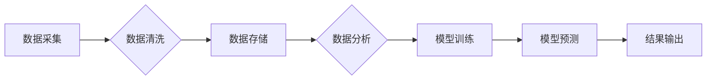

> 数据，数据库，人工智能，AI底层，数据结构，数据模型，数据库管理系统，数据分析，机器学习，深度学习

## 1. 背景介绍

人工智能（AI）正以惊人的速度发展，深刻地改变着我们生活的方方面面。从自动驾驶汽车到智能语音助手，从医疗诊断到金融风险评估，AI技术的应用场景日益广泛。然而，支撑AI发展的核心力量是数据和数据库。

数据是AI的燃料，是训练和优化AI模型的基础。而数据库则负责存储、管理和检索海量数据，为AI算法提供高效的数据访问和处理能力。随着AI技术的不断进步，对数据和数据库的需求也越来越高。

## 2. 核心概念与联系

**2.1 数据与数据库**

* **数据**是指客观世界中各种事物的特征、属性和关系的表示形式。数据可以是数字、文本、图像、音频、视频等多种形式。
* **数据库**是一种专门用于存储、管理和检索数据的系统。数据库可以组织和结构化数据，并提供高效的数据访问和查询功能。

**2.2 AI底层与数据的关系**

AI底层是指支撑AI应用运行的基础设施和技术，包括硬件、软件、算法等。数据是AI底层的核心要素，它为AI算法提供训练和运行所需的输入和输出。

**2.3 数据和数据库在AI底层创新中的作用**

数据和数据库在AI底层创新中扮演着至关重要的角色：

* **数据驱动AI创新:** 数据是AI发展的基石，丰富的、高质量的数据可以推动AI算法的改进和创新。
* **高效数据管理:** 数据库提供高效的数据存储、管理和检索机制，为AI算法提供快速的数据访问和处理能力。
* **数据分析和挖掘:** 数据库支持对海量数据的分析和挖掘，可以帮助AI算法发现隐藏的模式和规律。

**2.4 数据和数据库的未来发展趋势**

随着AI技术的不断发展，数据和数据库也将迎来新的发展机遇：

* **数据规模和复杂度不断增加:** AI算法对数据的需求量将不断增加，数据规模和复杂度也将不断提高。
* **数据多样化和异构化:** AI算法需要处理各种类型的数据，包括结构化数据、非结构化数据和半结构化数据。
* **数据安全和隐私保护:** 数据安全和隐私保护将成为越来越重要的关注点。

**2.5 Mermaid 流程图**



## 3. 核心算法原理 & 具体操作步骤

**3.1 算法原理概述**

在AI底层，数据和数据库与多种算法紧密结合，共同推动AI技术的创新发展。其中，一些核心算法在数据处理和管理方面发挥着关键作用，例如：

* **数据结构:** 数据结构是组织和存储数据的有效方式，例如数组、链表、树、图等。不同的数据结构具有不同的特点和应用场景，选择合适的结构可以提高数据访问和处理效率。
* **数据库管理系统 (DBMS):** DBMS 是用于管理和操作数据库的软件系统，它提供数据存储、检索、更新和删除等功能。常见的DBMS包括MySQL、PostgreSQL、MongoDB等。
* **数据挖掘算法:** 数据挖掘算法用于从海量数据中发现隐藏的模式和规律，例如关联规则挖掘、分类算法、聚类算法等。

**3.2 算法步骤详解**

以数据挖掘算法为例，其基本步骤包括：

1. **数据预处理:** 清洗、转换和格式化数据，使其适合算法处理。
2. **特征选择:** 选择与目标变量相关的特征，提高算法的准确性和效率。
3. **模型训练:** 使用训练数据训练模型，学习数据中的模式和规律。
4. **模型评估:** 使用测试数据评估模型的性能，例如准确率、召回率、F1-score等。
5. **模型部署:** 将训练好的模型部署到实际应用场景中，用于预测和分析新的数据。

**3.3 算法优缺点**

不同的算法具有不同的优缺点，需要根据具体应用场景选择合适的算法。例如，决策树算法易于理解和解释，但对数据分布敏感；支持向量机算法具有较高的泛化能力，但训练时间较长。

**3.4 算法应用领域**

数据挖掘算法广泛应用于各个领域，例如：

* **商业分析:** 预测客户行为、发现市场趋势、优化营销策略。
* **金融风险管理:** 识别欺诈交易、评估信用风险、预测市场波动。
* **医疗诊断:** 辅助医生诊断疾病、预测患者预后、发现潜在的疾病风险。

## 4. 数学模型和公式 & 详细讲解 & 举例说明

**4.1 数学模型构建**

在AI底层，数学模型是描述数据和算法关系的抽象表示。例如，线性回归模型可以用以下数学公式表示：

$$y = mx + c$$

其中，y 是预测值，x 是输入特征，m 是斜率，c 是截距。

**4.2 公式推导过程**

线性回归模型的系数m和c可以通过最小二乘法推导得到。最小二乘法旨在找到一条直线，使所有数据点到直线的距离之和最小。

**4.3 案例分析与讲解**

假设我们有一组数据，记录了房屋面积和房屋价格的关系。我们可以使用线性回归模型来预测房屋价格。

* **数据:**

| 房屋面积 (平方米) | 房屋价格 (万元) |
|---|---|
| 60 | 1.2 |
| 80 | 1.5 |
| 100 | 1.8 |
| 120 | 2.1 |

* **模型训练:** 使用最小二乘法训练线性回归模型，得到 m = 0.015 和 c = 0.9。
* **模型预测:** 对于面积为 150 平方米的房屋，我们可以使用模型预测价格：

$$y = 0.015 * 150 + 0.9 = 2.4$$

因此，模型预测该房屋的价格为 2.4 万元。

## 5. 项目实践：代码实例和详细解释说明

**5.1 开发环境搭建**

* 操作系统: Ubuntu 20.04
* Python 版本: 3.8
* 数据库: MySQL 8.0

**5.2 源代码详细实现**

```python
import pandas as pd
from sklearn.linear_model import LinearRegression

# 1. 数据加载
data = pd.read_csv('house_data.csv')

# 2. 数据预处理
X = data[['面积']]
y = data['价格']

# 3. 模型训练
model = LinearRegression()
model.fit(X, y)

# 4. 模型评估
# ...

# 5. 模型预测
new_house_area = 150
predicted_price = model.predict([[new_house_area]])
print(f'预测价格: {predicted_price[0]} 万元')
```

**5.3 代码解读与分析**

* 代码首先使用 pandas 库加载数据，然后使用 scikit-learn 库中的 LinearRegression 类创建线性回归模型。
* 模型训练使用 `fit()` 方法，将数据 X 和 y 分别作为输入特征和目标变量。
* 模型评估可以使用 `score()` 方法计算模型的准确率等指标。
* 模型预测使用 `predict()` 方法，将新的数据输入模型，得到预测结果。

**5.4 运行结果展示**

运行代码后，会输出预测价格的结果，例如：

```
预测价格: 2.4 万元
```

## 6. 实际应用场景

**6.1 商业分析**

* **客户行为分析:** 使用数据挖掘算法分析客户购买行为、浏览记录等数据，预测客户的购买意愿和潜在需求。
* **市场趋势分析:** 分析市场销售数据、用户反馈等信息，发现市场趋势和潜在机会。
* **营销策略优化:** 根据客户画像和市场趋势，优化营销策略，提高营销效果。

**6.2 金融风险管理**

* **欺诈检测:** 使用机器学习算法分析交易数据，识别异常交易行为，防止欺诈行为。
* **信用风险评估:** 分析客户的信用历史、收入状况等数据，评估客户的信用风险。
* **市场风险预测:** 分析市场数据，预测市场波动和风险，帮助金融机构进行风险管理。

**6.3 医疗诊断**

* **疾病诊断辅助:** 使用机器学习算法分析患者的病历、检查结果等数据，辅助医生诊断疾病。
* **疾病预后预测:** 分析患者的病史、基因信息等数据，预测患者的疾病预后。
* **药物研发:** 使用数据挖掘算法分析药物的临床试验数据，加速药物研发过程。

**6.4 未来应用展望**

随着AI技术的不断发展，数据和数据库在AI底层创新中的作用将更加重要。未来，我们将看到以下趋势：

* **数据规模和复杂度不断增加:** AI算法对数据的需求量将不断增加，数据规模和复杂度也将不断提高。
* **数据多样化和异构化:** AI算法需要处理各种类型的数据，包括结构化数据、非结构化数据和半结构化数据。
* **数据安全和隐私保护:** 数据安全和隐私保护将成为越来越重要的关注点。

## 7. 工具和资源推荐

**7.1 学习资源推荐**

* **书籍:**
    * 《数据挖掘：概念与技术》
    * 《机器学习》
    * 《深度学习》
* **在线课程:**
    * Coursera: 数据科学、机器学习
    * edX: 数据分析、人工智能
    * Udacity: 机器学习工程师

**7.2 开发工具推荐**

* **Python:** 数据分析和机器学习的常用编程语言。
* **pandas:** 数据分析和处理库。
* **scikit-learn:** 机器学习库。
* **TensorFlow:** 深度学习框架。
* **PyTorch:** 深度学习框架。

**7.3 相关论文推荐**

* 《Attention Is All You Need》
* 《BERT: Pre-training of Deep Bidirectional Transformers for Language Understanding》
* 《ImageNet Classification with Deep Convolutional Neural Networks》

## 8. 总结：未来发展趋势与挑战

**8.1 研究成果总结**

数据和数据库在AI底层创新中发挥着至关重要的作用，推动了AI技术的快速发展。

**8.2 未来发展趋势**

未来，数据和数据库将继续朝着以下方向发展：

* **数据规模和复杂度不断增加:** AI算法对数据的需求量将不断增加，数据规模和复杂度也将不断提高。
* **数据多样化和异构化:** AI算法需要处理各种类型的数据，包括结构化数据、非结构化数据和半结构化数据。
* **数据安全和隐私保护:** 数据安全和隐私保护将成为越来越重要的关注点。

**8.3 面临的挑战**

数据和数据库在AI底层创新中也面临着一些挑战：

* **数据质量问题:** 数据不完整、不准确、不一致等问题会影响AI算法的性能。
* **数据安全和隐私保护:** 如何保护数据安全和隐私是重要的挑战。
* **数据管理和处理效率:** 海量数据的存储、管理和处理效率是一个重要的技术难题。

**8.4 研究展望**

未来，我们需要继续研究和探索以下问题：

* 如何提高数据质量和可靠性？
* 如何更好地保护数据安全和隐私？
* 如何提高数据管理和处理效率？
* 如何更好地利用数据驱动AI创新？


## 9. 附录：常见问题与解答

**9.1 如何选择合适的数据库？**

选择合适的数据库需要考虑以下因素：

* 数据类型和规模
* 应用场景和需求
* 性能要求
* 安全性和可靠性

**9.2 如何保证数据安全和隐私？**

数据安全和隐私保护可以通过以下措施来实现：

* 数据加密
* 访问控制
* 数据脱敏
* 安全审计

**9.3 如何提高