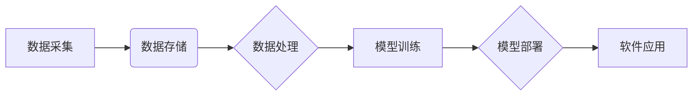

> 数据驱动、软件架构、机器学习、深度学习、数据平台、数据可视化、数据分析

## 1. 背景介绍

软件行业经历了从第一代以代码为核心的软件到第二代以数据为核心的软件的演变。第一代软件以手工编写的代码为核心，依赖于人类的逻辑思维和编程能力。随着数据量的爆炸式增长和计算能力的提升，数据逐渐成为软件的核心驱动力。数据驱动软件的出现，标志着软件行业进入了一个新的时代——软件2.0时代。

数据驱动软件的本质是利用数据来指导软件的开发、运行和优化。它打破了传统软件开发模式的局限性，使软件能够更加智能化、个性化和适应性强。数据驱动软件的应用场景广泛，涵盖了各个领域，例如：

* **个性化推荐:**  电商平台、视频网站等利用用户行为数据进行个性化推荐，提高用户体验和转化率。
* **精准营销:**  企业利用用户数据进行精准营销，提高营销效率和ROI。
* **智能客服:**  聊天机器人利用自然语言处理技术和用户数据，提供智能客服服务，提高客户满意度。
* **预测分析:**  利用历史数据进行预测分析，帮助企业做出更明智的决策。

## 2. 核心概念与联系

数据驱动软件的核心概念包括：

* **数据采集:**  从各种来源收集数据，例如用户行为数据、传感器数据、社交媒体数据等。
* **数据存储:**  将收集到的数据存储在高效、可靠的数据存储系统中。
* **数据处理:**  对收集到的数据进行清洗、转换、分析等处理，使其能够被软件利用。
* **模型训练:**  利用机器学习算法对数据进行训练，构建预测模型或决策模型。
* **模型部署:**  将训练好的模型部署到软件系统中，使软件能够根据数据做出决策或提供服务。

数据驱动软件的架构通常由以下几个部分组成：



## 3. 核心算法原理 & 具体操作步骤

### 3.1  算法原理概述

数据驱动软件的核心算法主要包括机器学习和深度学习算法。

* **机器学习:**  是一种人工智能技术，通过训练模型来学习数据中的模式和规律，从而能够对新的数据进行预测或分类。常见的机器学习算法包括线性回归、逻辑回归、决策树、支持向量机、k近邻算法等。
* **深度学习:**  是一种更高级的机器学习算法，它利用多层神经网络来模拟人类大脑的学习过程，能够处理更复杂的数据和任务。常见的深度学习算法包括卷积神经网络、循环神经网络、生成对抗网络等。

### 3.2  算法步骤详解

**机器学习算法的步骤:**

1. **数据预处理:**  对收集到的数据进行清洗、转换、特征工程等处理，使其能够被模型训练。
2. **模型选择:**  根据任务需求选择合适的机器学习算法。
3. **模型训练:**  利用训练数据对模型进行训练，调整模型参数，使其能够学习数据中的模式和规律。
4. **模型评估:**  利用测试数据对模型进行评估，评估模型的性能，例如准确率、召回率、F1-score等。
5. **模型部署:**  将训练好的模型部署到软件系统中，使软件能够根据数据做出决策或提供服务。

**深度学习算法的步骤:**

1. **数据预处理:**  与机器学习算法类似，对数据进行清洗、转换、特征工程等处理。
2. **模型选择:**  根据任务需求选择合适的深度学习算法。
3. **模型训练:**  利用训练数据对模型进行训练，调整模型参数，使其能够学习数据中的模式和规律。
4. **模型评估:**  利用测试数据对模型进行评估，评估模型的性能。
5. **模型调优:**  根据模型评估结果，对模型参数进行调整，提高模型性能。
6. **模型部署:**  将训练好的模型部署到软件系统中。

### 3.3  算法优缺点

**机器学习算法:**

* **优点:**  相对简单易懂，训练速度快，适用于小规模数据。
* **缺点:**  难以处理复杂的数据和任务，对数据特征工程要求较高。

**深度学习算法:**

* **优点:**  能够处理复杂的数据和任务，自动学习数据特征，性能优异。
* **缺点:**  训练速度慢，对数据量要求高，模型复杂度高，难以解释模型决策过程。

### 3.4  算法应用领域

机器学习和深度学习算法广泛应用于各个领域，例如：

* **图像识别:**  自动识别图像中的物体、场景、人脸等。
* **自然语言处理:**  理解和生成人类语言，例如机器翻译、文本摘要、聊天机器人等。
* **语音识别:**  将语音转换为文本。
* **推荐系统:**  根据用户行为数据进行个性化推荐。
* **预测分析:**  利用历史数据进行预测分析，例如销售预测、风险评估等。

## 4. 数学模型和公式 & 详细讲解 & 举例说明

### 4.1  数学模型构建

机器学习和深度学习算法的数学模型通常基于线性代数、微积分和概率论等数学基础。

**线性回归模型:**

线性回归模型假设数据之间存在线性关系，可以用以下公式表示：

$$y = w_0 + w_1x_1 + w_2x_2 + ... + w_nx_n + \epsilon$$

其中：

* $y$ 是目标变量
* $x_1, x_2, ..., x_n$ 是输入特征
* $w_0, w_1, w_2, ..., w_n$ 是模型参数
* $\epsilon$ 是误差项

**目标:**  通过最小化误差项的平方和来求解模型参数。

### 4.2  公式推导过程

**最小二乘法:**

最小二乘法是一种常用的求解线性回归模型参数的方法。其目标是找到一组参数，使得模型预测值与实际值之间的误差平方和最小。

$$J(w) = \sum_{i=1}^{n}(y_i - \hat{y}_i)^2$$

其中：

* $J(w)$ 是损失函数
* $w$ 是模型参数
* $y_i$ 是实际值
* $\hat{y}_i$ 是模型预测值

通过求解损失函数的梯度，可以得到模型参数的更新公式：

$$w = w - \alpha \nabla J(w)$$

其中：

* $\alpha$ 是学习率

### 4.3  案例分析与讲解

**房价预测:**

假设我们想要预测房屋的价格，可以使用线性回归模型。

* **输入特征:**  房屋面积、房间数、楼层数等
* **目标变量:**  房屋价格

我们可以收集房屋数据，训练线性回归模型，并使用模型预测新的房屋价格。

## 5. 项目实践：代码实例和详细解释说明

### 5.1  开发环境搭建

* **操作系统:**  Windows、macOS、Linux
* **编程语言:**  Python
* **机器学习库:**  scikit-learn、TensorFlow、PyTorch
* **数据存储:**  MySQL、MongoDB、Redis

### 5.2  源代码详细实现

```python
# 导入必要的库
import pandas as pd
from sklearn.linear_model import LinearRegression

# 加载数据
data = pd.read_csv('house_data.csv')

# 选择特征和目标变量
X = data[['面积', '房间数', '楼层数']]
y = data['价格']

# 创建线性回归模型
model = LinearRegression()

# 训练模型
model.fit(X, y)

# 预测新房子的价格
new_house = pd.DataFrame({'面积': [100], '房间数': [2], '楼层数': [10]})
predicted_price = model.predict(new_house)

# 打印预测结果
print(f'预测价格: {predicted_price[0]}')
```

### 5.3  代码解读与分析

* **数据加载:**  使用pandas库加载数据。
* **特征选择:**  选择需要用于预测的特征。
* **模型创建:**  创建线性回归模型。
* **模型训练:**  使用训练数据训练模型。
* **模型预测:**  使用训练好的模型预测新房子的价格。

### 5.4  运行结果展示

运行代码后，会输出预测价格的结果。

## 6. 实际应用场景

数据驱动软件的应用场景广泛，例如：

* **个性化推荐:**  电商平台、视频网站等利用用户行为数据进行个性化推荐，提高用户体验和转化率。
* **精准营销:**  企业利用用户数据进行精准营销，提高营销效率和ROI。
* **智能客服:**  聊天机器人利用自然语言处理技术和用户数据，提供智能客服服务，提高客户满意度。
* **预测分析:**  利用历史数据进行预测分析，帮助企业做出更明智的决策。

### 6.4  未来应用展望

随着数据量的爆炸式增长和计算能力的提升，数据驱动软件的应用场景将更加广泛，例如：

* **自动驾驶:**  利用传感器数据和机器学习算法实现自动驾驶。
* **医疗诊断:**  利用医疗影像数据和深度学习算法辅助医生进行诊断。
* **金融风险管理:**  利用金融数据进行风险评估和预测。

## 7. 工具和资源推荐

### 7.1  学习资源推荐

* **书籍:**  《Python机器学习》、《深度学习》
* **在线课程:**  Coursera、edX、Udacity
* **博客:**  机器之心、AI科技大本营

### 7.2  开发工具推荐

* **编程语言:**  Python
* **机器学习库:**  scikit-learn、TensorFlow、PyTorch
* **数据存储:**  MySQL、MongoDB、Redis

### 7.3  相关论文推荐

* **机器学习:**  《Support Vector Machines》
* **深度学习:**  《ImageNet Classification with Deep Convolutional Neural Networks》

## 8. 总结：未来发展趋势与挑战

### 8.1  研究成果总结

数据驱动软件的出现，标志着软件行业进入了一个新的时代。机器学习和深度学习算法的不断发展，使得数据驱动软件能够处理更复杂的数据和任务，并取得了显著的成果。

### 8.2  未来发展趋势

* **模型自动化:**  自动生成和优化模型，降低模型开发门槛。
* **边缘计算:**  将模型部署到边缘设备，实现实时数据处理和决策。
* **联邦学习:**  在不共享原始数据的情况下，联合训练模型，保护数据隐私。

### 8.3  面临的挑战

* **数据质量:**  数据驱动软件的性能依赖于数据质量，如何保证数据准确性和完整性是一个挑战。
* **模型解释性:**  深度学习模型的决策过程难以解释，如何提高模型的透明度和可解释性是一个挑战。
* **数据安全:**  数据驱动软件处理大量敏感数据，如何保障数据安全是一个挑战。

### 8.4  研究展望

未来，数据驱动软件将继续发展，并应用于更多领域。研究者将继续探索新的算法、模型和技术，以解决数据驱动软件面临的挑战，并推动软件行业的发展。

## 9. 附录：常见问题与解答

* **什么是数据驱动软件？**

数据驱动软件是指利用数据来指导软件的开发、运行和优化。

* **数据驱动软件有哪些优势？**

数据驱动软件能够更加智能化、个性化和适应性强。

* **数据驱动软件有哪些应用场景？**

数据驱动软件的应用场景广泛，例如个性化推荐、精准营销、智能客服、预测分析等。

* **如何学习数据驱动软件开发？**

可以学习机器学习和深度学习算法，并使用相关的开发工具和平台。

作者：禅与计算机程序设计艺术 / Zen and the Art of Computer Programming


<end_of_turn>