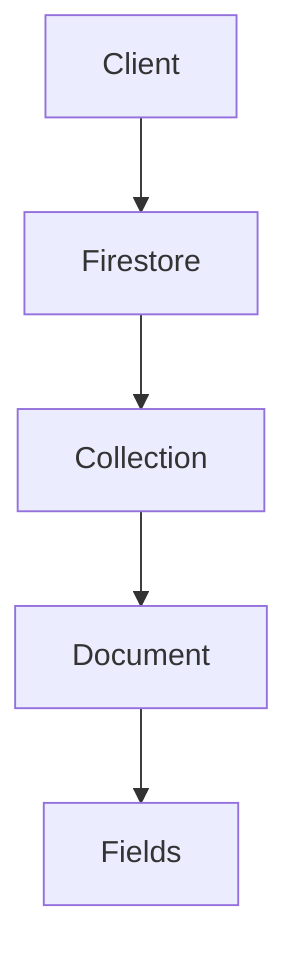
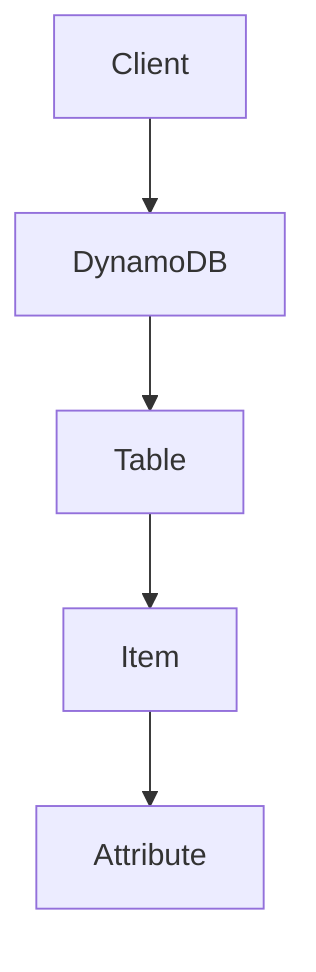

                 

## 1. 背景介绍

在当今的云计算时代，无服务器架构（Serverless Architecture）已成为一种主流趋势。无服务器数据库（Serverless Database）是无服务器架构的关键组成部分，它允许开发人员构建和部署应用程序，而无需管理底层的数据库服务器。本文将比较两种流行的无服务器数据库：Firebase Firestore 和 Amazon DynamoDB。

## 2. 核心概念与联系

### 2.1 Firestore

Firebase Firestore 是 Firebase 平台的 NoSQL 数据库，提供实时同步、高可用性和水平可扩展性。它使用文档存储数据，每个文档都有唯一的 ID，并支持嵌套文档和数组。



### 2.2 DynamoDB

Amazon DynamoDB 是一种完全托管的 NoSQL 数据库服务，提供单表、单键值存储。它使用项（Items）和属性（Attributes）存储数据，并支持事务和原子操作。



## 3. 核心算法原理 & 具体操作步骤

### 3.1 算法原理概述

Firestore 使用集合（Collection）和文档（Document）组织数据，支持实时同步和查询。DynamoDB 使用表（Table）和项（Item）组织数据，支持事务和原子操作。

### 3.2 算法步骤详解

#### 3.2.1 Firestore

1. 创建一个项目并启用 Firestore。
2. 创建一个集合，并添加文档。
3. 执行查询以检索数据。
4. 实时监听数据更改。

#### 3.2.2 DynamoDB

1. 创建一个表，并定义主键和属性。
2. 插入项（Items）到表中。
3. 执行查询以检索数据。
4. 使用事务和原子操作更新数据。

### 3.3 算法优缺点

#### 3.3.1 Firestore

**优点**：实时同步、简单易用、集成 Firebase 平台。

**缺点**：数据模型固定、查询能力有限、成本可能高于 DynamoDB。

#### 3.3.2 DynamoDB

**优点**：高性能、高可用、支持事务和原子操作。

**缺点**：学习曲线陡峭、成本可能高于 Firestore。

### 3.4 算法应用领域

Firestore 适合实时应用程序，如聊天应用和实时仪表板。DynamoDB 适合需要高性能和事务的应用程序，如金融和电子商务系统。

## 4. 数学模型和公式 & 详细讲解 & 举例说明

### 4.1 数学模型构建

#### 4.1.1 Firestore

Firestore 的数学模型可以表示为集合（C）和文档（D）的映射：

$$M_{Firestore} = \{C_1 \rightarrow D_{11}, D_{12},..., D_{1n},..., C_m \rightarrow D_{m1}, D_{m2},..., D_{mn}\}$$

#### 4.1.2 DynamoDB

DynamoDB 的数学模型可以表示为表（T）和项（I）的映射：

$$M_{DynamoDB} = \{T_1 \rightarrow I_{11}, I_{12},..., I_{1n},..., T_m \rightarrow I_{m1}, I_{m2},..., I_{mn}\}$$

### 4.2 公式推导过程

#### 4.2.1 Firestore

Firestore 的查询成本可以表示为：

$$C_{Firestore} = f(n, q)$$

其中，$n$ 是文档数，$q$ 是查询复杂度。

#### 4.2.2 DynamoDB

DynamoDB 的查询成本可以表示为：

$$C_{DynamoDB} = g(c, r)$$

其中，$c$ 是容量单位（Capacity Units），$r$ 是请求数。

### 4.3 案例分析与讲解

假设我们要存储和查询 1000 万个用户文档，每个文档大小为 1 KB。

#### 4.3.1 Firestore

Firestore 的成本可以使用以下公式计算：

$$C_{Firestore} = 1000,000 \times 1 \times 10 = 10,000,000 \text{ read units}$$

#### 4.3.2 DynamoDB

DynamoDB 的成本可以使用以下公式计算：

$$C_{DynamoDB} = 1000,000 \times 4 \times 10 = 40,000,000 \text{ read capacity units}$$

## 5. 项目实践：代码实例和详细解释说明

### 5.1 开发环境搭建

#### 5.1.1 Firestore

1. 安装 Firebase CLI：`npm install -g firebase-tools`
2. 登录 Firebase：`firebase login`
3. 初始化项目：`firebase init`

#### 5.1.2 DynamoDB

1. 安装 AWS CLI：`pip install awscli`
2. 登录 AWS：`aws configure`
3. 创建 DynamoDB 表：`aws dynamodb create-table`

### 5.2 源代码详细实现

#### 5.2.1 Firestore

```javascript
// Add a document
db.collection('users').add({
  first: 'Ada',
  last: 'Lovelace',
  born: 1815
});

// Query documents
db.collection('users').where('born', '==', 1815).get()
 .then(snapshot => {
    snapshot.forEach(doc => {
      console.log(doc.id, '=>', doc.data());
    });
  });
```

#### 5.2.2 DynamoDB

```python
# Add an item
table = boto3.resource('dynamodb').Table('Users')
table.put_item(
   Item={
        'Name': 'Ada Lovelace',
        'Born': 1815
    }
)

# Query items
response = table.scan(FilterExpression='#born = :born_value',
                       ExpressionAttributeNames={'#born': 'Born'},
                       ExpressionAttributeValues={':born_value': 1815})
for item in response['Items']:
    print(item['Name'], '=>', item['Born'])
```

### 5.3 代码解读与分析

#### 5.3.1 Firestore

在 Firestore 中，我们使用 `db.collection('users').add()` 添加文档，并使用 `db.collection('users').where('born', '==', 1815).get()` 查询文档。

#### 5.3.2 DynamoDB

在 DynamoDB 中，我们使用 `table.put_item()` 添加项，并使用 `table.scan()` 查询项。

### 5.4 运行结果展示

运行上述代码后，我们应该能够在控制台看到 Ada Lovelace 的信息。

## 6. 实际应用场景

### 6.1 Firestore

Firebase Firestore 适合实时应用程序，如：

- 实时聊天应用程序
- 实时仪表板和分析应用程序
- 实时地图应用程序

### 6.2 DynamoDB

Amazon DynamoDB 适合需要高性能和事务的应用程序，如：

- 金融系统
- 电子商务系统
- 实时数据处理系统

### 6.3 未来应用展望

无服务器数据库的未来将朝着更高的可扩展性、更低的延迟和更丰富的功能发展。我们可能会看到更多的无服务器数据库提供商进入市场，并提供更多的功能和集成选项。

## 7. 工具和资源推荐

### 7.1 学习资源推荐

- Firestore 文档：<https://firebase.google.com/docs/firestore>
- DynamoDB 文档：<https://docs.aws.amazon.com/amazondynamodb/latest/developerguide/Introduction.html>
- Serverless Architecture 书籍：<https://www.serverlessarchitectures.com/>

### 7.2 开发工具推荐

- Firebase CLI：<https://firebase.google.com/docs/cli>
- AWS CLI：<https://aws.amazon.com/cli/>
- Serverless Framework：<https://www.serverless.com/>

### 7.3 相关论文推荐

- "Serverless Computing: Definition, Architecture, and Applications"：<https://ieeexplore.ieee.org/document/8458964>
- "DynamoDB: Amazon's Highly Available NoSQL Database"：<https://www.allthingsdistributed.com/files/amazon-dynamo-sigod10.pdf>

## 8. 总结：未来发展趋势与挑战

### 8.1 研究成果总结

本文比较了 Firebase Firestore 和 Amazon DynamoDB，并提供了项目实践和代码示例。我们发现，Firestore 适合实时应用程序，而 DynamoDB 适合需要高性能和事务的应用程序。

### 8.2 未来发展趋势

无服务器数据库的未来趋势包括更高的可扩展性、更低的延迟和更丰富的功能。我们可能会看到更多的无服务器数据库提供商进入市场，并提供更多的功能和集成选项。

### 8.3 面临的挑战

无服务器数据库面临的挑战包括成本控制、数据模型的限制和学习曲线。开发人员需要平衡成本、性能和功能，并学习新的数据模型和 API。

### 8.4 研究展望

未来的研究将关注无服务器数据库的性能优化、成本控制和新的应用领域。我们可能会看到更多的研究关注无服务器数据库的安全性、隐私和合规性。

## 9. 附录：常见问题与解答

**Q：无服务器数据库与传统数据库有何不同？**

A：无服务器数据库提供了更高的可扩展性、更低的延迟和更丰富的功能。它们允许开发人员构建和部署应用程序，而无需管理底层的数据库服务器。

**Q：如何选择无服务器数据库？**

A：选择无服务器数据库取决于应用程序的需求。如果您需要实时同步和查询，Firestore 可能是一个好选择。如果您需要高性能和事务，DynamoDB 可能是一个好选择。

**Q：无服务器数据库的成本如何计算？**

A：无服务器数据库的成本取决于数据量、查询复杂度和请求数。开发人员需要平衡成本、性能和功能。

## 作者：禅与计算机程序设计艺术 / Zen and the Art of Computer Programming

