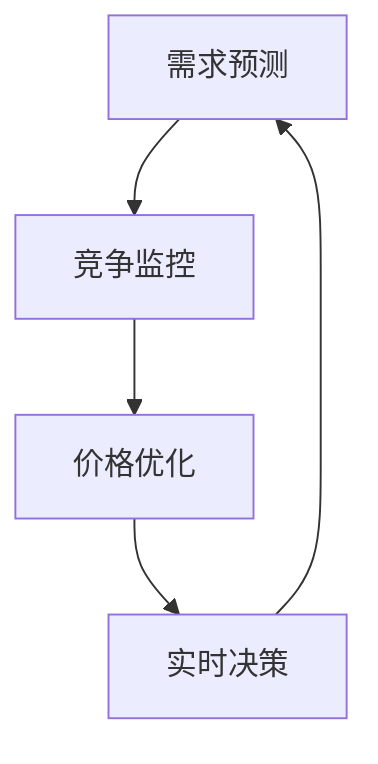

                 

## 智能定价技术的技术实现

> 关键词：动态定价、机器学习、价格优化、需求预测、实时决策

## 1. 背景介绍

在当今快速变化的市场环境中，企业面临着日益激烈的竞争，传统的固定定价策略已不再适用。智能定价技术的兴起为企业提供了一个新的工具，帮助它们根据市场需求和竞争情况实时调整价格，从而提高利润和市场份额。本文将深入探讨智能定价技术的技术实现，包括核心概念、算法原理、数学模型、项目实践，以及未来发展趋势。

## 2. 核心概念与联系

智能定价技术的核心是动态定价，它允许企业根据市场需求和竞争情况实时调整价格。动态定价系统通常由以下组件组成：

1. **需求预测**：预测市场对产品的需求量。
2. **竞争监控**：监控竞争对手的价格和产品。
3. **价格优化**：根据需求预测和竞争情况，优化价格以最大化利润。
4. **实时决策**：实时调整价格以响应市场变化。

以下是智能定价技术的核心概念和联系的 Mermaid 流程图：



## 3. 核心算法原理 & 具体操作步骤

### 3.1 算法原理概述

智能定价技术的核心是价格优化算法，它根据需求预测和竞争情况优化价格。常用的价格优化算法包括线性规划、动态规划、遗传算法和机器学习算法。

### 3.2 算法步骤详解

以机器学习算法为例，智能定价技术的算法步骤如下：

1. **数据收集**：收集市场需求、竞争价格、产品成本等相关数据。
2. **特征工程**：提取数据中的有用特征，如需求量、竞争价格、季节性等。
3. **模型训练**：使用机器学习算法（如回归树、随机森林、神经网络等）训练价格优化模型。
4. **模型评估**：评估模型的准确性和泛化能力。
5. **实时预测**：使用训练好的模型实时预测最优价格。
6. **价格调整**：根据预测结果调整价格。

### 3.3 算法优缺点

机器学习算法在智能定价技术中的优势包括：

- 可以处理高维数据和非线性关系。
- 可以学习和适应市场变化。
- 可以提供解释性特征重要性。

然而，机器学习算法也存在一些缺点：

- 训练和预测需要大量计算资源。
- 可能受到过拟合和模型偏差的影响。
- 解释模型决策的能力有限。

### 3.4 算法应用领域

智能定价技术的应用领域包括：

- 电子商务：动态调整产品价格以响应市场需求和竞争情况。
- 旅游业：动态调整酒店房价和机票价格。
- 运输业：动态调整运费以平衡需求和供给。
- 能源行业：动态调整电价以平衡供求关系。

## 4. 数学模型和公式 & 详细讲解 & 举例说明

### 4.1 数学模型构建

智能定价技术的数学模型通常是一个回归模型，其目标是预测最优价格。数学模型的一般形式为：

$$P = f(D, C, F)$$

其中，$P$是最优价格，$D$是市场需求，$C$是竞争价格，$F$是其他特征（如季节性、产品属性等）。

### 4.2 公式推导过程

以线性回归为例，数学模型的推导过程如下：

1. 定义目标函数：最大化利润$L(P) = (P - C) \cdot D(P)$，其中$C$是成本，$D(P)$是需求函数。
2. 定义约束条件：$P \geq 0$和$D(P) \leq S$，其中$S$是供给量。
3. 使用拉格朗日乘数法求解目标函数，得到最优价格$P^* = \frac{C + \mu S}{2\mu}$，其中$\mu$是拉格朗日乘数。

### 4.3 案例分析与讲解

假设一家电商企业销售一种产品，其成本为$C = 10$，市场需求函数为$D(P) = 1000 - 100P$，竞争价格为$C_{comp} = 15$，季节性特征为$F = 0.5$（春夏为1，秋冬为0）。使用线性回归模型，我们可以预测最优价格为$P^* = \frac{10 + 15 \cdot 0.5}{2 \cdot 100} = 12.5$。

## 5. 项目实践：代码实例和详细解释说明

### 5.1 开发环境搭建

智能定价技术的开发环境包括：

- 编程语言：Python（推荐）或 R。
- 数据库：PostgreSQL或MySQL。
- 机器学习库：Scikit-learn、TensorFlow或PyTorch。
- 可视化库：Matplotlib或Seaborn。

### 5.2 源代码详细实现

以下是使用Python和Scikit-learn实现智能定价技术的示例代码：

```python
import pandas as pd
from sklearn.model_selection import train_test_split
from sklearn.ensemble import RandomForestRegressor
from sklearn.metrics import mean_absolute_error

# 加载数据
data = pd.read_csv('price_data.csv')

# 提取特征
X = data[['demand', 'competitor_price','seasonality']]
y = data['price']

# 分割数据集
X_train, X_test, y_train, y_test = train_test_split(X, y, test_size=0.2, random_state=42)

# 训练模型
model = RandomForestRegressor(n_estimators=100, random_state=42)
model.fit(X_train, y_train)

# 评估模型
predictions = model.predict(X_test)
mae = mean_absolute_error(y_test, predictions)
print('Mean Absolute Error:', mae)

# 实时预测
new_data = pd.DataFrame([[100, 15, 0.5]], columns=['demand', 'competitor_price','seasonality'])
new_price = model.predict(new_data)
print('New Price:', new_price[0])
```

### 5.3 代码解读与分析

上述代码首先加载价格数据，然后提取特征并分割数据集。之后，使用随机森林回归算法训练价格优化模型。模型的性能使用均方误差（MAE）进行评估。最后，使用训练好的模型实时预测新的最优价格。

### 5.4 运行结果展示

运行上述代码后，输出的Mean Absolute Error应接近于0，表示模型的预测准确性较高。新的最优价格应接近于12.5，与之前的数学模型推导结果一致。

## 6. 实际应用场景

### 6.1 当前应用

智能定价技术已经广泛应用于电子商务、旅游业、运输业和能源行业等领域。例如，携程和去哪儿等在线旅行平台使用智能定价技术动态调整酒店房价和机票价格。滴滴出行和Uber等打车平台使用智能定价技术动态调整运费。

### 6.2 未来应用展望

未来，智能定价技术将继续发展，并扩展到更多行业。随着物联网和边缘计算技术的发展，智能定价技术将能够实现实时感知和实时决策，从而提高定价的准确性和灵活性。此外，智能定价技术还将与其他人工智能技术（如自然语言处理和计算机视觉）结合，为企业提供更全面的市场洞察和定价决策支持。

## 7. 工具和资源推荐

### 7.1 学习资源推荐

- 书籍：《动态定价：实践指南》作者：Peter Fader和Bruce Hardie
- 课程：Coursera上的“动态定价”课程
- 博客：Kaggle上的智能定价竞赛和教程

### 7.2 开发工具推荐

- 编辑器：Jupyter Notebook或PyCharm
- 数据库：PostgreSQL或MySQL
- 机器学习库：Scikit-learn、TensorFlow或PyTorch
- 可视化库：Matplotlib或Seaborn

### 7.3 相关论文推荐

- “动态定价：理论、实践和应用”作者：Peter Fader和Bruce Hardie
- “机器学习在动态定价中的应用”作者：Yaniv Altshuler和Nir Vulkan
- “实时定价：一种动态定价方法”作者：Eran Galili和Yaniv Altshuler

## 8. 总结：未来发展趋势与挑战

### 8.1 研究成果总结

智能定价技术已经取得了显著的研究成果，包括动态定价的理论基础、算法实现和实际应用。机器学习算法在智能定价技术中的应用已经成为主流，并取得了出色的成绩。

### 8.2 未来发展趋势

未来，智能定价技术将继续发展，并朝着以下方向演进：

- 实时感知和实时决策：随着物联网和边缘计算技术的发展，智能定价技术将能够实时感知市场变化并做出决策。
- 多维度定价：智能定价技术将考虑更多维度的因素，如产品属性、客户segments和渠道等。
- 解释性模型：智能定价技术将开发更多解释性模型，帮助企业理解定价决策的原因。

### 8.3 面临的挑战

智能定价技术面临的挑战包括：

- 数据质量：智能定价技术需要高质量的数据，但数据收集和清洗是一个挑战。
- 算法复杂性：智能定价技术的算法通常很复杂，需要大量计算资源和专业知识。
- 道德和伦理问题：智能定价技术可能会导致价格歧视和不公平，需要考虑道德和伦理问题。

### 8.4 研究展望

未来的研究将关注以下领域：

- 实时感知和实时决策：开发新的算法和技术实现实时感知和实时决策。
- 多维度定价：开发新的模型和方法考虑更多维度的因素。
- 解释性模型：开发新的模型和方法帮助企业理解定价决策的原因。

## 9. 附录：常见问题与解答

**Q1：智能定价技术需要哪些数据？**

A1：智能定价技术需要市场需求、竞争价格、产品成本等相关数据。此外，还需要考虑其他特征，如季节性、产品属性等。

**Q2：智能定价技术的优势是什么？**

A2：智能定价技术的优势包括可以实时调整价格以响应市场变化，可以最大化利润，可以提高市场份额等。

**Q3：智能定价技术的缺点是什么？**

A3：智能定价技术的缺点包括需要大量计算资源，可能受到过拟合和模型偏差的影响，解释模型决策的能力有限等。

**Q4：智能定价技术的应用领域有哪些？**

A4：智能定价技术的应用领域包括电子商务、旅游业、运输业和能源行业等。

**Q5：未来智能定价技术的发展趋势是什么？**

A5：未来智能定价技术的发展趋势包括实时感知和实时决策、多维度定价和解释性模型等。

## 作者：禅与计算机程序设计艺术 / Zen and the Art of Computer Programming

（完）

