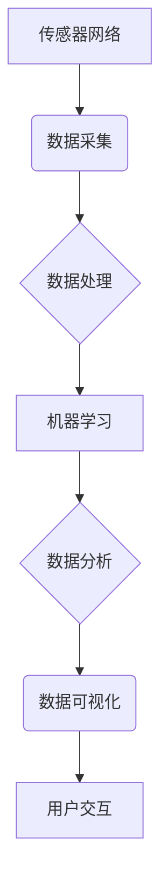

> 智能家居，环境质量，传感器网络，机器学习，数据分析，系统设计

## 1. 背景介绍

随着科技的飞速发展，智能家居已成为现代生活的重要组成部分。智能家居系统通过传感器网络、云计算、物联网等技术，实现对家居环境的智能感知、控制和管理，为用户提供更加舒适、便捷、安全的居住体验。然而，智能家居环境质量的分析和优化一直是该领域面临的重要挑战。

传统的家居环境质量监测主要依赖于人工观察和简单的传感器，缺乏对环境质量的全面、实时和智能分析能力。随着智能家居系统的普及，对环境质量的监测和分析需求日益增长。如何有效地分析和优化智能家居环境质量，提升用户体验，成为智能家居发展的重要方向。

## 2. 核心概念与联系

**2.1 智能家居环境质量**

智能家居环境质量是指家居环境中各种物理、化学和生物因素的综合状态，包括温度、湿度、空气质量、光照、噪音等。这些因素对用户的健康、舒适和生活质量有直接影响。

**2.2 传感器网络**

传感器网络是智能家居环境质量监测的关键技术之一。通过部署各种传感器，可以实时采集家居环境中的各种数据，为环境质量分析提供数据支撑。常见的传感器类型包括温度传感器、湿度传感器、气体传感器、光照传感器、噪音传感器等。

**2.3 机器学习**

机器学习是人工智能领域的重要分支，通过算法训练，使系统能够从数据中学习，并对未知数据进行预测和分析。在智能家居环境质量分析中，机器学习可以用于识别环境质量异常情况、预测未来环境质量变化趋势等。

**2.4 数据分析**

数据分析是利用统计学、计算机科学等方法，对海量数据进行挖掘、整理和分析，从中发现规律和价值。在智能家居环境质量分析中，数据分析可以用于识别环境质量影响因素、评估环境质量改善方案等。

**2.5 系统架构**

智能家居环境质量分析系统通常由以下几个模块组成：

* **传感器网络模块:**负责采集家居环境数据。
* **数据处理模块:**负责对采集到的数据进行预处理、清洗和格式转换。
* **机器学习模块:**负责对数据进行分析和建模，识别环境质量异常情况、预测未来环境质量变化趋势等。
* **数据可视化模块:**负责将分析结果以图表、报表等形式展示给用户。
* **用户交互模块:**负责用户与系统进行交互，例如设置环境质量目标、查看环境质量报告等。



## 3. 核心算法原理 & 具体操作步骤

### 3.1  算法原理概述

智能家居环境质量分析系统通常采用机器学习算法进行环境质量预测和异常检测。常见的算法包括：

* **线性回归:** 用于预测环境质量指标与其他因素之间的线性关系。
* **支持向量机:** 用于分类环境质量，例如判断环境质量是否良好或不良。
* **决策树:** 用于根据环境质量指标的组合，构建决策规则，判断环境质量。
* **神经网络:** 用于学习复杂的环境质量变化模式，进行更精准的预测和分析。

### 3.2  算法步骤详解

以环境质量预测为例，算法步骤如下：

1. **数据收集:** 收集历史环境质量数据和相关影响因素数据，例如温度、湿度、光照、人员活动等。
2. **数据预处理:** 对数据进行清洗、转换和特征工程，例如处理缺失值、归一化数据、提取特征等。
3. **模型训练:** 选择合适的机器学习算法，使用训练数据训练模型，学习环境质量与影响因素之间的关系。
4. **模型评估:** 使用测试数据评估模型的预测精度，例如使用均方误差、R-squared等指标。
5. **模型部署:** 将训练好的模型部署到智能家居系统中，用于实时预测环境质量。

### 3.3  算法优缺点

不同的机器学习算法具有不同的优缺点，需要根据实际应用场景选择合适的算法。

* **线性回归:** 算法简单易懂，计算效率高，但对数据线性关系要求较高。
* **支持向量机:** 对非线性数据处理能力强，但训练时间较长，参数设置较为复杂。
* **决策树:** 算法易于理解和解释，但容易过拟合，预测精度可能较低。
* **神经网络:** 能够学习复杂数据模式，预测精度较高，但训练时间长，参数设置复杂，解释性较差。

### 3.4  算法应用领域

机器学习算法在智能家居环境质量分析领域具有广泛的应用前景，例如：

* **环境质量预测:** 预测未来环境质量变化趋势，帮助用户提前做好准备。
* **异常检测:** 识别环境质量异常情况，例如空气质量突然下降、温度过高等，及时采取措施。
* **个性化控制:** 根据用户的喜好和需求，自动调节环境质量，例如温度、湿度、光照等。
* **健康监测:** 通过环境质量数据，监测用户的健康状况，例如过敏反应、呼吸道疾病等。

## 4. 数学模型和公式 & 详细讲解 & 举例说明

### 4.1  数学模型构建

智能家居环境质量分析系统通常采用数学模型来描述环境质量与影响因素之间的关系。常见的数学模型包括：

* **线性回归模型:** 用于描述环境质量指标与影响因素之间的线性关系。

$$
y = \beta_0 + \beta_1x_1 + \beta_2x_2 + ... + \beta_nx_n + \epsilon
$$

其中：

* $y$ 是环境质量指标
* $x_1, x_2, ..., x_n$ 是影响因素
* $\beta_0, \beta_1, ..., \beta_n$ 是模型参数
* $\epsilon$ 是随机误差

* **支持向量机模型:** 用于分类环境质量，例如判断环境质量是否良好或不良。

### 4.2  公式推导过程

支持向量机模型的推导过程较为复杂，涉及到凸优化、拉格朗日乘子法等数学工具。

### 4.3  案例分析与讲解

以温度预测为例，假设我们使用线性回归模型预测室内温度，影响因素包括室外温度、光照强度、空调使用情况等。

通过收集历史数据，我们可以训练线性回归模型，得到模型参数。然后，我们可以使用模型预测未来室内温度。

## 5. 项目实践：代码实例和详细解释说明

### 5.1  开发环境搭建

智能家居环境质量分析系统可以使用Python语言开发，常用的库包括：

* **NumPy:** 用于数值计算
* **Pandas:** 用于数据处理
* **Scikit-learn:** 用于机器学习算法
* **Matplotlib:** 用于数据可视化

### 5.2  源代码详细实现

```python
import numpy as np
from sklearn.linear_model import LinearRegression

# 训练数据
X = np.array([[20, 100], [25, 200], [30, 300], [35, 400]])
y = np.array([22, 27, 32, 37])

# 创建线性回归模型
model = LinearRegression()

# 训练模型
model.fit(X, y)

# 预测新数据
new_data = np.array([[40, 500]])
predicted_temperature = model.predict(new_data)

# 打印预测结果
print("预测温度:", predicted_temperature[0])
```

### 5.3  代码解读与分析

这段代码演示了如何使用Python和Scikit-learn库训练一个线性回归模型，预测室内温度。

* 首先，我们定义了训练数据，包括影响因素（室外温度、光照强度）和目标变量（室内温度）。
* 然后，我们创建了一个线性回归模型对象。
* 接着，我们使用`fit()`方法训练模型，将训练数据输入模型。
* 最后，我们使用`predict()`方法预测新数据的温度。

### 5.4  运行结果展示

运行这段代码，可以得到预测的室内温度值。

## 6. 实际应用场景

智能家居环境质量分析系统可以应用于各种场景，例如：

* **家庭住宅:** 监测和优化家庭环境质量，例如温度、湿度、空气质量等，提升居住舒适度。
* **办公楼:** 监测和优化办公环境质量，例如温度、湿度、光照、噪音等，提高员工工作效率和舒适度。
* **酒店:** 监测和优化酒店房间环境质量，提升入住体验。
* **养老院:** 监测和优化养老院环境质量，例如温度、湿度、空气质量等，保障老人健康。

### 6.4  未来应用展望

随着人工智能、物联网等技术的不断发展，智能家居环境质量分析系统将拥有更广阔的应用前景，例如：

* **个性化环境控制:** 根据用户的喜好和需求，自动调节环境质量，例如温度、湿度、光照等。
* **健康监测:** 通过环境质量数据，监测用户的健康状况，例如过敏反应、呼吸道疾病等。
* **智能家居安全:** 利用环境质量数据，识别潜在的安全隐患，例如火灾、泄漏等。

## 7. 工具和资源推荐

### 7.1  学习资源推荐

* **机器学习课程:** Coursera、edX、Udacity等平台提供丰富的机器学习课程。
* **Python编程教程:** Python官网、Real Python等网站提供Python编程教程。
* **智能家居开发文档:** 各家智能家居平台提供开发文档和API接口。

### 7.2  开发工具推荐

* **Python:** 强大的编程语言，广泛应用于数据分析和机器学习。
* **Jupyter Notebook:** 用于交互式编程和数据可视化。
* **TensorFlow:** 深度学习框架，用于训练复杂的机器学习模型。
* **PyTorch:** 深度学习框架，与TensorFlow类似。

### 7.3  相关论文推荐

* **"A Survey of Machine Learning for Smart Home Applications"**
* **"Deep Learning for Indoor Environment Quality Prediction"**
* **"Smart Home Energy Management Using Machine Learning"**

## 8. 总结：未来发展趋势与挑战

### 8.1  研究成果总结

智能家居环境质量分析系统已经取得了一定的研究成果，例如：

* 能够准确预测环境质量指标，例如温度、湿度、空气质量等。
* 能够识别环境质量异常情况，例如空气质量突然下降、温度过高等。
* 能够根据用户的喜好和需求，自动调节环境质量。

### 8.2  未来发展趋势

智能家居环境质量分析系统未来将朝着以下方向发展：

* **更精准的预测:** 利用更先进的机器学习算法和传感器技术，提高环境质量预测的精度。
* **更个性化的控制:** 根据用户的喜好和需求，提供更个性化的环境质量控制方案。
* **更智能的交互:** 利用自然语言处理和语音识别技术，实现更智能的与用户的交互。
* **更广泛的应用:** 将智能家居环境质量分析系统应用于更多场景，例如医疗、教育、农业等。

### 8.3  面临的挑战

智能家居环境质量分析系统也面临一些挑战：

* **数据隐私保护:** 智能家居系统收集大量用户数据，需要确保数据隐私安全。
* **算法鲁棒性:** 环境质量数据具有复杂性和不确定性，需要开发更鲁棒的算法，能够应对各种环境变化。
* **系统安全性:** 智能家居系统需要保证安全可靠，防止恶意攻击和数据泄露。

### 8.4  研究展望

未来，我们将继续致力于智能家居环境质量分析系统的研究，探索更先进的算法、更智能的交互方式，以及更广泛的应用场景，为用户提供更加舒适、便捷、安全的智能家居体验。

## 9. 附录：常见问题与解答

**Q1: 智能家居环境质量分析系统需要哪些硬件设备？**

**A1:** 智能家居环境