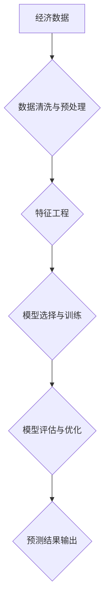

> 经济增长预测，人工智能，大数据，机器学习，深度学习，云计算，区块链，经济模型

## 1. 背景介绍

全球经济在过去几十年中经历了显著的增长，但近年来，经济增长放缓，全球不确定性增加。新冠疫情、地缘政治紧张局势、气候变化等因素对经济增长构成重大挑战。在这样的背景下，准确预测未来几年世界经济增长至关重要，以便各国政府和企业制定有效的政策和战略。

传统经济增长预测方法主要依赖于统计模型和专家意见，但这些方法往往难以捕捉到经济系统复杂性和不确定性。近年来，人工智能（AI）技术的发展为经济增长预测提供了新的机遇。AI算法能够处理海量数据，识别复杂模式，并进行更精准的预测。

## 2. 核心概念与联系

**2.1 经济增长预测**

经济增长预测是指利用历史数据、经济指标和模型，预测未来一段时间内经济总产出（GDP）的增长率。

**2.2 人工智能（AI）**

人工智能是指模拟人类智能行为的计算机系统。AI技术包括机器学习、深度学习、自然语言处理等。

**2.3 大数据**

大数据是指海量、高速度、高多样性的数据。大数据分析可以帮助我们从数据中发现隐藏的模式和趋势。

**2.4 机器学习（ML）**

机器学习是AI的一个子领域，它使计算机能够从数据中学习，并根据学习到的知识进行预测或决策。

**2.5 深度学习（DL）**

深度学习是机器学习的一个子领域，它使用多层神经网络来模拟人类大脑的学习过程。深度学习算法能够处理更复杂的数据，并进行更精准的预测。

**2.6 云计算**

云计算是指使用互联网提供计算资源、存储空间和软件服务的模式。云计算可以帮助我们处理海量数据，并进行大规模的机器学习训练。

**2.7 区块链**

区块链是一种分布式账本技术，它可以记录和验证交易信息，并确保数据的安全性和透明性。区块链技术可以应用于经济增长预测，例如用于收集和验证经济数据。

**2.8 经济模型**

经济模型是用来描述经济现象和关系的数学模型。经济模型可以用来预测经济增长、通货膨胀、失业率等经济指标。

**2.9 流程图**



## 3. 核心算法原理 & 具体操作步骤

### 3.1 算法原理概述

经济增长预测的AI算法主要包括：

* **线性回归:** 用于预测连续变量，例如GDP增长率。
* **逻辑回归:** 用于预测分类变量，例如经济衰退或复苏。
* **支持向量机 (SVM):** 用于分类和回归，能够处理高维数据。
* **决策树:** 用于分类和回归，能够处理非线性关系。
* **随机森林:** 结合多个决策树，提高预测精度。
* **神经网络:** 能够处理复杂数据，并学习非线性关系。

### 3.2 算法步骤详解

1. **数据收集:** 收集历史经济数据，包括GDP、消费支出、投资、出口、进口等指标。
2. **数据清洗与预处理:** 处理缺失值、异常值和数据格式问题。
3. **特征工程:** 从原始数据中提取特征，例如经济指标的差分、比率、指数等。
4. **模型选择与训练:** 选择合适的AI算法，并使用训练数据训练模型。
5. **模型评估与优化:** 使用测试数据评估模型性能，并通过调整模型参数优化预测精度。
6. **预测结果输出:** 使用训练好的模型预测未来一段时间内的经济增长率。

### 3.3 算法优缺点

| 算法 | 优点 | 缺点 |
|---|---|---|
| 线性回归 | 简单易懂，计算速度快 | 只能处理线性关系 |
| 逻辑回归 | 用于分类问题，效果较好 | 只能处理线性关系 |
| SVM | 能够处理高维数据，泛化能力强 | 计算复杂度高 |
| 决策树 | 易于理解和解释 | 容易过拟合 |
| 随机森林 | 结合多个决策树，提高预测精度 | 计算复杂度高 |
| 神经网络 | 能够处理复杂数据，学习非线性关系 | 计算复杂度高，训练时间长 |

### 3.4 算法应用领域

* **宏观经济预测:** 预测GDP增长率、通货膨胀率、失业率等宏观经济指标。
* **行业分析:** 预测特定行业的发展趋势和增长潜力。
* **投资决策:** 为投资者提供经济增长预测，帮助他们做出投资决策。
* **政策制定:** 为政府制定经济政策提供参考。

## 4. 数学模型和公式 & 详细讲解 & 举例说明

### 4.1 数学模型构建

经济增长预测模型通常基于时间序列分析和经济学理论。

**4.1.1 时间序列模型:**

时间序列模型用于分析和预测随时间变化的经济指标。常见的模型包括ARIMA模型、SARIMA模型和GARCH模型。

**4.1.2 经济学模型:**

经济学模型基于经济学理论，描述经济现象和关系。常见的模型包括IS-LM模型、AD-AS模型和Solow模型。

### 4.2 公式推导过程

**4.2.1 ARIMA模型:**

ARIMA模型是一种统计模型，用于预测时间序列数据。其公式如下：

$$y_t = c + \phi_1 y_{t-1} + \phi_2 y_{t-2} + ... + \phi_p y_{t-p} + \theta_1 \epsilon_{t-1} + \theta_2 \epsilon_{t-2} + ... + \theta_q \epsilon_{t-q} + \epsilon_t$$

其中：

* $y_t$ 是时间t的观测值。
* $c$ 是截距项。
* $\phi_i$ 是自回归系数。
* $\theta_i$ 是移动平均系数。
* $\epsilon_t$ 是随机误差项。
* $p$ 和 $q$ 分别是自回归阶数和移动平均阶数。

**4.2.2 Solow模型:**

Solow模型是一个经济增长模型，它解释了资本积累、劳动力增长和技术进步对经济增长的影响。其核心公式如下：

$$Y_t = F(K_t, L_t)$$

其中：

* $Y_t$ 是时间t的产出。
* $K_t$ 是时间t的资本存量。
* $L_t$ 是时间t的劳动力。
* $F(K_t, L_t)$ 是生产函数。

### 4.3 案例分析与讲解

**4.3.1 ARIMA模型预测GDP增长率:**

可以使用ARIMA模型预测一个国家的GDP增长率。例如，我们可以使用历史GDP增长率数据训练一个ARIMA模型，并使用模型预测未来几年的GDP增长率。

**4.3.2 Solow模型分析经济增长:**

可以使用Solow模型分析一个国家的经济增长。例如，我们可以使用该国的资本存量、劳动力和技术进步数据，来分析这些因素对经济增长的影响。

## 5. 项目实践：代码实例和详细解释说明

### 5.1 开发环境搭建

* 操作系统：Windows/macOS/Linux
* Python版本：3.6+
* 必要的库：pandas, numpy, scikit-learn, statsmodels

### 5.2 源代码详细实现

```python
import pandas as pd
from sklearn.linear_model import LinearRegression
from sklearn.model_selection import train_test_split

# 加载数据
data = pd.read_csv('economic_data.csv')

# 选择特征和目标变量
features = ['consumption', 'investment', 'exports']
target = 'gdp_growth'

# 数据预处理
X = data[features]
y = data[target]

# 将数据分成训练集和测试集
X_train, X_test, y_train, y_test = train_test_split(X, y, test_size=0.2, random_state=42)

# 创建线性回归模型
model = LinearRegression()

# 训练模型
model.fit(X_train, y_train)

# 预测测试集数据
y_pred = model.predict(X_test)

# 评估模型性能
from sklearn.metrics import mean_squared_error
mse = mean_squared_error(y_test, y_pred)
print(f'Mean Squared Error: {mse}')
```

### 5.3 代码解读与分析

* 代码首先加载经济数据，并选择特征和目标变量。
* 然后，代码将数据分成训练集和测试集，用于训练和评估模型。
* 接下来，代码创建线性回归模型，并使用训练数据训练模型。
* 最后，代码使用训练好的模型预测测试集数据，并评估模型性能。

### 5.4 运行结果展示

运行代码后，会输出模型的均方误差（MSE）值。MSE值越小，模型的预测精度越高。

## 6. 实际应用场景

### 6.1 宏观经济预测

政府和央行可以使用AI算法预测GDP增长率、通货膨胀率、失业率等宏观经济指标，制定相应的经济政策。

### 6.2 行业分析

企业可以使用AI算法预测特定行业的增长潜力，制定相应的市场策略。

### 6.3 投资决策

投资者可以使用AI算法预测经济增长趋势，帮助他们做出投资决策。

### 6.4 未来应用展望

随着AI技术的不断发展，经济增长预测将更加精准和高效。未来，AI算法将能够处理更多类型的数据，并识别更复杂的经济模式，从而提供更准确的预测结果。

## 7. 工具和资源推荐

### 7.1 学习资源推荐

* **在线课程:** Coursera, edX, Udacity
* **书籍:**
    * "Python for Data Analysis" by Wes McKinney
    * "Hands-On Machine Learning with Scikit-Learn, Keras & TensorFlow" by Aurélien Géron
* **博客和网站:** Towards Data Science, Machine Learning Mastery

### 7.2 开发工具推荐

* **Python:** 
* **Jupyter Notebook:** 用于数据分析和机器学习开发
* **Scikit-learn:** 机器学习库
* **TensorFlow:** 深度学习库
* **PyTorch:** 深度学习库

### 7.3 相关论文推荐

* "Deep Learning for Economic Forecasting" by Goodfellow et al.
* "Machine Learning for Macroeconomic Forecasting" by Stock and Watson
* "Artificial Intelligence and Economic Growth" by Acemoglu and Restrepo

## 8. 总结：未来发展趋势与挑战

### 8.1 研究成果总结

近年来，AI技术在经济增长预测领域取得了显著进展。AI算法能够处理海量数据，识别复杂模式，并进行更精准的预测。

### 8.2 未来发展趋势

* **更精准的预测:** 随着AI技术的不断发展，经济增长预测将更加精准和高效。
* **更广泛的应用:** AI算法将应用于更多领域，例如金融、医疗、教育等。
* **更可解释的模型:** 研究人员将致力于开发更可解释的AI模型，以便更好地理解模型的决策过程。

### 8.3 面临的挑战

* **数据质量:** AI算法的性能依赖于数据质量。获取高质量的经济数据仍然是一个挑战。
* **模型解释性:** 许多AI模型是黑箱模型，难以解释其决策过程。
* **伦理问题:** AI技术可能带来一些伦理问题，例如算法偏见和数据隐私。

### 8.4 研究展望

未来，研究人员将继续探索AI技术在经济增长预测领域的应用，并致力于解决上述挑战。


## 9. 附录：常见问题与解答

**9.1  AI模型