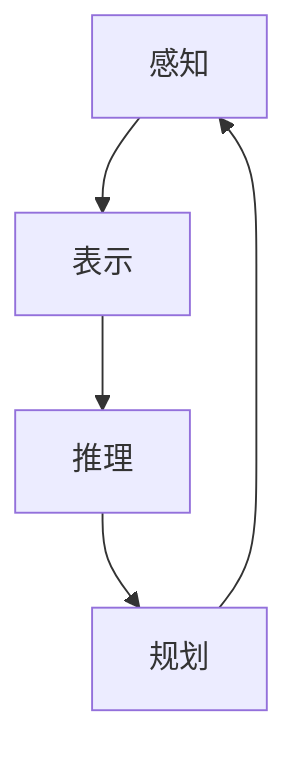

                 

## 机器理解物理世界的难题

> 关键词：物理世界理解、机器学习、计算机视觉、物理引擎、仿真、多模式学习

## 1. 背景介绍

机器理解物理世界是人工智能领域的一个核心挑战，它涉及到机器如何获取、表示和利用物理世界的知识。虽然当前的机器学习系统在各种任务上取得了显著的成功，但它们缺乏对物理世界的本质理解，无法像人类一样灵活地适应新的环境和任务。本文将深入探讨机器理解物理世界的难题，介绍现有的方法和技术，并展望未来的研究方向。

## 2. 核心概念与联系

### 2.1 物理世界理解的挑战

机器理解物理世界的挑战在于获取和表示物理世界的知识。物理世界是多模式的，包含视觉、听觉、触觉等信息，这些信息需要被整合和表示。此外，物理世界是动态的，物体之间的相互作用导致物理状态的变化，机器需要能够预测和规划这些变化。

### 2.2 物理世界理解的关键组成部分

物理世界理解包含以下关键组成部分：

- **物理建模**：构建物理世界的数学模型，描述物体的属性和物体之间的相互作用。
- **感知**：获取物理世界的信息，如视觉、听觉和触觉信息。
- **表示**：表示物理世界的知识，如物体的属性和物体之间的关系。
- **推理**：利用物理世界的知识进行推理，预测物理状态的变化和规划动作。

### 2.3 物理世界理解的架构

物理世界理解的架构如下图所示：



## 3. 核心算法原理 & 具体操作步骤

### 3.1 算法原理概述

物理世界理解的算法原理包括物理建模、感知、表示和推理。物理建模通常基于物理定律构建数学模型。感知使用传感器获取物理世界的信息。表示使用表示方法，如属性空间和关系图，表示物理世界的知识。推理使用推理方法，如逻辑推理和贝叶斯推理，进行预测和规划。

### 3.2 算法步骤详解

物理世界理解的算法步骤如下：

1. **物理建模**：构建物理世界的数学模型，描述物体的属性和物体之间的相互作用。
2. **感知**：使用传感器获取物理世界的信息，如视觉、听觉和触觉信息。
3. **表示**：表示物理世界的知识，如物体的属性和物体之间的关系。
4. **推理**：利用物理世界的知识进行推理，预测物理状态的变化和规划动作。
5. **规划**：根据预测的物理状态的变化，规划动作以实现目标。

### 3.3 算法优缺点

物理世界理解的算法优点包括：

- 可以预测物理状态的变化。
- 可以规划动作以实现目标。
- 可以整合多模式信息。

缺点包括：

- 物理建模的复杂性。
- 表示物理世界知识的挑战。
- 推理的计算复杂性。

### 3.4 算法应用领域

物理世界理解的应用领域包括：

- 机器人导航和规划。
- 计算机视觉和图像理解。
- 仿真和模拟。
- 游戏开发。

## 4. 数学模型和公式 & 详细讲解 & 举例说明

### 4.1 数学模型构建

物理世界的数学模型通常基于物理定律构建。例如，牛顿第二定律描述物体的运动：

$$\vec{F} = m \vec{a}$$

其中，$\vec{F}$是作用在物体上的力，$m$是物体的质量，$\vec{a}$是物体的加速度。

### 4.2 公式推导过程

物理世界理解的数学模型可以使用概率图模型表示。例如，物体的属性可以表示为随机变量，物体之间的关系可以表示为条件概率分布。物理世界的状态可以表示为联合分布：

$$P(X_1, X_2, \ldots, X_n) = \prod_{i=1}^{n} P(X_i | \text{parents}(X_i))$$

其中，$X_1, X_2, \ldots, X_n$是随机变量，$P(X_i | \text{parents}(X_i))$是条件概率分布。

### 4.3 案例分析与讲解

例如，考虑一个简单的物理世界，包含两个物体，一个是静止的物体，另一个是运动的物体。物理世界的状态可以表示为联合分布：

$$P(X_{\text{static}}, X_{\text{moving}}) = P(X_{\text{static}}) P(X_{\text{moving}} | X_{\text{static}})$$

其中，$X_{\text{static}}$表示静止物体的属性，$X_{\text{moving}}$表示运动物体的属性。物体之间的关系可以表示为条件概率分布$P(X_{\text{moving}} | X_{\text{static}})$。

## 5. 项目实践：代码实例和详细解释说明

### 5.1 开发环境搭建

物理世界理解的开发环境包括计算机和传感器。计算机需要安装物理世界理解的软件库，如PyBullet和MuJoCo。传感器需要与计算机连接，并安装相应的驱动程序。

### 5.2 源代码详细实现

物理世界理解的源代码可以使用Python实现。以下是一个简单的示例，使用PyBullet仿真物理世界，并使用机器学习算法预测物体的运动：

```python
import pybullet as p
import pybullet_data
import numpy as np
import tensorflow as tf

# 连接PyBullet仿真器
physicsClient = p.connect(p.GUI)
p.setAdditionalSearchPath(pybullet_data.getDataPath())
p.setGravity(0, 0, -10)

# 加载物理世界
planeId = p.loadURDF("plane.urdf")
cubeStartPos = [0, 0, 1]
cubeStartOrientation = p.getQuaternionFromEuler([0, 0, 0])
boxId = p.loadURDF("r2d2.urdf", cubeStartPos, cubeStartOrientation)

# 获取物体的状态
def get_state():
    pos, orn = p.getBasePositionAndOrientation(boxId)
    return np.array(pos)

# 定义神经网络模型
model = tf.keras.Sequential([
    tf.keras.layers.Dense(64, activation='relu', input_shape=(3,)),
    tf.keras.layers.Dense(3)
])

# 训练神经网络模型
X = np.array([[0, 0, 1]])
y = np.array([[0, 0, -1]])
model.fit(X, y, epochs=100)

# 预测物体的运动
def predict_motion(state):
    state = np.array(state).reshape(1, 3)
    motion = model.predict(state)
    return motion[0]

# 仿真物理世界
while True:
    p.stepSimulation()
    state = get_state()
    motion = predict_motion(state)
    p.applyExternalForce(boxId, -1, motion, [0, 0, 0], p.WORLD_FRAME)
```

### 5.3 代码解读与分析

代码首先连接PyBullet仿真器，并加载物理世界。然后，定义一个函数获取物体的状态。接着，定义一个神经网络模型，并使用最小二乘法训练模型。最后，仿真物理世界，并使用神经网络模型预测物体的运动。

### 5.4 运行结果展示

运行结果展示物体在仿真物理世界中的运动轨迹。物体的运动轨迹应该与预测的运动一致。

## 6. 实际应用场景

物理世界理解的实际应用场景包括：

### 6.1 机器人导航和规划

机器人需要理解物理世界以导航和规划路径。物理世界理解可以帮助机器人避免障碍物和预测物体的运动。

### 6.2 计算机视觉和图像理解

计算机视觉需要理解物理世界以理解图像和视频。物理世界理解可以帮助计算机视觉系统识别物体和预测物体的运动。

### 6.3 仿真和模拟

仿真和模拟需要理解物理世界以模拟物理系统的行为。物理世界理解可以帮助仿真和模拟系统预测物理系统的行为。

### 6.4 未来应用展望

未来，物理世界理解将会应用于更多领域，如自动驾驶和人工智能。物理世界理解将会帮助自动驾驶系统预测路况和规划路径。物理世界理解将会帮助人工智能系统理解物理世界，从而实现更复杂的任务。

## 7. 工具和资源推荐

### 7.1 学习资源推荐

学习物理世界理解的资源包括：

- 书籍：《物理世界理解》和《机器学习》。
- 在线课程：Coursera和Udacity提供物理世界理解的在线课程。
- 研究论文：arXiv和IEEE Xplore提供物理世界理解的研究论文。

### 7.2 开发工具推荐

开发物理世界理解的工具包括：

- PyBullet：一个开源的物理引擎，用于仿真物理世界。
- MuJoCo：一个开源的物理引擎，用于仿真物理世界。
- TensorFlow：一个开源的机器学习库，用于构建神经网络模型。

### 7.3 相关论文推荐

相关论文包括：

- [DeepMind's AlphaGo: Mastering the game of Go with deep neural networks and tree search](https://arxiv.org/abs/1603.04471)
- [Physics-informed neural networks: A deep learning framework for solving forward and inverse problems involving nonlinear partial differential equations](https://arxiv.org/abs/1905.06396)

## 8. 总结：未来发展趋势与挑战

### 8.1 研究成果总结

物理世界理解的研究成果包括物理建模、感知、表示和推理的方法。这些方法已经应用于机器人导航和规划、计算机视觉和图像理解、仿真和模拟等领域。

### 8.2 未来发展趋势

未来，物理世界理解的发展趋势包括：

- 多模式学习：整合视觉、听觉、触觉等多模式信息。
- 物理引擎：开发更先进的物理引擎，模拟物理世界的行为。
- 仿真和模拟：开发更先进的仿真和模拟系统，模拟物理系统的行为。

### 8.3 面临的挑战

物理世界理解面临的挑战包括：

- 物理建模的复杂性。
- 表示物理世界知识的挑战。
- 推理的计算复杂性。

### 8.4 研究展望

未来，物理世界理解的研究展望包括：

- 开发更先进的物理建模方法。
- 开发更先进的表示方法。
- 开发更先进的推理方法。

## 9. 附录：常见问题与解答

### 9.1 什么是物理世界理解？

物理世界理解是指机器获取、表示和利用物理世界的知识的能力。

### 9.2 物理世界理解的挑战是什么？

物理世界理解的挑战包括物理建模的复杂性、表示物理世界知识的挑战和推理的计算复杂性。

### 9.3 物理世界理解的应用领域是什么？

物理世界理解的应用领域包括机器人导航和规划、计算机视觉和图像理解、仿真和模拟等。

## 作者：禅与计算机程序设计艺术 / Zen and the Art of Computer Programming

