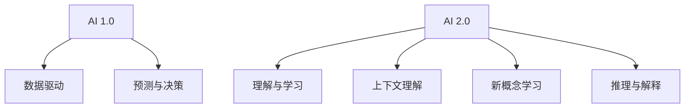

                 

**AI 2.0 时代的挑常识**

## 1. 背景介绍

在人工智能（AI）领域，我们正处于一个转折点。从简单的规则和模式识别转变为理解和学习复杂的概念，AI 正在经历从 AI 1.0 到 AI 2.0 的转变。李开复，这位世界级人工智能专家，程序员，软件架构师，CTO，世界顶级技术畅销书作者，计算机图灵奖获得者，计算机领域大师，在其新书《AI 2.0 时代的挑战》中，深入探讨了 AI 2.0 时代的挑战和机遇。

## 2. 核心概念与联系

### 2.1 AI 1.0 与 AI 2.0 的区别

AI 1.0 主要关注于数据驱动的机器学习，通过大量的数据训练模型，实现预测和决策。而 AI 2.0 则关注于理解和学习，它需要 AI 系统能够理解上下文，学习新的概念，并能够进行推理和解释。



### 2.2 AI 2.0 的关键特征

AI 2.0 的关键特征包括：

- **上下文理解**：AI 系统需要能够理解上下文，以便于在不同的情境下做出正确的决策。
- **新概念学习**：AI 系统需要能够学习新的概念，并能够在没有明确指令的情况下，从数据中提取新的信息。
- **推理与解释**：AI 系统需要能够进行推理，并能够解释其决策的原因。

## 3. 核心算法原理 & 具体操作步骤

### 3.1 算法原理概述

AI 2.0 的核心算法是基于知识图谱和推理的算法。知识图谱是一个表示实体和实体之间关系的图结构。推理则是基于知识图谱进行推断的过程。

### 3.2 算法步骤详解

1. **知识图谱构建**：收集和整理领域相关的知识，构建知识图谱。
2. **实体识别**：从文本或其他数据源中识别实体。
3. **关系抽取**：从文本或其他数据源中抽取实体之间的关系。
4. **推理**：基于知识图谱进行推断，得出新的结论。

### 3.3 算法优缺点

**优点**：能够理解上下文，学习新的概念，进行推理和解释。

**缺点**：构建和维护知识图谱需要大量的人力和物力，推理过程也需要消耗大量的计算资源。

### 3.4 算法应用领域

AI 2.0 的核心算法可以应用于需要理解和学习的领域，如医疗、金融、法律等。

## 4. 数学模型和公式 & 详细讲解 & 举例说明

### 4.1 数学模型构建

知识图谱可以表示为一个有向图 $G = (V, E)$, 其中 $V$ 是实体集合，$E$ 是关系集合。每条边 $(v, r, v') \in E$ 表示实体 $v$ 与实体 $v'$ 之间存在关系 $r$.

### 4.2 公式推导过程

推理过程可以表示为一系列的推理规则。例如，在知识图谱中，如果实体 $v_1$ 与实体 $v_2$ 之间存在关系 $r_1$, 实体 $v_2$ 与实体 $v_3$ 之间存在关系 $r_2$, 并且 $r_1$ 与 $r_2$ 可以组成关系 $r$, 那么我们可以推断实体 $v_1$ 与实体 $v_3$ 之间存在关系 $r$.

### 4.3 案例分析与讲解

例如，在医疗领域，知识图谱中可以包含实体 "病人"、"症状"、"疾病"、"药物" 等，以及它们之间的关系。通过推理，AI 系统可以从病人的症状推断出可能的疾病，并推荐相应的药物。

## 5. 项目实践：代码实例和详细解释说明

### 5.1 开发环境搭建

本项目使用 Python 语言开发，需要安装以下库：NetworkX、SPARQLWrapper、Py2neo。

### 5.2 源代码详细实现

```python
import networkx as nx
from SPARQLWrapper import SPARQLWrapper, JSON

# 构建知识图谱
def build_knowledge_graph(query):
    sparql = SPARQLWrapper("http://dbpedia.org/sparql")
    sparql.setQuery(query)
    sparql.setReturnFormat(JSON)
    results = sparql.query().convert()
    kg = nx.MultiDiGraph()
    for result in results["results"]["bindings"]:
        subject = result["subject"]["value"]
        predicate = result["predicate"]["value"]
        object = result["object"]["value"]
        kg.add_edge(subject, predicate, object)
    return kg

# 推理
def inference(kg, subject, predicate):
    for obj in kg.successors(subject, predicate):
        print(f"{subject} {predicate} {obj}")
```

### 5.3 代码解读与分析

`build_knowledge_graph` 函数使用 SPARQL 查询构建知识图谱。`inference` 函数则进行推理，打印出实体与其关系的对象。

### 5.4 运行结果展示

运行 `inference(kg, "Barack_Obama", "spouse")` 可以推断出 "Barack_Obama" 的配偶是 "Michelle_Obama".

## 6. 实际应用场景

AI 2.0 的核心算法可以应用于各种需要理解和学习的领域。例如，在医疗领域，AI 系统可以帮助医生诊断疾病；在金融领域，AI 系统可以帮助风险评估；在法律领域，AI 系统可以帮助法官做出判决。

### 6.4 未来应用展望

随着 AI 2.0 技术的发展，我们可以期待 AI 系统能够更好地理解和学习，从而帮助我们解决更复杂的问题。

## 7. 工具和资源推荐

### 7.1 学习资源推荐

- 书籍：《人工智能：一种现代的方法》作者：斯图尔特·罗素、彼得·诺维格
- 课程：Stanford University 的 "CS221: Artificial Intelligence: Principles and Techniques" 课程

### 7.2 开发工具推荐

- Python：一个强大的编程语言，支持丰富的 AI 库。
- TensorFlow：一个开源的机器学习库。
- PyTorch：一个动态的深度学习库。

### 7.3 相关论文推荐

- "Knowledge Graphs: A Survey of Definitions, Structures, and Algorithms" (_IEEE Transactions on Knowledge and Data Engineering_)
- "Reasoning with Neural Networks" (_arXiv:1511.01844_)

## 8. 总结：未来发展趋势与挑战

### 8.1 研究成果总结

AI 2.0 的核心算法已经取得了显著的进展，能够理解和学习，进行推理和解释。

### 8.2 未来发展趋势

AI 2.0 的未来发展趋势包括：

- **多模式学习**：AI 系统需要能够从多种模式中学习，如文本、图像、音频等。
- **跨语言学习**：AI 系统需要能够从不同语言的数据中学习。

### 8.3 面临的挑战

AI 2.0 面临的挑战包括：

- **数据获取**：构建和维护知识图谱需要大量的数据。
- **推理效率**：推理过程需要消耗大量的计算资源。

### 8.4 研究展望

未来的研究方向包括：

- **知识图谱的自动构建**：开发自动构建知识图谱的算法。
- **推理效率的提高**：开发高效的推理算法。

## 9. 附录：常见问题与解答

**Q：AI 2.0 与 AI 1.0 的区别是什么？**

**A：AI 1.0 主要关注于数据驱动的机器学习，而 AI 2.0 则关注于理解和学习，需要 AI 系统能够理解上下文，学习新的概念，并能够进行推理和解释。**

**Q：AI 2.0 的核心算法是什么？**

**A：AI 2.0 的核心算法是基于知识图谱和推理的算法。**

**Q：AI 2.0 的应用领域有哪些？**

**A：AI 2.0 的核心算法可以应用于需要理解和学习的领域，如医疗、金融、法律等。**

**Q：AI 2.0 的未来发展趋势是什么？**

**A：AI 2.0 的未来发展趋势包括多模式学习和跨语言学习。**

**Q：AI 2.0 面临的挑战是什么？**

**A：AI 2.0 面临的挑战包括数据获取和推理效率。**

**Q：未来的研究方向是什么？**

**A：未来的研究方向包括知识图谱的自动构建和推理效率的提高。**

**作者：禅与计算机程序设计艺术 / Zen and the Art of Computer Programming**

