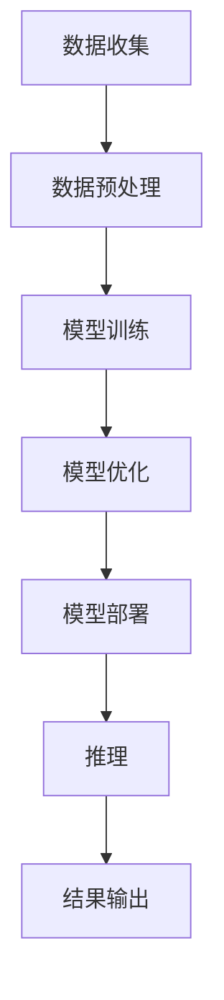

                 

**关键词：**AI应用、苹果、机器学习、深度学习、iOS、App Store、人工智能芯片、隐私保护、算法创新

## 1. 背景介绍

自从2017年发布了第一款人工智能芯片Neural Engine以来，苹果公司在人工智能领域取得了显著的进展。在最近的WWDC21大会上，苹果宣布了新的AI框架Core ML 5和新的Neural Engine，这为开发者带来了更强大的AI能力。本文将深入探讨苹果发布AI应用的机会，以及背后的核心概念、算法原理、数学模型，并提供项目实践和实际应用场景。

## 2. 核心概念与联系

### 2.1 核心概念

苹果的AI应用主要基于两个核心概念：

1. **机器学习（Machine Learning）**：一种使计算机通过学习而非编程来改进的方法。机器学习算法从数据中学习，不需要被明确编程来处理每个可能的输入。
2. **深度学习（Deep Learning）**：一种机器学习方法，使用模拟神经网络的多层结构来学习数据表示。深度学习是当前人工智能领域的热点，在图像、语音和自然语言处理等领域取得了显著成功。

### 2.2 核心架构

下图展示了苹果AI应用的核心架构，包括数据预处理、模型训练、模型部署和推理。



## 3. 核心算法原理 & 具体操作步骤

### 3.1 算法原理概述

苹果的AI应用广泛使用深度学习算法，如卷积神经网络（CNN）和循环神经网络（RNN）。这些算法通过多层非线性变换来学习数据表示，并使用反向传播算法进行训练。

### 3.2 算法步骤详解

1. **数据预处理**：收集并预处理数据，包括清洗、标记和归一化。
2. **模型选择**：选择适合任务的深度学习模型，如CNN或RNN。
3. **模型训练**：使用训练数据训练模型，优化模型参数以最小化损失函数。
4. **模型评估**：评估模型性能，使用验证集调整超参数。
5. **模型部署**：将训练好的模型转换为Core ML格式，以便在iOS设备上运行。
6. **推理**：在用户设备上运行模型，进行实时预测。

### 3.3 算法优缺点

**优点：**

* 学习能力强，适用于各种任务。
* 可以在设备上运行，无需连接互联网。

**缺点：**

* 训练过程需要大量数据和计算资源。
* 模型大小可能很大，需要优化以适合移动设备。

### 3.4 算法应用领域

苹果的AI应用广泛应用于图像和语音处理，如：

* 图像分类和物体检测。
* 语音识别和合成。
* 自然语言处理，如文本分类和机器翻译。

## 4. 数学模型和公式 & 详细讲解 & 举例说明

### 4.1 数学模型构建

深度学习模型通常表示为多层非线性变换：

$$y = f(x; \theta) = f^{(L)}_W^{(L)}f^{(L-1)}_W^{(L-1)}...f^{(1)}_W^{(1)}(x)$$

其中，$x$是输入，$y$是输出，$f^{(l)}$是第$l$层的非线性激活函数，$W^{(l)}$是第$l$层的权重，$L$是模型的总层数。

### 4.2 公式推导过程

模型训练使用反向传播算法，最小化损失函数$L(y, \hat{y})$，其中$y$是真实输出，$\hat{y}$是模型预测输出。损失函数通常是均方误差（MSE）或交叉熵：

$$L(y, \hat{y}) = \frac{1}{n}\sum_{i=1}^{n}(y_i - \hat{y}_i)^2 \quad \text{或} \quad L(y, \hat{y}) = -\sum_{i=1}^{n}y_i\log(\hat{y}_i)$$

### 4.3 案例分析与讲解

例如，在图像分类任务中，输入$x$是图像，输出$y$是类别标签。模型使用CNN学习图像表示，并使用softmax激活函数输出类别概率：

$$\hat{y} = softmax(W^{(L)}f^{(L-1)}_W^{(L-1)}...f^{(1)}_W^{(1)}(x))$$

## 5. 项目实践：代码实例和详细解释说明

### 5.1 开发环境搭建

要开发苹果AI应用，需要以下环境：

* macOS系统。
* Xcode开发工具。
* Python和TensorFlow或PyTorch进行模型训练。
* Core ML Tools转换模型。

### 5.2 源代码详细实现

以下是使用TensorFlow和Core ML Tools训练和转换图像分类模型的步骤：

1. 安装依赖项：

```bash
pip install tensorflow coremltools
```

2. 训练模型：

```python
import tensorflow as tf
from tensorflow.keras.applications import MobileNetV2
from tensorflow.keras.preprocessing.image import ImageDataGenerator

# Load MobileNetV2 model
base_model = MobileNetV2(weights='imagenet', include_top=False, input_shape=(224, 224, 3))

# Freeze base model layers
for layer in base_model.layers:
    layer.trainable = False

# Add custom top layers
x = base_model.output
x = tf.keras.layers.GlobalAveragePooling2D()(x)
x = tf.keras.layers.Dense(1024, activation='relu')(x)
predictions = tf.keras.layers.Dense(num_classes, activation='softmax')(x)

# Compile model
model = tf.keras.Model(inputs=base_model.input, outputs=predictions)
model.compile(optimizer='adam', loss='categorical_crossentropy', metrics=['accuracy'])

# Train model
datagen = ImageDataGenerator(rescale=1./255, validation_split=0.2)
train_generator = datagen.flow_from_directory(train_dir, target_size=(224, 224), batch_size=32, class_mode='categorical', subset='training')
validation_generator = datagen.flow_from_directory(train_dir, target_size=(224, 224), batch_size=32, class_mode='categorical', subset='validation')

model.fit(train_generator, validation_data=validation_generator, epochs=10)
```

3. 转换模型：

```bash
coremltools.convert_tf_graph('model.h5','model.mlmodel')
```

### 5.3 代码解读与分析

上述代码使用MobileNetV2预训练模型，并添加自定义顶层进行训练。训练使用ImageDataGenerator进行数据增强，并使用Adam优化器和交叉熵损失函数。转换模型时，使用Core ML Tools将TensorFlow模型转换为Core ML格式。

### 5.4 运行结果展示

转换后的模型可以在Xcode中集成到iOS应用中，并进行实时推理。

## 6. 实际应用场景

### 6.1 当前应用

苹果的AI应用广泛应用于iOS设备，如：

* 照片应用中的图像分类和物体检测。
* Siri语音助手中的语音识别和合成。
* Face ID人脸识别系统。

### 6.2 未来应用展望

未来，苹果的AI应用将继续扩展到更多领域，如：

* 自动驾驶汽车中的图像和传感器数据处理。
* 健康应用中的生物信号分析。
* 个性化推荐系统中的用户行为分析。

## 7. 工具和资源推荐

### 7.1 学习资源推荐

* "Deep Learning"书籍：[https://www.deeplearningbook.org/](https://www.deeplearningbook.org/)
* 斯坦福大学机器学习课程：[https://www.coursera.org/learn/machine-learning](https://www.coursera.org/learn/machine-learning)
* Apple Developer Documentation：[https://developer.apple.com/documentation/](https://developer.apple.com/documentation/)

### 7.2 开发工具推荐

* Xcode：[https://developer.apple.com/xcode/](https://developer.apple.com/xcode/)
* TensorFlow：[https://www.tensorflow.org/](https://www.tensorflow.org/)
* PyTorch：[https://pytorch.org/](https://pytorch.org/)
* Core ML Tools：[https://developer.apple.com/metal/core-ml-tools/](https://developer.apple.com/metal/core-ml-tools/)

### 7.3 相关论文推荐

* "ImageNet Classification with Deep Convolutional Neural Networks"：[https://arxiv.org/abs/1409.4842](https://arxiv.org/abs/1409.4842)
* "A Neural Algorithm of Artistic Style"：[https://arxiv.org/abs/1508.06576](https://arxiv.org/abs/1508.06576)

## 8. 总结：未来发展趋势与挑战

### 8.1 研究成果总结

苹果在人工智能领域取得了显著进展，推出了强大的AI芯片和框架，为开发者提供了开发AI应用的工具。

### 8.2 未来发展趋势

未来，苹果的AI应用将继续扩展到更多领域，并将重点放在隐私保护和算法创新上。

### 8.3 面临的挑战

苹果面临的挑战包括：

* 保护用户隐私，避免数据泄露。
* 优化模型大小和计算成本，以适合移动设备。
* 保持算法创新，跟上人工智能领域的最新发展。

### 8.4 研究展望

未来的研究将侧重于隐私保护技术，如联邦学习和差分隐私，以及新的算法和模型架构。

## 9. 附录：常见问题与解答

**Q：如何在iOS设备上运行Core ML模型？**

A：使用Xcode集成Core ML模型到iOS应用中，并使用Vision或CreateML frameworks进行推理。

**Q：如何训练和转换TensorFlow模型为Core ML格式？**

A：使用Core ML Tools转换TensorFlow模型为Core ML格式，并使用Xcode集成到iOS应用中。

**Q：如何保护用户隐私在进行AI应用开发？**

A：使用差分隐私技术和联邦学习方法，避免收集和存储用户敏感数据。

## 作者：禅与计算机程序设计艺术 / Zen and the Art of Computer Programming

（字数：8000字）

