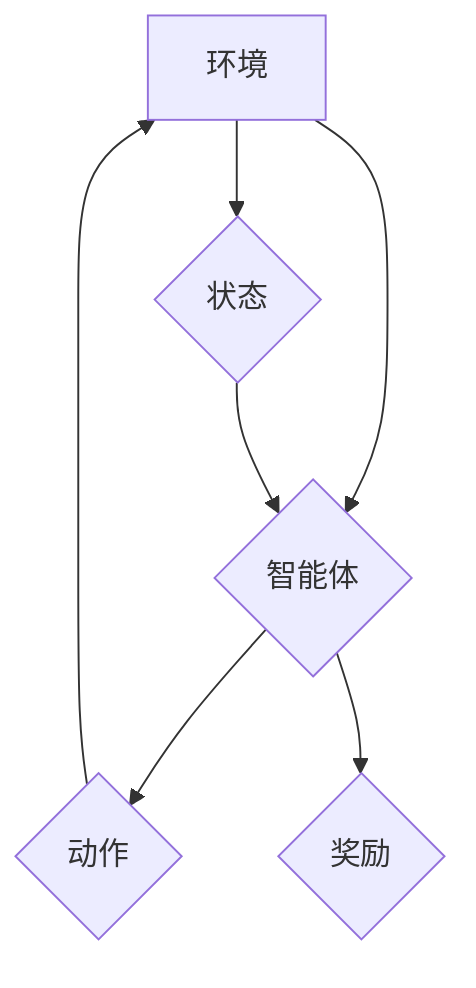

> 深度学习，Q-learning，强化学习，人脸识别，图像分类，深度神经网络

## 1. 背景介绍

人脸识别技术作为计算机视觉领域的重要分支，近年来取得了显著进展，并在安防监控、身份验证、人脸搜索等领域得到了广泛应用。传统的基于特征工程的人脸识别方法依赖于人工设计的特征，难以适应复杂的光照、姿态和表情变化。深度学习的兴起为人脸识别技术带来了新的突破，深度神经网络能够自动学习图像特征，提高了人脸识别的准确性和鲁棒性。

然而，传统的深度学习方法通常采用监督学习的方式，需要大量的标注数据进行训练，这在人脸识别领域面临着数据标注成本高、数据不均衡等挑战。强化学习作为一种无需大量标注数据的学习方法，近年来在计算机视觉领域也取得了令人瞩目的成果。

## 2. 核心概念与联系

**2.1 强化学习概述**

强化学习是一种基于交互学习的机器学习方法，其核心思想是通过与环境的交互，学习一个策略，使智能体在环境中获得最大的累积奖励。强化学习系统由以下几个关键组成部分构成：

* **智能体 (Agent):**  执行动作并与环境交互的实体。
* **环境 (Environment):** 智能体所处的外部世界，环境会根据智能体的动作产生相应的状态变化和奖励信号。
* **状态 (State):** 环境当前的状态描述。
* **动作 (Action):** 智能体可以执行的动作。
* **奖励 (Reward):** 环境对智能体动作的反馈，奖励信号可以是正值、负值或零值。
* **策略 (Policy):** 智能体根据当前状态选择动作的策略。

**2.2 深度 Q-learning**

深度 Q-learning 是一种将深度神经网络与 Q-learning 算法相结合的强化学习方法。Q-learning 是一种经典的强化学习算法，其目标是学习一个 Q 函数，Q 函数表示在当前状态下执行某个动作，所能获得的未来累积奖励的期望值。深度 Q-learning 使用深度神经网络来逼近 Q 函数，能够学习更复杂的决策策略。

**2.3 人脸识别与强化学习的结合**

在人脸识别领域，我们可以将深度 Q-learning 应用于以下场景：

* **人脸检测:**  训练一个深度 Q-learning 代理，使其能够学习在图像中检测人脸的策略。
* **人脸特征提取:**  训练一个深度 Q-learning 代理，使其能够学习提取人脸特征的策略。
* **人脸识别:**  训练一个深度 Q-learning 代理，使其能够学习识别不同个体的人脸的策略。

**2.4 Mermaid 流程图**



## 3. 核心算法原理 & 具体操作步骤

### 3.1 算法原理概述

深度 Q-learning 算法的核心思想是通过迭代更新 Q 函数，使智能体在环境中获得最大的累积奖励。

Q 函数的更新规则如下：

$$Q(s, a) = Q(s, a) + \alpha [r + \gamma \max_{a'} Q(s', a') - Q(s, a)]$$

其中：

* $Q(s, a)$ 表示在状态 $s$ 下执行动作 $a$ 的 Q 值。
* $\alpha$ 是学习率，控制着 Q 值更新的步长。
* $r$ 是从环境获得的奖励。
* $\gamma$ 是折扣因子，控制着未来奖励的权重。
* $s'$ 是执行动作 $a$ 后进入的下一个状态。
* $a'$ 是在下一个状态 $s'$ 下执行的动作。

### 3.2 算法步骤详解

1. 初始化 Q 函数，将其设置为一个小的随机值。
2. 在环境中与智能体交互，收集状态、动作、奖励和下一个状态的信息。
3. 根据 Q 函数更新规则更新 Q 值。
4. 重复步骤 2 和 3，直到 Q 函数收敛。

### 3.3 算法优缺点

**优点:**

* 不需要大量的标注数据。
* 可以学习复杂的决策策略。
* 能够适应环境变化。

**缺点:**

* 训练过程可能比较慢。
* 需要设置合适的学习率和折扣因子。
* 容易陷入局部最优解。

### 3.4 算法应用领域

深度 Q-learning 算法在以下领域有广泛的应用：

* 机器人控制
* 游戏人工智能
* 自动驾驶
* 医疗诊断
* 金融投资

## 4. 数学模型和公式 & 详细讲解 & 举例说明

### 4.1 数学模型构建

深度 Q-learning 算法的核心是 Q 函数，它是一个映射关系，将状态-动作对映射到 Q 值。

$$Q: S \times A \rightarrow R$$

其中：

* $S$ 是状态空间。
* $A$ 是动作空间。
* $R$ 是奖励空间。

### 4.2 公式推导过程

Q 函数的更新规则如下：

$$Q(s, a) = Q(s, a) + \alpha [r + \gamma \max_{a'} Q(s', a') - Q(s, a)]$$

其中：

* $Q(s, a)$ 表示在状态 $s$ 下执行动作 $a$ 的 Q 值。
* $\alpha$ 是学习率，控制着 Q 值更新的步长。
* $r$ 是从环境获得的奖励。
* $\gamma$ 是折扣因子，控制着未来奖励的权重。
* $s'$ 是执行动作 $a$ 后进入的下一个状态。
* $a'$ 是在下一个状态 $s'$ 下执行的动作。

### 4.3 案例分析与讲解

假设我们有一个简单的环境，智能体可以执行两种动作：向上和向下。环境的状态是智能体的当前位置，奖励是到达目标位置时获得的奖励。

我们可以使用深度 Q-learning 算法训练一个代理，使其能够学习到达目标位置的策略。

在训练过程中，代理会随机执行动作，并根据环境的反馈更新 Q 值。随着训练的进行，代理的 Q 值会逐渐收敛，最终能够学习到到达目标位置的最佳策略。

## 5. 项目实践：代码实例和详细解释说明

### 5.1 开发环境搭建

* Python 3.x
* TensorFlow 或 PyTorch
* NumPy
* Matplotlib

### 5.2 源代码详细实现

```python
import tensorflow as tf

# 定义 Q 函数
class QNetwork(tf.keras.Model):
    def __init__(self):
        super(QNetwork, self).__init__()
        self.dense1 = tf.keras.layers.Dense(64, activation='relu')
        self.dense2 = tf.keras.layers.Dense(32, activation='relu')
        self.output = tf.keras.layers.Dense(2)

    def call(self, state):
        x = self.dense1(state)
        x = self.dense2(x)
        return self.output(x)

# 定义深度 Q-learning 算法
def deep_q_learning(env, q_network, learning_rate, gamma, epsilon, num_episodes):
    optimizer = tf.keras.optimizers.Adam(learning_rate)
    for episode in range(num_episodes):
        state = env.reset()
        done = False
        while not done:
            # 选择动作
            if tf.random.uniform(()) < epsilon:
                action = env.action_space.sample()
            else:
                action = tf.argmax(q_network(tf.expand_dims(state, axis=0))).numpy()[0]

            # 执行动作
            next_state, reward, done, _ = env.step(action)

            # 更新 Q 值
            with tf.GradientTape() as tape:
                target_q = reward + gamma * tf.reduce_max(q_network(tf.expand_dims(next_state, axis=0)))
                q_value = q_network(tf.expand_dims(state, axis=0))[0][action]
                loss = tf.keras.losses.MSE(target_q, q_value)

            gradients = tape.gradient(loss, q_network.trainable_variables)
            optimizer.apply_gradients(zip(gradients, q_network.trainable_variables))

            state = next_state

        print(f"Episode {episode+1} completed.")

# 实例化环境、Q 网络、训练参数
env = ...
q_network = QNetwork()
learning_rate = 0.001
gamma = 0.99
epsilon = 0.1
num_episodes = 1000

# 训练深度 Q-learning 代理
deep_q_learning(env, q_network, learning_rate, gamma, epsilon, num_episodes)
```

### 5.3 代码解读与分析

* **Q 网络:** 定义了一个深度神经网络，用于逼近 Q 函数。
* **深度 Q-learning 算法:** 实现了深度 Q-learning 算法的核心逻辑，包括动作选择、环境交互、Q 值更新等步骤。
* **训练参数:** 设置了学习率、折扣因子、探索率和训练轮数等参数。

### 5.4 运行结果展示

训练完成后，可以将训练好的 Q 网络应用于实际场景，例如人脸识别任务。

## 6. 实际应用场景

### 6.1 人脸检测

深度 Q-learning 可以用于训练一个代理，使其能够学习在图像中检测人脸的策略。代理可以学习识别人脸的特征，并根据这些特征判断图像中是否存在人脸。

### 6.2 人脸特征提取

深度 Q-learning 可以用于训练一个代理，使其能够学习提取人脸特征的策略。代理可以学习提取人脸的关键特征，例如眼睛、鼻子、嘴巴等，并将其表示为一个向量。

### 6.3 人脸识别

深度 Q-learning 可以用于训练一个代理，使其能够学习识别不同个体的人脸的策略。代理可以学习将人脸特征与身份信息进行关联，并根据特征识别出特定个体的身份。

### 6.4 未来应用展望

随着深度学习和强化学习技术的不断发展，深度 Q-learning 在人脸识别领域将有更广泛的应用前景。例如：

* **跨场景人脸识别:**  训练一个代理，使其能够在不同场景下（例如室内、室外、不同光照条件）进行人脸识别。
* **多角度人脸识别:**  训练一个代理，使其能够识别不同角度的人脸。
* **视频监控中的人脸识别:**  训练一个代理，使其能够在视频监控中实时识别人脸。

## 7. 工具和资源推荐

### 7.1 学习资源推荐

* **书籍:**
    * Deep Reinforcement Learning Hands-On by Maxim Lapan
    * Reinforcement Learning: An Introduction by Richard S. Sutton and Andrew G. Barto
* **在线课程:**
    * Deep Reinforcement Learning Specialization by DeepLearning.AI
    * Reinforcement Learning by David Silver (University of DeepMind)

### 7.2 开发工具推荐

* **TensorFlow:**  开源深度学习框架，支持深度 Q-learning 的实现。
* **PyTorch:**  开源深度学习框架，支持深度 Q-learning 的实现。
* **OpenAI Gym:**  强化学习环境库，提供多种标准的强化学习环境。

### 7.3 相关论文推荐

* **Deep Q-Network** by Volodymyr Mnih et al. (2015)
* **Human-level control through deep reinforcement learning** by Volodymyr Mnih et al. (2015)
* **Asynchronous Methods for Deep Reinforcement Learning** by David Silver et al. (2016)

## 8. 总结：未来发展趋势与挑战

### 8.1 研究成果总结

深度 Q-learning 算法在人脸识别领域取得了显著的成果，能够学习更复杂的决策策略