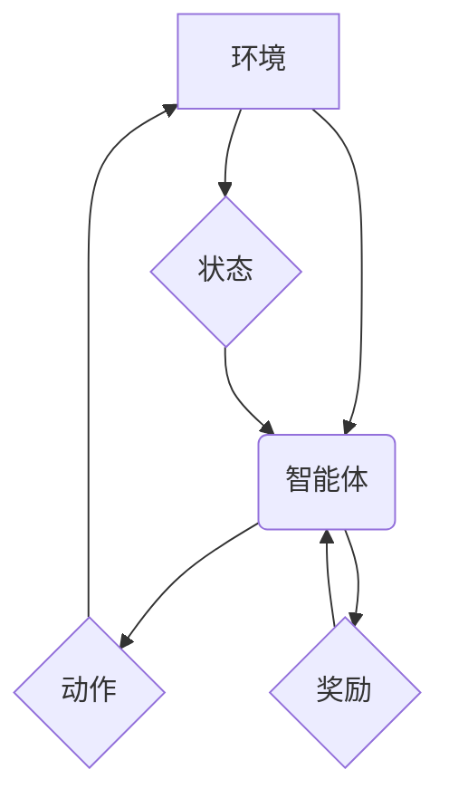

> 深度学习、增强学习、深度强化学习、游戏AI、视频游戏、算法原理、应用实践

## 1. 背景介绍

近年来，人工智能（AI）技术取得了飞速发展，深度学习作为其重要组成部分，在图像识别、自然语言处理等领域取得了突破性进展。而增强学习（Reinforcement Learning，RL）则专注于训练智能体在环境中通过交互学习最优策略的问题。深度强化学习（Deep Reinforcement Learning，DRL）将深度学习与强化学习相结合，使得智能体能够学习更复杂、更抽象的策略，并应用于更广泛的领域。

视频游戏作为复杂、动态、交互式的环境，为深度强化学习提供了理想的测试平台和应用场景。通过训练游戏AI，我们可以实现游戏角色的智能化行为，例如自主决策、策略制定、对手预测等，从而提升游戏体验和创造新的游戏玩法。

## 2. 核心概念与联系

**2.1 深度学习**

深度学习是一种基于多层神经网络的机器学习方法，能够自动从数据中学习特征表示。其核心在于利用多个隐藏层来提取数据的层次化特征，从而实现更精准的预测和分类。

**2.2 强化学习**

强化学习是一种基于交互学习的机器学习方法，智能体通过与环境交互，获得奖励或惩罚信号，并根据这些信号调整其行为策略，最终学习到最优策略。

**2.3 深度强化学习**

深度强化学习将深度学习与强化学习相结合，利用深度神经网络作为策略网络或价值网络，学习更复杂、更抽象的策略。

**2.4  DRL 架构**



**2.5  DRL 工作流程**

1. 智能体从环境中感知当前状态。
2. 智能体根据当前状态选择一个动作。
3. 环境根据智能体的动作产生新的状态和奖励信号。
4. 智能体根据奖励信号更新其策略网络或价值网络。
5. 重复步骤1-4，直到智能体学习到最优策略。

## 3. 核心算法原理 & 具体操作步骤

### 3.1  算法原理概述

深度强化学习算法的核心是利用深度神经网络学习智能体的策略或价值函数。常见的深度强化学习算法包括：

* **DQN（Deep Q-Network）**：利用深度神经网络估计状态-动作对的 Q 值，并通过经验回放机制训练网络。
* **A2C（Advantage Actor-Critic）**：将策略网络和价值网络结合，通过优势函数引导策略网络的更新。
* **PPO（Proximal Policy Optimization）**：通过限制策略更新的范围，提高算法的稳定性和收敛性。

### 3.2  算法步骤详解

以 DQN 算法为例，其训练步骤如下：

1. **初始化网络参数**：随机初始化深度神经网络的参数。
2. **收集经验数据**：智能体与环境交互，收集状态、动作、奖励和下一个状态的经验数据。
3. **经验回放**：从经验数据集中随机抽取样本，用于训练网络。
4. **计算 Q 值**：利用网络预测当前状态下不同动作的 Q 值。
5. **更新网络参数**：利用目标 Q 值和预测 Q 值之间的误差，更新网络参数。
6. **重复步骤2-5**：不断收集经验数据，更新网络参数，直到网络收敛。

### 3.3  算法优缺点

**优点：**

* 能够学习复杂、非线性决策策略。
* 能够处理高维状态空间。
* 能够利用经验回放机制提高训练效率。

**缺点：**

* 训练过程可能比较耗时。
* 需要大量的经验数据进行训练。
* 容易出现震荡和不稳定性。

### 3.4  算法应用领域

深度强化学习算法已广泛应用于以下领域：

* **游戏AI**：训练游戏角色的智能行为，例如策略制定、对手预测等。
* **机器人控制**：训练机器人完成复杂的任务，例如导航、抓取等。
* **自动驾驶**：训练自动驾驶系统进行决策和控制。
* **金融交易**：训练交易策略，进行股票投资等。

## 4. 数学模型和公式 & 详细讲解 & 举例说明

### 4.1  数学模型构建

深度强化学习的数学模型主要包括状态空间、动作空间、奖励函数和策略网络。

* **状态空间**：表示环境中所有可能的状况。
* **动作空间**：表示智能体可以执行的所有动作。
* **奖励函数**：将环境状态和智能体动作映射到奖励值，用于指导智能体的学习。
* **策略网络**：将状态映射到动作概率分布，用于指导智能体选择动作。

### 4.2  公式推导过程

DQN 算法的目标是最大化以下目标函数：

$$
J(\theta) = E_{\tau \sim D} [Q(s_t, a_t; \theta) - Q'(s_t, a_t; \theta')]
$$

其中：

* $\theta$：网络参数
* $D$：经验数据集合
* $\tau$：经验数据样本
* $s_t$：当前状态
* $a_t$：当前动作
* $Q(s_t, a_t; \theta)$：网络预测的 Q 值
* $Q'(s_t, a_t; \theta')$：目标 Q 值

### 4.3  案例分析与讲解

假设一个智能体在玩游戏“贪吃蛇”中，其状态空间包括蛇的位置和食物的位置，动作空间包括向上、向下、向左、向右四个方向。

智能体通过与环境交互，获得奖励和惩罚信号。例如，当蛇吃到食物时，获得奖励；当蛇撞到墙壁或自身时，获得惩罚。

通过训练 DQN 算法，智能体可以学习到最优策略，即在不同状态下选择最优动作，从而获得更高的分数。

## 5. 项目实践：代码实例和详细解释说明

### 5.1  开发环境搭建

* Python 3.x
* TensorFlow 或 PyTorch 深度学习框架
* OpenAI Gym 游戏环境

### 5.2  源代码详细实现

```python
import gym
import tensorflow as tf

# 定义 DQN 网络
class DQN(tf.keras.Model):
    def __init__(self, state_size, action_size):
        super(DQN, self).__init__()
        self.dense1 = tf.keras.layers.Dense(64, activation='relu')
        self.dense2 = tf.keras.layers.Dense(action_size)

    def call(self, state):
        x = self.dense1(state)
        return self.dense2(x)

# 定义 DQN 算法
class DQNAgent:
    def __init__(self, state_size, action_size, learning_rate=0.001):
        self.model = DQN(state_size, action_size)
        self.optimizer = tf.keras.optimizers.Adam(learning_rate)

    def train(self, state, action, reward, next_state, done):
        with tf.GradientTape() as tape:
            target_q = reward + (1 - done) * self.model(next_state)
            q_value = self.model(state)
            loss = tf.keras.losses.mean_squared_error(target_q, q_value)
        gradients = tape.gradient(loss, self.model.trainable_variables)
        self.optimizer.apply_gradients(zip(gradients, self.model.trainable_variables))

# 创建游戏环境
env = gym.make('CartPole-v1')

# 创建 DQN 智能体
agent = DQNAgent(state_size=env.observation_space.shape[0], action_size=env.action_space.n)

# 训练智能体
for episode in range(1000):
    state = env.reset()
    done = False
    total_reward = 0
    while not done:
        action = tf.argmax(agent.model(state)).numpy()
        next_state, reward, done, _ = env.step(action)
        agent.train(state, action, reward, next_state, done)
        state = next_state
        total_reward += reward
    print(f'Episode {episode+1}: Total Reward = {total_reward}')

# 测试智能体
state = env.reset()
while True:
    action = tf.argmax(agent.model(state)).numpy()
    next_state, reward, done, _ = env.step(action)
    env.render()
    if done:
        break
    state = next_state
env.close()
```

### 5.3  代码解读与分析

* **DQN 网络**：定义了一个简单的深度神经网络，用于预测状态-动作对的 Q 值。
* **DQN 算法**：实现了 DQN 算法的核心逻辑，包括经验回放、目标 Q 值计算和网络更新。
* **游戏环境**：使用 OpenAI Gym 创建了“CartPole-v1”游戏环境。
* **智能体训练**：训练智能体进行游戏，并记录训练过程中的奖励和损失值。
* **智能体测试**：测试训练好的智能体在游戏中的表现。

### 5.4  运行结果展示

训练完成后，智能体能够在“CartPole-v1”游戏中保持平衡杆一段时间，并获得较高的分数。

## 6. 实际应用场景

### 6.1 游戏AI

* **游戏角色行为设计**：训练游戏角色的智能行为，例如策略制定、对手预测、对话交互等。
* **游戏难度调节**：根据玩家水平动态调整游戏难度，提供更具挑战性和趣味性的游戏体验。
* **游戏内容生成**：利用深度强化学习算法生成新的游戏关卡、任务和道具，丰富游戏内容。

### 6.2 其他应用场景

* **机器人控制**：训练机器人完成复杂的任务，例如导航、抓取、组装等。
* **自动驾驶**：训练自动驾驶系统进行决策和控制，提高驾驶安全性。
* **金融交易**：训练交易策略，进行股票投资等。

### 6.4  未来应用展望

随着深度强化学习算法的不断发展，其在视频游戏和其他领域的应用前景更加广阔。未来，我们可以期待：

* 更智能、更具交互性的游戏AI。
* 更个性化、更具沉浸感的游戏体验。
* 更广泛的深度强化学习应用场景。

## 7. 工具和资源推荐

### 7.1  学习资源推荐

* **书籍**：
    * Deep Reinforcement Learning Hands-On
    * Reinforcement Learning: An Introduction
* **在线课程**：
    * Deep Reinforcement Learning Specialization (Coursera)
    * Reinforcement Learning (Udacity)

### 7.2  开发工具推荐

* **深度学习框架**：TensorFlow, PyTorch
* **游戏环境**：OpenAI Gym
* **编程语言**：Python

### 7.3  相关论文推荐

* Deep Q-Network (DQN)
* Proximal Policy Optimization (PPO)
* Asynchronous Advantage Actor-Critic (A2C)

## 8. 总结：未来发展趋势与挑战

### 8.1  研究成果总结

深度强化学习在视频游戏领域取得了显著的成果，例如训练出能够玩出人类水平的游戏AI。

### 8.2  未来发展趋势

* **算法效率提升**：开发更有效的深度强化学习算法，降低训练时间和资源消耗。
* **模型鲁棒性增强**：提高深度强化学习模型的鲁棒性，使其能够应对更复杂、更不确定性的环境。
* **多智能体强化学习**：研究多智能体协作和竞争的强化学习问题，应用于多人游戏和机器人协