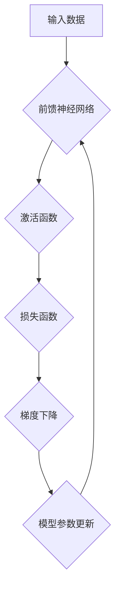

> 深度学习,神经网络,卷积神经网络,循环神经网络,梯度下降,反向传播,TensorFlow,PyTorch

## 1. 背景介绍

深度学习作为机器学习领域的一个重要分支，近年来取得了令人瞩目的成就，在图像识别、自然语言处理、语音识别等领域展现出强大的应用潜力。深度学习的核心在于利用多层神经网络来模拟人类大脑的学习过程，通过对大量数据进行训练，能够自动学习特征并进行复杂的任务处理。

传统的机器学习方法通常需要人工提取特征，而深度学习则能够自动学习特征，这使得其在处理复杂数据时具有更强的优势。随着计算能力的提升和数据量的爆炸式增长，深度学习的研究和应用得到了飞速发展。

## 2. 核心概念与联系

深度学习的核心概念包括神经网络、激活函数、损失函数、梯度下降等。

**神经网络**

神经网络由多个相互连接的神经元组成，这些神经元按照一定的结构和规则进行信息传递和处理。神经网络的结构可以分为前馈神经网络、循环神经网络和卷积神经网络等。

**激活函数**

激活函数用于引入非线性，使神经网络能够学习更复杂的模式。常见的激活函数包括 sigmoid 函数、ReLU 函数、tanh 函数等。

**损失函数**

损失函数用于衡量模型的预测结果与真实值的差距。常用的损失函数包括均方误差、交叉熵等。

**梯度下降**

梯度下降是一种优化算法，用于调整神经网络的参数，使得模型的损失函数最小化。

**Mermaid 流程图**



## 3. 核心算法原理 & 具体操作步骤

### 3.1  算法原理概述

深度学习的核心算法是**反向传播算法**，它用于计算神经网络中每个参数的梯度，并根据梯度更新参数值。反向传播算法的基本步骤如下：

1. 将输入数据输入到神经网络中。
2. 计算神经网络的输出结果。
3. 计算损失函数的值。
4. 使用反向传播算法计算每个参数的梯度。
5. 根据梯度更新参数值。
6. 重复步骤1-5，直到损失函数达到最小值。

### 3.2  算法步骤详解

1. **前向传播:** 将输入数据逐层传递到神经网络中，计算每个神经元的输出值。
2. **损失函数计算:** 计算神经网络的输出结果与真实值的差距，即损失函数的值。
3. **反向传播:** 从输出层开始，反向计算每个神经元的梯度。
4. **参数更新:** 根据梯度更新每个参数的值，使得损失函数最小化。

### 3.3  算法优缺点

**优点:**

* 能够自动学习特征，无需人工提取。
* 能够处理复杂数据，学习复杂模式。
* 性能优异，在许多领域取得了突破性进展。

**缺点:**

* 训练时间长，需要大量数据和计算资源。
* 模型解释性差，难以理解模型的决策过程。
* 容易过拟合，需要进行正则化和交叉验证等技术来避免。

### 3.4  算法应用领域

深度学习在各个领域都有广泛的应用，例如：

* **图像识别:** 人脸识别、物体检测、图像分类等。
* **自然语言处理:** 机器翻译、文本摘要、情感分析等。
* **语音识别:** 语音转文本、语音助手等。
* **推荐系统:** 商品推荐、内容推荐等。
* **医疗诊断:** 疾病诊断、影像分析等。

## 4. 数学模型和公式 & 详细讲解 & 举例说明

### 4.1  数学模型构建

深度学习模型通常由多个神经层组成，每个神经层包含多个神经元。每个神经元接收来自上一层的输入信号，并通过激活函数进行处理，输出到下一层。

**神经元模型:**

$$
y = f(w^T x + b)
$$

其中：

* $y$ 是神经元的输出值。
* $f$ 是激活函数。
* $w$ 是神经元的权重向量。
* $x$ 是神经元的输入向量。
* $b$ 是神经元的偏置项。

### 4.2  公式推导过程

反向传播算法的核心是计算每个参数的梯度。梯度表示参数变化对损失函数的影响。

**梯度计算公式:**

$$
\frac{\partial L}{\partial w} = \frac{\partial L}{\partial y} \cdot \frac{\partial y}{\partial w}
$$

其中：

* $L$ 是损失函数。
* $w$ 是参数。

### 4.3  案例分析与讲解

假设我们有一个简单的线性回归模型，目标是预测房价。模型输入特征包括房屋面积和房间数量，输出是房价。

**损失函数:** 均方误差

$$
L = \frac{1}{n} \sum_{i=1}^{n} (y_i - \hat{y}_i)^2
$$

其中：

* $y_i$ 是真实房价。
* $\hat{y}_i$ 是模型预测的房价。
* $n$ 是样本数量。

**梯度下降算法:**

$$
w = w - \alpha \frac{\partial L}{\partial w}
$$

其中：

* $w$ 是模型参数。
* $\alpha$ 是学习率。

通过反向传播算法，我们可以计算出每个参数的梯度，并根据梯度更新参数值，最终得到一个能够预测房价的模型。

## 5. 项目实践：代码实例和详细解释说明

### 5.1  开发环境搭建

深度学习开发环境通常需要安装 Python 语言、深度学习框架（如 TensorFlow 或 PyTorch）以及必要的库。

### 5.2  源代码详细实现

以下是一个使用 TensorFlow 实现简单的线性回归模型的代码示例：

```python
import tensorflow as tf

# 定义模型
model = tf.keras.Sequential([
    tf.keras.layers.Dense(units=1, input_shape=[2])
])

# 编译模型
model.compile(optimizer='sgd', loss='mse')

# 训练模型
model.fit(x_train, y_train, epochs=100)

# 评估模型
loss = model.evaluate(x_test, y_test)
```

### 5.3  代码解读与分析

* `tf.keras.Sequential` 用于构建一个顺序模型，即神经网络层按顺序连接。
* `tf.keras.layers.Dense` 用于定义一个全连接层，每个神经元都连接到上一层的每个神经元。
* `optimizer='sgd'` 指定使用随机梯度下降算法进行模型训练。
* `loss='mse'` 指定使用均方误差作为损失函数。
* `model.fit()` 用于训练模型，`x_train` 和 `y_train` 是训练数据，`epochs=100` 表示训练100个epoch。
* `model.evaluate()` 用于评估模型，`x_test` 和 `y_test` 是测试数据。

### 5.4  运行结果展示

训练完成后，我们可以使用测试数据评估模型的性能，例如计算均方误差。

## 6. 实际应用场景

深度学习在各个领域都有广泛的应用，例如：

### 6.1  图像识别

* **人脸识别:** 用于解锁手机、验证身份等。
* **物体检测:** 用于自动驾驶、安防监控等。
* **图像分类:** 用于医学影像诊断、产品分类等。

### 6.2  自然语言处理

* **机器翻译:** 将一种语言翻译成另一种语言。
* **文本摘要:** 将长文本总结成短文本。
* **情感分析:** 分析文本的情感倾向。

### 6.3  语音识别

* **语音转文本:** 将语音转换为文本。
* **语音助手:** 例如 Siri、Alexa 等。

### 6.4  未来应用展望

深度学习技术还在不断发展，未来将有更多新的应用场景出现，例如：

* **个性化推荐:** 根据用户的喜好推荐个性化内容。
* **自动写作:** 自动生成文章、故事等。
* **医疗诊断:** 更准确、更早地诊断疾病。

## 7. 工具和资源推荐

### 7.1  学习资源推荐

* **书籍:**
    * 深度学习
    * 深度学习实践
* **在线课程:**
    * Coursera 深度学习课程
    * Udacity 深度学习课程
* **博客:**
    * TensorFlow 官方博客
    * PyTorch 官方博客

### 7.2  开发工具推荐

* **TensorFlow:** 开源深度学习框架。
* **PyTorch:** 开源深度学习框架。
* **Keras:** 高级深度学习API，可以用于 TensorFlow 和 Theano 等框架。

### 7.3  相关论文推荐

* **AlexNet:** ImageNet Classification with Deep Convolutional Neural Networks
* **VGGNet:** Very Deep Convolutional Networks for Large-Scale Image Recognition
* **ResNet:** Deep Residual Learning for Image Recognition

## 8. 总结：未来发展趋势与挑战

### 8.1  研究成果总结

深度学习取得了令人瞩目的成就，在图像识别、自然语言处理、语音识别等领域取得了突破性进展。

### 8.2  未来发展趋势

* **模型更深更复杂:** 研究更深层次、更复杂的深度学习模型。
* **数据更丰富更多样:** 利用更多数据类型和数据源进行训练。
* **硬件加速:** 利用GPU、TPU等硬件加速深度学习训练和推理。
* **可解释性增强:** 研究更可解释的深度学习模型，提高模型的透明度和可信度。

### 8.3  面临的挑战

* **数据获取和标注:** 深度学习需要大量数据进行训练，数据获取和标注成本高昂。
* **计算资源:** 深度学习模型训练需要大量的计算资源，成本高昂。
* **模型解释性:** 深度学习模型的决策过程难以理解，缺乏可解释性。
* **公平性与伦理:** 深度学习模型可能存在偏见和歧视，需要关注公平性和伦理问题。

### 8.4  研究展望

未来，深度学习研究将继续朝着更深、更广、更强、更智能的方向发展，并将对社会产生更深远的影响。

## 9. 附录：常见问题与解答

### 9.1  什么是深度学习？

深度学习是一种机器学习的子领域，它利用多层神经网络来模拟人类大脑的学习过程，能够自动学习特征并进行复杂的任务处理。

### 9.2  深度学习有哪些应用场景？

深度学习在各个领域都有广泛的应用，例如图像识别、自然语言处理、语音识别、推荐系统、医疗诊断等。

### 9.3  如何学习深度学习？

可以通过阅读书籍、在线课程、博客等方式学习深度学习。

### 9.4  有哪些深度学习框架？

常见的深度学习框架包括 TensorFlow、PyTorch、Keras 等。

### 9.5  深度学习的未来发展趋势是什么？

深度学习的未来发展趋势包括模型更深更复杂、数据更丰富更多样、硬件加速、可解释性增强等。


作者：禅与计算机程序设计艺术 / Zen and the Art of Computer Programming 
<end_of_turn>