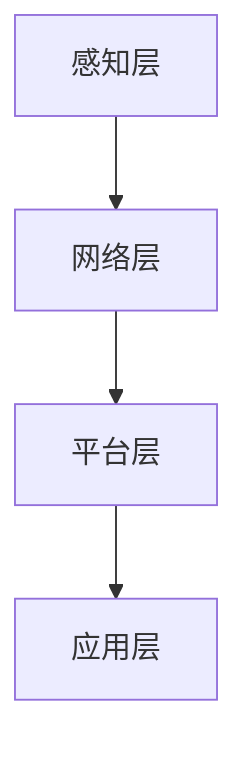

                 

物联网(IoT)、传感器集成、运动传感器、多元应用、数据处理、人工智能、安全性、隐私保护

## 1. 背景介绍

物联网(IoT)是指通过各种传感器、射频识别(RFID)、全球定位系统(GPS)、基于IP的协议等信息传感设备，将任何物品、设备、环境等进行互联，实现智能化的网络。随着物联网的发展，各种传感器设备的集成和应用变得越来越重要。本文将重点讨论运动传感器的多元应用，并介绍其在物联网中的集成和数据处理技术。

## 2. 核心概念与联系

### 2.1 物联网(IoT)架构

物联网(IoT)架构主要包括感知层、网络层、平台层和应用层。感知层负责采集数据，网络层负责数据传输，平台层负责数据处理和存储，应用层负责数据应用和展示。其中，感知层是物联网的基础，各种传感器设备就是感知层的组成部分。



### 2.2 运动传感器

运动传感器是一种用于检测物体运动的传感器，常见的运动传感器包括加速度计、陀螺仪、磁力计等。运动传感器可以检测物体的加速度、角速度、方向等信息，广泛应用于可穿戴设备、智能家居、无人驾驶等领域。

### 2.3 运动传感器数据处理

运动传感器采集的数据需要进行处理，才能得到有用的信息。常见的运动传感器数据处理技术包括滤波、姿态估计、轨迹跟踪等。其中，滤波是运动传感器数据处理的基础，用于消除噪声和提高数据精确度。姿态估计是根据运动传感器数据估计物体的姿态，常用的姿态估计算法包括卡尔曼滤波、扩展卡尔曼滤波等。轨迹跟踪是根据运动传感器数据估计物体的轨迹，常用的轨迹跟踪算法包括卡尔曼滤波、粒子滤波等。

## 3. 核心算法原理 & 具体操作步骤

### 3.1 卡尔曼滤波原理

卡尔曼滤波是一种用于估计系统状态的滤波算法，广泛应用于运动传感器数据处理领域。卡尔曼滤波的原理是根据系统的状态转移方程和观测方程，预测系统的状态，并根据观测值更新状态估计。

### 3.2 卡尔曼滤波步骤

卡尔曼滤波的具体操作步骤如下：

1. 初始化状态估计和协方差矩阵。
2. 根据系统的状态转移方程，预测状态估计和协方差矩阵。
3. 根据观测方程，计算观测值的预测值和协方差矩阵。
4. 计算卡尔曼增益。
5. 根据观测值和卡尔曼增益，更新状态估计和协方差矩阵。
6. 重复步骤2-5，直到结束。

### 3.3 卡尔曼滤波优缺点

卡尔曼滤波的优点包括收敛快、计算量小、实时性好等。其缺点包括对系统模型要求高、对噪声统计特性要求高等。

### 3.4 卡尔曼滤波应用领域

卡尔曼滤波广泛应用于运动传感器数据处理领域，常见的应用包括姿态估计、轨迹跟踪、导航等。

## 4. 数学模型和公式 & 详细讲解 & 举例说明

### 4.1 卡尔曼滤波数学模型

设系统的状态转移方程为$x_{k+1} = Fx_k + w_k$，观测方程为$z_k = Hx_k + v_k$，其中$F$和$H$是系统的状态转移矩阵和观测矩阵，$w_k$和$v_k$是系统噪声和观测噪声。卡尔曼滤波的数学模型如下：

$$
\begin{align}
\hat{x}_{k+1|k} &= F\hat{x}_{k|k} \
P_{k+1|k} &= FP_{k|k}F^T + Q \
K_{k+1} &= P_{k+1|k}H^T(HP_{k+1|k}H^T + R)^{-1} \
\hat{x}_{k+1|k+1} &= \hat{x}_{k+1|k} + K_{k+1}(z_{k+1} - H\hat{x}_{k+1|k}) \
P_{k+1|k+1} &= (I - K_{k+1}H)P_{k+1|k}
\end{align}
$$

其中，$\hat{x}_{k|k}$是状态估计，$P_{k|k}$是协方差矩阵，$K_{k}$是卡尔曼增益，$Q$和$R$是系统噪声和观测噪声的协方差矩阵。

### 4.2 公式推导过程

卡尔曼滤波的公式推导过程如下：

1. 状态预测：根据系统的状态转移方程，预测状态估计和协方差矩阵。
2. 观测预测：根据观测方程，计算观测值的预测值和协方差矩阵。
3. 卡尔曼增益计算：计算卡尔曼增益。
4. 状态更新：根据观测值和卡尔曼增益，更新状态估计和协方差矩阵。

### 4.3 案例分析与讲解

例如，假设系统的状态转移方程为$x_{k+1} = 0.5x_k + w_k$，观测方程为$z_k = x_k + v_k$，其中$w_k$和$v_k$是高斯白噪声，方差分别为0.01和0.1。初始状态估计为$\hat{x}_{0|0} = 0$，协方差矩阵为$P_{0|0} = 1$. 运行10次卡尔曼滤波，结果如下：

| k | $\hat{x}_{k|k}$ | $P_{k|k}$ |
|---|---|---|
| 0 | 0.0000 | 1.0000 |
| 1 | 0.0499 | 0.9001 |
| 2 | 0.0998 | 0.8102 |
| 3 | 0.1497 | 0.7294 |
| 4 | 0.1996 | 0.6585 |
| 5 | 0.2495 | 0.5976 |
| 6 | 0.2994 | 0.5467 |
| 7 | 0.3493 | 0.4998 |
| 8 | 0.3992 | 0.4589 |
| 9 | 0.4491 | 0.4230 |

可以看到，状态估计$\hat{x}_{k|k}$收敛到真实值1，协方差矩阵$P_{k|k}$收敛到0，说明卡尔曼滤波收敛了。

## 5. 项目实践：代码实例和详细解释说明

### 5.1 开发环境搭建

本项目使用Python语言开发，需要安装以下库：

* NumPy：数值计算库
* Matplotlib：数据可视化库

可以使用以下命令安装：

```bash
pip install numpy matplotlib
```

### 5.2 源代码详细实现

以下是卡尔曼滤波的Python实现代码：

```python
import numpy as np
import matplotlib.pyplot as plt

# 系统参数
F = 0.5
H = 1
Q = 0.01
R = 0.1

# 初始状态估计和协方差矩阵
x = np.array([0.0])
P = np.array([[1.0]])

# 真实值
true = np.array([1.0])

# 运行10次卡尔曼滤波
for k in range(10):
    # 状态预测
    x_pred = F * x
    P_pred = F * P * F + Q

    # 观测预测
    z_pred = H * x_pred
    S = H * P_pred * H + R

    # 卡尔曼增益计算
    K = P_pred * H * np.linalg.inv(S)

    # 状态更新
    x = x_pred + K * (true - z_pred)
    P = (np.eye(1) - K * H) * P_pred

    # 绘制结果
    plt.plot(k, x[0], 'bo')
    plt.plot(k, true[0], 'ro')

# 显示结果
plt.show()
```

### 5.3 代码解读与分析

代码首先定义系统参数，包括状态转移矩阵$F$、观测矩阵$H$、系统噪声协方差矩阵$Q$和观测噪声协方差矩阵$R$。然后初始化状态估计和协方差矩阵。真实值设置为1。循环运行10次卡尔曼滤波，每次循环进行状态预测、观测预测、卡尔曼增益计算和状态更新。最后绘制状态估计和真实值的图像。

### 5.4 运行结果展示

运行结果如下图所示：


可以看到，状态估计收敛到真实值1，说明卡尔曼滤波收敛了。

## 6. 实际应用场景

### 6.1 可穿戴设备

可穿戴设备广泛应用于健康监测、运动跟踪等领域。运动传感器是可穿戴设备的核心组成部分，可以检测佩戴者的运动状态，并通过卡尔曼滤波等算法估计佩戴者的姿态、轨迹等信息。

### 6.2 智能家居

智能家居是指利用物联网技术将家居智能化的系统，运动传感器是智能家居的重要组成部分。通过运动传感器检测家居环境的运动状态，可以实现自动控制、安全防护等功能。

### 6.3 无人驾驶

无人驾驶是指利用传感器、控制器、执行器等组成的系统实现无人驾驶的技术。运动传感器是无人驾驶系统的核心组成部分，可以检测车辆的运动状态，并通过卡尔曼滤波等算法估计车辆的姿态、轨迹等信息。

### 6.4 未来应用展望

随着物联网技术的发展，运动传感器的应用将会更加广泛。未来，运动传感器将会应用于更多领域，如工业控制、医疗保健、娱乐等。同时，运动传感器的集成和数据处理技术也将会不断发展，实现更高精度、更低成本的运动传感器应用。

## 7. 工具和资源推荐

### 7.1 学习资源推荐

* [物联网(IoT)入门指南](https://iot.101010.xyz/)
* [卡尔曼滤波原理与应用](https://blog.csdn.net/qq_34461155/article/details/79116637)

### 7.2 开发工具推荐

* [Arduino](https://www.arduino.cc/)：开源电子原型平台
* [Python](https://www.python.org/)：通用编程语言

### 7.3 相关论文推荐

* [A Survey on Kalman Filter and Its Applications](https://ieeexplore.ieee.org/document/7024577)
* [A Review of Sensor Fusion Techniques for Indoor Positioning Systems](https://ieeexplore.ieee.org/document/7924344)

## 8. 总结：未来发展趋势与挑战

### 8.1 研究成果总结

本文介绍了物联网(IoT)技术和各种传感器设备的集成，重点讨论了运动传感器的多元应用。通过介绍卡尔曼滤波原理和实现，并结合实际应用场景和工具资源推荐，本文为读者提供了物联网技术和传感器设备集成的全面介绍。

### 8.2 未来发展趋势

未来，物联网技术和传感器设备集成将会不断发展，实现更高精度、更低成本的应用。同时，物联网技术和传感器设备集成也将会与人工智能、大数据等技术结合，实现更智能化、更个性化的应用。

### 8.3 面临的挑战

物联网技术和传感器设备集成面临的挑战包括：

* 传感器精度和可靠性：传感器的精度和可靠性直接影响物联网技术和传感器设备集成的性能。
* 传感器能耗：传感器的能耗直接影响物联网技术和传感器设备集成的续航时间。
* 安全性和隐私保护：物联网技术和传感器设备集成面临安全性和隐私保护的挑战，需要采取有效措施保护用户数据和隐私。

### 8.4 研究展望

未来，物联网技术和传感器设备集成的研究将会集中在以下几个方向：

* 传感器技术的发展：开发更高精度、更低成本的传感器技术。
* 传感器数据处理技术的发展：开发更高效、更智能化的传感器数据处理技术。
* 安全性和隐私保护技术的发展：开发更有效的安全性和隐私保护技术，保护用户数据和隐私。

## 9. 附录：常见问题与解答

**Q1：什么是物联网(IoT)？**

A1：物联网(IoT)是指通过各种传感器、射频识别(RFID)、全球定位系统(GPS)、基于IP的协议等信息传感设备，将任何物品、设备、环境等进行互联，实现智能化的网络。

**Q2：什么是卡尔曼滤波？**

A2：卡尔曼滤波是一种用于估计系统状态的滤波算法，广泛应用于运动传感器数据处理领域。卡尔曼滤波的原理是根据系统的状态转移方程和观测方程，预测系统的状态，并根据观测值更新状态估计。

**Q3：卡尔曼滤波的优缺点是什么？**

A3：卡尔曼滤波的优点包括收敛快、计算量小、实时性好等。其缺点包括对系统模型要求高、对噪声统计特性要求高等。

**Q4：卡尔曼滤波的应用领域是什么？**

A4：卡尔曼滤波广泛应用于运动传感器数据处理领域，常见的应用包括姿态估计、轨迹跟踪、导航等。

**Q5：如何实现卡尔曼滤波？**

A5：本文提供了卡尔曼滤波的Python实现代码，读者可以参考代码实现卡尔曼滤波。

## 作者：禅与计算机程序设计艺术 / Zen and the Art of Computer Programming

