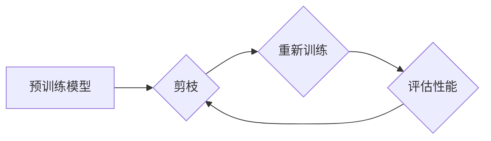

> 深度学习，神经网络，剪枝，模型压缩，效率优化，渐进式训练

## 1. 背景介绍

深度学习在过去几年取得了令人瞩目的成就，在图像识别、自然语言处理、语音识别等领域取得了突破性的进展。然而，深度学习模型通常具有庞大的参数量和计算复杂度，这使得它们在部署和推理时面临着资源限制和效率问题。为了解决这些问题，模型压缩技术应运而生，其中渐进式剪枝是一种高效且有效的模型压缩方法。

传统的模型剪枝方法通常是将预训练好的模型进行一次性剪枝，这可能会导致模型性能大幅下降。渐进式剪枝则采用一种逐步优化网络结构的方法，在训练过程中不断剪除不重要的连接，从而在保证模型性能的同时，有效地减少模型参数量和计算复杂度。

## 2. 核心概念与联系

### 2.1 核心概念

* **剪枝 (Pruning):** 剪枝是指从神经网络中移除不重要的连接（权重），从而减少模型参数量和计算复杂度。
* **渐进式剪枝 (Progressive Pruning):** 渐进式剪枝是指在训练过程中逐步剪除不重要的连接，而不是一次性剪除所有连接。

### 2.2 联系

渐进式剪枝将剪枝和训练过程结合起来，通过不断地剪除和重新训练，最终得到一个更紧凑、更高效的模型。

**Mermaid 流程图**



## 3. 核心算法原理 & 具体操作步骤

### 3.1 算法原理概述

渐进式剪枝的基本原理是：在训练过程中，根据连接权重的重要性，逐步剪除不重要的连接。

* **权重重要性度量:** 常用的权重重要性度量方法包括：
    * **绝对值:** 直接使用权重的绝对值作为重要性度量。
    * **梯度:** 使用权重的梯度作为重要性度量。
    * **稀疏性:** 使用权重的稀疏性作为重要性度量。

* **剪枝策略:** 根据权重重要性度量，选择不同的剪枝策略，例如：
    * **阈值剪枝:** 将权重绝对值低于某个阈值的连接剪除。
    * **百分比剪枝:** 剪除模型参数总量的某个百分比。
    * **随机剪枝:** 随机选择一些连接进行剪除。

### 3.2 算法步骤详解

1. **预训练模型:** 使用一个预训练好的模型作为起点。
2. **权重重要性度量:** 计算每个连接的权重重要性。
3. **剪枝:** 根据剪枝策略，选择一些连接进行剪除。
4. **重新训练:** 对剪枝后的模型进行重新训练，以恢复模型性能。
5. **评估性能:** 评估剪枝后的模型性能，并根据性能进行调整。
6. **重复步骤3-5:** 重复上述步骤，逐步剪除更多的连接，直到达到预期的模型压缩目标。

### 3.3 算法优缺点

**优点:**

* **有效性:** 能够有效地减少模型参数量和计算复杂度。
* **性能保留:** 在保证模型性能的同时，实现模型压缩。
* **可控性:** 可以通过调整剪枝策略和剪枝比例，控制模型压缩程度。

**缺点:**

* **训练时间:** 渐进式剪枝需要多次训练，训练时间较长。
* **资源消耗:** 需要较多的计算资源进行训练。

### 3.4 算法应用领域

渐进式剪枝广泛应用于各种深度学习领域，例如：

* **移动设备:** 将大型深度学习模型压缩到移动设备上，以实现高效的推理。
* **嵌入式系统:** 将深度学习模型部署到资源受限的嵌入式系统上。
* **边缘计算:** 将深度学习模型部署到边缘设备上，实现实时推理。

## 4. 数学模型和公式 & 详细讲解 & 举例说明

### 4.1 数学模型构建

假设一个深度学习模型包含 $N$ 个参数，每个参数的权重为 $w_i$。

* **剪枝率:** 定义剪枝率为 $\alpha$，表示需要剪除的连接比例。
* **剪枝后的参数数量:** 剪枝后的参数数量为 $N(1-\alpha)$。

### 4.2 公式推导过程

* **剪枝后的权重矩阵:** 

$$
W' = W \cdot S
$$

其中，$W$ 是原始的权重矩阵，$W'$ 是剪枝后的权重矩阵，$S$ 是一个稀疏矩阵，表示剪枝操作。

* **剪枝后的模型性能:** 剪枝后的模型性能可以通过测试集上的准确率、损失函数值等指标来评估。

### 4.3 案例分析与讲解

假设一个深度学习模型包含 1000 个参数，剪枝率为 0.2。

* 剪枝后的参数数量为 1000 * (1 - 0.2) = 800 个。
* 剪枝后的模型性能需要通过测试集上的准确率等指标来评估。

## 5. 项目实践：代码实例和详细解释说明

### 5.1 开发环境搭建

* Python 3.7+
* TensorFlow 2.0+
* PyTorch 1.0+

### 5.2 源代码详细实现

```python
import tensorflow as tf

# 定义一个简单的卷积神经网络模型
model = tf.keras.models.Sequential([
    tf.keras.layers.Conv2D(32, (3, 3), activation='relu', input_shape=(28, 28, 1)),
    tf.keras.layers.MaxPooling2D((2, 2)),
    tf.keras.layers.Flatten(),
    tf.keras.layers.Dense(10, activation='softmax')
])

# 训练模型
model.compile(optimizer='adam',
              loss='sparse_categorical_crossentropy',
              metrics=['accuracy'])
model.fit(x_train, y_train, epochs=10)

# 进行渐进式剪枝
for epoch in range(10):
    # 计算每个连接的权重重要性
    weights = model.get_weights()
    importance = tf.abs(weights)

    # 选择一些连接进行剪除
    threshold = tf.reduce_mean(importance) * 0.5
    mask = tf.cast(importance > threshold, tf.float32)

    # 更新模型权重
    model.set_weights([w * m for w, m in zip(weights, mask)])

    # 重新训练模型
    model.fit(x_train, y_train, epochs=1)

# 评估剪枝后的模型性能
loss, accuracy = model.evaluate(x_test, y_test)
print('Loss:', loss)
print('Accuracy:', accuracy)
```

### 5.3 代码解读与分析

* 代码首先定义了一个简单的卷积神经网络模型。
* 然后，代码进行训练模型，并使用渐进式剪枝方法进行模型压缩。
* 渐进式剪枝方法首先计算每个连接的权重重要性，然后选择一些连接进行剪除。
* 剪除后的模型需要重新训练，以恢复模型性能。
* 最后，代码评估剪枝后的模型性能。

### 5.4 运行结果展示

运行结果展示了剪枝后的模型性能，例如损失函数值和准确率。

## 6. 实际应用场景

### 6.1 移动设备

在移动设备上部署深度学习模型面临着资源限制的问题。渐进式剪枝可以有效地压缩模型大小，从而降低部署成本和功耗。

### 6.2 嵌入式系统

嵌入式系统通常具有有限的计算资源和存储空间。渐进式剪枝可以将深度学习模型压缩到嵌入式系统上，实现高效的推理。

### 6.3 边缘计算

边缘计算将深度学习模型部署到边缘设备上，实现实时推理。渐进式剪枝可以帮助将模型压缩到边缘设备上，降低延迟和功耗。

### 6.4 未来应用展望

随着深度学习技术的不断发展，渐进式剪枝将在更多领域得到应用，例如：

* **自动驾驶:** 将深度学习模型压缩到自动驾驶系统中，实现更轻量级的推理。
* **医疗诊断:** 将深度学习模型压缩到医疗设备上，实现更便捷的诊断。
* **工业自动化:** 将深度学习模型压缩到工业设备上，实现更智能的自动化。

## 7. 工具和资源推荐

### 7.1 学习资源推荐

* **论文:**
    * "Deep Compression: Compressing Deep Neural Networks with Pruning, Trained Quantization and Huffman Coding"
    * "Lottery Ticket Hypothesis: Finding Sparse, Trainable Neural Networks"
* **博客:**
    * https://towardsdatascience.com/pruning-neural-networks-for-model-compression-a-comprehensive-guide-a3b299999997
    * https://blog.paperspace.com/pruning-neural-networks/

### 7.2 开发工具推荐

* **TensorFlow:** https://www.tensorflow.org/
* **PyTorch:** https://pytorch.org/

### 7.3 相关论文推荐

* "Pruning Filters for Efficient ConvNets"
* "Structured Pruning of Deep Neural Networks"
* "Quantization-Aware Training"

## 8. 总结：未来发展趋势与挑战

### 8.1 研究成果总结

渐进式剪枝是一种有效且高效的模型压缩方法，能够有效地减少模型参数量和计算复杂度，同时保持模型性能。

### 8.2 未来发展趋势

* **更有效的剪枝策略:** 研究更有效的剪枝策略，例如基于梯度的剪枝、基于稀疏性的剪枝等。
* **自动化剪枝:** 研究自动化剪枝方法，使模型压缩更加便捷。
* **联合剪枝和量化:** 将剪枝和量化技术结合起来，实现更有效的模型压缩。

### 8.3 面临的挑战

* **剪枝后的性能下降:** 即使使用最先进的剪枝方法，也可能导致模型性能下降。
* **剪枝效率:** 剪枝过程可能非常耗时，需要进一步提高剪枝效率。
* **剪枝的可解释性:** 剪枝过程的决策机制难以解释，需要提高剪枝的可解释性。

### 8.4 研究展望

未来，渐进式剪枝技术将继续发展，并应用于更多领域。研究人员将继续探索更有效的剪枝策略、自动化剪枝方法和联合剪枝与量化技术，以实现更有效的模型压缩。

## 9. 附录：常见问题与解答

* **Q1: 渐进式剪枝和一次性剪枝有什么区别？**

* **A1:** 渐进式剪枝是逐步剪除连接，而一次性剪枝是一次性剪除所有连接。渐进式剪枝可以更好地保留模型性能。

* **Q2: 如何选择合适的剪枝策略？**

* **A2:** 选择合适的剪枝策略取决于具体的模型和任务。常用的剪枝策略包括阈值剪枝、百分比剪枝和随机剪枝。

* **Q3: 剪枝后的模型性能会下降吗？**

* **A3:** 即使使用最先进的剪枝方法，也可能导致模型性能下降。但是，渐进式剪枝可以有效地减少性能下降。


作者：禅与计算机程序设计艺术 / Zen and the Art of Computer Programming 
<end_of_turn>