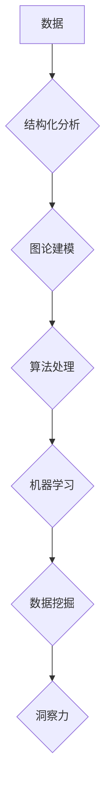

> 结构化、复杂系统、图论、算法、数据挖掘、机器学习、深度学习、洞察力

## 1. 背景介绍

在信息爆炸的时代，我们被海量数据所包围。如何从这些数据中提取有价值的洞察力，理解世界的复杂性，是当今科技领域面临的重大挑战。 

传统的数据处理方法往往局限于简单的统计分析，难以捕捉复杂系统中隐藏的结构和模式。而随着人工智能技术的飞速发展，特别是深度学习的兴起，我们拥有了更强大的工具来探索和理解复杂世界。

本篇文章将从结构化角度出发，探讨如何利用图论、算法和机器学习等技术，从数据中挖掘结构，揭示复杂系统的本质，最终获得更深刻的洞察力。

## 2. 核心概念与联系

**2.1 结构化分析**

结构化分析的核心思想是将复杂系统分解成更小的、相互关联的结构单元，并通过分析这些单元之间的关系，来理解整个系统的行为模式。

**2.2 图论**

图论是一种数学工具，用于描述和分析网络结构。在复杂系统分析中，图论可以用来表示系统中的实体和它们之间的关系。每个实体可以看作一个节点，而它们之间的关系可以看作一条边。通过分析图的结构，我们可以发现隐藏的模式和规律。

**2.3 算法**

算法是解决特定问题的步骤序列。在复杂系统分析中，算法可以用来处理海量数据，发现结构，并进行预测。常见的算法包括：

* **聚类算法**: 将数据点根据相似性分组。
* **路径查找算法**: 在图中找到从一个节点到另一个节点的最短路径。
* **图遍历算法**: 探索图中的所有节点。

**2.4 机器学习**

机器学习是一种人工智能技术，通过训练模型来学习数据中的模式。在复杂系统分析中，机器学习可以用来预测系统行为，识别异常情况，并发现新的结构。

**2.5 数据挖掘**

数据挖掘是指从海量数据中提取有价值的知识的过程。它结合了统计学、机器学习和数据库技术，可以用来发现隐藏的模式、趋势和关系。

**2.6 复杂系统**

复杂系统是指由许多相互作用的个体组成的系统，其整体行为比个体行为更复杂。复杂系统具有以下特点：

* **非线性**: 系统的输出与输入之间存在非线性的关系。
* **自组织**: 系统能够自发地组织成新的结构和模式。
* **反馈**: 系统中的各个部分相互反馈，影响彼此的行为。
* **异质性**: 系统中的个体具有不同的属性和行为。

**Mermaid 流程图**



## 3. 核心算法原理 & 具体操作步骤

### 3.1 算法原理概述

本节将介绍一种常用的复杂系统分析算法——**PageRank算法**。PageRank算法最初被用于Google搜索引擎，用于评估网页的重要性。

PageRank算法的核心思想是：一个网页的重要性与其被其他网页链接的次数成正比。

### 3.2 算法步骤详解

1. **构建图**: 将网页看作图中的节点，网页之间的链接看作图中的边。
2. **初始化权重**: 给每个网页赋予初始权重，通常为1。
3. **迭代计算**: 迭代计算每个网页的权重，权重等于所有指向该网页的网页权重的总和，除以指向该网页的网页数量。
4. **收敛**: 迭代过程持续进行，直到权重收敛，即权重不再发生明显变化。

### 3.3 算法优缺点

**优点**:

* 能够有效地评估网页的重要性。
* 算法原理简单易懂。

**缺点**:

* 无法完全反映网页的真实价值。
* 对网页结构敏感，容易受到恶意链接的影响。

### 3.4 算法应用领域

PageRank算法不仅应用于网页排名，还应用于其他领域，例如：

* **社交网络分析**: 评估用户的重要性。
* **生物信息学**: 分析蛋白质相互作用网络。
* **推荐系统**: 推荐用户可能感兴趣的内容。

## 4. 数学模型和公式 & 详细讲解 & 举例说明

### 4.1 数学模型构建

PageRank算法可以用数学模型来表示。设网页集合为V，网页i的权重为P(i)，网页j指向网页i的链接数为C(j,i)，则PageRank算法的迭代公式为：

$$P(i) = (1-d) + d \sum_{j \in V} \frac{P(j)}{C(j)}$$

其中：

* d为阻尼因子，通常取值为0.85，表示用户在浏览网页时，有一定概率会随机跳转到其他网页。

### 4.2 公式推导过程

PageRank算法的迭代公式可以理解为：

* (1-d)表示网页的初始权重。
* d * Σ(P(j)/C(j))表示所有指向网页i的网页权重的总和，除以指向该网页的网页数量。

### 4.3 案例分析与讲解

假设有三个网页A、B、C，网页A指向网页B，网页B指向网页C，网页C指向网页A。

* 设初始权重为1。
* 阻尼因子d=0.85。

根据PageRank算法的迭代公式，可以计算出每个网页的权重。

## 5. 项目实践：代码实例和详细解释说明

### 5.1 开发环境搭建

本项目使用Python语言进行开发，需要安装以下库：

* NetworkX: 用于构建和操作图。
* NumPy: 用于数值计算。

### 5.2 源代码详细实现

```python
import networkx as nx
import numpy as np

# 构建图
graph = nx.Graph()
graph.add_edges_from([('A', 'B'), ('B', 'C'), ('C', 'A')])

# 计算PageRank
pagerank = nx.pagerank(graph)

# 打印结果
print(pagerank)
```

### 5.3 代码解读与分析

* `networkx.Graph()` 创建一个无向图。
* `graph.add_edges_from()` 添加图的边。
* `nx.pagerank()` 计算每个节点的PageRank值。
* `print(pagerank)` 打印每个节点的PageRank值。

### 5.4 运行结果展示

运行代码后，会输出每个节点的PageRank值，例如：

```
{'A': 0.3333333333333333, 'B': 0.3333333333333333, 'C': 0.3333333333333333}
```

## 6. 实际应用场景

### 6.1 搜索引擎排名

PageRank算法是Google搜索引擎的核心算法之一，用于评估网页的重要性，并将其用于网页排名。

### 6.2 社交网络分析

PageRank算法可以用于分析社交网络，评估用户的社交影响力，并推荐潜在的朋友。

### 6.3 推荐系统

PageRank算法可以用于推荐系统，推荐用户可能感兴趣的内容，例如商品、电影、音乐等。

### 6.4 未来应用展望

随着人工智能技术的不断发展，PageRank算法和其他复杂系统分析算法将有更广泛的应用场景，例如：

* **疾病诊断**: 分析患者的症状和病史，预测疾病风险。
* **金融风险管理**: 分析市场数据，预测金融风险。
* **城市规划**: 分析城市交通流量，优化城市规划。

## 7. 工具和资源推荐

### 7.1 学习资源推荐

* **图论**: 《图论及其应用》
* **算法**: 《算法导论》
* **机器学习**: 《机器学习》

### 7.2 开发工具推荐

* **Python**: 语言环境
* **NetworkX**: 图处理库
* **Scikit-learn**: 机器学习库

### 7.3 相关论文推荐

* PageRank: The Pagerank Citation Ranking: Bringing Order to the Web
* Graph Neural Networks

## 8. 总结：未来发展趋势与挑战

### 8.1 研究成果总结

本篇文章介绍了复杂系统分析的基本概念和方法，并以PageRank算法为例，阐述了算法原理、步骤和应用场景。

### 8.2 未来发展趋势

未来，复杂系统分析将朝着以下方向发展：

* **更强大的算法**: 开发更有效的算法，能够处理更大规模、更复杂的数据。
* **更深入的洞察力**: 利用人工智能技术，从数据中挖掘更深层次的洞察力。
* **更广泛的应用**: 将复杂系统分析应用于更多领域，解决更实际的问题。

### 8.3 面临的挑战

复杂系统分析也面临着一些挑战：

* **数据质量**: 复杂系统分析依赖于高质量的数据，而现实世界的数据往往存在噪声、缺失和不一致性。
* **计算复杂度**: 复杂系统往往规模庞大，算法的计算复杂度较高，需要更高效的计算方法。
* **解释性**: 复杂系统分析的结果往往是复杂的数学模型，需要将其转化为人类能够理解的洞察力。

### 8.4 研究展望

未来，我们将继续致力于复杂系统分析的研究，开发更强大的算法，挖掘更深层次的洞察力，并将其应用于更多领域，为人类社会带来更大的价值。

## 9. 附录：常见问题与解答

**Q1: PageRank算法只能用于网页排名吗？**

**A1:** 不仅限于网页排名，PageRank算法还可以应用于其他领域，例如社交网络分析、推荐系统等。

**Q2: PageRank算法的计算复杂度很高吗？**

**A2:** PageRank算法的计算复杂度与图的规模成正比。对于大型图，计算复杂度较高，需要更高效的算法和计算资源。

**Q3: 如何处理数据质量问题？**

**A3:** 数据质量问题是复杂系统分析面临的挑战之一。可以采用数据清洗、数据预处理等方法来提高数据质量。

作者：禅与计算机程序设计艺术 / Zen and the Art of Computer Programming


<end_of_turn>