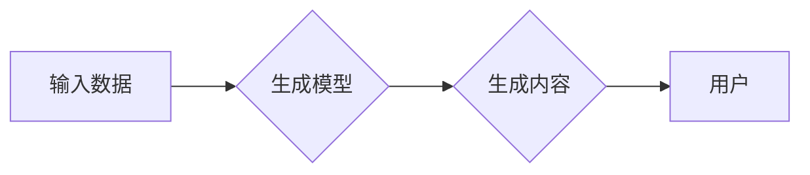

> 生成式AI, AIGC, 商业价值, 应用场景, 技术趋势, 挑战与机遇

## 1. 背景介绍

近年来，人工智能（AI）技术突飞猛进，特别是生成式人工智能（Generative AI）的兴起，引发了全球范围内的热议和关注。从ChatGPT的爆火到DALL-E 2的惊艳表现，生成式AI已经不再是科幻小说中的幻想，而是触手可及的现实。

生成式AI是指能够根据输入数据生成新内容的AI模型，例如文本、图像、音频、视频等。它利用深度学习算法，学习数据中的模式和规律，并根据这些模式生成新的、原创的内容。

生成式AI的出现，为各行各业带来了前所未有的机遇，但也引发了一些担忧。有人认为它将是未来科技发展的重要驱动力，带来巨大的经济效益和社会价值；也有人担心它会带来失业、版权争议等一系列问题。

## 2. 核心概念与联系

### 2.1 生成式AI的核心概念

* **深度学习:** 生成式AI的核心技术是深度学习，一种模仿人类大脑神经网络结构的机器学习算法。深度学习模型通过多层神经网络，从海量数据中学习特征和模式，从而实现对复杂数据的理解和生成。
* **生成模型:** 生成模型是深度学习的一种，专门用于生成新数据。常见的生成模型包括：
    * **变分自编码器 (VAE):** 通过编码输入数据到低维表示，然后解码生成新的数据。
    * **生成对抗网络 (GAN):** 由两个网络组成，一个是生成器，负责生成数据；另一个是鉴别器，负责判断数据是否真实。生成器和鉴别器之间进行对抗训练，最终生成逼真的数据。
    * **Transformer:**  一种基于注意力机制的深度学习模型，在自然语言处理领域取得了突破性进展，也应用于生成文本、代码等。

### 2.2 生成式AI与AIGC的关系

AIGC（人工智能生成内容）是利用生成式AI技术，自动生成各种类型内容的应用。它涵盖了文本创作、图像生成、音频合成、视频制作等多个领域。

**Mermaid 流程图:**



## 3. 核心算法原理 & 具体操作步骤

### 3.1 算法原理概述

生成式AI的核心算法原理是通过学习数据中的模式和规律，并根据这些模式生成新的、原创的内容。

* **数据驱动:** 生成式AI模型依赖于海量数据进行训练。数据越多，模型学习到的模式越丰富，生成的內容质量越高。
* **概率模型:** 生成式AI模型本质上是一个概率模型，它学习数据的概率分布，并根据概率分布生成新的数据。
* **神经网络:** 深度学习算法是生成式AI模型的核心，它利用多层神经网络，学习数据中的特征和关系。

### 3.2 算法步骤详解

1. **数据收集和预处理:** 收集大量相关数据，并进行清洗、格式化等预处理工作。
2. **模型选择:** 根据具体应用场景选择合适的生成模型，例如VAE、GAN、Transformer等。
3. **模型训练:** 利用训练数据训练生成模型，调整模型参数，使其能够生成高质量的内容。
4. **内容生成:** 将输入数据输入到训练好的模型中，模型根据学习到的模式生成新的内容。
5. **内容评估:** 对生成的內容进行评估，例如文本流畅度、图像逼真度等，并根据评估结果进行模型优化。

### 3.3 算法优缺点

**优点:**

* **自动化生成:** 可以自动生成各种类型的内容，提高效率。
* **创意无限:** 可以生成全新的、原创的内容，激发创意。
* **个性化定制:** 可以根据用户需求定制生成的内容。

**缺点:**

* **数据依赖:** 需要大量高质量数据进行训练，否则生成的內容质量会下降。
* **伦理风险:** 可能被用于生成虚假信息、恶意内容等，需要谨慎使用。
* **技术门槛:** 需要一定的技术背景才能开发和应用生成式AI模型。

### 3.4 算法应用领域

* **文本生成:** 文本创作、机器翻译、代码生成、聊天机器人等。
* **图像生成:** 图片合成、图像修复、艺术创作等。
* **音频生成:** 音频合成、音乐创作、语音助手等。
* **视频生成:** 视频剪辑、动画制作、虚拟现实等。

## 4. 数学模型和公式 & 详细讲解 & 举例说明

### 4.1 数学模型构建

生成式AI模型通常基于概率模型，例如概率分布、贝叶斯网络等。

**举例说明:**

* **VAE模型:** 使用变分自编码器来学习数据的概率分布，并生成新的数据。

**公式:**

$$
p(x) = \int p(x|z)p(z)dz
$$

其中：

* $p(x)$ 是输入数据的概率分布。
* $p(x|z)$ 是给定隐变量 $z$ 的条件概率分布。
* $p(z)$ 是隐变量 $z$ 的概率分布。

### 4.2 公式推导过程

VAE模型的训练目标是最大化输入数据 $x$ 的对数似然函数，同时最小化隐变量 $z$ 的编码和解码过程的重建误差。

**公式:**

$$
\mathcal{L} = - \mathbb{E}_{x \sim p_{data}(x)}[\log p(x|z)] + \mathbb{E}_{z \sim q(z)}[\log p(x|z)] + KL(q(z) || p(z))
$$

其中：

* $\mathcal{L}$ 是损失函数。
* $p_{data}(x)$ 是训练数据的概率分布。
* $q(z)$ 是编码器生成的隐变量 $z$ 的概率分布。
* $p(z)$ 是先验分布。
* $KL(q(z) || p(z))$ 是KL散度，衡量两个概率分布之间的差异。

### 4.3 案例分析与讲解

**案例:** 使用VAE模型生成图像

1. 收集大量图像数据进行训练。
2. 使用VAE模型学习图像数据的概率分布。
3. 将随机生成的隐变量 $z$ 输入到解码器中，生成新的图像。

## 5. 项目实践：代码实例和详细解释说明

### 5.1 开发环境搭建

* Python 3.x
* TensorFlow 或 PyTorch 深度学习框架
* Jupyter Notebook 或 VS Code 开发环境

### 5.2 源代码详细实现

```python
# 使用TensorFlow实现VAE模型

import tensorflow as tf

# 定义编码器
encoder = tf.keras.Sequential([
    tf.keras.layers.Input(shape=(28, 28, 1)),
    tf.keras.layers.Conv2D(32, (3, 3), activation='relu'),
    tf.keras.layers.MaxPooling2D((2, 2)),
    tf.keras.layers.Conv2D(64, (3, 3), activation='relu'),
    tf.keras.layers.MaxPooling2D((2, 2)),
    tf.keras.layers.Flatten(),
    tf.keras.layers.Dense(latent_dim, activation='relu')
])

# 定义解码器
decoder = tf.keras.Sequential([
    tf.keras.layers.Input(shape=(latent_dim,)),
    tf.keras.layers.Dense(7 * 7 * 64, activation='relu'),
    tf.keras.layers.Reshape((7, 7, 64)),
    tf.keras.layers.Conv2DTranspose(64, (3, 3), strides=(2, 2), activation='relu'),
    tf.keras.layers.Conv2DTranspose(32, (3, 3), strides=(2, 2), activation='relu'),
    tf.keras.layers.Conv2D(1, (3, 3), activation='sigmoid')
])

# 定义VAE模型
vae = tf.keras.Model(inputs=encoder.input, outputs=decoder(encoder.output))

# 编译模型
vae.compile(optimizer='adam', loss='binary_crossentropy')

# 训练模型
vae.fit(x_train, x_train, epochs=10)

# 生成新图像
z = tf.random.normal(shape=(1, latent_dim))
generated_image = decoder(z)
```

### 5.3 代码解读与分析

* **编码器:** 将输入图像编码成低维的隐变量 $z$。
* **解码器:** 将隐变量 $z$ 解码成新的图像。
* **VAE模型:** 将编码器和解码器组合在一起，构成完整的VAE模型。
* **训练过程:** 使用训练数据训练VAE模型，使其能够生成逼真的图像。

### 5.4 运行结果展示

训练完成后，可以将随机生成的隐变量 $z$ 输入到解码器中，生成新的图像。生成的图像与训练数据具有相似性，并展现出一定的随机性。

## 6. 实际应用场景

### 6.1 文本生成

* **内容创作:** 自动生成新闻报道、博客文章、小说等。
* **机器翻译:** 将文本从一种语言翻译成另一种语言。
* **代码生成:** 根据自然语言描述自动生成代码。

### 6.2 图像生成

* **图片合成:** 合并多个图像，生成新的图像。
* **图像修复:** 修复损坏的图像，恢复图像细节。
* **艺术创作:** 生成具有艺术风格的图像。

### 6.3 音频生成

* **语音合成:** 将文本转换为语音。
* **音乐创作:** 生成新的音乐旋律和伴奏。
* **音效制作:** 生成各种音效，用于游戏、电影等。

### 6.4 视频生成

* **视频剪辑:** 自动剪辑视频，生成符合特定主题的视频。
* **动画制作:** 生成动画角色和场景。
* **虚拟现实:** 生成虚拟现实场景和体验。

### 6.4 未来应用展望

* **个性化教育:** 根据学生的学习进度和需求，自动生成个性化的学习内容。
* **医疗诊断:** 利用生成式AI辅助医生进行疾病诊断。
* **科学研究:** 加速科学研究，例如药物研发、材料设计等。

## 7. 工具和资源推荐

### 7.1 学习资源推荐

* **书籍:**
    * 《Deep Learning》 by Ian Goodfellow, Yoshua Bengio, and Aaron Courville
    * 《Generative Deep Learning》 by David Foster
* **在线课程:**
    * Coursera: Deep Learning Specialization
    * Udacity: Deep Learning Nanodegree
* **博客和网站:**
    * OpenAI Blog
    * TensorFlow Blog
    * PyTorch Blog

### 7.2 开发工具推荐

* **TensorFlow:** 开源深度学习框架，支持多种硬件平台。
* **PyTorch:** 开源深度学习框架，以其灵活性和易用性而闻名。
* **Hugging Face:** 提供预训练模型和工具，方便使用生成式AI模型。

### 7.3 相关论文推荐

* **Generative Adversarial Networks** by Ian Goodfellow et al. (2014)
* **Variational Autoencoders** by Diederik P. Kingma and Max Welling (2013)
* **Attention Is All You Need** by Ashish Vaswani et al. (2017)

## 8. 总结：未来发展趋势与挑战

### 8.1 研究成果总结

生成式AI技术取得了显著进展，在文本、图像、音频等多个领域展现出强大的应用潜力。

### 8.2 未来发展趋势

* **模型规模和能力提升:** 模型规模将继续扩大，模型能力将进一步提升，生成的内容质量和多样性将得到提高。
* **多模态生成:** 将文本、图像、音频