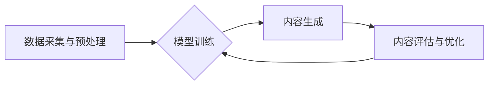

> 生成式AI，AIGC，商业化，技术路径，应用场景，未来趋势

## 1. 背景介绍

近年来，人工智能（AI）技术取得了飞速发展，特别是生成式人工智能（Generative AI）的兴起，为各行各业带来了前所未有的机遇。生成式AI能够根据输入的文本、图像、音频等数据生成新的、原创的内容，例如文本、代码、图像、音乐等。

AIGC技术在各个领域展现出巨大的潜力，例如：

* **内容创作:** 自动生成新闻报道、广告文案、剧本、诗歌等，提高内容生产效率，降低成本。
* **设计与创意:** 自动生成设计稿、产品原型、音乐作品等，激发创意，加速设计流程。
* **教育与培训:** 自动生成个性化学习内容、模拟场景练习等，提升学习效率，个性化教学体验。
* **科学研究:** 自动生成实验数据、分析报告等，加速科研进度，推动科学发现。

然而，AIGC技术也面临着一些挑战，例如：

* **数据依赖:** AIGC模型需要大量高质量的数据进行训练，数据获取和清洗成本高。
* **伦理风险:** AIGC技术可能被用于生成虚假信息、侵犯版权等，需要制定相应的伦理规范和法律法规。
* **技术瓶颈:** AIGC技术还处于发展初期，模型的生成能力和质量还有待提升。

## 2. 核心概念与联系

**2.1 生成式AI概述**

生成式AI是指能够根据输入数据生成新数据的AI模型。它与传统的AI模型不同，传统的AI模型主要用于分类、预测等任务，而生成式AI则能够创造新的内容。

**2.2 AIGC技术架构**

AIGC技术通常由以下几个模块组成：

* **数据采集与预处理:** 收集和清洗训练数据，并将其转换为模型可理解的格式。
* **模型训练:** 使用深度学习算法训练生成式AI模型，例如GAN、Transformer等。
* **内容生成:** 将输入数据输入到训练好的模型中，生成新的内容。
* **内容评估与优化:** 对生成的內容进行评估，并根据评估结果优化模型参数，提高生成质量。

**2.3 AIGC与其他AI技术的联系**

AIGC技术与其他AI技术密切相关，例如：

* **自然语言处理（NLP）:** AIGC技术在文本生成领域广泛应用，NLP技术为AIGC提供了语言理解和生成能力。
* **计算机视觉（CV）:** AIGC技术在图像生成领域也取得了进展，CV技术为AIGC提供了图像识别和生成能力。
* **机器学习（ML）:** AIGC技术基于机器学习算法，ML算法为AIGC提供了学习和优化能力。

**Mermaid 流程图**



## 3. 核心算法原理 & 具体操作步骤

### 3.1  算法原理概述

生成式AI模型的核心算法主要包括：

* **生成对抗网络（GAN）:** GAN由两个网络组成：生成器和判别器。生成器试图生成逼真的数据，而判别器试图区分真实数据和生成数据。两者相互竞争，最终生成器能够生成逼真的数据。
* **变压器（Transformer）:** Transformer是一种基于注意力机制的深度学习模型，能够处理序列数据，例如文本。Transformer在文本生成领域取得了显著的成果。

### 3.2  算法步骤详解

**3.2.1 GAN算法步骤**

1. 初始化生成器和判别器网络。
2. 生成器随机生成数据样本。
3. 判别器对真实数据和生成数据样本进行分类。
4. 根据判别器的反馈，更新生成器的参数。
5. 根据生成器的输出，更新判别器的参数。
6. 重复步骤2-5，直到生成器能够生成逼真的数据。

**3.2.2 Transformer算法步骤**

1. 将输入文本序列编码成向量表示。
2. 使用多头注意力机制学习文本之间的关系。
3. 使用前馈神经网络处理编码后的向量表示。
4. 使用解码器生成目标文本序列。

### 3.3  算法优缺点

**3.3.1 GAN算法**

* **优点:** 可以生成逼真的数据，适用于各种类型的数据生成任务。
* **缺点:** 训练过程比较复杂，容易陷入局部最优解，生成数据可能存在模式重复等问题。

**3.3.2 Transformer算法**

* **优点:** 能够处理长文本序列，生成质量高，可解释性强。
* **缺点:** 计算量大，训练成本高。

### 3.4  算法应用领域

* **GAN算法:** 图像生成、视频生成、语音合成、文本风格转换等。
* **Transformer算法:** 机器翻译、文本摘要、对话系统、代码生成等。

## 4. 数学模型和公式 & 详细讲解 & 举例说明

### 4.1  数学模型构建

**4.1.1 GAN模型**

GAN模型由两个网络组成：生成器G和判别器D。

* **生成器G:** 输入随机噪声z，输出生成数据x。

* **判别器D:** 输入数据x，输出判断x是真实数据还是生成数据。

**4.1.2 Transformer模型**

Transformer模型的核心是注意力机制，它能够学习文本之间的关系。

* **注意力机制:** 计算每个词与其他词之间的相关性，并根据相关性赋予每个词不同的权重。

### 4.2  公式推导过程

**4.2.1 GAN模型损失函数**

* **生成器损失函数:**

$$
L_G = -E_{z \sim p_z(z)}[log(D(G(z)))]
$$

* **判别器损失函数:**

$$
L_D = -E_{x \sim p_{data}(x)}[log(D(x))] - E_{z \sim p_z(z)}[log(1 - D(G(z)))]
$$

**4.2.2 Transformer模型注意力机制公式**

$$
Attention(Q, K, V) = softmax(\frac{QK^T}{\sqrt{d_k}})V
$$

其中：

* Q: 查询矩阵
* K: 键矩阵
* V: 值矩阵
* $d_k$: 键向量的维度

### 4.3  案例分析与讲解

**4.3.1 GAN模型案例:**

* **图像生成:** 使用GAN模型生成逼真的图像，例如人脸图像、风景图像等。

**4.3.2 Transformer模型案例:**

* **机器翻译:** 使用Transformer模型进行机器翻译，例如将英文翻译成中文。

## 5. 项目实践：代码实例和详细解释说明

### 5.1  开发环境搭建

* **操作系统:** Ubuntu 20.04
* **编程语言:** Python 3.8
* **深度学习框架:** TensorFlow 2.0

### 5.2  源代码详细实现

```python
# 生成器模型
class Generator(tf.keras.Model):
    def __init__(self, latent_dim, image_shape):
        super(Generator, self).__init__()
        # ...

    def call(self, z):
        # ...

# 判别器模型
class Discriminator(tf.keras.Model):
    def __init__(self, image_shape):
        super(Discriminator, self).__init__()
        # ...

    def call(self, x):
        # ...

# 训练循环
for epoch in range(num_epochs):
    for batch in dataset:
        # ...
```

### 5.3  代码解读与分析

* **生成器模型:** 负责生成新的数据样本。
* **判别器模型:** 负责判断数据样本是真实数据还是生成数据。
* **训练循环:** 迭代训练生成器和判别器模型。

### 5.4  运行结果展示

* **图像生成:** 使用生成器模型生成逼真的图像。
* **文本生成:** 使用Transformer模型生成流畅的文本。

## 6. 实际应用场景

### 6.1  内容创作

* **新闻报道:** 自动生成新闻报道，提高新闻生产效率。
* **广告文案:** 自动生成广告文案，吸引用户注意力。
* **剧本创作:** 自动生成剧本，为影视作品提供创意灵感。

### 6.2  设计与创意

* **设计稿生成:** 自动生成设计稿，加速设计流程。
* **产品原型:** 自动生成产品原型，帮助用户快速了解产品功能。
* **音乐创作:** 自动生成音乐作品，激发音乐创作灵感。

### 6.3  教育与培训

* **个性化学习内容:** 根据学生的学习进度和需求，自动生成个性化学习内容。
* **模拟场景练习:** 自动生成模拟场景练习，帮助学生提高实践能力。
* **智能辅导:** 自动解答学生的问题，提供个性化的学习辅导。

### 6.4  未来应用展望

* **虚拟助手:** 更智能、更人性化的虚拟助手，能够理解和响应用户的自然语言指令。
* **个性化推荐:** 更精准、更个性化的商品、服务和内容推荐。
* **自动代码生成:** 根据用户需求自动生成代码，提高软件开发效率。

## 7. 工具和资源推荐

### 7.1  学习资源推荐

* **书籍:**
    * 《深度学习》
    * 《生成对抗网络》
* **在线课程:**
    * Coursera: 深度学习
    * Udacity: 生成对抗网络

### 7.2  开发工具推荐

* **深度学习框架:** TensorFlow, PyTorch
* **编程语言:** Python
* **云计算平台:** AWS, Azure, GCP

### 7.3  相关论文推荐

* **Generative Adversarial Networks**
* **Attention Is All You Need**

## 8. 总结：未来发展趋势与挑战

### 8.1  研究成果总结

AIGC技术取得了显著的进展，能够生成逼真的图像、文本、音频等内容，在各个领域展现出巨大的潜力。

### 8.2  未来发展趋势

* **模型能力提升:** 模型生成能力和质量将进一步提升，能够生成更复杂、更逼真的内容。
* **应用场景拓展:** AIGC技术将应用于更多领域，例如医疗、教育、金融等。
* **伦理规范制定:** 随着AIGC技术的应用，需要制定相应的伦理规范和法律法规，确保其安全、可控地发展。

### 8.3  面临的挑战

* **数据依赖:** AIGC模型需要大量高质量的数据进行训练，数据获取和清洗成本高。
* **伦理风险:** AIGC技术可能被用于生成虚假信息、侵犯版权等，需要制定相应的伦理规范和法律法规。
* **技术瓶颈:** AIGC技术还处于发展初期，模型的生成能力和质量还有待提升。

### 8.4  研究展望

未来，AIGC技术将继续朝着更智能、更安全、更可控的方向发展，为人类社会带来更多福祉。

## 9. 附录：常见问题与解答

**9.1  AIGC技术与传统AI技术的区别是什么？**

传统AI技术主要用于分类、预测等任务，而AIGC技术能够生成新的内容。

**9.2  AIGC技术的应用场景有哪些？**

AIGC技术应用场景广泛，例如内容创作、设计与创意、教育与培训等。

**9.3  AIGC技术的伦理风险有哪些？**

AIGC技术可能被用于生成虚假信息、侵犯版权等，需要制定相应的伦理规范和法律法规。

**9.4  如何学习AIGC技术？**

可以通过阅读书籍、在线课程、参加培训等方式学习AIGC技术。

作者：禅与计算机程序设计艺术 / Zen and the Art of Computer Programming


<end_of_turn>