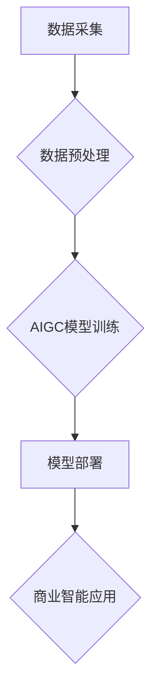

> 生成式AI, AIGC, 商业智能, 自然语言处理, 深度学习, 图像生成, 文本生成, 代码生成

## 1. 背景介绍

近年来，人工智能（AI）技术取得了飞速发展，特别是生成式人工智能（AIGC）的兴起，为商业智能（BI）领域带来了前所未有的机遇。AIGC是指能够生成新内容的AI模型，例如文本、图像、音频、视频等。与传统的AI模型相比，AIGC能够更深入地理解和生成人类语言和创意，从而为商业智能提供更强大、更灵活的工具。

传统的BI系统主要依赖于数据分析和可视化，能够帮助企业洞察数据趋势和发现商业机会。然而，传统的BI系统往往局限于结构化数据分析，难以处理海量非结构化数据，例如文本、图像、音频等。而AIGC能够有效地处理这些非结构化数据，并从中提取有价值的信息，从而为企业提供更全面的商业洞察。

## 2. 核心概念与联系

**2.1  AIGC的核心概念**

AIGC的核心是利用深度学习算法训练模型，使其能够学习和理解人类语言和创作模式。常见的AIGC模型包括：

* **文本生成模型:** 例如GPT-3、LaMDA等，能够生成高质量的文本内容，例如文章、故事、对话等。
* **图像生成模型:** 例如DALL-E 2、Stable Diffusion等，能够根据文本描述生成逼真的图像。
* **音频生成模型:** 例如Jukebox、WaveNet等，能够生成逼真的语音和音乐。

**2.2  AIGC与商业智能的联系**

AIGC能够为商业智能提供以下方面的支持：

* **数据分析与洞察:** AIGC能够处理海量非结构化数据，例如客户评论、社交媒体数据等，并从中提取有价值的信息，帮助企业更好地了解客户需求和市场趋势。
* **报表与报告自动化:** AIGC能够自动生成报表和报告，节省人力成本，提高效率。
* **预测分析:** AIGC能够基于历史数据和趋势预测未来发展趋势，帮助企业做出更明智的决策。
* **个性化服务:** AIGC能够根据用户的个人喜好和需求提供个性化的服务，例如推荐产品、提供定制化咨询等。

**2.3  AIGC与商业智能的架构**



## 3. 核心算法原理 & 具体操作步骤

**3.1  算法原理概述**

AIGC的核心算法是基于深度学习的生成模型，例如Transformer、GAN等。这些模型通过学习大量的文本或图像数据，能够捕捉语言或图像的结构和规律，并生成新的内容。

**3.2  算法步骤详解**

1. **数据收集和预处理:** 收集大量文本或图像数据，并进行清洗、格式化等预处理操作。
2. **模型训练:** 使用深度学习算法训练生成模型，例如Transformer、GAN等。
3. **模型评估:** 使用测试数据评估模型的生成效果，并根据评估结果进行模型调优。
4. **模型部署:** 将训练好的模型部署到服务器或云平台，以便进行实际应用。

**3.3  算法优缺点**

**优点:**

* 生成效果逼真，能够生成高质量的文本、图像等内容。
* 能够处理海量非结构化数据，提取有价值的信息。
* 具有强大的学习能力，能够不断改进生成效果。

**缺点:**

* 训练成本高，需要大量的计算资源和数据。
* 模型容易受到训练数据的影响，可能生成带有偏见或错误的信息。
* 生成内容缺乏真实性和原创性，存在版权和伦理问题。

**3.4  算法应用领域**

* 文本生成：文章写作、故事创作、对话系统、机器翻译等。
* 图像生成：图像合成、图像修复、图像风格转换等。
* 音频生成：语音合成、音乐创作、音效制作等。
* 代码生成：代码自动完成、代码翻译、代码注释等。

## 4. 数学模型和公式 & 详细讲解 & 举例说明

**4.1  数学模型构建**

AIGC模型通常基于神经网络架构，例如Transformer、GAN等。这些模型使用数学公式来描述神经网络的结构和功能。

**4.2  公式推导过程**

例如，Transformer模型使用注意力机制来捕捉文本序列中的长距离依赖关系。注意力机制的数学公式如下：

$$
Attention(Q, K, V) = softmax(\frac{QK^T}{\sqrt{d_k}})V
$$

其中，Q、K、V分别代表查询矩阵、键矩阵和值矩阵，$d_k$代表键向量的维度。

**4.3  案例分析与讲解**

例如，在文本生成任务中，Transformer模型会首先将输入文本序列编码成向量表示，然后使用注意力机制来捕捉文本序列中的上下文信息。最后，模型会根据上下文信息生成下一个词的概率分布，并根据概率分布选择最合适的词作为输出。

## 5. 项目实践：代码实例和详细解释说明

**5.1  开发环境搭建**

AIGC模型的开发通常需要使用Python编程语言和深度学习框架，例如TensorFlow、PyTorch等。

**5.2  源代码详细实现**

以下是一个简单的文本生成模型的代码示例，使用PyTorch框架实现：

```python
import torch
import torch.nn as nn

class TextGenerator(nn.Module):
    def __init__(self, vocab_size, embedding_dim, hidden_dim):
        super(TextGenerator, self).__init__()
        self.embedding = nn.Embedding(vocab_size, embedding_dim)
        self.lstm = nn.LSTM(embedding_dim, hidden_dim)
        self.fc = nn.Linear(hidden_dim, vocab_size)

    def forward(self, x):
        embedded = self.embedding(x)
        output, (hidden, cell) = self.lstm(embedded)
        output = self.fc(output[:, -1, :])
        return output

# ... 模型训练和评估代码 ...
```

**5.3  代码解读与分析**

该代码实现了一个简单的文本生成模型，包含三个主要部分：

* **Embedding层:** 将单词转换为向量表示。
* **LSTM层:** 使用循环神经网络捕捉文本序列中的上下文信息。
* **全连接层:** 将LSTM输出映射到单词概率分布。

**5.4  运行结果展示**

训练好的模型能够根据输入的文本序列生成新的文本内容。

## 6. 实际应用场景

**6.1  客户服务自动化**

AIGC可以用于构建智能客服机器人，自动回复客户常见问题，提高客户服务效率。

**6.2  营销内容创作**

AIGC可以帮助企业自动生成营销文案、广告创意等，节省营销成本，提高营销效果。

**6.3  数据分析与洞察**

AIGC可以帮助企业分析海量非结构化数据，例如客户评论、社交媒体数据等，提取有价值的信息，帮助企业更好地了解客户需求和市场趋势。

**6.4  未来应用展望**

AIGC在商业智能领域的应用前景广阔，未来将有更多创新应用场景出现，例如：

* **个性化产品推荐:** 根据用户的个人喜好和需求，提供个性化的产品推荐。
* **智能决策支持:** 基于数据分析和预测，为企业决策提供智能支持。
* **虚拟助理:** 为企业员工提供虚拟助理服务，例如日程安排、会议管理等。

## 7. 工具和资源推荐

**7.1  学习资源推荐**

* **书籍:**
    * 《深度学习》
    * 《自然语言处理》
    * 《生成式对抗网络》
* **在线课程:**
    * Coursera
    * edX
    * Udacity

**7.2  开发工具推荐**

* **深度学习框架:** TensorFlow、PyTorch
* **文本处理工具:** NLTK、spaCy
* **图像处理工具:** OpenCV、Pillow

**7.3  相关论文推荐**

* 《Attention Is All You Need》
* 《Generative Adversarial Networks》
* 《BERT: Pre-training of Deep Bidirectional Transformers for Language Understanding》

## 8. 总结：未来发展趋势与挑战

**8.1  研究成果总结**

近年来，AIGC技术取得了显著进展，能够生成高质量的文本、图像等内容，为商业智能领域带来了新的机遇。

**8.2  未来发展趋势**

* **模型规模和性能提升:** 未来AIGC模型将更加强大，能够生成更加逼真、更加原创的内容。
* **多模态生成:** AIGC模型将能够处理多种数据类型，例如文本、图像、音频等，并生成多模态内容。
* **个性化定制:** AIGC模型将能够根据用户的个人喜好和需求进行个性化定制。

**8.3  面临的挑战**

* **数据安全和隐私保护:** AIGC模型的训练需要大量数据，如何保证数据安全和隐私保护是一个重要挑战。
* **模型可解释性和信任度:** AIGC模型的决策过程往往难以理解，如何提高模型的可解释性和信任度是一个重要问题。
* **伦理和社会影响:** AIGC技术可能带来一些伦理和社会问题，例如内容虚假、版权侵权等，需要引起重视和关注。

**8.4  研究展望**

未来，AIGC技术将继续发展，为商业智能领域带来更多创新应用。研究者需要关注数据安全、模型可解释性和伦理问题，确保AIGC技术能够安全、可靠、可持续地发展。

## 9. 附录：常见问题与解答

**9.1  AIGC模型的训练需要多少数据？**

AIGC模型的训练数据量取决于模型的复杂度和任务类型。一般来说，需要大量的文本或图像数据才能训练出高质量的模型。

**9.2  AIGC模型的生成内容是否原创？**

AIGC模型生成的內容是基于训练数据学习到的模式，并非完全原创。

**9.3  如何保证AIGC模型的安全性？**

需要采取多种措施保证AIGC模型的安全性，例如数据加密、模型审计等。

**9.4  AIGC技术会取代人类工作吗？**

AIGC技术可以帮助人类提高工作效率，但不会完全取代人类工作。人类仍然需要发挥创造力和解决复杂问题的能力。


作者：禅与计算机程序设计艺术 / Zen and the Art of Computer Programming 
<end_of_turn>