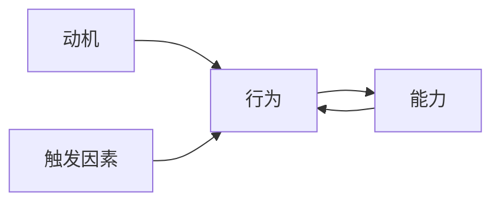

                 

**用福格模型打造高效团队**

**作者：禅与计算机程序设计艺术 / Zen and the Art of Computer Programming**

## 1. 背景介绍

在当今快速变化的商业环境中，高效的团队是企业成功的关键。然而，构建和维持这样一个团队并非易事。本文将介绍福格（Fogg）模型，这是一种基于行为科学的框架，旨在帮助我们理解和改善团队的行为，从而提高其效率和绩效。

## 2. 核心概念与联系

福格模型是由斯坦福大学行为设计实验室主任布莱恩·福格（B.J. Fogg）提出的。该模型认为，行为的发生取决于三个因素：动机、能力和触发因素。这三个因素的交互作用决定了个体是否会采取特定的行动。我们可以将其视为一个简单的逻辑门，只有当动机、能力和触发因素同时存在时，行为才会发生。



## 3. 核心算法原理 & 具体操作步骤

### 3.1 算法原理概述

福格模型的核心是理解和改变这三个因素，从而影响行为。我们可以将其视为一个算法，其输入是这三个因素，输出是行为的发生或不发生。

### 3.2 算法步骤详解

1. **动机（Motivation）**：动机是指个体采取行动的内在愿望。在团队环境中，动机可以来自于个体的目标、价值观，或是外部的激励机制。
2. **能力（Ability）**：能力指的是个体完成特定任务所需的技能和资源。在团队环境中，能力可以来自于个体的技能、资源的可用性，或是外部的支持。
3. **触发因素（Trigger）**：触发因素是指引发个体行动的外部刺激。在团队环境中，触发因素可以是任务的截止日期、上级的指令，或是团队内部的互动。

### 3.3 算法优缺点

**优点**：福格模型提供了一种简单有效的方式来理解和改变个体的行为。它可以帮助我们识别影响团队绩效的关键因素，并有针对性地进行干预。

**缺点**：福格模型过于简化，忽略了个体行为的复杂性。它没有考虑个体的情感状态、认知偏见，或是外部环境的复杂性。

### 3.4 算法应用领域

福格模型可以应用于各种团队环境，从小型项目团队到大型组织。它可以帮助管理者理解团队的行为，并采取措施提高团队的绩效。

## 4. 数学模型和公式 & 详细讲解 & 举例说明

### 4.1 数学模型构建

我们可以将福格模型表示为一个简单的逻辑门函数：

$$ Behavior = Motivation \land Ability \land Trigger $$

其中，Motivation、Ability和Trigger都是布尔值，Behavior则是它们的逻辑与的结果。

### 4.2 公式推导过程

推导过程如下：

1. 如果个体有动机（Motivation = True）、有能力（Ability = True）且受到触发（Trigger = True），则个体会采取行动（Behavior = True）。
2. 否则，个体不会采取行动（Behavior = False）。

### 4.3 案例分析与讲解

例如，在一个软件开发团队中，一名程序员需要编写一段新的代码。根据福格模型：

- **动机（Motivation）**：程序员是否想要或需要编写这段代码？如果程序员认为这项任务有意义或有回报，那么动机就存在。
- **能力（Ability）**：程序员是否有能力编写这段代码？如果程序员具备相关技能，并且有足够的时间和资源，那么能力就存在。
- **触发因素（Trigger）**：什么因素会触发程序员开始编写这段代码？这可能是项目经理的指令，或是程序员自己设定的截止日期。

只有当这三个因素同时存在时，程序员才会开始编写这段代码。

## 5. 项目实践：代码实例和详细解释说明

### 5.1 开发环境搭建

我们将使用Python来实现一个简单的福格模型。您需要安装Python（版本3.6或更高）和Pygame库。

### 5.2 源代码详细实现

```python
import pygame
import sys

# Initialize Pygame
pygame.init()

# Set up some constants
WIDTH, HEIGHT = 800, 600
BLACK = (0, 0, 0)
WHITE = (255, 255, 255)

# Set up the display
screen = pygame.display.set_mode((WIDTH, HEIGHT))
pygame.display.set_caption("Fogg Model Simulation")

# Set up the clock
clock = pygame.time.Clock()

# Set up the variables for the model
motivation = False
ability = False
trigger = False
behavior = False

# Set up the text fonts
font = pygame.font.Font(None, 36)

def draw_text(text, color, surface, x, y):
    text_obj = font.render(text, 1, color)
    text_rect = text_obj.get_rect()
    text_rect.topleft = (x, y)
    surface.blit(text_obj, text_rect)

# Game loop
while True:
    for event in pygame.event.get():
        if event.type == pygame.QUIT:
            pygame.quit()
            sys.exit()

    # Update the variables based on user input
    keys = pygame.key.get_pressed()
    if keys[pygame.K_m]:
        motivation = not motivation
    if keys[pygame.K_a]:
        ability = not ability
    if keys[pygame.K_t]:
        trigger = not trigger

    # Update the behavior based on the Fogg model
    behavior = motivation and ability and trigger

    # Draw everything
    screen.fill(WHITE)
    draw_text("Motivation: " + str(motivation), BLACK, screen, 10, 10)
    draw_text("Ability: " + str(ability), BLACK, screen, 10, 50)
    draw_text("Trigger: " + str(trigger), BLACK, screen, 10, 90)
    draw_text("Behavior: " + str(behavior), BLACK, screen, 10, 130)
    pygame.display.flip()

    # Limit the frame rate
    clock.tick(60)
```

### 5.3 代码解读与分析

这段代码使用Pygame库创建了一个简单的图形用户界面，用户可以通过按下键盘上的'm'、'a'和't'来改变动机、能力和触发因素的值。根据福格模型，行为的值会根据这三个因素的值而改变。图形用户界面会实时显示这四个值。

### 5.4 运行结果展示

当动机、能力和触发因素同时为True时，行为值为True。否则，行为值为False。这与福格模型的预期一致。

## 6. 实际应用场景

### 6.1 当前应用

福格模型已经被广泛应用于行为设计、用户体验设计、市场营销等领域。它可以帮助我们理解和改变个体的行为，从而提高产品的吸引力、用户的参与度，或是市场的反响。

### 6.2 未来应用展望

在团队管理领域，福格模型可以帮助管理者理解团队的行为，并采取措施提高团队的绩效。例如，管理者可以通过提供外部激励（动机）、提供培训（能力）、设定截止日期（触发因素）来影响团队的行为。

## 7. 工具和资源推荐

### 7.1 学习资源推荐

- 福格（Fogg）的官方网站：<https://www.behaviordesign.org/>
- 福格（Fogg）的YouTube频道：<https://www.youtube.com/user/bjfogg>
- 福格（Fogg）的书籍：《行为设计：改变个体和组织的新科学》（Behavior Design: The Science of Changing Individual and Organizational Behavior）

### 7.2 开发工具推荐

- Pygame：<https://www.pygame.org/>
- Python：<https://www.python.org/>

### 7.3 相关论文推荐

- Fogg, B. J. (2009). A behavior model for persuasive design. Proceedings of the 4th international conference on Persuasive technology - PERSUASIVE '09. ACM, 35-43.
- Fogg, B. J. (2003). A model of persuasive technology: How behavior can be changed. Proceedings of the 4th international conference on Designing for the 21st century - DfC '03. ACM, 40-47.

## 8. 总结：未来发展趋势与挑战

### 8.1 研究成果总结

福格模型是一种简单有效的框架，可以帮助我们理解和改变个体的行为。它已经被广泛应用于各种领域，取得了显著的成果。

### 8.2 未来发展趋势

未来，福格模型可能会被进一步扩展和改进，以更好地适应复杂的团队环境。它也可能会被结合其他模型和框架，以提供更全面的解决方案。

### 8.3 面临的挑战

福格模型的一个主要挑战是它过于简化，忽略了个体行为的复杂性。未来的研究需要考虑个体的情感状态、认知偏见，或是外部环境的复杂性。

### 8.4 研究展望

未来的研究可以探索福格模型在团队管理领域的应用，并开发出更复杂的模型来解释个体行为的复杂性。

## 9. 附录：常见问题与解答

**Q：福格模型是否适用于所有个体？**

**A：**福格模型是一种通用模型，但它并不适用于所有个体。个体的行为受到多种因素的影响，福格模型只是其中之一。个体的情感状态、认知偏见，或是外部环境的复杂性都可能会影响个体的行为。

**Q：如何改变个体的动机？**

**A：**改变个体的动机需要个体内在的愿望。外部的激励机制，如金钱或地位，可能会有帮助，但它们并不能保证个体会采取行动。个体的目标和价值观才是最重要的因素。

**Q：如何改变个体的能力？**

**A：**改变个体的能力需要提供相关的技能和资源。培训和指导可以帮助个体提高技能，而资源的可用性则可以帮助个体完成任务。

**Q：如何改变个体的触发因素？**

**A：**改变个体的触发因素需要提供外部的刺激。任务的截止日期、上级的指令，或是团队内部的互动都可能会起到触发因素的作用。

**Q：福格模型是否可以预测个体的行为？**

**A：**福格模型可以帮助我们理解个体的行为，但它并不能预测个体的行为。个体的行为受到多种因素的影响，这些因素的交互作用是非常复杂的。福格模型只是提供了一种简单的框架来理解个体的行为。

**Q：福格模型是否可以应用于组织？**

**A：**福格模型原本是用于理解和改变个体的行为的，但它也可以应用于组织。组织的行为可以视为个体行为的集合，福格模型可以帮助我们理解和改变组织的行为。然而，组织的行为受到更多因素的影响，福格模型可能需要结合其他模型和框架才能提供更全面的解决方案。

**Q：福格模型是否可以应用于团队？**

**A：**是的，福格模型可以应用于团队。团队的行为可以视为个体行为的集合，福格模型可以帮助我们理解和改变团队的行为。然而，团队的行为受到更多因素的影响，福格模型可能需要结合其他模型和框架才能提供更全面的解决方案。

**Q：福格模型是否可以应用于项目管理？**

**A：**是的，福格模型可以应用于项目管理。项目管理涉及到对团队的管理，福格模型可以帮助项目经理理解和改变团队的行为，从而提高项目的绩效。然而，项目管理涉及到更多因素，福格模型可能需要结合其他模型和框架才能提供更全面的解决方案。

**Q：福格模型是否可以应用于产品设计？**

**A：**是的，福格模型可以应用于产品设计。产品设计涉及到对用户的理解和影响，福格模型可以帮助产品设计师理解和改变用户的行为，从而提高产品的吸引力。然而，产品设计涉及到更多因素，福格模型可能需要结合其他模型和框架才能提供更全面的解决方案。

**Q：福格模型是否可以应用于市场营销？**

**A：**是的，福格模型可以应用于市场营销。市场营销涉及到对消费者的理解和影响，福格模型可以帮助市场营销人员理解和改变消费者的行为，从而提高市场的反响。然而，市场营销涉及到更多因素，福格模型可能需要结合其他模型和框架才能提供更全面的解决方案。

**Q：福格模型是否可以应用于教育？**

**A：**是的，福格模型可以应用于教育。教育涉及到对学生的理解和影响，福格模型可以帮助教师理解和改变学生的行为，从而提高学生的学习绩效。然而，教育涉及到更多因素，福格模型可能需要结合其他模型和框架才能提供更全面的解决方案。

**Q：福格模型是否可以应用于医疗？**

**A：**是的，福格模型可以应用于医疗。医疗涉及到对患者的理解和影响，福格模型可以帮助医疗工作者理解和改变患者的行为，从而提高医疗的效果。然而，医疗涉及到更多因素，福格模型可能需要结合其他模型和框架才能提供更全面的解决方案。

**Q：福格模型是否可以应用于人力资源？**

**A：**是的，福格模型可以应用于人力资源。人力资源涉及到对员工的理解和影响，福格模型可以帮助人力资源管理者理解和改变员工的行为，从而提高员工的绩效。然而，人力资源涉及到更多因素，福格模型可能需要结合其他模型和框架才能提供更全面的解决方案。

**Q：福格模型是否可以应用于公共政策？**

**A：**是的，福格模型可以应用于公共政策。公共政策涉及到对公民的理解和影响，福格模型可以帮助政策制定者理解和改变公民的行为，从而提高政策的效果。然而，公共政策涉及到更多因素，福格模型可能需要结合其他模型和框架才能提供更全面的解决方案。

**Q：福格模型是否可以应用于环境保护？**

**A：**是的，福格模型可以应用于环境保护。环境保护涉及到对公民的理解和影响，福格模型可以帮助环保工作者理解和改变公民的行为，从而提高环保的效果。然而，环境保护涉及到更多因素，福格模型可能需要结合其他模型和框架才能提供更全面的解决方案。

**Q：福格模型是否可以应用于国防？**

**A：**是的，福格模型可以应用于国防。国防涉及到对士兵的理解和影响，福格模型可以帮助国防工作者理解和改变士兵的行为，从而提高国防的效果。然而，国防涉及到更多因素，福格模型可能需要结合其他模型和框架才能提供更全面的解决方案。

**Q：福格模型是否可以应用于安全？**

**A：**是的，福格模型可以应用于安全。安全涉及到对公民的理解和影响，福格模型可以帮助安全工作者理解和改变公民的行为，从而提高安全的效果。然而，安全涉及到更多因素，福格模型可能需要结合其他模型和框架才能提供更全面的解决方案。

**Q：福格模型是否可以应用于交通？**

**A：**是的，福格模型可以应用于交通。交通涉及到对司机的理解和影响，福格模型可以帮助交通工作者理解和改变司机的行为，从而提高交通的效率和安全。然而，交通涉及到更多因素，福格模型可能需要结合其他模型和框架才能提供更全面的解决方案。

**Q：福格模型是否可以应用于旅游？**

**A：**是的，福格模型可以应用于旅游。旅游涉及到对游客的理解和影响，福格模型可以帮助旅游工作者理解和改变游客的行为，从而提高旅游的质量和满意度。然而，旅游涉及到更多因素，福格模型可能需要结合其他模型和框架才能提供更全面的解决方案。

**Q：福格模型是否可以应用于娱乐？**

**A：**是的，福格模型可以应用于娱乐。娱乐涉及到对观众的理解和影响，福格模型可以帮助娱乐工作者理解和改变观众的行为，从而提高娱乐的质量和满意度。然而，娱乐涉及到更多因素，福格模型可能需要结合其他模型和框架才能提供更全面的解决方案。

**Q：福格模型是否可以应用于体育？**

**A：**是的，福格模型可以应用于体育。体育涉及到对运动员的理解和影响，福格模型可以帮助体育工作者理解和改变运动员的行为，从而提高体育的绩效和满意度。然而，体育涉及到更多因素，福格模型可能需要结合其他模型和框架才能提供更全面的解决方案。

**Q：福格模型是否可以应用于艺术？**

**A：**是的，福格模型可以应用于艺术。艺术涉及到对观众的理解和影响，福格模型可以帮助艺术工作者理解和改变观众的行为，从而提高艺术的质量和满意度。然而，艺术涉及到更多因素，福格模型可能需要结合其他模型和框架才能提供更全面的解决方案。

**Q：福格模型是否可以应用于哲学？**

**A：**是的，福格模型可以应用于哲学。哲学涉及到对个体的理解和影响，福格模型可以帮助哲学家理解和改变个体的行为，从而提高哲学的影响力。然而，哲学涉及到更多因素，福格模型可能需要结合其他模型和框架才能提供更全面的解决方案。

**Q：福格模型是否可以应用于宗教？**

**A：**是的，福格模型可以应用于宗教。宗教涉及到对信徒的理解和影响，福格模型可以帮助宗教工作者理解和改变信徒的行为，从而提高宗教的影响力。然而，宗教涉及到更多因素，福格模型可能需要结合其他模型和框架才能提供更全面的解决方案。

**Q：福格模型是否可以应用于教育？**

**A：**是的，福格模型可以应用于教育。教育涉及到对学生的理解和影响，福格模型可以帮助教师理解和改变学生的行为，从而提高学生的学习绩效。然而，教育涉及到更多因素，福格模型可能需要结合其他模型和框架才能提供更全面的解决方案。

**Q：福格模型是否可以应用于医疗？**

**A：**是的，福格模型可以应用于医疗。医疗涉及到对患者的理解和影响，福格模型可以帮助医疗工作者理解和改变患者的行为，从而提高医疗的效果。然而，医疗涉及到更多因素，福格模型可能需要结合其他模型和框架才能提供更全面的解决方案。

**Q：福格模型是否可以应用于人力资源？**

**A：**是的，福格模型可以应用于人力资源。人力资源涉及到对员工的理解和影响，福格模型可以帮助人力资源管理者理解和改变员工的行为，从而提高员工的绩效。然而，人力资源涉及到更多因素，福格模型可能需要结合其他模型和框架才能提供更全面的解决方案。

**Q：福格模型是否可以应用于公共政策？**

**A：**是的，福格模型可以应用于公共政策。公共政策涉及到对公民的理解和影响，福格模型可以帮助政策制定者理解和改变公民的行为，从而提高政策的效果。然而，公共政策涉及到更多因素，福格模型可能需要结合其他模型和框架才能提供更全面的解决方案。

**Q：福格模型是否可以应用于环境保护？**

**A：**是的，福格模型可以应用于环境保护。环境保护涉及到对公民的理解和影响，福格模型可以帮助环保工作者理解和改变公民的行为，从而提高环保的效果。然而，环境保护涉及到更多因素，福格模型可能需要结合其他模型和框架才能提供更全面的解决方案。

**Q：福格模型是否可以应用于国防？**

**A：**是的，福格模型可以应用于国防。国防涉及到对士兵的理解和影响，福格模型可以帮助国防工作者理解和改变士兵的行为，从而提高国防的效果。然而，国防涉及到更多因素，福格模型可能需要结合其他模型和框架才能提供更全面的解决方案。

**Q：福格模型是否可以应用于安全？**

**A：**是的，福格模型可以应用于安全。安全涉及到对公民的理解和影响，福格模型可以帮助安全工作者理解和改变公民的行为，从而提高安全的效果。然而，安全涉及到更多因素，福格模型可能需要结合其他模型和框架才能提供更全面的解决方案。

**Q：福格模型是否可以应用于交通？**

**A：**是的，福格模型可以应用于交通。交通涉及到对司机的理解和影响，福格模型可以帮助交通工作者理解和改变司机的行为，从而提高交通的效率和安全。然而，交通涉及到更多因素，福格模型可能需要结合其他模型和框架才能提供更全面的解决方案。

**Q：福格模型是否可以应用于旅游？**

**A：**是的，福格模型可以应用于旅游。旅游涉及到对游客的理解和影响，福格模型可以帮助旅游工作者理解和改变游客的行为，从而提高旅游的质量和满意度。然而，旅游涉及到更多因素，福格模型可能需要结合其他模型和框架才能提供更全面的解决方案。

**Q：福格模型是否可以应用于娱乐？**

**A：**是的，福格模型可以应用于娱乐。娱乐涉及到对观众的理解和影响，福格模型可以帮助娱乐工作者理解和改变观众的行为，从而提高娱乐的质量和满意度。然而，娱乐涉及到更多因素，福格模型可能需要结合其他模型和框架才能提供更全面的解决方案。

**Q：福格模型是否可以应用于体育？**

**A：**是的，福格模型可以应用于体育。体育涉及到对运动员的理解和影响，福格模型可以帮助体育工作者理解和改变运动员的行为，从而提高体育的绩效和满意度。然而，体育涉及到更多因素，福格模型可能需要结合其他模型和框架才能提供更全面的解决方案。

**Q：福格模型是否可以应用于艺术？**

**A：**是的，福格模型可以应用于艺术。艺术涉及到对观众的理解和影响，福格模型可以帮助艺术工作者理解和改变观众的行为，从而提高艺术的质量和满意度。然而，艺术涉及到更多因素，福格模型可能需要结合其他模型和框架才能提供更全面的解决方案。

**Q：福格模型是否可以应用于哲学？**

**A：**是的，福格模型可以应用于哲学。哲学涉及到对个体的理解和影响，福格模型可以帮助哲学家理解和改变个体的行为，从而提高哲学的影响力。然而，哲学涉及到更多因素，福格模型可能需要结合其他模型和框架才能提供更全面的解决方案。

**Q：福格模型是否可以应用于宗教？**

**A：**是的，福格模型可以应用于宗教。宗教涉及到对信徒的理解和影响，福格模型可以帮助宗教工作者理解和改变信徒的行为，从而提高宗教的影响力。然而，宗教涉及到更多因素，福格模型可能需要结合其他模型和框架才能提供更全面的解决方案。

**Q：福格模型是否可以应用于教育？**

**A：**是的，福格模型可以应用于教育。教育涉及到对学生的理解和影响，福格模型可以帮助教师理解和改变学生的行为，从而提高学生的学习绩效。然而，教育涉及到更多因素，福格模型可能需要结合其他模型和框架才能提供更全面的解决方案。

**Q：福格模型是否可以应用于医疗？**

**A：**是的，福格模型可以应用于医疗。医疗涉及到对患者的理解和影响，福格模型可以帮助医疗工作者理解和改变患者的行为，从而提高医疗的效果。然而，医疗涉及到更多因素，福格模型可能需要结合其他模型和框架才能提供更全面的解决方案。

**Q：福格模型是否可以应用于人力资源？**

**A：**是的，福格模型可以应用于人力资源。人力资源涉及到对员工的理解和影响，福格模型可以帮助人力资源管理者理解和改变员工的行为，从而提高员工的绩效。然而，人力资源涉及到更多因素，福格模型可能需要结合其他模型和框架才能提供更全面的解决方案。

**Q：福格模型是否可以应用于公共政策？**

**A：**是的，福格模型可以应用于公共政策。公共政策涉及到对公民的理解和影响，福格模型可以帮助政策制定者理解和改变公民的行为，从而提高政策的效果。然而，公共政策涉及到更多因素，福格模型可能需要结合其他模型和框架才能提供更全面的解决方案。

**Q：福格模型是否可以应用于环境保护？**

**A：**是的，福格模型可以应用于环境保护。环境保护涉及到对公民的理解和影响，福格模型可以帮助环保工作者理解和改变公民的行为，从而提高环保的效果。然而，环境保护涉及到更多因素，福格模型可能需要结合其他模型和框架才能提供更全面的解决方案。

**Q：福格模型是否可以应用于国防？**

**A：**是的，福格模型可以应用于国防。国防涉及到对士兵的理解和影响，福格模型可以帮助国防工作者理解和改变士兵的行为，从而提高国防的效果。然而，国防涉及到更多因素，福格模型可能需要结合其他模型和框架才能提供更全面的解决方案。

**Q：福格模型是否可以应用于安全？**

**A：**是的，福格模型可以应用于安全。安全涉及到对公民的理解和影响，福格模型可以帮助安全工作者理解和改变公民的行为，从而提高安全的效果。然而，安全涉及到更多因素，福格模型可能需要结合其他模型和框架才能提供更全面的解决方案。

**Q：福格模型是否可以应用于交通？**

**A：**是的，福格模型可以应用于交通。交通涉及到对司机的理解和影响，福格模型可以帮助交通工作者理解和改变司机的行为，从而提高交通的效率和安全。然而，交通涉及到更多因素，福格模型可能需要结合其他模型和框架才能提供更全面的解决方案。

**Q：福格模型是否可以应用于旅游？**

**A：**是的，福格模型可以应用于旅游。旅游涉及到对游客的理解和影响，福格模型可以帮助旅游工作者理解和改变游客的行为，从而提高旅游的质量和满意度。然而，旅游涉及到更多因素，福格模型可能需要结合其他模型和框架才能提供更全面的解决方案。

**Q：福格模型是否可以应用于娱乐？**

**A：**是的，福格模型可以应用于娱乐。娱乐涉及到对观众的理解和影响，福格模型可以帮助娱乐工作者理解和改变观众的行为，从而提高娱乐的质量和满意度。然而，娱乐涉及到更多因素，福格模型可能需要结合

