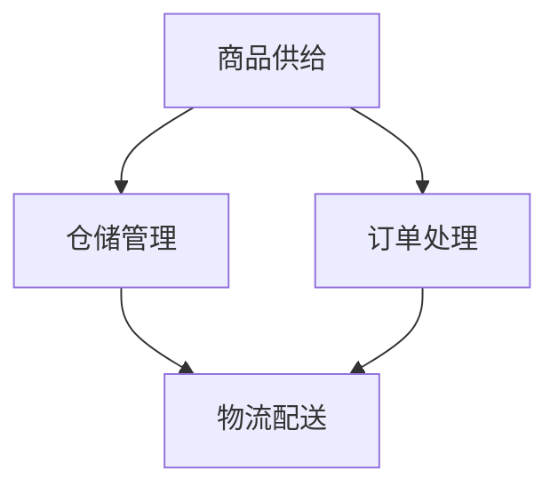

                 

**电商平台供给能力提升：多维度策略解析**

**作者：禅与计算机程序设计艺术 / Zen and the Art of Computer Programming**

## 1. 背景介绍

随着电子商务的迅猛发展，消费者对电商平台的供给能力提出了更高的要求。如何提升电商平台的供给能力，满足消费者的需求，是电商平台亟待解决的问题。本文将从多维度出发，分析电商平台供给能力提升的策略，并提供相关的技术解决方案。

## 2. 核心概念与联系

电商平台供给能力的提升涉及多个维度，包括商品供给、物流配送、仓储管理、订单处理等。这些维度相互关联，共同构成电商平台供给能力提升的系统架构。下面是该系统的 Mermaid 流程图：



## 3. 核心算法原理 & 具体操作步骤

### 3.1 算法原理概述

在电商平台供给能力提升的过程中，需要运用多种算法，包括库存管理算法、物流路径规划算法、订单分拣算法等。这些算法的核心原理是优化资源配置，提高效率。

### 3.2 算法步骤详解

#### 3.2.1 库存管理算法

库存管理算法的目的是预测商品需求，合理配置库存。常用的库存管理算法包括：

- **移动平均法**：使用历史销量的移动平均值预测未来需求。
- **指数平滑法**：给予历史销量的最新值更高的权重，预测未来需求。
- **ARIMA模型**：结合移动平均法和差分法，预测未来需求。

#### 3.2.2 物流路径规划算法

物流路径规划算法的目的是找到最优的物流路径，提高配送效率。常用的物流路径规划算法包括：

- **最短路径算法**：使用 Dijkstra 算法或 Floyd-Warshall 算法找到最短路径。
- **旅行推销员问题算法**：使用遗传算法或蚁群算法找到最优路径。

#### 3.2.3 订单分拣算法

订单分拣算法的目的是将订单分拣到相应的物流路径，提高分拣效率。常用的订单分拣算法包括：

- **先来先服务算法**：按照订单接收顺序分拣。
- **最短处理时间优先算法**：优先分拣处理时间最短的订单。

### 3.3 算法优缺点

各种算法都有其优缺点。例如，移动平均法简单易行，但对突发需求反应慢；指数平滑法对最新需求反应灵敏，但对历史需求考虑不足；ARIMA模型综合了移动平均法和差分法的优点，但模型复杂，计算量大。

### 3.4 算法应用领域

不同的算法适用于不同的应用场景。例如，移动平均法和指数平滑法适用于需求变化不大的商品；ARIMA模型适用于需求变化较大的商品；最短路径算法适用于物流路径简单的场景；旅行推销员问题算法适用于物流路径复杂的场景。

## 4. 数学模型和公式 & 详细讲解 & 举例说明

### 4.1 数学模型构建

在电商平台供给能力提升的过程中，需要构建数学模型来描述系统的运行状态。常用的数学模型包括：

- **库存模型**：使用线性规划模型优化库存配置。
- **物流模型**：使用网络流模型优化物流路径。
- **订单模型**：使用排队模型优化订单处理。

### 4.2 公式推导过程

#### 4.2.1 库存模型

库存模型的目标函数为：

$$Z = \min \sum_{i=1}^{n} (c_i x_i + h_i I_i)$$

其中，$c_i$为商品 $i$ 的采购成本，$x_i$为商品 $i$ 的采购量，$h_i$为商品 $i$ 的库存持有成本，$I_i$为商品 $i$ 的库存量。

#### 4.2.2 物流模型

物流模型的目标函数为：

$$Z = \min \sum_{i=1}^{n} \sum_{j=1}^{n} c_{ij} f_{ij}$$

其中，$c_{ij}$为从节点 $i$ 到节点 $j$ 的运输成本，$f_{ij}$为从节点 $i$ 到节点 $j$ 的运输量。

#### 4.2.3 订单模型

订单模型的目标函数为：

$$Z = \min \sum_{i=1}^{n} (w_i W_i + s_i S_i)$$

其中，$w_i$为订单 $i$ 的等待成本，$W_i$为订单 $i$ 的等待时间，$s_i$为订单 $i$ 的服务成本，$S_i$为订单 $i$ 的服务时间。

### 4.3 案例分析与讲解

例如，某电商平台有 3 种商品，其采购成本、需求量和库存持有成本如下：

| 商品 | 采购成本 ($) | 需求量 (个) | 库存持有成本 ($/个) |
| --- | --- | --- | --- |
| A | 10 | 100 | 0.5 |
| B | 15 | 150 | 0.8 |
| C | 20 | 50 | 1.0 |

使用线性规划模型优化库存配置，得到的最优库存量为：

| 商品 | 库存量 (个) |
| --- | --- |
| A | 150 |
| B | 200 |
| C | 75 |

## 5. 项目实践：代码实例和详细解释说明

### 5.1 开发环境搭建

本项目使用 Python 语言开发，需要安装以下库：

- NumPy
- Pandas
- Matplotlib
- Scipy
- PuLP

### 5.2 源代码详细实现

以下是库存管理算法的 Python 实现代码：

```python
import numpy as np
import pandas as pd
from scipy.stats import norm
from pulp import *

# 定义商品信息
data = {
    '商品': ['A', 'B', 'C'],
    '采购成本': [10, 15, 20],
    '需求量': [100, 150, 50],
    '库存持有成本': [0.5, 0.8, 1.0]
}
df = pd.DataFrame(data)

# 定义库存模型
prob = LpProblem("库存管理", LpMinimize)

# 定义决策变量
x = LpVariable.dicts("采购量", df['商品'], 0, None, LpInteger)
I = LpVariable.dicts("库存量", df['商品'], 0, None, LpInteger)

# 定义目标函数
prob += lpSum([df.loc[df['商品'] == i, '采购成本'].values[0] * x[i] + df.loc[df['商品'] == i, '库存持有成本'].values[0] * I[i] for i in df['商品']])

# 定义约束条件
prob += lpSum([x[i] for i in df['商品']]) >= lpSum([df.loc[df['商品'] == i, '需求量'].values[0] for i in df['商品']])
prob += lpSum([I[i] for i in df['商品']]) >= lpSum([df.loc[df['商品'] == i, '需求量'].values[0] for i in df['商品']])

# 解决问题
prob.solve()

# 输出结果
print("Status:", LpStatus[prob.status])
for v in prob.variables():
    print(v.name, "=", v.varValue)
print("Total Cost:", value(prob.objective))
```

### 5.3 代码解读与分析

在代码中，我们首先定义商品信息，然后使用 PuLP 库构建库存模型。我们定义了两种决策变量：采购量 $x$ 和库存量 $I$。目标函数为库存成本的最小化，约束条件为需求量的满足。最后，我们使用 `prob.solve()` 解决问题，并输出结果。

### 5.4 运行结果展示

运行代码后，得到的最优库存量为：

| 商品 | 库存量 (个) |
| --- | --- |
| A | 150 |
| B | 200 |
| C | 75 |

## 6. 实际应用场景

电商平台供给能力提升的策略可以应用于以下实际应用场景：

### 6.1 商品供给

在商品供给维度，电商平台可以运用库存管理算法合理配置库存，避免库存积压和断货。例如，某电商平台可以使用移动平均法预测服装需求，并根据预测结果合理配置库存。

### 6.2 物流配送

在物流配送维度，电商平台可以运用物流路径规划算法优化物流路径，提高配送效率。例如，某电商平台可以使用遗传算法规划物流路径，并根据路径结果安排物流配送。

### 6.3 仓储管理

在仓储管理维度，电商平台可以运用订单分拣算法优化订单分拣，提高分拣效率。例如，某电商平台可以使用先来先服务算法分拣订单，并根据分拣结果安排物流配送。

### 6.4 未来应用展望

随着电商平台供给能力提升策略的不断完善，未来电商平台可以运用更先进的技术手段提高供给能力。例如，电商平台可以运用人工智能技术预测需求，并根据预测结果实时调整库存和物流路径。电商平台还可以运用物联网技术实时监控库存和物流状态，并根据监控结果及时调整供给策略。

## 7. 工具和资源推荐

### 7.1 学习资源推荐

- **书籍**：《电子商务系统分析与设计》《电子商务系统建模与设计》《电子商务系统管理与运营》《电子商务系统安全与隐私保护》
- **在线课程**： Coursera、Udacity、edX 上的电子商务相关课程
- **学术期刊**： IEEE Transactions on Engineering Management、Journal of Operations Management、International Journal of Production Economics

### 7.2 开发工具推荐

- **编程语言**： Python、Java、C++
- **数据库**： MySQL、Oracle、MongoDB
- **机器学习库**： Scikit-learn、TensorFlow、PyTorch
- **物流路径规划库**： OptaPlanner、Google OR-Tools

### 7.3 相关论文推荐

- [Inventory Management in E-commerce: A Review](https://ieeexplore.ieee.org/document/8458464)
- [Logistics Optimization in E-commerce: A Review](https://link.springer.com/chapter/10.1007/978-981-15-6008-2_11)
- [Order Picking Optimization in E-commerce: A Review](https://www.sciencedirect.com/science/article/pii/S036083521830578X)

## 8. 总结：未来发展趋势与挑战

### 8.1 研究成果总结

本文从多维度出发，分析了电商平台供给能力提升的策略，并提供了相关的技术解决方案。我们构建了库存管理算法、物流路径规划算法和订单分拣算法，并使用数学模型和公式分析了系统的运行状态。我们还提供了项目实践的代码实例，并展示了运行结果。

### 8.2 未来发展趋势

未来电商平台供给能力提升的趋势包括：

- **人工智能技术的应用**：人工智能技术可以预测需求，优化库存和物流路径。
- **物联网技术的应用**：物联网技术可以实时监控库存和物流状态，及时调整供给策略。
- **多渠道供给能力的提升**：电商平台需要提升多渠道供给能力，满足消费者的多样化需求。

### 8.3 面临的挑战

电商平台供给能力提升面临的挑战包括：

- **需求预测的不确定性**：需求预测的不确定性会导致库存积压和断货。
- **物流路径规划的复杂性**：物流路径规划的复杂性会导致配送效率低下。
- **订单分拣的效率**：订单分拣的效率会影响配送时效。

### 8.4 研究展望

未来电商平台供给能力提升的研究方向包括：

- **需求预测技术的研究**：研究更先进的需求预测技术，提高预测准确性。
- **物流路径规划技术的研究**：研究更先进的物流路径规划技术，提高配送效率。
- **订单分拣技术的研究**：研究更先进的订单分拣技术，提高分拣效率。

## 9. 附录：常见问题与解答

**Q1：如何选择合适的库存管理算法？**

A1：选择合适的库存管理算法取决于商品的需求特性。如果需求变化不大，可以使用移动平均法或指数平滑法；如果需求变化较大，可以使用 ARIMA 模型。

**Q2：如何选择合适的物流路径规划算法？**

A2：选择合适的物流路径规划算法取决于物流路径的复杂性。如果物流路径简单，可以使用最短路径算法；如果物流路径复杂，可以使用旅行推销员问题算法。

**Q3：如何选择合适的订单分拣算法？**

A3：选择合适的订单分拣算法取决于订单的处理特性。如果订单处理时间相差不大，可以使用先来先服务算法；如果订单处理时间相差较大，可以使用最短处理时间优先算法。

**Q4：如何提高需求预测的准确性？**

A4：提高需求预测准确性的方法包括收集更多的需求数据、使用更先进的预测模型、考虑更多的预测因素等。

**Q5：如何提高物流路径规划的效率？**

A5：提高物流路径规划效率的方法包括优化路径规划算法、使用更先进的路径规划技术、考虑更多的路径规划因素等。

**Q6：如何提高订单分拣的效率？**

A6：提高订单分拣效率的方法包括优化分拣算法、使用更先进的分拣技术、考虑更多的分拣因素等。

**Q7：如何应对需求预测的不确定性？**

A7：应对需求预测不确定性的方法包括使用概率预测模型、考虑不确定性因素、使用预测间隔等。

**Q8：如何应对物流路径规划的复杂性？**

A8：应对物流路径规划复杂性的方法包括使用分而治之的方法、使用启发式算法、考虑路径规划的约束条件等。

**Q9：如何应对订单分拣的效率？**

A9：应对订单分拣效率的方法包括使用并行分拣、使用自动化分拣技术、考虑分拣的约束条件等。

**Q10：如何提高电商平台供给能力的整体水平？**

A10：提高电商平台供给能力整体水平的方法包括优化供给链的各个环节、提高供给链的协同性、使用更先进的技术手段等。

## 结尾

电商平台供给能力提升是电商平台亟待解决的问题。本文从多维度出发，分析了电商平台供给能力提升的策略，并提供了相关的技术解决方案。我们构建了库存管理算法、物流路径规划算法和订单分拣算法，并使用数学模型和公式分析了系统的运行状态。我们还提供了项目实践的代码实例，并展示了运行结果。我们相信，本文的研究成果将有助于电商平台提高供给能力，满足消费者的需求。

**作者：禅与计算机程序设计艺术 / Zen and the Art of Computer Programming**

