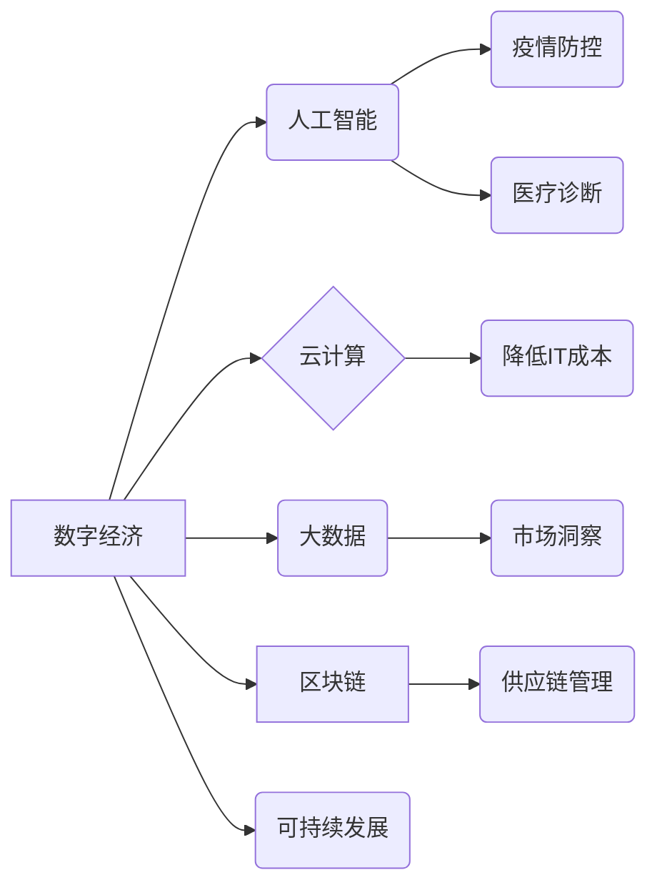

> 疫情、经济复苏、数字经济、人工智能、云计算、大数据、区块链、可持续发展

## 1. 背景介绍

新冠疫情对全球经济造成了前所未有的冲击，导致供应链中断、消费需求萎缩、企业倒闭等一系列问题。疫情也加速了数字化转型进程，推动了远程办公、线上教育、电子商务等领域的快速发展。在疫情后的世界，全球经济复苏面临着诸多挑战，但也孕育着新的机遇。

## 2. 核心概念与联系

**2.1 数字经济**

数字经济是指以数字技术为基础，以数据为核心要素，以网络为主要载体，以智能化和数字化服务为主要特征的经济形态。数字经济的本质是利用信息技术提高生产效率、降低交易成本、创造新的价值。

**2.2 人工智能**

人工智能（AI）是指模拟人类智能行为的计算机系统。AI技术在疫情防控、医疗诊断、物流配送、金融服务等领域发挥着越来越重要的作用。

**2.3 云计算**

云计算是指通过互联网提供计算资源、存储资源、网络资源等服务的模式。云计算可以帮助企业降低IT成本、提高资源利用率、增强业务弹性。

**2.4 大数据**

大数据是指海量、高速、多样化的数据。大数据分析可以帮助企业洞察市场趋势、优化运营策略、提升客户体验。

**2.5 区块链**

区块链是一种分布式账本技术，可以实现数据安全、透明、不可篡改。区块链技术可以应用于供应链管理、金融交易、身份认证等领域。

**2.6 可持续发展**

可持续发展是指满足当前需求，同时不损害后代满足自身需求的能力。数字经济的发展需要遵循可持续发展原则，实现经济增长、社会进步和环境保护的协调发展。

**2.7 核心概念关系图**



## 3. 核心算法原理 & 具体操作步骤

**3.1 算法原理概述**

疫情后的经济复苏需要依靠数据驱动、智能化和协同化等技术手段。一些核心算法，例如机器学习、深度学习、自然语言处理等，可以帮助我们分析疫情数据、预测经济趋势、优化资源配置等。

**3.2 算法步骤详解**

1. **数据收集与预处理:** 收集疫情相关数据，例如确诊病例数、死亡人数、疫苗接种率等，并进行清洗、转换、标准化等预处理操作。
2. **特征提取:** 从原始数据中提取有价值的特征，例如人口密度、医疗资源配置、社会流动性等，这些特征可以反映疫情传播的风险和经济活动的活跃程度。
3. **模型训练:** 使用机器学习算法，例如线性回归、逻辑回归、支持向量机等，对提取的特征进行训练，建立预测模型。
4. **模型评估:** 使用测试数据对模型进行评估，评估模型的准确率、召回率、F1-score等指标。
5. **模型部署:** 将训练好的模型部署到生产环境中，实时预测疫情发展趋势和经济复苏情况。

**3.3 算法优缺点**

**优点:**

* 数据驱动，预测结果更准确。
* 可实时更新，适应疫情变化。
* 可以辅助决策，制定科学的防控和复苏政策。

**缺点:**

* 数据质量对模型准确率影响较大。
* 模型训练需要大量计算资源。
* 模型解释性较差，难以理解预测结果背后的逻辑。

**3.4 算法应用领域**

* 疫情防控: 预测疫情传播趋势、识别高风险人群、优化医疗资源配置。
* 经济复苏: 预测经济增长率、分析消费需求、优化产业结构。
* 社会管理: 预测社会风险、评估政策效果、提高公共服务效率。

## 4. 数学模型和公式 & 详细讲解 & 举例说明

**4.1 数学模型构建**

我们可以使用SIR模型来描述疫情传播过程。SIR模型假设人口分为三个状态：易感者（S）、感染者（I）和恢复者（R）。模型的三个微分方程如下：

```latex
\frac{dS}{dt} = -\beta SI
\frac{dI}{dt} = \beta SI - \gamma I
\frac{dR}{dt} = \gamma I
```

其中，$\beta$ 是感染率，$\gamma$ 是恢复率。

**4.2 公式推导过程**

SIR模型的推导过程基于以下假设：

* 人口总数保持不变。
* 易感者通过与感染者接触感染病毒。
* 感染者在一定时间后恢复。
* 恢复者不再感染病毒。

根据这些假设，我们可以推导出上述三个微分方程。

**4.3 案例分析与讲解**

假设一个封闭社区有1000人，初始时有10人感染病毒。感染率为0.2，恢复率为0.1。我们可以使用SIR模型计算疫情传播过程中的易感者、感染者和恢复者数量的变化趋势。

## 5. 项目实践：代码实例和详细解释说明

**5.1 开发环境搭建**

可以使用Python语言和相关库，例如NumPy、SciPy、Matplotlib等，来实现SIR模型的仿真和分析。

**5.2 源代码详细实现**

```python
import numpy as np
import matplotlib.pyplot as plt

def sir_model(S, I, R, beta, gamma, dt):
    dS = -beta * S * I
    dI = beta * S * I - gamma * I
    dR = gamma * I
    return dS, dI, dR

# 参数设置
N = 1000  # 人口总数
I0 = 10  # 初始感染者数量
beta = 0.2  # 感染率
gamma = 0.1  # 恢复率
dt = 0.1  # 时间步长
t_max = 100  # 模拟时间

# 初始化
S = N - I0
I = I0
R = 0

# 时间步长
t = np.arange(0, t_max, dt)

# SIR模型仿真
S_values = [S]
I_values = [I]
R_values = [R]
for i in range(len(t) - 1):
    dS, dI, dR = sir_model(S, I, R, beta, gamma, dt)
    S += dS * dt
    I += dI * dt
    R += dR * dt
    S_values.append(S)
    I_values.append(I)
    R_values.append(R)

# 绘制SIR模型曲线
plt.plot(t, S_values, label='易感者')
plt.plot(t, I_values, label='感染者')
plt.plot(t, R_values, label='恢复者')
plt.xlabel('时间')
plt.ylabel('人数')
plt.legend()
plt.show()
```

**5.3 代码解读与分析**

这段代码首先定义了SIR模型的微分方程，然后根据给定的参数设置，模拟了疫情传播过程。代码使用NumPy库进行数值计算，使用Matplotlib库绘制了SIR模型曲线。

**5.4 运行结果展示**

运行代码后，会生成一个曲线图，展示了疫情传播过程中的易感者、感染者和恢复者数量的变化趋势。

## 6. 实际应用场景

**6.1 疫情防控**

* 预测疫情传播趋势，帮助政府制定防控政策。
* 识别高风险人群，进行精准防控。
* 优化医疗资源配置，提高医疗服务效率。

**6.2 经济复苏**

* 预测经济增长率，帮助企业制定发展战略。
* 分析消费需求，帮助企业调整生产计划。
* 优化产业结构，促进经济转型升级。

**6.3 社会管理**

* 预测社会风险，帮助政府做好风险防范工作。
* 评估政策效果，帮助政府改进政策措施。
* 提高公共服务效率，改善民生福祉。

**6.4 未来应用展望**

随着人工智能、大数据、云计算等技术的不断发展，数字经济将更加深入地融入到各个领域，为疫情后的全球经济复苏提供更强大的支撑。

## 7. 工具和资源推荐

**7.1 学习资源推荐**

* **在线课程:** Coursera、edX、Udacity等平台提供丰富的机器学习、深度学习、数据分析等课程。
* **书籍:** 《深度学习》、《机器学习实战》、《Python数据科学手册》等书籍。
* **开源项目:** TensorFlow、PyTorch、Scikit-learn等开源项目可以帮助你学习和实践人工智能技术。

**7.2 开发工具推荐**

* **Python:** Python是一种流行的编程语言，广泛应用于数据科学、机器学习等领域。
* **Jupyter Notebook:** Jupyter Notebook是一种交互式编程环境，方便进行数据分析和模型开发。
* **云计算平台:** AWS、Azure、GCP等云计算平台提供强大的计算资源和数据存储服务。

**7.3 相关论文推荐**

* **SIR模型:** Kermack, W. O., & McKendrick, A. G. (1927). A contribution to the mathematical theory of epidemics. Proceedings of the Royal Society of London. Series A, Containing Papers of a Mathematical and Physical Character, 115(772), 700-721.
* **机器学习:** Bishop, C. M. (2006). Pattern recognition and machine learning. Springer.

## 8. 总结：未来发展趋势与挑战

**8.1 研究成果总结**

疫情后的全球经济复苏需要依靠数据驱动、智能化和协同化等技术手段。人工智能、大数据、云计算等技术可以帮助我们分析疫情数据、预测经济趋势、优化资源配置等。

**8.2 未来发展趋势**

* **更精准的预测模型:** 未来，我们将看到更精准的疫情传播预测模型和经济复苏预测模型，能够更准确地反映疫情发展趋势和经济变化。
* **更广泛的应用场景:** 人工智能技术将应用于更多领域，例如医疗、教育、金融、交通等，为疫情后的全球经济复苏提供更广泛的支持。
* **更强的协同能力:** 人工智能技术将与其他技术融合，例如区块链、物联网等，实现更强的协同能力，更好地应对疫情后的挑战。

**8.3 面临的挑战**

* **数据质量问题:** 数据质量对模型准确率影响较大，需要加强数据收集、清洗和标准化工作。
* **算法解释性问题:** 许多人工智能算法的解释性较差，难以理解预测结果背后的逻辑，需要加强算法可解释性的研究。
* **伦理道德问题:** 人工智能技术的发展需要遵循伦理道德原则，避免出现算法偏见、数据隐私泄露等问题。

**8.4 研究展望**

未来，我们需要继续加强人工智能、大数据、云计算等技术的研发，推动数字经济的健康发展，为疫情后的全球经济复苏提供更强大的支撑。


## 9. 附录：常见问题与解答

**9.1 如何评估疫情传播模型的准确性？**

可以使用实际疫情数据与模型预测结果进行比较，评估模型的准确性。常用的评估指标包括准确率、召回率、F1-score等。

**9.2 如何解决数据质量问题？**

需要加强数据收集、清洗和标准化工作，确保数据准确、完整、一致。

**9.3 如何提高算法的可解释性？**

可以使用可解释机器学习算法，例如决策树、线性回归等，或者使用可视化技术，例如SHAP值、LIME等，来解释模型的预测结果。


作者