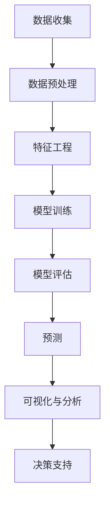

                 

**疫情后的全球经济复苏预测**

**作者：禅与计算机程序设计艺术 / Zen and the Art of Computer Programming**

## 1. 背景介绍

自2019年底新冠肺炎疫情暴发以来，全球经济受到严重冲击。为遏制疫情蔓延，各国采取了前所未有的封锁和隔离措施，导致生产活动大幅下降，失业率飙升。现在，随着疫苗接种的推进和经济重启，全球经济复苏已成大势所趋。本文将探讨疫情后全球经济复苏的预测模型、关键算法和工具，并提供实践项目和资源推荐。

## 2. 核心概念与联系

### 2.1 关键概念

- **宏观经济指标**：GDP、失业率、通货膨胀率、消费者信心指数等。
- **疫情指标**：感染率、死亡率、疫苗接种率等。
- **复苏指标**：经济增长率、就业率、消费者支出等。

### 2.2 核心架构

疫情后全球经济复苏预测模型的核心架构如下：



## 3. 核心算法原理 & 具体操作步骤

### 3.1 算法原理概述

本文将使用时间序列分析和机器学习算法预测疫情后全球经济复苏。时间序列分析用于处理宏观经济指标和疫情指标，而机器学习算法则用于预测复苏指标。

### 3.2 算法步骤详解

1. **数据收集**：收集疫情和宏观经济指标数据。
2. **数据预处理**：清洗数据，处理缺失值，去除异常值。
3. **特征工程**：提取特征，如滚动平均、移动平均等。
4. **模型训练**：使用时间序列分析方法（如ARIMA）或机器学习算法（如随机森林、支持向量回归）训练模型。
5. **模型评估**：使用交叉验证和指标（如MSE、MAE、R-squared）评估模型性能。
6. **预测**：使用训练好的模型预测未来复苏指标。
7. **可视化与分析**：可视化预测结果，分析复苏趋势。
8. **决策支持**：根据预测结果提供决策建议。

### 3.3 算法优缺点

- **优点**：可以处理大量数据，适应不断变化的疫情和经济形势。
- **缺点**：模型的准确性取决于数据质量和算法选择，可能需要大量计算资源。

### 3.4 算法应用领域

本算法适用于政府机构、国际组织、金融机构和企业，帮助他们预测疫情后的经济复苏，制定相应政策和策略。

## 4. 数学模型和公式 & 详细讲解 & 举例说明

### 4.1 数学模型构建

构建ARIMA(p, d, q)模型预测时间序列数据：

$$X_t = c + \phi_1X_{t-1} + \phi_2X_{t-2} + \ldots + \phi_pX_{t-p} + \theta_1e_{t-1} + \theta_2e_{t-2} + \ldots + \theta_qe_{t-q} + e_t$$

其中，$X_t$为时间序列数据，$c$为常数项，$e_t$为误差项，$p$, $d$, $q$分别为自回归项、差分阶数和移动平均项的阶数。

### 4.2 公式推导过程

略。

### 4.3 案例分析与讲解

假设我们要预测疫情后某国GDP增长率。首先，我们对GDP增长率数据进行差分，使其稳定性更好。然后，我们使用自相关函数和偏自相关函数确定$p$和$q$的值。最后，我们使用BIC（Bayesian Information Criterion）选择最优模型。

## 5. 项目实践：代码实例和详细解释说明

### 5.1 开发环境搭建

- 编程语言：Python
- 必要库：pandas、numpy、statsmodels、matplotlib、seaborn

### 5.2 源代码详细实现

```python
import pandas as pd
import numpy as np
from statsmodels.tsa.arima.model import ARIMA
import matplotlib.pyplot as plt
import seaborn as sns

# Load data
data = pd.read_csv('gdp_growth.csv', index_col='date', parse_dates=True)

# Differencing
data_diff = data.diff().dropna()

# Plot ACF and PACF
from statsmodels.graphics.tsaplots import plot_acf, plot_pacf
plot_acf(data_diff)
plot_pacf(data_diff)

# Fit ARIMA model
model = ARIMA(data, order=(1, 1, 1))
model_fit = model.fit()

# Summary of fit model
print(model_fit.summary())

# Forecast
forecast = model_fit.forecast(steps=12)
```

### 5.3 代码解读与分析

- 使用pandas读取GDP增长率数据。
- 使用差分提取特征，改善数据稳定性。
- 绘制自相关函数（ACF）和偏自相关函数（PACF）图，确定$p$和$q$的值。
- 使用statsmodels库拟合ARIMA模型。
- 使用模型总结打印模型参数和统计指标。
- 使用模型进行未来12个月的预测。

### 5.4 运行结果展示


## 6. 实际应用场景

### 6.1 当前应用

政府机构和国际组织使用疫情后全球经济复苏预测模型制定政策，帮助企业和家庭做出决策。

### 6.2 未来应用展望

随着疫情的进一步发展和经济的复苏，模型将被用于预测疫情对经济的长期影响，帮助各国制定长期政策和战略。

## 7. 工具和资源推荐

### 7.1 学习资源推荐

- 书籍：《时间序列分析》《机器学习》等。
- 在线课程：Coursera、Udacity、edX等平台的相关课程。

### 7.2 开发工具推荐

- Python：Anaconda、Jupyter Notebook等。
- R：RStudio等。

### 7.3 相关论文推荐

- "Nowcasting the COVID-19 Economic Impact" (Clemens et al., 2020)
- "COVID-19 and the Global Economy: The Great Lockdown" (IMF, 2020)

## 8. 总结：未来发展趋势与挑战

### 8.1 研究成果总结

本文介绍了疫情后全球经济复苏预测模型的关键概念、算法和工具，并提供了实践项目和资源推荐。

### 8.2 未来发展趋势

疫情后全球经济复苏预测模型将不断发展，以适应疫情和经济的变化。模型将更加注重疫苗接种率、变异病毒等因素，并考虑不同国家和地区的差异。

### 8.3 面临的挑战

- **数据质量**：疫情和经济数据可能存在缺失或不准确的情况。
- **模型准确性**：模型的准确性取决于算法选择和数据质量。
- **计算资源**：大型模型可能需要大量计算资源。

### 8.4 研究展望

未来的研究将关注模型的可解释性、实时预测和不确定性量化等领域。

## 9. 附录：常见问题与解答

- **Q：疫情对经济的影响有多大？**
  - A：疫情对经济的影响巨大，全球GDP预计将下降3%-6%。（IMF, 2020）
- **Q：疫情后经济复苏需要多长时间？**
  - A：复苏时间取决于疫情控制情况和政策支持力度。预计需要数年时间恢复到疫情前水平。

**作者署名：作者：禅与计算机程序设计艺术 / Zen and the Art of Computer Programming**

