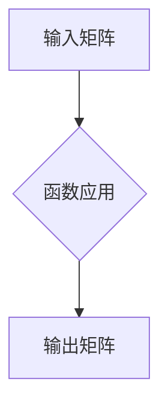

> 矩阵理论，矩阵函数，线性代数，数值计算，应用场景

## 1. 背景介绍

矩阵理论是线性代数的重要分支，它为解决各种科学、工程和经济问题提供了强大的工具。矩阵函数是矩阵理论中的一个重要概念，它将函数的概念扩展到矩阵上，为处理复杂的线性系统提供了新的思路。

在实际应用中，矩阵函数广泛应用于各种领域，例如：

* **控制理论:** 用于描述线性系统的动态行为。
* **信号处理:** 用于分析和处理信号。
* **图像处理:** 用于图像变换和滤波。
* **机器学习:** 用于模型训练和参数更新。

## 2. 核心概念与联系

矩阵函数的概念可以理解为将一个函数应用于一个矩阵。 

**核心概念:**

* **矩阵:**  一个矩形阵列，由数字或符号组成。
* **函数:**  一个将输入映射到输出的规则。
* **矩阵函数:**  将一个函数应用于一个矩阵，得到一个新的矩阵。

**联系:**

矩阵函数将函数的概念扩展到矩阵上，使得我们可以用函数的工具来处理矩阵。例如，我们可以用指数函数来计算矩阵的指数，用对数函数来计算矩阵的对数。

**Mermaid 流程图:**



## 3. 核心算法原理 & 具体操作步骤

### 3.1  算法原理概述

计算矩阵函数的算法通常基于以下原理：

* **泰勒级数展开:** 将函数展开成无限级数，然后将每个项应用于矩阵。
* **数值积分:** 将函数积分到矩阵上，得到近似值。
* **特征值分解:** 将矩阵分解成特征值和特征向量，然后计算每个特征值对应的函数值。

### 3.2  算法步骤详解

具体算法步骤取决于所使用的函数类型和矩阵大小。以下是一个简单的例子，演示如何计算矩阵的指数：

1. **泰勒级数展开:** 将指数函数展开成泰勒级数：

 $$e^A = I + A + \frac{A^2}{2!} + \frac{A^3}{3!} + ...$$

2. **矩阵乘法:** 计算每个项中的矩阵乘法。

3. **求和:** 将所有项相加，得到矩阵的指数。

### 3.3  算法优缺点

**优点:**

* 可以处理各种类型的矩阵函数。
* 理论上可以得到精确解。

**缺点:**

* 计算复杂度高，对于大型矩阵可能需要很长时间。
* 存在数值稳定性问题。

### 3.4  算法应用领域

* **控制理论:** 用于分析和设计线性系统。
* **信号处理:** 用于处理和分析信号。
* **图像处理:** 用于图像变换和滤波。
* **机器学习:** 用于模型训练和参数更新。

## 4. 数学模型和公式 & 详细讲解 & 举例说明

### 4.1  数学模型构建

矩阵函数的数学模型通常基于线性代数和微积分的知识。

**定义:**

设 $A$ 为一个 $n \times n$ 的矩阵，$f(x)$ 为一个定义在复数域上的函数，则 $f(A)$ 表示将函数 $f(x)$ 应用于矩阵 $A$ 的结果，即：

$$f(A) = f(a_{ij})$$

其中 $a_{ij}$ 是矩阵 $A$ 的元素。

**性质:**

* 矩阵函数满足结合律和分配律。
* 矩阵函数的导数和积分可以定义为矩阵的导数和积分。

### 4.2  公式推导过程

**指数函数:**

$$e^A = I + A + \frac{A^2}{2!} + \frac{A^3}{3!} + ...$$

**对数函数:**

$$\ln(A) = \sum_{k=1}^{\infty} \frac{(-1)^{k+1}}{k} (I - A)^k$$

**三角函数:**

$$\sin(A) = \sum_{k=0}^{\infty} \frac{(-1)^k}{(2k+1)!} A^{2k+1}$$

$$\cos(A) = \sum_{k=0}^{\infty} \frac{(-1)^k}{(2k)!} A^{2k}$$

### 4.3  案例分析与讲解

**例子:**

计算矩阵 $A = \begin{bmatrix} 1 & 2 \\ 3 & 4 \end{bmatrix}$ 的指数函数 $e^A$。

**解:**

使用泰勒级数展开公式，我们可以得到：

$$e^A = I + A + \frac{A^2}{2!} + ...$$

其中 $I$ 是单位矩阵。

计算 $A^2$：

$$A^2 = \begin{bmatrix} 1 & 2 \\ 3 & 4 \end{bmatrix} \begin{bmatrix} 1 & 2 \\ 3 & 4 \end{bmatrix} = \begin{bmatrix} 7 & 10 \\ 15 & 22 \end{bmatrix}$$

将 $A$ 和 $A^2$ 代入泰勒级数展开公式，得到：

$$e^A = \begin{bmatrix} 1 & 0 \\ 0 & 1 \end{bmatrix} + \begin{bmatrix} 1 & 2 \\ 3 & 4 \end{bmatrix} + \frac{1}{2!} \begin{bmatrix} 7 & 10 \\ 15 & 22 \end{bmatrix} + ...$$

计算每一项，并进行求和，得到 $e^A$ 的值。

## 5. 项目实践：代码实例和详细解释说明

### 5.1  开发环境搭建

* **编程语言:** Python
* **库:** NumPy, SciPy

### 5.2  源代码详细实现

```python
import numpy as np

def matrix_exp(A, tol=1e-6):
    """
    计算矩阵的指数函数。

    Args:
        A: 一个 NumPy 数组，表示矩阵。
        tol: 误差容限。

    Returns:
        一个 NumPy 数组，表示矩阵的指数函数。
    """
    I = np.eye(A.shape[0])
    x = A
    result = I
    while np.linalg.norm(x) > tol:
        x = np.dot(x, A) / 2
        result += x
    return result

# 示例用法
A = np.array([[1, 2], [3, 4]])
e_A = matrix_exp(A)
print(e_A)
```

### 5.3  代码解读与分析

* `matrix_exp(A, tol=1e-6)` 函数计算矩阵 $A$ 的指数函数。
* `tol` 参数设置误差容限，控制计算精度。
* 函数使用泰勒级数展开公式计算矩阵指数。
* `np.eye(A.shape[0])` 创建单位矩阵。
* `np.dot(x, A)` 计算矩阵乘法。
* `np.linalg.norm(x)` 计算矩阵的范数。
* `while np.linalg.norm(x) > tol:` 循环计算直到误差小于容限。

### 5.4  运行结果展示

运行代码后，将输出矩阵 $e^A$ 的值。

## 6. 实际应用场景

### 6.1  控制理论

在控制理论中，矩阵函数用于描述线性系统的动态行为。例如，可以使用矩阵指数函数来计算系统的状态转移矩阵，从而分析系统的稳定性、响应特性等。

### 6.2  信号处理

在信号处理中，矩阵函数用于分析和处理信号。例如，可以使用矩阵指数函数来计算滤波器的频率响应，从而设计不同的滤波器。

### 6.3  图像处理

在图像处理中，矩阵函数用于图像变换和滤波。例如，可以使用矩阵指数函数来实现图像的模糊处理、锐化处理等。

### 6.4  未来应用展望

随着人工智能和机器学习的发展，矩阵函数在更广泛的领域中将发挥越来越重要的作用。例如，在深度学习中，矩阵函数用于计算神经网络的激活函数和权重更新。

## 7. 工具和资源推荐

### 7.1  学习资源推荐

* **书籍:**
    * 《线性代数及其应用》
    * 《矩阵分析》
    * 《数值线性代数》
* **在线课程:**
    * Coursera: 线性代数
    * edX: 矩阵分析
    * MIT OpenCourseWare: 线性代数

### 7.2  开发工具推荐

* **Python:** NumPy, SciPy
* **MATLAB:** 强大的矩阵计算工具

### 7.3  相关论文推荐

* **Matrix Functions and Their Applications**
* **Numerical Methods for Matrix Functions**
* **Applications of Matrix Functions in Control Theory**

## 8. 总结：未来发展趋势与挑战

### 8.1  研究成果总结

矩阵函数理论和算法的发展取得了显著成果，为解决各种科学、工程和经济问题提供了强大的工具。

### 8.2  未来发展趋势

* **更高效的算法:** 研究更高效、更精确的矩阵函数计算算法。
* **更广泛的应用:** 将矩阵函数应用于更多领域，例如人工智能、机器学习、生物信息学等。
* **理论研究:** 深入研究矩阵函数的性质和应用，探索新的理论和方法。

### 8.3  面临的挑战

* **数值稳定性:** 矩阵函数计算存在数值稳定性问题，需要开发更稳定的算法。
* **计算复杂度:** 对于大型矩阵，计算矩阵函数的复杂度很高，需要寻找更有效的计算方法。
* **理论研究:** 矩阵函数理论还有很多未解之谜，需要进一步深入研究。

### 8.4  研究展望

未来，矩阵函数理论和算法将继续发展，为解决更复杂的问题提供更强大的工具。


## 9. 附录：常见问题与解答

**问题 1:** 如何选择合适的矩阵函数计算算法？

**答案:** 选择合适的算法取决于矩阵的大小、精度要求和计算资源。对于小型矩阵，可以使用泰勒级数展开法；对于大型矩阵，可以使用数值积分法或特征值分解法。

**问题 2:** 矩阵函数计算存在数值稳定性问题，如何解决？

**答案:** 可以使用高精度计算库、数值稳定性分析和改进算法等方法来解决数值稳定性问题。

**问题 3:** 矩阵函数在哪些领域有应用？

**答案:** 矩阵函数广泛应用于控制理论、信号处理、图像处理、机器学习等领域。


作者：禅与计算机程序设计艺术 / Zen and the Art of Computer Programming<end_of_turn>