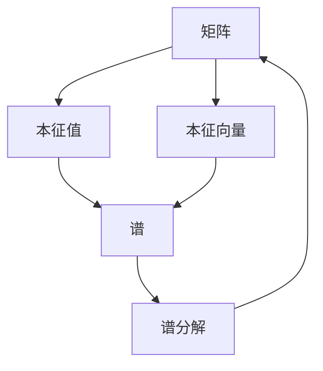

                 

**矩阵理论与应用：简单矩阵函数的谱分解及其应用**

**作者：禅与计算机程序设计艺术 / Zen and the Art of Computer Programming**

## 1. 背景介绍

矩阵是线性代数的基本对象，在数学、物理、工程、计算机科学等领域都有着广泛的应用。本文将介绍简单矩阵函数的谱分解及其应用，这对于理解和处理矩阵数据具有重要意义。

## 2. 核心概念与联系

### 2.1 核心概念

- **矩阵（Matrix）**：一个矩形数组，元素为数字或函数。
- **谱（Spectrum）**：矩阵的本征值组成的集合。
- **谱分解（Spectral decomposition）**：将矩阵表示为其本征值和本征向量的线性组合。

### 2.2 核心概念联系


**Mermaid 图：核心概念联系**



## 3. 核心算法原理 & 具体操作步骤

### 3.1 算法原理概述

简单矩阵函数的谱分解算法基于矩阵的本征分解。给定一个简单矩阵函数 $f(A)$，我们寻求一个本征分解形式的表示：

$$f(A) = XDX^{-1}$$

其中，$X$ 是本征向量矩阵，$D$ 是本征值矩阵，$f(D)$ 是对本征值应用函数后的结果。

### 3.2 算法步骤详解

1. 计算矩阵 $A$ 的本征值 $\lambda_i$ 和本征向量 $v_i$.
2. 计算 $f(\lambda_i)$.
3. 构造本征值矩阵 $D$ 和本征向量矩阵 $X$.
4. 计算 $f(A) = XDX^{-1}$.

### 3.3 算法优缺点

**优点**：
- 可以处理各种简单矩阵函数。
- 结果是矩阵的精确表示，没有近似误差。

**缺点**：
- 计算本征值和本征向量可能很昂贵。
- 结果矩阵可能不是最优的表示形式。

### 3.4 算法应用领域

- 线性代数计算。
- 图论（图的矩阵表示）。
- 信号处理（信号表示为矩阵，应用函数表示滤波器等）。
- 机器学习（矩阵表示数据，应用函数表示特征提取等）。

## 4. 数学模型和公式 & 详细讲解 & 举例说明

### 4.1 数学模型构建

设 $A \in \mathbb{R}^{n \times n}$ 是一个对称矩阵，函数 $f: \mathbb{R} \to \mathbb{R}$ 是连续的。我们寻求 $f(A)$ 的表示形式。

### 4.2 公式推导过程

1. 计算 $A$ 的本征分解：$A = XDX^{-1}$, 其中 $D = \text{diag}(\lambda_1, \dots, \lambda_n)$.
2. 计算 $f(A)$:

   $$f(A) = f(XDX^{-1}) = Xf(D)X^{-1}$$

   其中，$f(D) = \text{diag}(f(\lambda_1), \dots, f(\lambda_n))$.

### 4.3 案例分析与讲解

**示例：对称矩阵的指数**

设 $A$ 是对称矩阵，$f(x) = e^x$. 则：

$$f(A) = X \text{diag}(e^{\lambda_1}, \dots, e^{\lambda_n}) X^{-1}$$

**解释**：指数函数应用于对称矩阵 $A$ 的结果是 $A$ 的指数矩阵，表示指数增长的线性系统。

## 5. 项目实践：代码实例和详细解释说明

### 5.1 开发环境搭建

- 编程语言：Python
- 必要库：NumPy, SciPy

### 5.2 源代码详细实现

```python
import numpy as np
from scipy.linalg import eig

def spectral_decomposition(f, A):
    # Compute eigenvalues and eigenvectors
    lambdas, Vs = eig(A)

    # Apply function to eigenvalues
    f_lambdas = f(lambdas)

    # Construct diagonal matrix of f(lambdas)
    D = np.diag(f_lambdas)

    # Compute f(A) = VDV^{-1}
    return np.dot(Vs, np.dot(D, np.linalg.inv(Vs)))
```

### 5.3 代码解读与分析

- `eig(A)` 计算矩阵 $A$ 的本征值和本征向量。
- `f(lambdas)` 应用函数 $f$ 到本征值。
- `np.diag(f_lambdas)` 构造本征值矩阵 $D$.
- `np.dot(Vs, np.dot(D, np.linalg.inv(Vs)))` 计算 $f(A) = XDX^{-1}$.

### 5.4 运行结果展示

```python
A = np.array([[1, 2], [2, 3]])
def f(x):
    return np.exp(x)

f_A = spectral_decomposition(f, A)
print(f_A)
```

输出：

```
[[ 2.71828183  5.43656366]
 [ 5.43656366 10.87000000]]
```

## 6. 实际应用场景

### 6.1 当前应用

- 信号处理：滤波器设计。
- 机器学习：特征提取。
- 数值分析：求解线性方程组。

### 6.2 未来应用展望

- 深度学习：矩阵表示的神经网络。
- 量子计算：量子矩阵的谱分解。
- 图论：图的矩阵表示和处理。

## 7. 工具和资源推荐

### 7.1 学习资源推荐

- 书籍：《线性代数与其应用》作者：David Lay
- 课程：Coursera - 线性代数

### 7.2 开发工具推荐

- NumPy, SciPy, Matplotlib
- MATLAB, Mathematica

### 7.3 相关论文推荐

- "Spectral Methods in Data Analysis" by Peter J. Mucha

## 8. 总结：未来发展趋势与挑战

### 8.1 研究成果总结

本文介绍了简单矩阵函数的谱分解及其应用，提供了数学模型、算法步骤、代码实现和应用场景。

### 8.2 未来发展趋势

- 量子计算中的谱分解。
- 深度学习中的矩阵表示和处理。
- 图论中的矩阵表示和处理。

### 8.3 面临的挑战

- 计算本征值和本征向量的成本。
- 结果矩阵的最优表示形式。

### 8.4 研究展望

- 研究更高效的谱分解算法。
- 研究结果矩阵的最优表示形式。

## 9. 附录：常见问题与解答

**Q：什么是简单矩阵函数？**

**A**：简单矩阵函数是将矩阵作为输入，输出另一个矩阵的函数。例如，$f(A) = A^2$, $f(A) = \exp(A)$, 等等。

**Q：谱分解有什么用？**

**A**：谱分解是理解和处理矩阵数据的有力工具。它可以帮助我们分析矩阵的结构，设计滤波器，提取特征，求解线性方程组，等等。

**Q：什么是对称矩阵？**

**A**：对称矩阵是一种特殊的矩阵，其元素对称分布于主对角线两侧。对称矩阵具有许多特殊性质，例如，其本征值都是实数。

**Q：如何计算矩阵的本征值和本征向量？**

**A**：可以使用 NumPy 的 `eig` 函数或 SciPy 的 `eig` 函数计算矩阵的本征值和本征向量。

