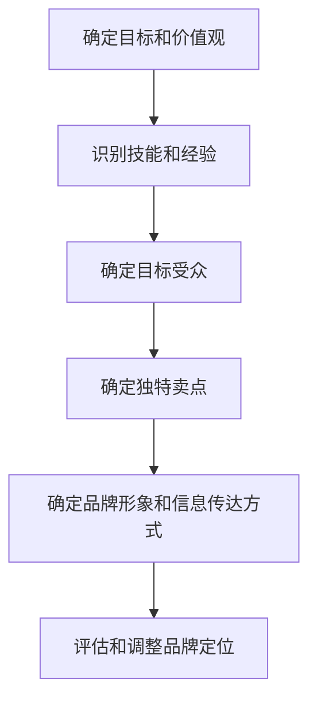

                 

## 1. 背景介绍

在当今竞争激烈的职场环境中，建立个人品牌已成为一种必需。个人品牌是你在职业生涯中积累的声誉和名望，它有助于你在市场上脱颖而出，吸引雇主、客户和合作伙伴。然而，建立个人品牌并非易事，它需要清晰的定位和明确的目标。本文将指导你如何确立个人品牌定位，明确你要解决的问题。

## 2. 核心概念与联系

### 2.1 个人品牌的定义

个人品牌是指个体在职业生涯中积累的声誉和名望，它反映了个体的技能、经验、价值观和个性。个人品牌是个体与雇主、客户和合作伙伴之间的信任和关系的基础。

### 2.2 个人品牌定位的重要性

个人品牌定位有助于个体在市场上脱颖而出，吸引雇主、客户和合作伙伴。它有助于个体明确自己的目标和方向，并帮助个体在市场上建立信誉和名望。

### 2.3 个人品牌定位的过程

个人品牌定位的过程包括以下几个步骤：

1. 确定你的目标和价值观
2. 识别你的技能和经验
3. 确定你的目标受众
4. 确定你的独特卖点（Unique Selling Proposition，USP）
5. 确定你的品牌形象和信息传达方式
6. 评估和调整你的品牌定位

### 2.4 个人品牌定位的联系

个人品牌定位与市场营销、沟通和人际关系密切相关。它需要个体理解市场需求，有效沟通，并建立良好的人际关系。个人品牌定位还与个体的职业发展密切相关，它有助于个体明确自己的目标和方向，并帮助个体在市场上建立信誉和名望。

## 3. 核心算法原理 & 具体操作步骤

### 3.1 算法原理概述

个人品牌定位算法基于市场营销和沟通原理。它需要个体理解市场需求，识别自己的技能和经验，确定自己的目标受众，并有效沟通自己的品牌形象。

### 3.2 算法步骤详解

#### 3.2.1 确定你的目标和价值观

1. 列出你的短期和长期职业目标
2. 列出你的核心价值观和信念
3. 确定你的目标和价值观是否一致

#### 3.2.2 识别你的技能和经验

1. 列出你的技能和经验
2. 评估你的技能和经验是否与你的目标和价值观一致
3. 确定你的核心竞争力

#### 3.2.3 确定你的目标受众

1. 识别你的目标受众（雇主、客户、合作伙伴等）
2. 理解你的目标受众的需求和期望
3. 确定你的目标受众与你的技能和经验是否匹配

#### 3.2.4 确定你的独特卖点（USP）

1. 列出你的技能和经验中独特的方面
2. 确定这些独特方面如何满足你的目标受众的需求
3. 确定你的USP是否清晰明确，并能够区分你与竞争对手

#### 3.2.5 确定你的品牌形象和信息传达方式

1. 确定你的品牌形象，包括视觉元素（如Logo、颜色等）和非视觉元素（如语调、价值观等）
2. 确定你的信息传达方式，包括网站、社交媒体、简历等
3. 确保你的品牌形象和信息传达方式与你的目标受众匹配

#### 3.2.6 评估和调整你的品牌定位

1. 定期评估你的品牌定位是否有效
2. 调整你的品牌定位以适应市场变化
3. 寻求反馈并不断改进

### 3.3 算法优缺点

优点：

* 有助于个体明确自己的目标和方向
* 有助于个体在市场上建立信誉和名望
* 有助于个体吸引雇主、客户和合作伙伴

缺点：

* 需要大量时间和精力
* 需要个体具有良好的沟通和市场营销技能
* 需要个体不断调整和改进自己的品牌定位

### 3.4 算法应用领域

个人品牌定位算法适用于各个行业和领域，包括但不限于：

* 商业和管理
* 信息技术
* 设计和创意
* 媒体和传播
* 教育和培训

## 4. 数学模型和公式 & 详细讲解 & 举例说明

### 4.1 数学模型构建

个人品牌定位模型可以表示为以下公式：

$$P = f(T, S, A, U, B)$$

其中：

* $P$ 表示个人品牌
* $T$ 表示个体的目标和价值观
* $S$ 表示个体的技能和经验
* $A$ 表示个体的目标受众
* $U$ 表示个体的独特卖点（USP）
* $B$ 表示个体的品牌形象和信息传达方式

### 4.2 公式推导过程

个人品牌定位模型是基于市场营销和沟通原理推导而来的。个体的目标和价值观、技能和经验、目标受众、独特卖点和品牌形象和信息传达方式共同决定了个体的个人品牌。

### 4.3 案例分析与讲解

例如，一名软件工程师想要建立个人品牌，吸引雇主。她的目标是成为一名资深软件工程师，她的核心价值观是创新和卓越。她的技能包括编程、调试和项目管理。她的目标受众是软件公司的雇主。她的独特卖点是她的创新能力和卓越的编程技能。她的品牌形象是专业、创新和可靠。她的信息传达方式包括她的个人网站、简历和社交媒体账号。通过有效地传达她的品牌形象，她成功地吸引了雇主，并找到了一份理想的工作。

## 5. 项目实践：代码实例和详细解释说明

### 5.1 开发环境搭建

个人品牌定位项目需要的开发环境包括：

* 文本编辑器（如Visual Studio Code）
* 网站建设工具（如WordPress）
* 图像编辑工具（如Adobe Photoshop）
* 社交媒体账号（如LinkedIn、Twitter）

### 5.2 源代码详细实现

个人品牌定位项目的源代码包括：

* 个人网站的源代码（HTML、CSS、JavaScript）
* 简历的源代码（Word、PDF）
* 社交媒体账号的源代码（如LinkedIn、Twitter的个人资料页面）

### 5.3 代码解读与分析

个人品牌定位项目的代码需要反映个体的品牌形象和信息传达方式。例如，个人网站的源代码需要反映个体的品牌形象，包括视觉元素（如Logo、颜色等）和非视觉元素（如语调、价值观等）。简历的源代码需要反映个体的技能和经验，并突出个体的独特卖点。社交媒体账号的源代码需要反映个体的品牌形象和信息传达方式。

### 5.4 运行结果展示

个人品牌定位项目的运行结果包括：

* 个体的个人网站
* 个体的简历
* 个体的社交媒体账号

## 6. 实际应用场景

### 6.1 个人品牌定位在求职中的应用

个人品牌定位在求职中有着广泛的应用。它有助于个体明确自己的目标和方向，并帮助个体在市场上建立信誉和名望。个体可以通过个人网站、简历和社交媒体账号有效地传达自己的品牌形象，吸引雇主。

### 6.2 个人品牌定位在创业中的应用

个人品牌定位在创业中也有着广泛的应用。它有助于创业者明确自己的目标和方向，并帮助创业者在市场上建立信誉和名望。创业者可以通过个人网站、社交媒体账号和公关活动有效地传达自己的品牌形象，吸引客户和合作伙伴。

### 6.3 未来应用展望

未来，个人品牌定位将继续成为一种必需。随着技术的发展，个体将需要不断调整和改进自己的品牌定位，以适应市场变化。个体将需要更加有效地传达自己的品牌形象，并建立更加强大的网络和人际关系。

## 7. 工具和资源推荐

### 7.1 学习资源推荐

* "个人品牌定位：明确你要解决的问题"（本文）
* "个人品牌定位：从无到有"（网络视频）
* "个人品牌定位：实践指南"（网络视频）
* "个人品牌定位：案例分析"（网络视频）

### 7.2 开发工具推荐

* 文本编辑器：Visual Studio Code
* 网站建设工具：WordPress
* 图像编辑工具：Adobe Photoshop
* 社交媒体账号：LinkedIn、Twitter

### 7.3 相关论文推荐

* "个人品牌定位的理论基础"（学术论文）
* "个人品牌定位的实践应用"（学术论文）
* "个人品牌定位的未来发展趋势"（学术论文）

## 8. 总结：未来发展趋势与挑战

### 8.1 研究成果总结

个人品牌定位是个体在职业生涯中积累的声誉和名望，它有助于个体在市场上脱颖而出，吸引雇主、客户和合作伙伴。个人品牌定位需要个体明确自己的目标和方向，并有效地传达自己的品牌形象。个人品牌定位是一个持续的过程，需要个体不断调整和改进自己的品牌定位。

### 8.2 未来发展趋势

未来，个人品牌定位将继续成为一种必需。随着技术的发展，个体将需要不断调整和改进自己的品牌定位，以适应市场变化。个体将需要更加有效地传达自己的品牌形象，并建立更加强大的网络和人际关系。

### 8.3 面临的挑战

个人品牌定位面临的挑战包括：

* 需要大量时间和精力
* 需要个体具有良好的沟通和市场营销技能
* 需要个体不断调整和改进自己的品牌定位

### 8.4 研究展望

未来的研究将关注个人品牌定位的新趋势和新挑战。研究将关注个体如何在数字化环境中建立个人品牌，如何利用社交媒体和其他数字渠道传达自己的品牌形象。研究还将关注个人品牌定位的跨文化应用，个体如何在不同文化背景下建立个人品牌。

## 9. 附录：常见问题与解答

**Q1：个人品牌定位需要多长时间？**

A1：个人品牌定位是一个持续的过程，需要个体不断调整和改进自己的品牌定位。因此，个人品牌定位没有固定的时间长度。

**Q2：个人品牌定位需要花费多少钱？**

A2：个人品牌定位需要一定的成本，包括网站建设、图像编辑和社交媒体账号维护等。成本因个体的需求和目标受众而异。

**Q3：个人品牌定位适合所有人吗？**

A3：个人品牌定位适合所有个体，无论他们是求职者、创业者还是已有工作的人。个人品牌定位有助于个体明确自己的目标和方向，并帮助个体在市场上建立信誉和名望。

**Q4：个人品牌定位需要什么技能？**

A4：个人品牌定位需要个体具有良好的沟通和市场营销技能。个体需要能够有效地传达自己的品牌形象，并建立良好的人际关系。

**Q5：个人品牌定位有什么风险？**

A5：个人品牌定位的风险包括个体无法有效地传达自己的品牌形象，个体的品牌定位与市场需求不匹配，个体的品牌定位无法持续吸引雇主、客户和合作伙伴。

## 作者：禅与计算机程序设计艺术 / Zen and the Art of Computer Programming

