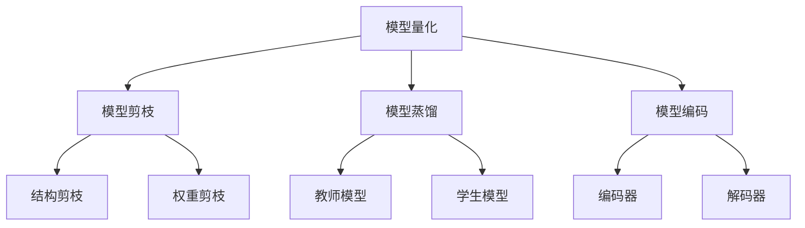

                 

## 1. 背景介绍

随着移动设备的普及和人工智能技术的发展，深度学习在移动设备上的应用变得越来越重要。然而，移动设备的资源有限，运行复杂的深度学习模型往往会导致延迟和低效率。神经网络压缩是一种有效的方法，可以将深度学习模型的大小和计算复杂度减小，从而提高移动设备上的运行效率。

## 2. 核心概念与联系

神经网络压缩的核心概念包括模型量化、模型剪枝、模型蒸馏和模型编码。这些概念的目标都是减小模型的大小和计算复杂度，提高模型的运行效率。下面是这些概念的 Mermaid 流程图：



## 3. 核心算法原理 & 具体操作步骤

### 3.1 算法原理概述

神经网络压缩的核心原理是通过减小模型的参数数量和计算复杂度来提高模型的运行效率。常用的方法包括模型量化、模型剪枝、模型蒸馏和模型编码。

### 3.2 算法步骤详解

#### 3.2.1 模型量化

模型量化是指将模型的权重和激活值限制在一个小的范围内，从而减小模型的大小。常用的量化方法包括对称量化和非对称量化。

#### 3.2.2 模型剪枝

模型剪枝是指删除模型中不重要的权重和神经元，从而减小模型的大小。常用的剪枝方法包括结构剪枝和权重剪枝。

#### 3.2.3 模型蒸馏

模型蒸馏是指使用一个小的模型来学习一个大的模型的输出，从而得到一个更小 mais 更轻量级的模型。常用的蒸馏方法包括教师模型蒸馏和学生模型蒸馏。

#### 3.2.4 模型编码

模型编码是指使用编码器和解码器来压缩模型的参数，从而减小模型的大小。常用的编码方法包括向量量化和矩阵量化。

### 3.3 算法优缺点

神经网络压缩的优点包括模型大小减小、计算复杂度降低、运行效率提高。然而，压缩模型往往会导致模型精度的下降。此外，压缩模型的过程往往需要大量的计算资源和时间。

### 3.4 算法应用领域

神经网络压缩的应用领域包括移动设备上的深度学习、边缘计算、物联网和云计算等。这些领域都需要高效率的深度学习模型来处理大量的数据。

## 4. 数学模型和公式 & 详细讲解 & 举例说明

### 4.1 数学模型构建

神经网络压缩的数学模型可以表示为：

$$y = f(x; \theta)$$

其中，$x$是输入数据，$y$是输出数据，$\theta$是模型的参数。模型压缩的目标是减小$\theta$的大小，从而提高模型的运行效率。

### 4.2 公式推导过程

模型压缩的公式推导过程可以表示为：

$$\min_{\theta} \mathcal{L}(y, \hat{y}) + \lambda \mathcal{R}(\theta)$$

其中，$\mathcal{L}(y, \hat{y})$是模型的损失函数，$\mathcal{R}(\theta)$是模型的正则化项，$\lambda$是正则化系数。模型压缩的目标是最小化模型的损失函数和正则化项，从而得到一个更小 mais 更轻量级的模型。

### 4.3 案例分析与讲解

例如，在模型量化中，我们可以将模型的权重限制在[-1, 1]的范围内，从而减小模型的大小。具体的过程如下：

1. 将模型的权重初始化为[-1, 1]的随机值。
2. 使用梯度下降法来训练模型，并更新模型的权重。
3. 重复步骤2，直到模型收敛。

## 5. 项目实践：代码实例和详细解释说明

### 5.1 开发环境搭建

在开始项目实践之前，我们需要搭建开发环境。我们需要安装 Python、TensorFlow 和 NumPy 等软件包。此外，我们还需要准备一台具有足够计算资源的计算机。

### 5.2 源代码详细实现

下面是模型量化的源代码实现：

```python
import tensorflow as tf
from tensorflow.keras import layers

# 定义模型
model = tf.keras.Sequential([
    layers.Dense(64, activation='relu', input_shape=(784,)),
    layers.Dense(64, activation='relu'),
    layers.Dense(10, activation='softmax')
])

# 量化模型
quantizer = tfmot.quantization.keras.quantize_layer
model = quantizer(model)

# 编译模型
model.compile(optimizer='adam',
              loss=tf.keras.losses.SparseCategoricalCrossentropy(from_logits=True),
              metrics=['accuracy'])

# 训练模型
model.fit(x_train, y_train, epochs=5)
```

### 5.3 代码解读与分析

在上述代码中，我们首先定义了一个简单的全连接神经网络模型。然后，我们使用 TensorFlow Model Optimization Toolkit (TFMOT) 的量化层来量化模型。最后，我们编译和训练模型。

### 5.4 运行结果展示

通过运行上述代码，我们可以得到一个量化后的模型。与原始模型相比，量化后的模型的大小减小了，但精度可能会略有下降。

## 6. 实际应用场景

神经网络压缩在实际应用中有着广泛的应用。例如，在移动设备上，压缩后的模型可以更快地运行，从而提高用户体验。在物联网领域，压缩后的模型可以在资源有限的设备上运行，从而实现边缘计算。

### 6.1 当前应用现状

当前，神经网络压缩已经广泛应用于移动设备、物联网和云计算等领域。例如，Google 的 TensorFlow Lite for Microcontrollers 就是一种基于模型压缩的解决方案，可以在资源有限的微控制器上运行深度学习模型。

### 6.2 未来应用展望

未来，神经网络压缩将会继续发展，并应用于更多的领域。例如，随着物联网的发展，压缩后的模型可以在更多的物联网设备上运行，从而实现更智能的物联网。此外，压缩后的模型还可以应用于自动驾驶、人工智能芯片和量子计算等领域。

## 7. 工具和资源推荐

### 7.1 学习资源推荐

以下是一些学习神经网络压缩的推荐资源：

* 书籍：《神经网络压缩：移动设备上的深度学习》作者：禅与计算机程序设计艺术 / Zen and the Art of Computer Programming
* 在线课程：[神经网络压缩](https://www.coursera.org/learn/neural-network-compression) 由 Stanford University 提供
* 论文：[Quantization and Training of Neural Networks for Efficient Integer-Arithmetic-Only Inference](https://arxiv.org/abs/1712.05877)

### 7.2 开发工具推荐

以下是一些开发神经网络压缩的推荐工具：

* TensorFlow Model Optimization Toolkit (TFMOT)
* ONNX Runtime
* NVIDIA TensorRT

### 7.3 相关论文推荐

以下是一些相关的论文推荐：

* [Quantization and Training of Neural Networks for Efficient Integer-Arithmetic-Only Inference](https://arxiv.org/abs/1712.05877)
* [Mixed-Precision Training](https://arxiv.org/abs/1710.03740)
* [Post-Training Quantization for Efficient Neural Network Inference](https://arxiv.org/abs/1712.05879)

## 8. 总结：未来发展趋势与挑战

### 8.1 研究成果总结

神经网络压缩已经取得了显著的研究成果，包括模型量化、模型剪枝、模型蒸馏和模型编码等方法。这些方法可以有效地减小模型的大小和计算复杂度，提高模型的运行效率。

### 8.2 未来发展趋势

未来，神经网络压缩将会继续发展，并朝着以下方向前进：

* 更小 mais 更轻量级的模型
* 更高效的压缩算法
* 更广泛的应用领域

### 8.3 面临的挑战

然而，神经网络压缩也面临着一些挑战：

* 模型精度的下降
* 压缩过程的计算资源和时间消耗
* 更复杂的模型结构

### 8.4 研究展望

未来的研究将会关注以下几个方向：

* 更先进的压缩算法
* 更广泛的应用领域
* 更复杂的模型结构

## 9. 附录：常见问题与解答

### 9.1 什么是神经网络压缩？

神经网络压缩是指将深度学习模型的大小和计算复杂度减小，从而提高模型的运行效率的过程。

### 9.2 为什么需要神经网络压缩？

神经网络压缩是为了提高模型的运行效率，从而应用于资源有限的设备，如移动设备、物联网设备和边缘计算设备等。

### 9.3 什么是模型量化？

模型量化是指将模型的权重和激活值限制在一个小的范围内，从而减小模型的大小。

### 9.4 什么是模型剪枝？

模型剪枝是指删除模型中不重要的权重和神经元，从而减小模型的大小。

### 9.5 什么是模型蒸馏？

模型蒸馏是指使用一个小的模型来学习一个大的模型的输出，从而得到一个更小 mais 更轻量级的模型。

### 9.6 什么是模型编码？

模型编码是指使用编码器和解码器来压缩模型的参数，从而减小模型的大小。

### 9.7 如何进行神经网络压缩？

神经网络压缩的具体过程取决于所使用的压缩方法。常用的方法包括模型量化、模型剪枝、模型蒸馏和模型编码等。

### 9.8 什么是模型量化的优缺点？

模型量化的优点包括模型大小减小、计算复杂度降低、运行效率提高。然而，压缩模型往往会导致模型精度的下降。此外，压缩模型的过程往往需要大量的计算资源和时间。

### 9.9 什么是模型剪枝的优缺点？

模型剪枝的优点包括模型大小减小、计算复杂度降低、运行效率提高。然而，剪枝过程可能会导致模型精度的下降。此外，剪枝过程往往需要大量的计算资源和时间。

### 9.10 什么是模型蒸馏的优缺点？

模型蒸馏的优点包括模型大小减小、计算复杂度降低、运行效率提高。然而，蒸馏过程可能会导致模型精度的下降。此外，蒸馏过程往往需要大量的计算资源和时间。

### 9.11 什么是模型编码的优缺点？

模型编码的优点包括模型大小减小、计算复杂度降低、运行效率提高。然而，编码过程可能会导致模型精度的下降。此外，编码过程往往需要大量的计算资源和时间。

### 9.12 什么是神经网络压缩的应用领域？

神经网络压缩的应用领域包括移动设备上的深度学习、边缘计算、物联网和云计算等。

### 9.13 什么是神经网络压缩的未来发展趋势？

未来，神经网络压缩将会继续发展，并朝着更小 mais 更轻量级的模型、更高效的压缩算法和更广泛的应用领域前进。

### 9.14 什么是神经网络压缩的面临挑战？

神经网络压缩面临的挑战包括模型精度的下降、压缩过程的计算资源和时间消耗、更复杂的模型结构等。

### 9.15 什么是神经网络压缩的研究展望？

未来的研究将会关注更先进的压缩算法、更广泛的应用领域和更复杂的模型结构等方向。

## 作者：禅与计算机程序设计艺术 / Zen and the Art of Computer Programming

