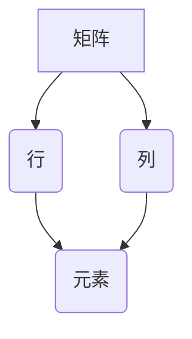

> 矩阵理论，线性代数，矩阵运算，特征值，特征向量，矩阵分解，应用场景

## 1. 背景介绍

矩阵理论是线性代数的重要分支，它以矩阵为基本对象，研究矩阵的性质、运算和应用。矩阵理论在数学、物理、工程、计算机科学等领域有着广泛的应用。

从微积分到机器学习，从图像处理到数据分析，矩阵理论无处不在。它为我们提供了简洁、高效的工具来描述和解决各种复杂问题。

## 2. 核心概念与联系

**2.1 矩阵定义**

矩阵是一个按照一定规律排列的数的集合，通常用方括号表示。



**2.2 矩阵运算**

矩阵之间可以进行加法、减法、数乘、矩阵乘法等运算。

* **加法和减法:** 对应位置的元素相加或相减。
* **数乘:** 每个元素乘以一个数。
* **矩阵乘法:** 两个矩阵相乘，需要满足一定的条件，结果是一个新的矩阵。

**2.3 矩阵的性质**

矩阵具有许多重要的性质，例如：

* **交换律:** 矩阵乘法不满足交换律，即 AB ≠ BA。
* **结合律:** 矩阵乘法满足结合律，即 (AB)C = A(BC)。
* **分配律:** 矩阵乘法满足分配律，即 A(B + C) = AB + AC。

## 3. 核心算法原理 & 具体操作步骤

**3.1 算法原理概述**

矩阵分解是一种将一个矩阵分解成多个简单矩阵的方法。常见的矩阵分解方法包括：

* **LU分解:** 将一个矩阵分解成一个下三角矩阵和一个上三角矩阵。
* **QR分解:** 将一个矩阵分解成一个正交矩阵和一个上三角矩阵。
* **奇异值分解 (SVD):** 将一个矩阵分解成三个矩阵，其中一个矩阵是正交矩阵，另一个矩阵是上三角矩阵，第三个矩阵是正交矩阵。

**3.2 算法步骤详解**

**3.2.1 LU分解**

1. 将矩阵 A 分解成一个下三角矩阵 L 和一个上三角矩阵 U。
2. 使用高斯消元法逐步将 A 变为 U，同时记录每次操作的变换矩阵，这些变换矩阵组成 L。

**3.2.2 QR分解**

1. 使用 Gram-Schmidt 正交化过程将矩阵 A 的列向量正交化，得到一个正交矩阵 Q。
2. 将 Q 与 A 相乘，得到一个上三角矩阵 R。

**3.2.3 奇异值分解 (SVD)**

1. 计算矩阵 A 的奇异值和奇异向量。
2. 将奇异值和奇异向量组成三个矩阵 U、Σ 和 V。
3. 则 A = UΣV<sup>T</sup>。

**3.3 算法优缺点**

**3.3.1 LU分解**

* **优点:** 算法简单，易于实现。
* **缺点:** 对于某些矩阵，可能导致数值不稳定。

**3.3.2 QR分解**

* **优点:** 算法稳定，适用于各种矩阵。
* **缺点:** 算法复杂度较高。

**3.3.3 奇异值分解 (SVD)**

* **优点:** 能够分解出矩阵的本质特征，具有广泛的应用。
* **缺点:** 算法复杂度较高。

**3.4 算法应用领域**

* **线性方程组求解:** LU分解和 QR分解可以用于求解线性方程组。
* **特征值和特征向量计算:** SVD可以用于计算矩阵的特征值和特征向量。
* **数据压缩和降维:** SVD可以用于数据压缩和降维。
* **图像处理和计算机视觉:** SVD可以用于图像处理和计算机视觉任务，例如图像压缩、去噪和特征提取。

## 4. 数学模型和公式 & 详细讲解 & 举例说明

**4.1 数学模型构建**

矩阵理论的核心是矩阵的定义、运算和性质。

* **矩阵定义:** 一个 m × n 的矩阵 A 可以表示为：

$$
A = \begin{bmatrix}
a_{11} & a_{12} & \cdots & a_{1n} \\
a_{21} & a_{22} & \cdots & a_{2n} \\
\vdots & \vdots & \ddots & \vdots \\
a_{m1} & a_{m2} & \cdots & a_{mn}
\end{bmatrix}
$$

其中， a<sub>ij</sub> 表示矩阵 A 中第 i 行第 j 列的元素。

* **矩阵运算:** 矩阵之间可以进行加法、减法、数乘、矩阵乘法等运算。

**4.2 公式推导过程**

**4.2.1 矩阵加法和减法**

两个矩阵 A 和 B 相加或相减，对应位置的元素相加或相减。

$$
A + B = \begin{bmatrix}
a_{11} + b_{11} & a_{12} + b_{12} & \cdots & a_{1n} + b_{1n} \\
a_{21} + b_{21} & a_{22} + b_{22} & \cdots & a_{2n} + b_{2n} \\
\vdots & \vdots & \ddots & \vdots \\
a_{m1} + b_{m1} & a_{m2} + b_{m2} & \cdots & a_{mn} + b_{mn}
\end{bmatrix}
$$

**4.2.2 矩阵数乘**

一个矩阵 A 和一个数 k 相乘，每个元素乘以 k。

$$
kA = \begin{bmatrix}
ka_{11} & ka_{12} & \cdots & ka_{1n} \\
ka_{21} & ka_{22} & \cdots & ka_{2n} \\
\vdots & \vdots & \ddots & \vdots \\
ka_{m1} & ka_{m2} & \cdots & ka_{mn}
\end{bmatrix}
$$

**4.2.3 矩阵乘法**

两个矩阵 A 和 B 相乘，需要满足一定的条件，结果是一个新的矩阵 C。

$$
C = AB = \begin{bmatrix}
c_{11} & c_{12} & \cdots & c_{1n} \\
c_{21} & c_{22} & \cdots & c_{2n} \\
\vdots & \vdots & \ddots & \vdots \\
c_{m1} & c_{m2} & \cdots & c_{mn}
\end{bmatrix}
$$

其中， c<sub>ij</sub> = a<sub>i1</sub>b<sub>1j</sub> + a<sub>i2</sub>b<sub>2j</sub> + ... + a<sub>in</sub>b<sub>nj</sub>。

**4.3 案例分析与讲解**

**4.3.1 矩阵加法**

```
A = \begin{bmatrix}
1 & 2 \\
3 & 4
\end{bmatrix}
B = \begin{bmatrix}
5 & 6 \\
7 & 8
\end{bmatrix}
```

则 A + B =

```
\begin{bmatrix}
1+5 & 2+6 \\
3+7 & 4+8
\end{bmatrix}
= \begin{bmatrix}
6 & 8 \\
10 & 12
\end{bmatrix}
```

**4.3.2 矩阵乘法**

```
A = \begin{bmatrix}
1 & 2 \\
3 & 4
\end{bmatrix}
B = \begin{bmatrix}
5 & 6 \\
7 & 8
\end{bmatrix}
```

则 AB =

```
\begin{bmatrix}
1*5+2*7 & 1*6+2*8 \\
3*5+4*7 & 3*6+4*8
\end{bmatrix}
= \begin{bmatrix}
19 & 22 \\
43 & 50
\end{bmatrix}
```

## 5. 项目实践：代码实例和详细解释说明

**5.1 开发环境搭建**

可以使用 Python 语言和 NumPy 库进行矩阵运算。

**5.2 源代码详细实现**

```python
import numpy as np

# 定义两个矩阵
A = np.array([[1, 2], [3, 4]])
B = np.array([[5, 6], [7, 8]])

# 计算矩阵加法
C = A + B
print("矩阵加法结果：\
", C)

# 计算矩阵乘法
D = np.dot(A, B)
print("矩阵乘法结果：\
", D)
```

**5.3 代码解读与分析**

* `import numpy as np`: 导入 NumPy 库，并使用别名 `np` 简化引用。
* `np.array()`: 创建 NumPy 数组，表示矩阵。
* `A + B`: 计算矩阵 A 和 B 的加法。
* `np.dot(A, B)`: 计算矩阵 A 和 B 的乘法。
* `print()`: 打印结果。

**5.4 运行结果展示**

```
矩阵加法结果：
 [[ 6  8]
 [10 12]]
矩阵乘法结果：
 [[19 22]
 [43 50]]
```

## 6. 实际应用场景

**6.1 图像处理**

* **图像压缩:** SVD 可以用于图像压缩，将图像表示为较少的奇异值和奇异向量，从而减少存储空间。
* **图像去噪:** SVD 可以用于图像去噪，通过去除图像中的高频噪声成分。

**6.2 机器学习**

* **特征提取:** SVD 可以用于特征提取，将高维数据降维到低维空间，从而提高机器学习模型的效率。
* **推荐系统:** SVD 可以用于推荐系统，预测用户对物品的评分。

**6.3 数据分析**

* **数据降维:** SVD 可以用于数据降维，将高维数据降维到低维空间，从而更容易地进行数据分析。
* **聚类分析:** SVD 可以用于聚类分析，将数据点分组到不同的类别。

**6.4 未来应用展望**

* **深度学习:** SVD 可以应用于深度学习领域，例如用于权重初始化和正则化。
* **大数据分析:** SVD 可以用于处理大规模数据，例如用于推荐系统和用户画像分析。

## 7. 工具和资源推荐

**7.1 学习资源推荐**

* **书籍:**
    * 《线性代数及其应用》
    * 《矩阵分析》
* **在线课程:**
    * Coursera: 线性代数
    * edX: 线性代数

**7.2 开发工具推荐**

* **Python:** 
    * NumPy: 用于矩阵运算
    * SciPy: 用于科学计算
* **MATLAB:** 
    * MATLAB: 用于矩阵运算和数值计算

**7.3 相关论文推荐**

* **奇异值分解 (SVD):**
    * Golub, G. H., & Van Loan, C. F. (1996). Matrix computations. Johns Hopkins University Press.
* **矩阵分解:**
    * Recht, B., & Singer, Y. (2011). Rank-revealing QR factorization. SIAM Journal on Matrix Analysis and Applications, 32(4), 1509-1530.

## 8. 总结：未来发展趋势与挑战

**8.1 研究成果总结**

矩阵理论的发展取得了巨大的成就，为解决各种复杂问题提供了强大的工具。

**8.2 未来发展趋势**

* **更高效的矩阵分解算法:** 研究更高效、更鲁棒的矩阵分解算法，例如用于处理大规模数据和稀疏矩阵。
* **