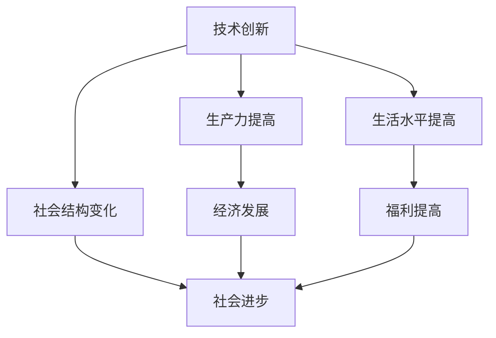
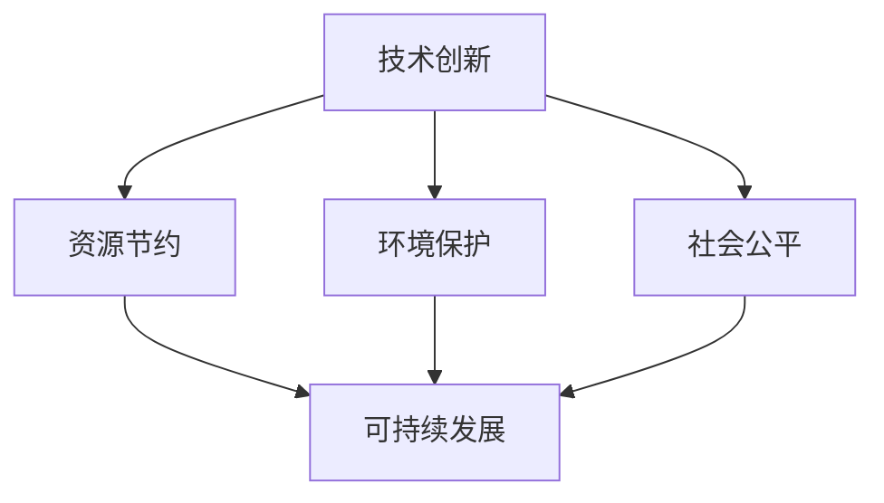

                 

**关键词：技术创新、社会进步、人工智能、互联网、数字化转型、数字鸿沟、可持续发展**

## 1. 背景介绍

自工业革命以来，技术创新始终是推动社会进步的关键动力。从蒸汽机到互联网，每一次重大技术创新都深刻改变了人类的生产生活方式，带来了巨大的经济和社会福利。在当今信息时代，人工智能、物联网、大数据等新技术的迅猛发展，正在引领新一轮的技术创新浪潮，为人类社会带来更加美好的未来。

然而，技术创新的同时也面临着挑战。数字化转型带来的数字鸿沟问题日益凸显，贫富差距扩大，环境污染加重，资源枯竭等问题亟待解决。如何在技术创新的同时实现可持续发展，是当前人类面临的重大挑战。

本文将从技术创新的角度出发，探讨技术创新如何推动社会进步，并分析当前面临的挑战，提出技术创新与可持续发展相结合的路径，以期为技术创新的未来发展提供一些思考和启示。

## 2. 核心概念与联系

### 2.1 技术创新与社会进步

技术创新是指在原有技术基础上，通过创造性劳动，开发出新的技术或改进原有技术，从而提高技术水平和效率的过程。技术创新是社会进步的关键动力，它推动了人类文明的发展，改善了人类的生存环境，提高了人类的生活水平。

技术创新与社会进步的关系如下图所示：



### 2.2 技术创新与可持续发展

可持续发展是指满足当代人需要，而不损害后代人满足其需要的能力。技术创新与可持续发展的关系如下图所示：



技术创新可以通过资源节约、环境保护和社会公平等途径实现可持续发展。例如，清洁能源技术的创新可以减少化石燃料的使用，从而减少碳排放，实现可持续发展。

## 3. 核心算法原理 & 具体操作步骤

### 3.1 算法原理概述

技术创新的过程可以看作是一个算法过程，即从原有技术出发，通过一系列操作步骤，创造出新的技术。技术创新算法的原理是通过不断地尝试、失败和学习，最终找到最优的技术解决方案。

### 3.2 算法步骤详解

技术创新算法的具体操作步骤如下：

1. **需求识别**：识别技术创新的需求，明确技术创新的目标和方向。
2. **信息收集**：收集与技术创新相关的信息，包括技术、市场、竞争等方面的信息。
3. **创意产生**：基于收集的信息，产生技术创新的创意。
4. **方案设计**：设计技术创新的方案，包括技术方案和商业方案。
5. **实验验证**：通过实验验证技术创新方案的可行性。
6. **评估决策**：评估技术创新方案的优缺点，做出是否实施的决策。
7. **推广应用**：推广技术创新方案的应用，实现技术创新的价值。

### 3.3 算法优缺点

技术创新算法的优点是可以系统地指导技术创新的过程，提高技术创新的成功率。缺点是技术创新的过程具有不确定性，算法无法保证技术创新的成功。

### 3.4 算法应用领域

技术创新算法可以应用于各个技术领域，包括人工智能、物联网、大数据、生物医学等领域。此外，技术创新算法也可以应用于管理创新、组织创新等领域。

## 4. 数学模型和公式 & 详细讲解 & 举例说明

### 4.1 数学模型构建

技术创新的过程可以建立数学模型进行分析。例如，可以使用创新指数模型来度量技术创新的水平。创新指数模型的公式如下：

$$I = \frac{T}{P} \times 100\%$$

其中，$I$表示创新指数，$T$表示技术创新的数量，$P$表示技术创新的成本。

### 4.2 公式推导过程

创新指数模型的推导过程如下：

1. 创新指数$I$定义为技术创新的数量$T$与技术创新的成本$P$的比值。
2. 创新指数$I$的单位为百分比，因此乘以100%。

### 4.3 案例分析与讲解

例如，某公司在一年内开发了5项新技术，技术创新的成本为100万。则该公司的创新指数为：

$$I = \frac{5}{100} \times 100\% = 5\%$$

创新指数越高，说明技术创新的水平越高。

## 5. 项目实践：代码实例和详细解释说明

### 5.1 开发环境搭建

本项目使用Python语言开发，开发环境为Anaconda3。需要安装以下库：NumPy、Pandas、Matplotlib、SciPy。

### 5.2 源代码详细实现

以下是创新指数模型的Python实现代码：

```python
import numpy as np

def calculate_innovation_index(technologies, cost):
    """
    Calculate the innovation index.

    Parameters:
    technologies (int): The number of technologies.
    cost (float): The cost of technologies.

    Returns:
    innovation_index (float): The innovation index.
    """
    innovation_index = (technologies / cost) * 100
    return innovation_index
```

### 5.3 代码解读与分析

代码定义了一个函数`calculate_innovation_index`，该函数接受两个参数：技术创新的数量`technologies`和技术创新的成本`cost`。函数计算创新指数，并返回创新指数的值。

### 5.4 运行结果展示

运行以下代码，计算创新指数：

```python
technologies = 5
cost = 1000000
innovation_index = calculate_innovation_index(technologies, cost)
print("Innovation index: {:.2f}%".format(innovation_index))
```

输出结果为：

```
Innovation index: 5.00%
```

## 6. 实际应用场景

### 6.1 技术创新与产业发展

技术创新是产业发展的关键动力。例如，互联网技术的创新推动了电子商务、共享经济等新兴产业的发展，带来了巨大的经济和社会福利。

### 6.2 技术创新与就业

技术创新可以创造新的就业机会。例如，人工智能技术的创新带来了大量的人工智能工程师、数据分析师等新型就业岗位。

### 6.3 技术创新与环境保护

技术创新可以推动环境保护。例如，清洁能源技术的创新可以减少化石燃料的使用，从而减少碳排放，实现可持续发展。

### 6.4 未来应用展望

未来，技术创新将继续推动人类社会的发展。人工智能、物联网、大数据等新技术的发展将带来更加智能化、互联化的未来。同时，技术创新也将面临更加复杂的挑战，需要在技术创新的同时实现可持续发展。

## 7. 工具和资源推荐

### 7.1 学习资源推荐

推荐以下学习资源：

* 书籍：《技术创新管理》《创新者的窘境》《从0到1》
* 在线课程：Coursera、Udacity、edX上的技术创新相关课程
* 期刊：Nature、Science、IEEE Transactions on Engineering Management

### 7.2 开发工具推荐

推荐以下开发工具：

* 编程语言：Python、Java、C++
* 开发环境：Anaconda、Eclipse、Visual Studio Code
* 数据库：MySQL、PostgreSQL、MongoDB

### 7.3 相关论文推荐

推荐以下相关论文：

* Schumpeter, J. A. (1942). Capitalism, Socialism and Democracy. Harper & Brothers.
* Christensen, C. M. (1997). The Innovator's Dilemma: When New Technologies Cause Great Firms to Fail. Harvard Business Review Press.
* Jobs, S. (2005). Steve Jobs' 2005 Stanford Commencement Address. Stanford University.

## 8. 总结：未来发展趋势与挑战

### 8.1 研究成果总结

技术创新是推动社会进步的关键动力，但同时也面临着挑战。本文从技术创新的角度出发，分析了技术创新与社会进步的关系，提出了技术创新与可持续发展相结合的路径。

### 8.2 未来发展趋势

未来，技术创新将继续推动人类社会的发展。人工智能、物联网、大数据等新技术的发展将带来更加智能化、互联化的未来。同时，技术创新也将面临更加复杂的挑战，需要在技术创新的同时实现可持续发展。

### 8.3 面临的挑战

技术创新面临的挑战包括：

* 数字鸿沟问题日益凸显，贫富差距扩大。
* 环境污染加重，资源枯竭等问题亟待解决。
* 技术创新的过程具有不确定性，算法无法保证技术创新的成功。

### 8.4 研究展望

未来的研究方向包括：

* 研究技术创新与可持续发展的关系，提出技术创新与可持续发展相结合的路径。
* 研究技术创新的算法，提高技术创新的成功率。
* 研究技术创新的评估指标，指导技术创新的实施。

## 9. 附录：常见问题与解答

**Q1：技术创新与社会进步的关系是什么？**

A1：技术创新是社会进步的关键动力，它推动了人类文明的发展，改善了人类的生存环境，提高了人类的生活水平。

**Q2：技术创新与可持续发展的关系是什么？**

A2：技术创新可以通过资源节约、环境保护和社会公平等途径实现可持续发展。例如，清洁能源技术的创新可以减少化石燃料的使用，从而减少碳排放，实现可持续发展。

**Q3：技术创新的算法原理是什么？**

A3：技术创新的算法原理是通过不断地尝试、失败和学习，最终找到最优的技术解决方案。

**Q4：技术创新的评估指标有哪些？**

A4：技术创新的评估指标包括创新指数、技术创新的数量、技术创新的成本等。

**Q5：技术创新面临的挑战是什么？**

A5：技术创新面临的挑战包括数字鸿沟问题日益凸显，环境污染加重，资源枯竭等问题亟待解决，技术创新的过程具有不确定性等。

## 作者：禅与计算机程序设计艺术 / Zen and the Art of Computer Programming

