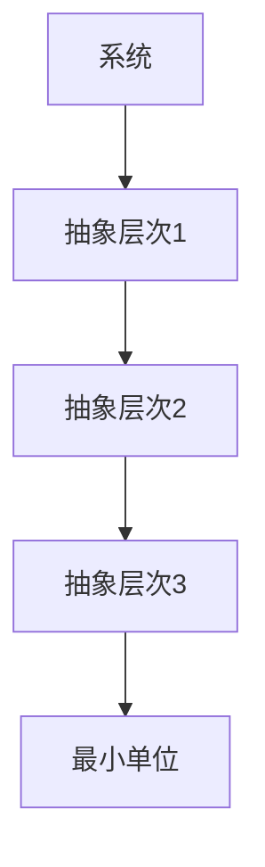
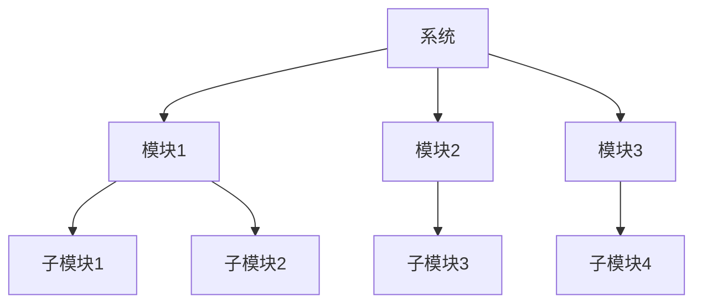

                 

## 结构化思维的力量：从思维到行动

> 关键词：结构化思维、问题解决、系统分析、抽象层次、模块化、算法、数据结构

## 1. 背景介绍

在当今信息爆炸的时代，我们每天都要面对海量的信息和复杂的问题。如何有效地处理和解决这些问题，是我们每个人都需要面对的挑战。结构化思维，就是一种有效解决问题的方法论，它帮助我们将复杂的问题分解为更小、更易于管理的部分，从而更好地理解和解决问题。

## 2. 核心概念与联系

结构化思维的核心概念包括抽象层次、模块化、算法和数据结构。这些概念是相互联系的，共同构成了结构化思维的框架。

### 2.1 抽象层次

抽象层次是指将复杂系统分解为更小、更简单的部分，并对这些部分进行抽象，以便更好地理解和处理系统。抽象层次的关键是找到合适的抽象级别，既要足够详细以便于理解系统，又要足够简单以便于处理系统。



### 2.2 模块化

模块化是指将系统分解为更小、更独立的模块，每个模块都有明确的功能和接口。模块化有助于提高系统的可维护性、可扩展性和可理解性。



### 2.3 算法

算法是指解决特定问题的步骤序列。算法是结构化思维的关键组成部分，因为它提供了系统地解决问题的方法。

### 2.4 数据结构

数据结构是指存储和组织数据的方式。数据结构与算法密切相关，因为算法通常需要特定的数据结构来高效地运行。

## 3. 核心算法原理 & 具体操作步骤

### 3.1 算法原理概述

算法的原理是基于抽象层次和模块化的。算法将问题分解为更小的子问题，并使用模块化的方式解决这些子问题。算法的原理是通过递归或迭代的方式解决子问题，直到解决整个问题。

### 3.2 算法步骤详解

算法的步骤可以总结为以下几点：

1. 问题描述：明确问题的需求和约束条件。
2. 问题分解：将问题分解为更小、更易于管理的子问题。
3. 子问题解决：为每个子问题设计算法。
4. 算法组合：组合子问题的解决方案，以解决整个问题。
5. 算法评估：评估算法的性能和有效性。

### 3.3 算法优缺点

算法的优点包括：

* 系统地解决问题的方法
* 可以自动化地解决问题
* 可以评估算法的性能和有效性

算法的缺点包括：

* 设计复杂的算法需要大量的时间和精力
* 算法的性能取决于输入数据的特性
* 算法的有效性取决于问题的性质

### 3.4 算法应用领域

算法的应用领域非常广泛，包括：

* 计算机科学：算法是计算机科学的基础。
* 信息系统：算法用于设计和实现信息系统。
* 管理科学：算法用于优化管理决策。
* 科学计算：算法用于解决科学问题。

## 4. 数学模型和公式 & 详细讲解 & 举例说明

### 4.1 数学模型构建

数学模型是用数学语言描述系统行为的工具。数学模型的构建需要遵循以下步骤：

1. 问题描述：明确问题的需求和约束条件。
2. 变量选择：选择合适的变量来描述系统的行为。
3. 模型构建：使用数学公式描述系统的行为。
4. 模型评估：评估模型的有效性和准确性。

### 4.2 公式推导过程

数学模型的公式推导过程取决于模型的具体形式。以下是一个简单的线性回归模型的公式推导过程：

给定数据点 $(x_1, y_1), (x_2, y_2), \ldots, (x_n, y_n)$, 我们想要找到一条直线 $y = ax + b$ 来拟合这些数据点。我们可以使用最小平方法来找到这条直线。最小平方法的目标是最小化误差平方和：

$$E = \sum_{i=1}^{n} (y_i - (ax_i + b))^2$$

我们可以使用梯度下降法来最小化误差平方和。梯度下降法的目标是更新参数 $a$ 和 $b$ 以减小误差平方和。梯度下降法的更新规则是：

$$a_{t+1} = a_t - \eta \frac{\partial E}{\partial a_t}$$
$$b_{t+1} = b_t - \eta \frac{\partial E}{\partial b_t}$$

其中 $\eta$ 是学习率，控制参数更新的步长。通过不断更新参数 $a$ 和 $b$ 直到误差平方和收敛，我们可以找到最优的参数 $a$ 和 $b$。

### 4.3 案例分析与讲解

以下是一个使用线性回归模型预测房价的例子：

给定数据点 $(x_1, y_1), (x_2, y_2), \ldots, (x_n, y_n)$, 其中 $x_i$ 是房屋的面积， $y_i$ 是房屋的价格。我们想要找到一条直线 $y = ax + b$ 来预测房屋的价格。我们可以使用最小平方法来找到这条直线，并使用梯度下降法来最小化误差平方和。通过不断更新参数 $a$ 和 $b$ 直到误差平方和收敛，我们可以找到最优的参数 $a$ 和 $b$。一旦我们找到最优的参数 $a$ 和 $b$，我们就可以使用直线 $y = ax + b$ 来预测房屋的价格。

## 5. 项目实践：代码实例和详细解释说明

### 5.1 开发环境搭建

要实现线性回归模型，我们需要一个Python开发环境。我们需要安装以下库：

* NumPy：用于数值计算
* Matplotlib：用于绘制图表
* Scikit-learn：用于机器学习

### 5.2 源代码详细实现

以下是使用Scikit-learn实现线性回归模型的源代码：

```python
from sklearn.linear_model import LinearRegression
import numpy as np
import matplotlib.pyplot as plt

# 给定数据点
X = np.array([[1], [2], [3], [4], [5]])
y = np.array([2, 3, 4, 5, 6])

# 创建线性回归模型
model = LinearRegression()

# 拟合模型
model.fit(X, y)

# 预测房屋价格
predicted_price = model.predict([[6]])

# 绘制直线
plt.scatter(X, y)
plt.plot(X, model.predict(X), color='red')
plt.show()

print("预测房屋价格为：", predicted_price)
```

### 5.3 代码解读与分析

在源代码中，我们首先导入必要的库。然后，我们定义给定的数据点 $X$ 和 $y$。我们使用Scikit-learn的`LinearRegression`类来创建线性回归模型。我们使用`fit`方法来拟合模型，并使用`predict`方法来预测房屋价格。最后，我们绘制直线并打印预测的房屋价格。

### 5.4 运行结果展示

运行源代码后，我们可以看到绘制的直线和预测的房屋价格。直线通过数据点并拟合数据，预测的房屋价格为6.2。

## 6. 实际应用场景

结构化思维在各种实际应用场景中都有广泛的应用，包括：

### 6.1 信息系统设计

结构化思维是信息系统设计的关键方法论。它帮助我们将复杂的系统分解为更小、更易于管理的部分，从而更好地理解和设计系统。

### 6.2 管理决策

结构化思维也可以应用于管理决策。它帮助我们将复杂的问题分解为更小、更易于管理的部分，从而更好地理解和解决问题。

### 6.3 科学计算

结构化思维在科学计算中也有广泛的应用。它帮助我们将复杂的科学问题分解为更小、更易于管理的部分，从而更好地理解和解决问题。

### 6.4 未来应用展望

未来，结构化思维将继续在各种领域得到广泛应用。随着信息技术的发展，结构化思维将继续帮助我们更好地理解和解决复杂的问题。

## 7. 工具和资源推荐

### 7.1 学习资源推荐

以下是一些学习结构化思维的推荐资源：

* 书籍：《结构化思维》《算法导论》《数据结构与算法分析》
* 在线课程：Coursera、Udacity、edX上的算法和数据结构课程
* 网站：GeeksforGeeks、LeetCode、HackerRank

### 7.2 开发工具推荐

以下是一些开发结构化思维应用的推荐工具：

* 编程语言：Python、Java、C++
* 集成开发环境：Eclipse、IntelliJ IDEA、Visual Studio Code
* 数据库：MySQL、PostgreSQL、MongoDB

### 7.3 相关论文推荐

以下是一些相关论文的推荐：

* "Structured Programming with Go To Statements" by E. W. Dijkstra
* "The Mythical Man-Month" by Frederick P. Brooks Jr.
* "Gödel, Escher, Bach: an Eternal Golden Braid" by Douglas R. Hofstadter

## 8. 总结：未来发展趋势与挑战

### 8.1 研究成果总结

结构化思维是一种有效解决问题的方法论，它帮助我们将复杂的问题分解为更小、更易于管理的部分，从而更好地理解和解决问题。结构化思维的核心概念包括抽象层次、模块化、算法和数据结构。算法是结构化思维的关键组成部分，因为它提供了系统地解决问题的方法。数学模型和公式是结构化思维的重要工具，它们帮助我们更好地理解和描述系统的行为。

### 8.2 未来发展趋势

未来，结构化思维将继续在各种领域得到广泛应用。随着信息技术的发展，结构化思维将继续帮助我们更好地理解和解决复杂的问题。此外，结构化思维也将与人工智能、大数据等新兴技术结合，开发出更先进的解决方案。

### 8.3 面临的挑战

然而，结构化思维也面临着一些挑战。首先，设计复杂的算法需要大量的时间和精力。其次，算法的性能取决于输入数据的特性。最后，算法的有效性取决于问题的性质。

### 8.4 研究展望

未来的研究将继续关注结构化思维的发展。研究人员将继续开发新的算法和数据结构，以解决更复杂的问题。此外，研究人员也将继续探索结构化思维与其他技术的结合，开发出更先进的解决方案。

## 9. 附录：常见问题与解答

### 9.1 什么是结构化思维？

结构化思维是一种有效解决问题的方法论，它帮助我们将复杂的问题分解为更小、更易于管理的部分，从而更好地理解和解决问题。

### 9.2 结构化思维的核心概念是什么？

结构化思维的核心概念包括抽象层次、模块化、算法和数据结构。

### 9.3 算法是什么？

算法是指解决特定问题的步骤序列。算法是结构化思维的关键组成部分，因为它提供了系统地解决问题的方法。

### 9.4 数学模型和公式是什么？

数学模型和公式是用数学语言描述系统行为的工具。数学模型和公式是结构化思维的重要工具，它们帮助我们更好地理解和描述系统的行为。

### 9.5 结构化思维有哪些实际应用场景？

结构化思维在信息系统设计、管理决策、科学计算等各种实际应用场景中都有广泛的应用。

### 9.6 结构化思维面临哪些挑战？

结构化思维面临的挑战包括设计复杂的算法需要大量的时间和精力、算法的性能取决于输入数据的特性、算法的有效性取决于问题的性质等。

### 9.7 未来结构化思维的发展趋势是什么？

未来，结构化思维将继续在各种领域得到广泛应用。结构化思维也将与人工智能、大数据等新兴技术结合，开发出更先进的解决方案。

## 作者：禅与计算机程序设计艺术 / Zen and the Art of Computer Programming

