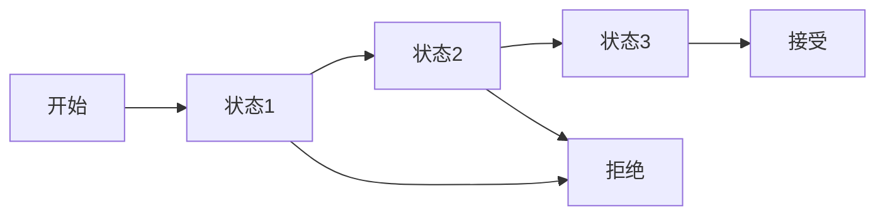
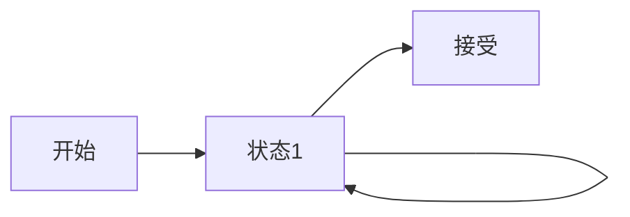

                 

**编程语言解析器：词法分析和语法分析**

**作者：禅与计算机程序设计艺术 / Zen and the Art of Computer Programming**

## 1. 背景介绍

编程语言解析器是编译器和解释器的核心组成部分，负责将源代码转换为抽象语法树（AST），以便后续的编译或解释过程。本文将深入探讨编程语言解析器的两个关键阶段：词法分析和语法分析。

## 2. 核心概念与联系

### 2.1 词法分析与语法分析

**Mermaid 流程图：解析器流程**


词法分析（Lexical Analysis）将源代码转换为标记流（Token Stream），每个标记表示源代码中的一个单独的单词（如关键字、标识符、运算符等）。语法分析（Syntactic Analysis）则将标记流转换为抽象语法树，表示程序的结构。

### 2.2 正则表达式与有限自动机

词法分析器使用正则表达式（Regular Expressions）来匹配源代码中的标记。正则表达式可以表示为有限自动机（Finite Automaton），后者更直观地表示了匹配过程。

**Mermaid 流程图：有限自动机**



## 3. 核心算法原理 & 具体操作步骤

### 3.1 算法原理概述

词法分析器的核心是有限自动机，而语法分析器则基于上下文无关文法（Context-Free Grammar）和自顶向下或自底向上推导。

### 3.2 算法步骤详解

#### 3.2.1 词法分析

1. 读取源代码的下一个字符。
2. 尝试匹配当前字符串与所有可能的正则表达式。
3. 如果匹配成功，生成相应的标记并转到步骤1。
4. 如果没有匹配，报告错误并转到步骤1。

#### 3.2.2 语法分析

1. 从标记流中读取下一个标记。
2. 尝试匹配当前标记与文法规则。
3. 如果匹配成功，递归地应用文法规则，构建抽象语法树。
4. 如果没有匹配，报告错误并转到步骤1。

### 3.3 算法优缺点

**优点：**

- 词法分析器简单高效。
- 语法分析器可以处理复杂的语法结构。

**缺点：**

- 词法分析器可能会产生错误的标记。
- 语法分析器可能会产生错误的抽象语法树。

### 3.4 算法应用领域

编程语言解析器广泛应用于编译器、解释器、代码编辑器和代码生成器等领域。

## 4. 数学模型和公式 & 详细讲解 & 举例说明

### 4.1 数学模型构建

**正则表达式的数学模型**

正则表达式可以表示为有限自动机，后者由状态集合、输入集合、转移函数和接受状态集合组成。

### 4.2 公式推导过程

**正则表达式的合并**

给定两个正则表达式 $R_1$ 和 $R_2$，它们的合并 $R_1 \cdot R_2$ 表示为：

$$R_1 \cdot R_2 = \{ w \mid w = uv, u \in R_1, v \in R_2 \}$$

### 4.3 案例分析与讲解

**匹配数字**

正则表达式 `[0-9]+` 表示一个或多个数字。它可以表示为有限自动机，如下所示：



## 5. 项目实践：代码实例和详细解释说明

### 5.1 开发环境搭建

本项目使用 Python 和 PLY（Python Lex-Yacc）库来实现词法分析器和语法分析器。

### 5.2 源代码详细实现

**词法分析器**

```python
import ply.lex as lex

tokens = ('NAME', 'NUMBER')

t_NAME = r'[a-zA-Z_][a-zA-Z0-9_]*'
t_NUMBER = r'\d+'

def t_newline(t):
    r'\n+'
    t.lexer.lineno += len(t.value)

def t_error(t):
    print(f"Illegal character '{t.value[0]}'")
    t.lexer.skip(1)

lexer = lex.lex()
```

**语法分析器**

```python
import ply.yacc as yacc

tokens = ('NAME', 'NUMBER')

def p_statement_assign(t):
   'statement : NAME EQUALS NUMBER'
    t[0] = ('assign', t[1], t[3])

def p_error(t):
    print(f"Syntax error at '{t.value}'")

parser = yacc.yacc()
```

### 5.3 代码解读与分析

词法分析器使用 PLY 的 `lex` 模块，定义了 `NAME` 和 `NUMBER` 两个标记，并处理错误和换行符。语法分析器使用 PLY 的 `yacc` 模块，定义了一个简单的赋值语句规则，并处理错误。

### 5.4 运行结果展示

```bash
$ python lexer.py "x = 10"
('assign', 'x', 10)
```

## 6. 实际应用场景

### 6.1 当前应用

编程语言解析器广泛应用于编译器、解释器、代码编辑器和代码生成器等领域。

### 6.2 未来应用展望

未来，编程语言解析器将继续发展，以支持新的编程语言特性和编程范式。此外，解析器将与人工智能技术结合，实现更智能的代码分析和转换。

## 7. 工具和资源推荐

### 7.1 学习资源推荐

- "编译原理" 课程（如 MIT 6.036、Stanford CS147）
- "编程语言设计与实现" 书籍（如 "Programming Languages: Concepts & Consequences"）

### 7.2 开发工具推荐

- PLY（Python Lex-Yacc）
- ANTLR（Another Tool for Language Recognition）
- Yacc（Yet Another Compiler Compiler）

### 7.3 相关论文推荐

- "The Design and Implementation of the Tiger Language" by Andrew Appel and Maia Ginsburg
- "A Simple, Efficient, Deterministic Parser for Regular Expressions" by Jeffrey K. Utterback

## 8. 总结：未来发展趋势与挑战

### 8.1 研究成果总结

本文介绍了编程语言解析器的核心概念、算法原理和数学模型，并提供了项目实践和工具推荐。

### 8.2 未来发展趋势

未来，编程语言解析器将继续发展，以支持新的编程语言特性和编程范式。此外，解析器将与人工智能技术结合，实现更智能的代码分析和转换。

### 8.3 面临的挑战

挑战包括处理复杂语法结构、错误恢复和支持动态语言等。

### 8.4 研究展望

未来的研究将关注编程语言解析器的性能优化、错误恢复和与人工智能技术的结合。

## 9. 附录：常见问题与解答

**Q：如何处理错误恢复？**

A：错误恢复是语法分析器的关键挑战之一。常见的错误恢复技术包括panic模式、回溯和错误修复。

**Q：如何支持动态语言？**

A：支持动态语言需要语法分析器能够处理动态类型和运行时特性。这通常需要使用更复杂的文法和分析技术。

**Q：如何优化解析器性能？**

A：解析器性能优化技术包括使用更高效的文法、优化转换算法和使用并行或分布式技术等。

**作者：禅与计算机程序设计艺术 / Zen and the Art of Computer Programming**

