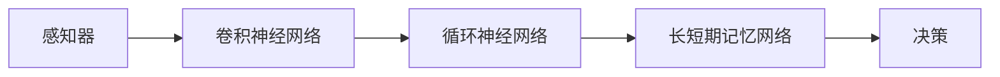

                 

**端到端（End-to-End）学习、卷积神经网络（Convolutional Neural Networks）、循环神经网络（Recurrent Neural Networks）、长短期记忆网络（Long Short-Term Memory）、感知器（Perceptron）、回归（Regression）、分类（Classification）、自动驾驶（Autonomous Driving）、L2级自动驾驶（Level 2 Autonomous Driving）、英伟达（NVIDIA）、comma.ai、Wayve**

## 1. 背景介绍

自动驾驶技术的发展正在改变交通运输的未来。其中，端到端（End-to-End）学习方法因其简单有效的特点，受到了广泛的关注。本文将介绍英伟达、comma.ai 和 Wayve 的端到端 L2 级自动驾驶 Demo，分析其核心概念、算法原理，并提供项目实践和工具推荐。

## 2. 核心概念与联系

### 2.1 端到端学习

端到端学习是一种直接从感知到决策的深度学习方法，无需手动设计中间表示。其架构如下：



### 2.2 L2 级自动驾驶

L2 级自动驾驶是自动驾驶的一个等级，车辆可以在驾驶员监督下自动控制加速、制动和转向。然而，驾驶员必须时刻准备接管车辆。

## 3. 核心算法原理 & 具体操作步骤

### 3.1 算法原理概述

端到端学习算法的核心是使用神经网络模型直接从感知到决策。感知器接收来自传感器的数据，卷积神经网络提取特征，循环神经网络和长短期记忆网络处理序列数据，最后输出决策。

### 3.2 算法步骤详解

1. **数据收集**：收集大量的驾驶数据，包括图像、雷达、里程计等传感器数据和对应的驾驶员操作。
2. **数据预处理**：对数据进行预处理，如图像resize、数据标准化等。
3. **模型构建**：构建端到端模型，包括感知器、卷积神经网络、循环神经网络和长短期记忆网络等。
4. **模型训练**：使用收集的数据训练模型，通常采用回归或分类的损失函数。
5. **模型评估**：评估模型的性能，通常使用测试数据集。
6. **部署**：将模型部署到目标平台，如自动驾驶汽车。

### 3.3 算法优缺点

**优点**：端到端学习方法简单有效，无需手动设计中间表示，易于部署。

**缺点**：端到端学习方法对数据量要求高，易受数据分布变化影响，安全性需要进一步验证。

### 3.4 算法应用领域

端到端学习方法广泛应用于自动驾驶、机器人导航、无人机控制等领域。

## 4. 数学模型和公式 & 详细讲解 & 举例说明

### 4.1 数学模型构建

端到端学习模型的数学表达式为：

$$y = f(x; \theta)$$

其中，$x$ 为输入数据，$y$ 为输出决策，$f$ 为神经网络模型，$θ$ 为模型参数。

### 4.2 公式推导过程

端到端学习模型的训练过程可以使用反向传播算法，目标是最小化损失函数：

$$L = \frac{1}{n} \sum_{i=1}^{n} l(y_i, \hat{y}_i)$$

其中，$l$ 为损失函数，$y_i$ 为真实标签，$\hat{y}_i$ 为模型预测。

### 4.3 案例分析与讲解

例如，在英伟达的端到端 L2 级自动驾驶 Demo 中，输入数据 $x$ 包括前置相机、侧置相机、里程计等传感器数据，输出决策 $y$ 包括加速度、转向角等。模型 $f$ 由感知器、卷积神经网络、循环神经网络和长短期记忆网络组成。损失函数 $l$ 为均方误差函数。

## 5. 项目实践：代码实例和详细解释说明

### 5.1 开发环境搭建

端到端学习项目的开发环境包括 Python、TensorFlow、Keras、OpenCV 等。

### 5.2 源代码详细实现

以下是端到端学习模型的伪代码实现：

```python
import tensorflow as tf
from tensorflow.keras.models import Sequential
from tensorflow.keras.layers import Dense, Conv2D, Flatten, LSTM

# 定义模型
model = Sequential()
model.add(Conv2D(32, (3, 3), activation='relu', input_shape=(100, 100, 3)))
model.add(Flatten())
model.add(Dense(128, activation='relu'))
model.add(LSTM(64, return_sequences=True))
model.add(LSTM(64))
model.add(Dense(2))

# 编译模型
model.compile(optimizer='adam', loss='mse')

# 训练模型
model.fit(x_train, y_train, epochs=10, batch_size=32)
```

### 5.3 代码解读与分析

上述代码定义了一个端到端学习模型，包括卷积神经网络和循环神经网络。模型使用 Adam 优化器，损失函数为均方误差函数。模型使用训练数据集进行训练。

### 5.4 运行结果展示

训练好的模型可以在测试数据集上进行评估，并部署到自动驾驶汽车上进行实际测试。

## 6. 实际应用场景

### 6.1 当前应用

端到端学习方法已成功应用于英伟达、comma.ai 和 Wayve 的 L2 级自动驾驶 Demo 中，实现了在真实道路上自动驾驶的功能。

### 6.2 未来应用展望

端到端学习方法有望应用于更高级别的自动驾驶，如 L4 级和 L5 级自动驾驶。此外，端到端学习方法还可以应用于其他领域，如机器人导航、无人机控制等。

## 7. 工具和资源推荐

### 7.1 学习资源推荐

- 深度学习入门：[Deep Learning Specialization](https://www.coursera.org/specializations/deep-learning)
- 自动驾驶入门：[Self-Driving Cars Specialization](https://www.coursera.org/specializations/self-driving-cars)

### 7.2 开发工具推荐

- TensorFlow：<https://www.tensorflow.org/>
- Keras：<https://keras.io/>
- OpenCV：<https://opencv.org/>

### 7.3 相关论文推荐

- [End-to-End Learning for Self-Driving Cars](https://arxiv.org/abs/1604.07316)
- [PilotNet: A Deep Learning Architecture for Efficient Visual Piloting of Autonomous Vehicles](https://arxiv.org/abs/1806.07793)

## 8. 总结：未来发展趋势与挑战

### 8.1 研究成果总结

端到端学习方法在自动驾驶领域取得了显著成果，实现了 L2 级自动驾驶的功能。

### 8.2 未来发展趋势

端到端学习方法有望应用于更高级别的自动驾驶，并扩展到其他领域。

### 8.3 面临的挑战

端到端学习方法面临的挑战包括数据量要求高、易受数据分布变化影响、安全性需要进一步验证等。

### 8.4 研究展望

未来的研究方向包括提高端到端学习方法的泛化能力、研究端到端学习方法的安全性、扩展端到端学习方法到其他领域等。

## 9. 附录：常见问题与解答

**Q：端到端学习方法需要多少数据？**

**A：端到端学习方法对数据量要求高，通常需要数百万甚至数千万的数据。**

**Q：端到端学习方法是否安全？**

**A：端到端学习方法的安全性需要进一步验证，目前还处于研究阶段。**

**Q：端到端学习方法是否可以应用于其他领域？**

**A：端到端学习方法有望应用于其他领域，如机器人导航、无人机控制等。**

## 作者：禅与计算机程序设计艺术 / Zen and the Art of Computer Programming

