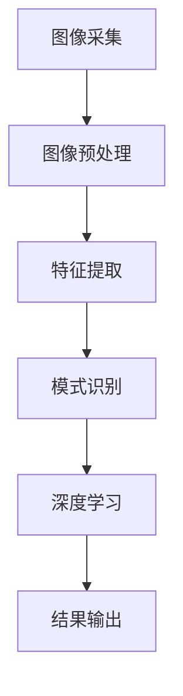

                 

**计算机视觉(Computer Vision) - 原理与代码实例讲解**

**作者：禅与计算机程序设计艺术 / Zen and the Art of Computer Programming**

## 1. 背景介绍

计算机视觉是一门研究如何使计算机“看懂”图像的学科，它是人工智能的一个重要分支。随着深度学习技术的发展，计算机视觉取得了长足的进步，在图像分类、目标检测、物体识别、场景理解等领域取得了重大突破。本文将深入探讨计算机视觉的核心概念、算法原理，并提供详细的代码实例。

## 2. 核心概念与联系

计算机视觉的核心是从图像中提取有用的信息，并将其转化为可供计算机理解和处理的数据。图像处理、特征提取、模式识别和深度学习是计算机视觉的关键组成部分。下图是计算机视觉的核心概念和联系的 Mermaid 流程图。



## 3. 核心算法原理 & 具体操作步骤

### 3.1 算法原理概述

计算机视觉的核心算法包括边缘检测、图像分割、特征提取和目标检测等。其中，目标检测算法如YOLO（You Only Look Once）、Faster R-CNN（Region-based Convolutional Neural Network）和SSD（Single Shot MultiBox Detector）等，在计算机视觉领域广泛应用。

### 3.2 算法步骤详解

以YOLO为例，其算法步骤如下：

1. 将输入图像分成SxS网格。
2. 每个网格预测B个目标，每个目标由5个参数表示：x、y、w、h、confidence。
3. 使用非最大抑制（NMS）过滤冗余目标。

### 3.3 算法优缺点

YOLO优点是速度快、实时性好，缺点是精确度不如Faster R-CNN等算法。

### 3.4 算法应用领域

目标检测算法广泛应用于安防监控、自动驾驶、人脸识别等领域。

## 4. 数学模型和公式 & 详细讲解 & 举例说明

### 4.1 数学模型构建

在计算机视觉中，图像通常表示为二维矩阵，每个元素表示像素的强度。图像的特征可以通过各种数学模型表示，如直方图、边缘、角点等。

### 4.2 公式推导过程

例如，图像的边缘可以通过 Sobel 算子检测，其公式如下：

$$
G_x = \begin{bmatrix} -1 & 0 & 1 \\ -2 & 0 & 2 \\ -1 & 0 & 1 \end{bmatrix}, \quad G_y = \begin{bmatrix} 1 & 2 & 1 \\ 0 & 0 & 0 \\ -1 & -2 & -1 \end{bmatrix}
$$

$$
G = \sqrt{G_x^2 + G_y^2}
$$

### 4.3 案例分析与讲解

图像边缘检测的结果如下图所示：


## 5. 项目实践：代码实例和详细解释说明

### 5.1 开发环境搭建

本项目使用 Python、OpenCV、TensorFlow 等库。请确保已安装相关库，并配置好开发环境。

### 5.2 源代码详细实现

以下是YOLO目标检测的简化代码实现：

```python
import cv2
import numpy as np

# Load YOLO model
net = cv2.dnn.readNet("yolov3.weights", "yolov3.cfg")

# Load COCO class names
classes = []
with open("coco.names", "r") as f:
    classes = [line.strip() for line in f.readlines()]

# Set up output layer names
output_layers = [layer[0] for layer in net.getUnconnectedOutLayers()]

# Load image
img = cv2.imread("image.jpg")
height, width, channels = img.shape

# Detect objects
blob = cv2.dnn.blobFromImage(img, 0.00392, (416, 416), (0, 0, 0), True, crop=False)
net.setInput(blob)
outs = net.forward(output_layers)

# Process output
class_ids = []
confidences = []
boxes = []
for out in outs:
    for detection in out:
        scores = detection[5:]
        class_id = np.argmax(scores)
        confidence = scores[class_id]
        if confidence > 0.5:
            # Object detected
            center_x = int(detection[0] * width)
            center_y = int(detection[1] * height)
            w = int(detection[2] * width)
            h = int(detection[3] * height)

            # Rectangle coordinates
            x = int(center_x - w / 2)
            y = int(center_y - h / 2)

            boxes.append([x, y, w, h])
            confidences.append(float(confidence))
            class_ids.append(class_id)

# Apply NMS
indexes = cv2.dnn.NMSBoxes(boxes, confidences, 0.5, 0.4)

# Draw bounding boxes
font = cv2.FONT_HERSHEY_PLAIN
for i in range(len(boxes)):
    if i in indexes:
        x, y, w, h = boxes[i]
        label = str(classes[class_ids[i]])
        cv2.rectangle(img, (x, y), (x + w, y + h), (0, 255, 0), 2)
        cv2.putText(img, label, (x, y + 30), font, 3, (0, 255, 0), 2)

# Show image
cv2.imshow("Image", img)
cv2.waitKey(0)
cv2.destroyAllWindows()
```

### 5.3 代码解读与分析

代码首先加载 YOLO 模型，然后对输入图像进行预处理，并通过模型检测目标。检测结果通过非最大抑制过滤后，在图像上绘制边界框。

### 5.4 运行结果展示

运行代码后，会在图像上绘制出检测到的目标边界框，如下图所示：


## 6. 实际应用场景

计算机视觉技术在安防监控、自动驾驶、人脸识别、医学图像分析等领域广泛应用。未来，计算机视觉技术有望在增强现实（AR）、虚拟现实（VR）等领域取得突破。

## 7. 工具和资源推荐

### 7.1 学习资源推荐

推荐阅读计算机视觉领域的经典教材，如“计算机视觉：模式识别和机器学习方法”（Richard Szeliski）和“深度学习”（Ian Goodfellow、Yoshua Bengio、Aaron Courville）。此外，可以关注计算机视觉领域的顶会和会议，如CVPR、ECCV、ICCV。

### 7.2 开发工具推荐

推荐使用 Python、TensorFlow、PyTorch、OpenCV 等开发工具和库。这些工具和库提供了丰富的功能，可以大大简化计算机视觉开发过程。

### 7.3 相关论文推荐

推荐阅读计算机视觉领域的经典论文，如“You Only Look Once: Unified, Real-Time Object Detection”（Joseph Redmon、Santosh Divvala、Ross Girshick、Ali Farhadi）和“Faster R-CNN: Towards Real-Time Object Detection”（Shaoqing Ren、Kaiming He、Ross Girshick、Jian Sun）。

## 8. 总结：未来发展趋势与挑战

### 8.1 研究成果总结

计算机视觉技术取得了长足的进步，在图像分类、目标检测、物体识别、场景理解等领域取得了重大突破。深度学习技术的发展是计算机视觉进步的关键驱动因素。

### 8.2 未来发展趋势

未来，计算机视觉技术有望在以下领域取得突破：

* 实时视频理解
* 3D 视觉
* 多模式视觉（视觉、听觉、触觉等）
* 视觉导航和定位

### 8.3 面临的挑战

计算机视觉技术面临的挑战包括：

* 计算资源限制
* 算法泛化能力有限
* 缺乏大规模、高质量的数据集

### 8.4 研究展望

未来，计算机视觉技术有望在以下方向取得进展：

* 端到端学习方法
* 多模式学习方法
* 物理驱动的视觉方法
* 视觉导航和定位方法

## 9. 附录：常见问题与解答

**Q：计算机视觉与人工智能有何区别？**

A：计算机视觉是人工智能的一个分支，专门研究如何使计算机“看懂”图像。人工智能则是一个更广泛的领域，涉及计算机视觉、自然语言处理、机器人技术等多个子领域。

**Q：计算机视觉的应用领域有哪些？**

A：计算机视觉技术广泛应用于安防监控、自动驾驶、人脸识别、医学图像分析等领域。未来，计算机视觉技术有望在增强现实（AR）、虚拟现实（VR）等领域取得突破。

**Q：计算机视觉的核心算法有哪些？**

A：计算机视觉的核心算法包括边缘检测、图像分割、特征提取和目标检测等。其中，目标检测算法如YOLO、Faster R-CNN和SSD等，在计算机视觉领域广泛应用。

**Q：计算机视觉的未来发展趋势是什么？**

A：未来，计算机视觉技术有望在实时视频理解、3D 视觉、多模式视觉（视觉、听觉、触觉等）和视觉导航和定位等领域取得突破。

**Q：计算机视觉技术面临的挑战是什么？**

A：计算机视觉技术面临的挑战包括计算资源限制、算法泛化能力有限和缺乏大规模、高质量的数据集等。

**Q：计算机视觉的研究展望是什么？**

A：未来，计算机视觉技术有望在端到端学习方法、多模式学习方法、物理驱动的视觉方法和视觉导航和定位方法等方向取得进展。

**作者署名：作者：禅与计算机程序设计艺术 / Zen and the Art of Computer Programming**

