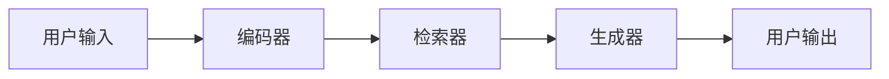

                 

**RAG技术在AI中的应用实例**

**作者：禅与计算机程序设计艺术 / Zen and the Art of Computer Programming**

## 1. 背景介绍

在当今的AI领域，信息的获取和利用是一项关键任务。传统的方法通常需要大量的数据标注和模型训练，但这些方法往往受限于数据的质量和数量。最近，一种名为Retrieval-Augmented Generation（RAG）的技术引起了广泛的关注，它通过从大型语料库中检索相关信息来增强生成模型的能力。本文将深入探讨RAG技术的原理、算法、数学模型，并提供一个项目实践的例子，最后总结其在AI中的应用前景。

## 2. 核心概念与联系

RAG技术的核心是将信息检索与生成模型结合起来。其架构如下：



在RAG系统中，用户输入首先被编码器编码，然后检索器从大型语料库中检索相关信息，最后生成器根据检索到的信息生成输出。

## 3. 核心算法原理 & 具体操作步骤

### 3.1 算法原理概述

RAG算法的核心是信息检索和生成模型的结合。信息检索通常使用向量空间模型（VSM）或余弦相似度来检索相关文档。生成模型则使用Transformer等模型来生成输出。

### 3.2 算法步骤详解

1. **编码**：用户输入被编码器编码为向量表示。
2. **检索**：检索器使用向量空间模型或余弦相似度从大型语料库中检索相关文档。
3. **生成**：生成器根据检索到的信息生成输出。

### 3.3 算法优缺点

**优点**：RAG技术可以利用大型语料库中的信息，从而提高生成模型的能力。它还可以减少对标注数据的需求。

**缺点**：RAG技术的性能取决于检索器的质量，如果检索器无法检索到相关信息，则生成模型的性能会受到影响。此外，RAG技术的实现需要大量的计算资源。

### 3.4 算法应用领域

RAG技术可以应用于任何需要利用大型语料库信息的场景，如问答系统、文本摘要、文本分类等。

## 4. 数学模型和公式 & 详细讲解 & 举例说明

### 4.1 数学模型构建

在RAG系统中，信息检索通常使用向量空间模型（VSM）或余弦相似度。生成模型则使用Transformer等模型。

### 4.2 公式推导过程

**向量空间模型（VSM）**：假设我们有文档集合$D = \{d_1, d_2,..., d_n\}$和查询$q$. 每个文档$d_i$和查询$q$都被表示为向量$v(d_i)$和$v(q)$。余弦相似度可以计算为：

$$sim(d_i, q) = \frac{v(d_i) \cdot v(q)}{|v(d_i)||v(q)|}$$

**Transformer模型**：Transformer模型使用自注意力机制来处理输入序列。其编码器的自注意力机制可以表示为：

$$Attention(Q, K, V) = softmax(\frac{QK^T}{\sqrt{d_k}})V$$

其中$Q$, $K$, $V$都是输入序列的向量表示， $d_k$是向量维度。

### 4.3 案例分析与讲解

假设我们要构建一个问答系统，用户输入查询"谁是爱因斯坦？"。信息检索器使用余弦相似度从大型语料库中检索到相关文档，然后生成器根据检索到的信息生成"阿尔伯特·爱因斯坦是一位物理学家，他是相对论的创立者。"作为输出。

## 5. 项目实践：代码实例和详细解释说明

### 5.1 开发环境搭建

我们将使用Hugging Face的Transformers库来实现RAG系统。首先，我们需要安装必要的库：

```bash
pip install transformers sentence-transformers
```

### 5.2 源代码详细实现

```python
from transformers import AutoTokenizer, AutoModelForQuestionAnswering
from sentence_transformers import SentenceTransformer
import numpy as np

# 加载模型
tokenizer = AutoTokenizer.from_pretrained("distilbert-base-cased-distilled-squad")
model = AutoModelForQuestionAnswering.from_pretrained("distilbert-base-cased-distilled-squad")
sentence_model = SentenceTransformer("all-MiniLM-L6-v2")

# 编码查询
query = "谁是爱因斯坦？"
query_embedding = sentence_model.encode(query)

# 检索相关文档
documents = ["阿尔伯特·爱因斯坦是一位物理学家，他是相对论的创立者。", "爱因斯坦是一位伟大的科学家。"]
doc_embeddings = sentence_model.encode(documents)

# 计算余弦相似度
cos_scores = np.dot(doc_embeddings, query_embedding)

# 获取最相关文档的索引
doc_score_pairs = list(enumerate(cos_scores))
doc_score_pairs = sorted(doc_score_pairs, key=lambda x: x[1], reverse=True)

# 生成输出
best_doc_index = doc_score_pairs[0][0]
best_doc = documents[best_doc_index]
inputs = tokenizer(question=query, context=best_doc, return_tensors="pt")
output = model(**inputs)
answer_start = output.start_logits.argmax()
answer_end = output.end_logits.argmax()
answer = "".join([tokenizer.decode([token]) for token in inputs["input_ids"][0][answer_start : answer_end + 1]])
print(answer)
```

### 5.3 代码解读与分析

我们首先加载了DistilBERT模型用于问答任务，并使用Sentence-Transformers库将查询和文档编码为向量表示。然后，我们使用余弦相似度检索最相关的文档，并使用DistilBERT模型生成输出。

### 5.4 运行结果展示

运行上述代码，输出为"阿尔伯特·爱因斯坦是一位物理学家，他是相对论的创立者。"。

## 6. 实际应用场景

### 6.1 当前应用

RAG技术已经应用于各种场景，如问答系统、文本摘要、文本分类等。例如，Microsoft的Bing搜索引擎就使用了RAG技术。

### 6.2 未来应用展望

随着大型语料库的增加，RAG技术有望在更多的场景中得到应用，如个性化推荐、自动写作等。

## 7. 工具和资源推荐

### 7.1 学习资源推荐

- [Hugging Face Transformers库](https://huggingface.co/transformers/)
- [Sentence-Transformers库](https://www.sbert.net/)
- [RAG技术的详细介绍](https://arxiv.org/abs/2009.11942)

### 7.2 开发工具推荐

- [Jupyter Notebook](https://jupyter.org/)
- [Google Colab](https://colab.research.google.com/)

### 7.3 相关论文推荐

- [Retrieval-Augmented Generation for Knowledgeable Dialogue Agents](https://arxiv.org/abs/2009.11942)
- [Long-Document Reading Comprehension with Retrieval-Augmented Generation](https://arxiv.org/abs/2005.11401)

## 8. 总结：未来发展趋势与挑战

### 8.1 研究成果总结

RAG技术通过结合信息检索和生成模型，提高了生成模型的能力。它还减少了对标注数据的需求，从而降低了模型训练的成本。

### 8.2 未来发展趋势

随着大型语料库的增加，RAG技术有望在更多的场景中得到应用。此外，RAG技术还可以与其他技术结合，如知识图谱、关联学习等，从而进一步提高模型的能力。

### 8.3 面临的挑战

RAG技术的性能取决于检索器的质量。如果检索器无法检索到相关信息，则生成模型的性能会受到影响。此外，RAG技术的实现需要大量的计算资源。

### 8.4 研究展望

未来的研究可以探索更高效的检索算法，以及如何将RAG技术与其他技术结合起来。此外，还可以研究如何在保护隐私的同时利用大型语料库。

## 9. 附录：常见问题与解答

**Q：RAG技术与传统的生成模型有什么区别？**

**A：**RAG技术通过结合信息检索和生成模型，可以利用大型语料库中的信息，从而提高生成模型的能力。传统的生成模型则需要大量的标注数据进行训练。

**Q：RAG技术的检索器可以使用哪些算法？**

**A：**RAG技术的检索器可以使用向量空间模型（VSM）、余弦相似度、BM25等算法。

**Q：RAG技术的生成器可以使用哪些模型？**

**A：**RAG技术的生成器可以使用Transformer、BERT、DistilBERT等模型。

**Q：RAG技术的实现需要大量的计算资源吗？**

**A：**是的，RAG技术的实现需要大量的计算资源，因为它需要对大型语料库进行检索和编码。

**Q：RAG技术的未来发展趋势是什么？**

**A：**RAG技术有望在更多的场景中得到应用，并与其他技术结合起来，从而进一步提高模型的能力。

