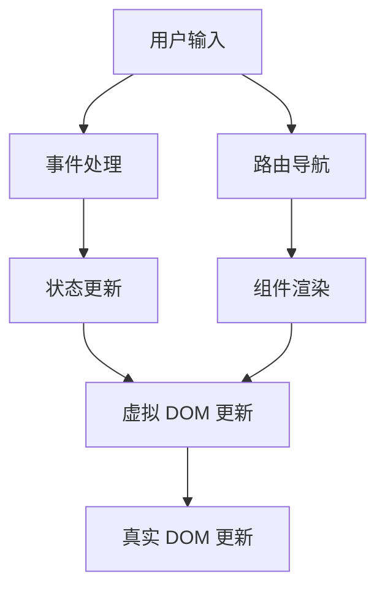

                 

**Web 前端框架高级应用：构建复杂和可扩展的界面**

**作者：禅与计算机程序设计艺术 / Zen and the Art of Computer Programming**

## 1. 背景介绍

随着 Web 应用的复杂性不断提高，构建和维护可扩展的前端界面变得越来越困难。前端框架的出现解决了这个问题，它们提供了丰富的功能和组件，帮助我们构建复杂的用户界面。本文将深入探讨前端框架的高级应用，重点关注构建复杂和可扩展的界面。

## 2. 核心概念与联系

### 2.1 核心概念

- **组件化**：前端框架将界面分成独立的、可重用的组件。
- **状态管理**：管理应用状态的方式，如 Redux、Vuex。
- **路由**：管理应用导航的方式，如 React Router、Vue Router。
- **虚拟 DOM**：一种高效的 DOM 更新机制，如 React、Vue。

### 2.2 架构联系



## 3. 核心算法原理 & 具体操作步骤

### 3.1 算法原理概述

前端框架的核心是组件化和虚拟 DOM。组件化将界面分成小块，每块负责渲染特定的 UI 部分。虚拟 DOM 则是一种高效的 DOM 更新机制，它记录组件的状态，并只更新需要变化的部分。

### 3.2 算法步骤详解

1. **组件化**：将界面分成组件，每个组件负责渲染特定的 UI 部分。
2. **状态管理**：使用状态管理库（如 Redux、Vuex）管理应用状态。
3. **虚拟 DOM**：使用虚拟 DOM 记录组件的状态，并只更新需要变化的部分。
4. **路由**：使用路由库（如 React Router、Vue Router）管理应用导航。

### 3.3 算法优缺点

**优点**：组件化提高了代码的可重用性和可维护性；虚拟 DOM 提高了 DOM 更新的效率；状态管理库帮助我们管理复杂的应用状态。

**缺点**：学习曲线陡峭；过度使用可能导致性能问题。

### 3.4 算法应用领域

前端框架广泛应用于构建单页应用（SPA）、移动应用、桌面应用等。

## 4. 数学模型和公式 & 详细讲解 & 举例说明

### 4.1 数学模型构建

前端框架的数学模型可以用有向无环图（DAG）表示，其中节点表示组件，边表示组件之间的依赖关系。

### 4.2 公式推导过程

假设组件 $C$ 的状态为 $S_C$, 则组件 $C$ 的渲染结果 $R_C$ 可以表示为：

$$R_C = f(S_C, R_{C_1}, R_{C_2},..., R_{C_n})$$

其中 $C_1, C_2,..., C_n$ 是 $C$ 的子组件。

### 4.3 案例分析与讲解

考虑一个简单的计数器组件 $C$：

```jsx
function Counter() {
  const [count, setCount] = useState(0);
  return (
    <div>
      <p>Count: {count}</p>
      <button onClick={() => setCount(count + 1)}>Increment</button>
    </div>
  );
}
```

在每次点击按钮时，组件的状态 $S_C$ 发生变化，从而导致渲染结果 $R_C$ 发生变化。

## 5. 项目实践：代码实例和详细解释说明

### 5.1 开发环境搭建

使用 Create React App 初始化 React 项目：

```bash
npx create-react-app counter-app
cd counter-app
```

### 5.2 源代码详细实现

在 `src` 目录下创建 `Counter.js` 文件，实现计数器组件：

```jsx
import React, { useState } from'react';

function Counter() {
  const [count, setCount] = useState(0);
  return (
    <div>
      <p>Count: {count}</p>
      <button onClick={() => setCount(count + 1)}>Increment</button>
    </div>
  );
}

export default Counter;
```

### 5.3 代码解读与分析

- `useState` 是 React 的 Hook，用于在函数组件中添加状态。
- `count` 是组件的状态，初始值为 0。
- `setCount` 是更新状态的函数。
- 组件渲染时，会显示当前计数和一个按钮。点击按钮会调用 `setCount` 函数，更新状态，从而触发组件重新渲染。

### 5.4 运行结果展示

运行项目：

```bash
npm start
```

打开浏览器访问 `http://localhost:3000`，点击按钮可以看到计数器增加。

## 6. 实际应用场景

### 6.1 当前应用

前端框架广泛应用于构建各种 Web 应用，如社交媒体、电子商务平台、在线游戏等。

### 6.2 未来应用展望

随着 Web 技术的发展，前端框架将继续演进，以适应新的应用场景，如 WebAssembly、原生应用开发等。

## 7. 工具和资源推荐

### 7.1 学习资源推荐

- [React 文档](https://reactjs.org/docs/getting-started.html)
- [Vue 文档](https://vuejs.org/v2/guide/)
- [Angular 文档](https://angular.io/docs)

### 7.2 开发工具推荐

- [Create React App](https://create-react-app.dev/)
- [Vue CLI](https://cli.vuejs.org/)
- [Angular CLI](https://cli.angular.io/)

### 7.3 相关论文推荐

- [A React-like Library for JavaScript](https://arxiv.org/abs/1301.1273)
- [Virtual DOM: A Modern Take on a Classic Idea](https://arxiv.org/abs/1502.03592)

## 8. 总结：未来发展趋势与挑战

### 8.1 研究成果总结

前端框架的出现大大提高了构建复杂 Web 应用的效率，并促进了 Web 开发的标准化。

### 8.2 未来发展趋势

前端框架将继续发展，以适应新的应用场景，如 WebAssembly、原生应用开发等。同时，前端框架也将与后端框架、数据库等其他技术更紧密地集成。

### 8.3 面临的挑战

前端框架的学习曲线陡峭，需要开发者花费大量时间学习。此外，前端框架的过度使用也可能导致性能问题。

### 8.4 研究展望

未来的研究将关注如何进一步提高前端框架的性能、可维护性和可扩展性。同时，研究也将关注如何将前端框架与其他技术更紧密地集成。

## 9. 附录：常见问题与解答

**Q：前端框架有哪些？**

A：常见的前端框架包括 React、Vue、Angular 等。

**Q：如何选择前端框架？**

A：选择前端框架取决于项目的需求、开发团队的技能等因素。React 更适合需要高度定制的项目，Vue 更适合需要快速开发的项目，Angular 更适合需要完整解决方案的项目。

**Q：前端框架的学习曲线陡峭吗？**

A：是的，前端框架的学习曲线陡峭。但是，一旦掌握了前端框架，开发效率将大大提高。

**作者：禅与计算机程序设计艺术 / Zen and the Art of Computer Programming**

