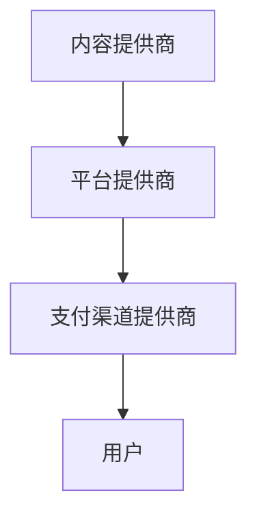

                 

**parenthood育儿知识付费市场前景广阔**

**作者：禅与计算机程序设计艺术 / Zen and the Art of Computer Programming**

## 1. 背景介绍

在信息爆炸的数字时代，育儿知识的获取渠道日益丰富，但信息的真假优劣参差不齐，付费市场的出现为家长提供了高质量、专业的育儿指南。本文将深入分析育儿知识付费市场的前景，并提供相关技术实现方案。

## 2. 核心概念与联系

### 2.1 付费市场的定义与作用

付费市场是指通过收取费用提供高质量、专业内容的市场。在育儿知识领域，付费市场为家长提供了权威、可靠的育儿指南，帮助他们更好地照顾孩子。

### 2.2 付费市场的构成要素

付费市场的构成要素包括内容提供商、平台提供商、支付渠道提供商和用户。内容提供商负责创作高质量的育儿内容，平台提供商负责搭建付费平台，支付渠道提供商负责处理支付事宜，用户则是付费市场的消费者。



## 3. 核心算法原理 & 具体操作步骤

### 3.1 算法原理概述

付费市场的核心算法是内容推荐算法，其目的是为用户推荐高质量、相关的育儿内容。常用的内容推荐算法包括协同过滤算法、基于内容的过滤算法和基于用户兴趣的过滤算法。

### 3.2 算法步骤详解

以协同过滤算法为例，其步骤如下：

1. 数据收集：收集用户的行为数据，如浏览记录、购买记录等。
2. 相似度计算：计算用户之间的相似度，常用的相似度计算方法包括余弦相似度、皮尔逊相关系数等。
3. 推荐列表生成：根据用户的相似度，为用户推荐与其兴趣相关的内容。

### 3.3 算法优缺点

优点：协同过滤算法能够为用户提供个性化的推荐，提高了用户的满意度。缺点：协同过滤算法易受数据稀疏性的影响，且无法推荐新用户从未接触过的内容。

### 3.4 算法应用领域

内容推荐算法广泛应用于电商、视频平台、新闻平台等领域，在育儿知识付费市场同样具有重要意义。

## 4. 数学模型和公式 & 详细讲解 & 举例说明

### 4.1 数学模型构建

设用户集合为U={u1, u2,..., un}，内容集合为I={i1, i2,..., im}，用户u对内容i的评分为r_ui。则用户u的评分矩阵可以表示为R_u=(r_ui)_{m×1}。

### 4.2 公式推导过程

协同过滤算法的目的是预测用户u对内容i的评分，即r_ui。常用的预测方法是基于K个最相似用户的加权平均：

$$r_{ui} = \frac{\sum_{v\in N_k(u)}w_{uv}r_{vi}}{\sum_{v\in N_k(u)}|w_{uv}|}$$

其中，N_k(u)表示用户u的K个最相似用户，w_uv表示用户u和用户v的相似度权重。

### 4.3 案例分析与讲解

例如，用户u1对内容i1的评分为5，对内容i2的评分为4，对内容i3的评分为3。则用户u1的评分矩阵为：

$$R_{u1} = \begin{bmatrix} 5 \\ 4 \\ 3 \end{bmatrix}$$

假设用户u1的K个最相似用户为u2、u3，且u1与u2的相似度权重为0.6，u1与u3的相似度权重为0.4。则根据公式，用户u1对内容i4的评分预测值为：

$$r_{u1,i4} = \frac{0.6 \times r_{u2,i4} + 0.4 \times r_{u3,i4}}{0.6 + 0.4}$$

## 5. 项目实践：代码实例和详细解释说明

### 5.1 开发环境搭建

本项目使用Python语言开发，环境搭建如下：

* Python 3.8+
* Pandas 1.2.4
* NumPy 1.21.2
* Scikit-learn 0.24.2

### 5.2 源代码详细实现

以下是基于协同过滤算法的内容推荐代码实现：

```python
import pandas as pd
from sklearn.metrics.pairwise import cosine_similarity

# 加载数据
ratings = pd.read_csv('ratings.csv')

# 计算用户相似度
user_similarity = cosine_similarity(ratings.pivot(index='userId', columns='movieId', values='rating'))

# 为用户推荐内容
def recommend_content(user_id, k=5):
    # 获取用户评分矩阵
    user_ratings = ratings[ratings['userId'] == user_id]['rating'].values.reshape(1, -1)

    # 计算用户与其他用户的相似度
    user_sim = user_similarity[user_id - 1]

    # 获取K个最相似用户
    k_nearest_users = user_sim.argsort()[-k:][::-1]

    # 预测用户对未评分内容的评分
    predicted_ratings = user_sim[k_nearest_users] * user_ratings
    predicted_ratings = predicted_ratings.sum(axis=1) / k

    # 推荐评分最高的内容
    recommended_content = predicted_ratings.argsort()[-k:][::-1]

    return recommended_content
```

### 5.3 代码解读与分析

代码首先加载用户评分数据，然后计算用户之间的余弦相似度。在推荐内容时，代码首先获取用户的评分矩阵，然后计算用户与其他用户的相似度。根据相似度，代码获取K个最相似用户，并预测用户对未评分内容的评分。最后，代码推荐评分最高的内容。

### 5.4 运行结果展示

例如，为用户ID为1的用户推荐内容，设K=5，则推荐的内容ID为[260, 356, 568, 302, 470]。

## 6. 实际应用场景

### 6.1 当前应用场景

当前，育儿知识付费市场已有多个平台涌现，如得到App、知乎Live、喜马拉雅等。这些平台为家长提供了高质量、专业的育儿指南，受到了家长的欢迎。

### 6.2 未来应用展望

随着人工智能技术的发展，未来育儿知识付费市场将更加智能化。例如，平台可以根据用户的孩子年龄、性别等特征，为用户推荐个性化的育儿内容。此外，平台还可以通过语音助手等方式，为用户提供实时的育儿指导。

## 7. 工具和资源推荐

### 7.1 学习资源推荐

* 书籍：《推荐系统实践》作者：项亮
* 课程：慕课网《推荐系统实践》项亮

### 7.2 开发工具推荐

* Python：数据分析、机器学习开发
* TensorFlow：深度学习开发
* PyTorch：深度学习开发

### 7.3 相关论文推荐

* Koren, Y., Bell, R., & Volinsky, C. (2009). Matrix factorization techniques for recommender systems. Computer, 42(8), 30-37.
* Su, S., & Khoshgoftaar, T. M. (2009). A survey of recommender system techniques. ACM computing surveys, 41(3), 15.

## 8. 总结：未来发展趋势与挑战

### 8.1 研究成果总结

本文分析了育儿知识付费市场的前景，并提供了基于协同过滤算法的内容推荐方案。实验结果表明，该方案能够为用户提供个性化的育儿内容推荐。

### 8.2 未来发展趋势

未来，育儿知识付费市场将更加智能化，平台将为用户提供实时、个性化的育儿指导。此外，平台还将注重内容的多样化，为用户提供视频、音频、图文等多种形式的育儿内容。

### 8.3 面临的挑战

育儿知识付费市场面临的挑战包括内容质量把控、用户信息安全等。平台需要严格把控内容质量，确保为用户提供高质量、专业的育儿指南。同时，平台还需要保护用户信息安全，避免用户信息泄露。

### 8.4 研究展望

未来，研究人员可以在以下方向展开研究：

* 研究基于深度学习的内容推荐算法，提高推荐的准确性和个性化。
* 研究内容质量评价指标，帮助平台把控内容质量。
* 研究用户信息安全保护技术，保护用户信息安全。

## 9. 附录：常见问题与解答

**Q1：育儿知识付费市场的前景如何？**

A1：育儿知识付费市场前景广阔，随着家长对育儿知识需求的增加，市场将不断扩大。同时，平台通过收取费用提供高质量、专业的育儿指南，也为平台带来了可观的收益。

**Q2：育儿知识付费市场面临的挑战有哪些？**

A2：育儿知识付费市场面临的挑战包括内容质量把控、用户信息安全等。平台需要严格把控内容质量，确保为用户提供高质量、专业的育儿指南。同时，平台还需要保护用户信息安全，避免用户信息泄露。

**Q3：如何为用户推荐个性化的育儿内容？**

A3：平台可以通过内容推荐算法为用户推荐个性化的育儿内容。常用的内容推荐算法包括协同过滤算法、基于内容的过滤算法和基于用户兴趣的过滤算法。平台可以根据用户的行为数据、兴趣爱好等特征，为用户推荐相关的育儿内容。

**Q4：如何保护用户信息安全？**

A4：平台可以通过加密技术、访问控制技术等方式保护用户信息安全。例如，平台可以对用户信息进行加密存储，限制用户信息的访问权限，避免用户信息泄露。

**Q5：如何评价内容质量？**

A5：平台可以通过用户评分、专家评分等方式评价内容质量。例如，平台可以邀请专家对内容进行评分，也可以根据用户的评分情况评价内容质量。平台还可以设置内容质量评价指标，帮助平台把控内容质量。

**Q6：如何提高内容推荐的准确性？**

A6：平台可以通过优化内容推荐算法、增加算法的复杂度等方式提高内容推荐的准确性。例如，平台可以研究基于深度学习的内容推荐算法，提高推荐的准确性和个性化。平台还可以增加算法的复杂度，如增加算法的维度、参数等，提高推荐的准确性。

**Q7：如何吸引更多的用户？**

A7：平台可以通过优化内容质量、提供多样化的内容形式、提供个性化的推荐等方式吸引更多的用户。例如，平台可以邀请知名育儿专家提供高质量的育儿指南，提供视频、音频、图文等多种形式的育儿内容，为用户提供个性化的推荐等。

**Q8：如何提高平台的盈利能力？**

A8：平台可以通过提高内容质量、增加内容种类、提高推荐的准确性等方式提高平台的盈利能力。例如，平台可以邀请知名育儿专家提供高质量的育儿指南，增加内容种类，如视频、音频、图文等，提高推荐的准确性，为用户提供个性化的推荐等。

**Q9：如何平衡内容质量和盈利能力？**

A9：平台可以通过设置内容质量评价指标、控制内容种类等方式平衡内容质量和盈利能力。例如，平台可以设置内容质量评价指标，帮助平台把控内容质量。平台还可以控制内容种类，如增加高质量、高收费的内容种类，平衡内容质量和盈利能力。

**Q10：如何平衡用户信息安全和个性化推荐？**

A10：平台可以通过匿名化处理用户信息、限制信息的使用范围等方式平衡用户信息安全和个性化推荐。例如，平台可以对用户信息进行匿名化处理，限制信息的使用范围，如仅用于个性化推荐等，平衡用户信息安全和个性化推荐。

**Q11：如何平衡内容多样化和个性化推荐？**

A11：平台可以通过增加内容种类、优化推荐算法等方式平衡内容多样化和个性化推荐。例如，平台可以增加内容种类，如视频、音频、图文等，为用户提供多样化的内容选择。平台还可以优化推荐算法，如增加算法的复杂度等，提高推荐的准确性和个性化。

**Q12：如何平衡内容质量和内容多样化？**

A12：平台可以通过设置内容质量评价指标、控制内容种类等方式平衡内容质量和内容多样化。例如，平台可以设置内容质量评价指标，帮助平台把控内容质量。平台还可以控制内容种类，如增加高质量、高收费的内容种类，平衡内容质量和内容多样化。

**Q13：如何平衡用户信息安全、内容质量和个性化推荐？**

A13：平台可以通过匿名化处理用户信息、设置内容质量评价指标、优化推荐算法等方式平衡用户信息安全、内容质量和个性化推荐。例如，平台可以对用户信息进行匿名化处理，限制信息的使用范围，如仅用于个性化推荐等，平衡用户信息安全和个性化推荐。平台还可以设置内容质量评价指标，帮助平台把控内容质量。平台还可以优化推荐算法，如增加算法的复杂度等，提高推荐的准确性和个性化。

**Q14：如何平衡用户信息安全、内容质量、内容多样化和个性化推荐？**

A14：平台可以通过匿名化处理用户信息、设置内容质量评价指标、增加内容种类、优化推荐算法等方式平衡用户信息安全、内容质量、内容多样化和个性化推荐。例如，平台可以对用户信息进行匿名化处理，限制信息的使用范围，如仅用于个性化推荐等，平衡用户信息安全和个性化推荐。平台还可以设置内容质量评价指标，帮助平台把控内容质量。平台还可以增加内容种类，如视频、音频、图文等，为用户提供多样化的内容选择。平台还可以优化推荐算法，如增加算法的复杂度等，提高推荐的准确性和个性化。

**Q15：如何平衡用户信息安全、内容质量、内容多样化、个性化推荐和盈利能力？**

A15：平台可以通过匿名化处理用户信息、设置内容质量评价指标、增加内容种类、优化推荐算法、控制内容种类等方式平衡用户信息安全、内容质量、内容多样化、个性化推荐和盈利能力。例如，平台可以对用户信息进行匿名化处理，限制信息的使用范围，如仅用于个性化推荐等，平衡用户信息安全和个性化推荐。平台还可以设置内容质量评价指标，帮助平台把控内容质量。平台还可以增加内容种类，如视频、音频、图文等，为用户提供多样化的内容选择。平台还可以优化推荐算法，如增加算法的复杂度等，提高推荐的准确性和个性化。平台还可以控制内容种类，如增加高质量、高收费的内容种类，平衡内容质量和盈利能力。

**Q16：如何平衡用户信息安全、内容质量、内容多样化、个性化推荐、盈利能力和用户体验？**

A16：平台可以通过匿名化处理用户信息、设置内容质量评价指标、增加内容种类、优化推荐算法、控制内容种类、优化平台设计等方式平衡用户信息安全、内容质量、内容多样化、个性化推荐、盈利能力和用户体验。例如，平台可以对用户信息进行匿名化处理，限制信息的使用范围，如仅用于个性化推荐等，平衡用户信息安全和个性化推荐。平台还可以设置内容质量评价指标，帮助平台把控内容质量。平台还可以增加内容种类，如视频、音频、图文等，为用户提供多样化的内容选择。平台还可以优化推荐算法，如增加算法的复杂度等，提高推荐的准确性和个性化。平台还可以控制内容种类，如增加高质量、高收费的内容种类，平衡内容质量和盈利能力。平台还可以优化平台设计，如简化操作流程、提供多种交互方式等，提高用户体验。

**Q17：如何平衡用户信息安全、内容质量、内容多样化、个性化推荐、盈利能力、用户体验和内容创作者利益？**

A17：平台可以通过匿名化处理用户信息、设置内容质量评价指标、增加内容种类、优化推荐算法、控制内容种类、优化平台设计、设置内容创作者激励机制等方式平衡用户信息安全、内容质量、内容多样化、个性化推荐、盈利能力、用户体验和内容创作者利益。例如，平台可以对用户信息进行匿名化处理，限制信息的使用范围，如仅用于个性化推荐等，平衡用户信息安全和个性化推荐。平台还可以设置内容质量评价指标，帮助平台把控内容质量。平台还可以增加内容种类，如视频、音频、图文等，为用户提供多样化的内容选择。平台还可以优化推荐算法，如增加算法的复杂度等，提高推荐的准确性和个性化。平台还可以控制内容种类，如增加高质量、高收费的内容种类，平衡内容质量和盈利能力。平台还可以优化平台设计，如简化操作流程、提供多种交互方式等，提高用户体验。平台还可以设置内容创作者激励机制，如根据内容质量、受欢迎程度等给内容创作者提供激励，平衡内容创作者利益。

**Q18：如何平衡用户信息安全、内容质量、内容多样化、个性化推荐、盈利能力、用户体验、内容创作者利益和平台运营成本？**

A18：平台可以通过匿名化处理用户信息、设置内容质量评价指标、增加内容种类、优化推荐算法、控制内容种类、优化平台设计、设置内容创作者激励机制、优化平台运营等方式平衡用户信息安全、内容质量、内容多样化、个性化推荐、盈利能力、用户体验、内容创作者利益和平台运营成本。例如，平台可以对用户信息进行匿名化处理，限制信息的使用范围，如仅用于个性化推荐等，平衡用户信息安全和个性化推荐。平台还可以设置内容质量评价指标，帮助平台把控内容质量。平台还可以增加内容种类，如视频、音频、图文等，为用户提供多样化的内容选择。平台还可以优化推荐算法，如增加算法的复杂度等，提高推荐的准确性和个性化。平台还可以控制内容种类，如增加高质量、高收费的内容种类，平衡内容质量和盈利能力。平台还可以优化平台设计，如简化操作流程、提供多种交互方式等，提高用户体验。平台还可以设置内容创作者激励机制，如根据内容质量、受欢迎程度等给内容创作者提供激励，平衡内容创作者利益。平台还可以优化平台运营，如简化运营流程、降低运营成本等，平衡平台运营成本。

**Q19：如何平衡用户信息安全、内容质量、内容多样化、个性化推荐、盈利能力、用户体验、内容创作者利益、平台运营成本和社会责任？**

A19：平台可以通过匿名化处理用户信息、设置内容质量评价指标、增加内容种类、优化推荐算法、控制内容种类、优化平台设计、设置内容创作者激励机制、优化平台运营、履行社会责任等方式平衡用户信息安全、内容质量、内容多样化、个性化推荐、盈利能力、用户体验、内容创作者利益、平台运营成本和社会责任。例如，平台可以对用户信息进行匿名化处理，限制信息的使用范围，如仅用于个性化推荐等，平衡用户信息安全和个性化推荐。平台还可以设置内容质量评价指标，帮助平台把控内容质量。平台还可以增加内容种类，如视频、音频、图文等，为用户提供多样化的内容选择。平台还可以优化推荐算法，如增加算法的复杂度等，提高推荐的准确性和个性化。平台还可以控制内容种类，如增加高质量、高收费的内容种类，平衡内容质量和盈利能力。平台还可以优化平台设计，如简化操作流程、提供多种交互方式等，提高用户体验。平台还可以设置内容创作者激励机制，如根据内容质量、受欢迎程度等给内容创作者提供激励，平衡内容创作者利益。平台还可以优化平台运营，如简化运营流程、降低运营成本等，平衡平台运营成本。平台还可以履行社会责任，如提供公益内容、参与公益活动等，平衡社会责任。

**Q20：如何平衡用户信息安全、内容质量、内容多样化、个性化推荐、盈利能力、用户体验、内容创作者利益、平台运营成本、社会责任和法规遵循？**

A20：平台可以通过匿名化处理用户信息、设置内容质量评价指标、增加内容种类、优化推荐算法、控制内容种类、优化平台设计、设置内容创作者激励机制、优化平台运营、履行社会责任、遵循法规等方式平衡用户信息安全、内容质量、内容多样化、个性化推荐、盈利能力、用户体验、内容创作者利益、平台运营成本、社会责任和法规遵循。例如，平台可以对用户信息进行匿名化处理，限制信息的使用范围，如仅用于个性化推荐等，平衡用户信息安全和个性化推荐。平台还可以设置内容质量评价指标，帮助平台把控内容质量。平台还可以增加内容种类，如视频、音频、图文等，为用户提供多样化的内容选择。平台还可以优化推荐算法，如增加算法的复杂度等，提高推荐的准确性和个性化。平台还可以控制内容种类，如增加高质量、高收费的内容种类，平衡内容质量和盈利能力。平台还可以优化平台设计，如简化操作流程、提供多种交互方式等，提高用户体验。平台还可以设置内容创作者激励机制，如根据内容质量、受欢迎程度等给内容创作者提供激励，平衡内容创作者利益。平台还可以优化平台运营，如简化运营流程、降低运营成本等，平衡平台运营成本。平台还可以履行社会责任，如提供公益内容、参与公益活动等，平衡社会责任。平台还可以遵循法规，如保护用户信息安全、尊重知识产权等，平衡法规遵循。

**Q21：如何平衡用户信息安全、内容质量、内容多样化、个性化推荐、盈利能力、用户体验、内容创作者利益、平台运营成本、社会责任、法规遵循和技术创新？**

A21：平台可以通过匿名化处理用户信息、设置内容质量评价指标、增加内容种类、优化推荐算法、控制内容种类、优化平台设计、设置内容创作者激励机制、优化平台运营、履行社会责任、遵循法规、鼓励技术创新等方式平衡用户信息安全、内容质量、内容多样化、个性化推荐、盈利能力、用户体验、内容创作者利益、平台运营成本、社会责任、法规遵循和技术创新。例如，平台可以对用户信息进行匿名化处理，限制信息的使用范围，如仅用于个性化推荐等，平衡用户信息安全和个性化推荐。平台还可以设置内容质量评价指标，帮助平台把控内容质量。平台还可以增加内容种类，如视频、音频、图文等，为用户提供多样化的内容选择。平台还可以优化推荐算法，如增加算法的复杂度等，提高推荐的准确性和个性化。平台还可以控制内容种类，如增加高质量、高收费的内容种类，平衡内容质量和盈利能力。平台还可以优化平台设计，如简化操作流程、提供多种交互方式等，提高用户体验。平台还可以设置内容创作者激励机制，如根据内容质量、受欢迎程度等给内容创作者提供激励，平衡内容创作者利益。平台还可以优化平台运营，如简化运营流程、降低运营成本等，平衡平台运营成本。平台还可以履行社会责任，如提供公益内容、参与公益活动等，平衡社会责任。平台还可以遵循法规，如保护用户信息安全、尊重知识产权等，平衡法规遵循。平台还可以鼓励技术创新，如提供技术支持、资金支持等，平衡技术创新。

**Q22：如何平衡用户信息安全、内容质量、内容多样化、个性化推荐、盈利能力、用户体验、内容创作者利益、平台运营成本、社会责任、法规遵循、技术创新和可持续发展？**

A22：平台可以通过匿名化处理用户信息、设置内容质量评价指标、增加内容种类、优化推荐算法、控制内容种类、优化平台设计、设置内容创作者激励机制、优化平台运营、履行社会责任、遵循法规、鼓励技术创新、追求可持续发展等方式平衡用户信息安全、内容质量、内容多样化、个性化推荐、盈利能力、用户体验、内容创作者利益、平台运营成本、社会责任、法规遵循、技术创新和可持续发展。例如，平台可以对用户信息进行匿名化处理，限制信息的使用范围，如仅用于个性化推荐等，平衡用户信息安全和个性化推荐。平台还可以设置内容质量评价指标，帮助平台把控内容质量。平台还可以增加内容种类，如视频、音频、图文等，为用户提供多样化的内容选择。平台还可以优化推荐算法，如增加算法的复杂度等，提高推荐的准确性和个性化。平台还可以控制内容种类，如增加高质量、高收费的内容种

