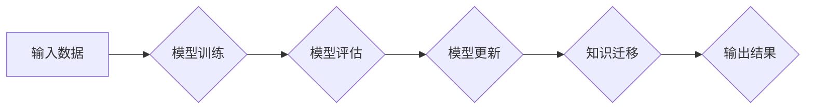

> Lifelong Learning, 持续学习, 机器学习, 深度学习, 知识迁移, 泛化能力, 模型更新, 代码实例

## 1. 背景介绍

在瞬息万变的科技时代，知识更新迭代的速度日新月异。传统的机器学习模型往往需要在特定任务下进行训练，一旦环境或任务发生变化，模型的性能就会急剧下降。为了解决这一问题，**终身学习 (Lifelong Learning)** 应运而生。

终身学习是指机器学习模型能够持续学习新知识，并将其应用于现有任务，同时保持对已有知识的理解和应用能力。它旨在构建能够适应不断变化环境的智能系统，使其能够持续学习和进化。

终身学习在众多领域具有广泛的应用前景，例如：

* **自动驾驶:** 自动驾驶系统需要不断学习新的道路规则、交通场景和驾驶策略，才能保证安全性和可靠性。
* **医疗诊断:** 医疗诊断需要不断学习新的疾病知识、治疗方法和医学影像分析技术，才能提高诊断准确率和治疗效果。
* **个性化推荐:** 个性化推荐系统需要不断学习用户的偏好和行为模式，才能提供更精准和有效的推荐结果。

## 2. 核心概念与联系

终身学习的核心概念包括：

* **知识迁移:** 将已学习到的知识应用于新的任务或环境。
* **模型更新:** 在学习新知识时，更新模型参数，使其能够更好地适应新的环境。
* **灾难性遗忘:** 学习新知识时，可能会导致模型忘记之前学习到的知识。

终身学习的目标是实现知识迁移和模型更新，同时避免灾难性遗忘。

**Mermaid 流程图:**



## 3. 核心算法原理 & 具体操作步骤

### 3.1  算法原理概述

终身学习算法主要分为以下几类：

* **经验重塑:** 通过调整模型参数，使模型能够更好地适应新的数据分布。
* **正则化:** 通过添加正则项，防止模型过拟合，提高模型的泛化能力。
* **元学习:** 通过学习学习策略，使模型能够更有效地学习新的任务。

### 3.2  算法步骤详解

以经验重塑算法为例，其具体操作步骤如下：

1. **初始化模型参数:** 使用预训练模型或随机初始化模型参数。
2. **训练新任务:** 使用新任务的数据训练模型，并更新模型参数。
3. **经验重塑:** 使用经验重塑技术，调整模型参数，使其能够更好地适应新任务和旧任务的知识。
4. **评估模型性能:** 使用测试数据评估模型在旧任务和新任务上的性能。
5. **重复步骤2-4:** 直到模型性能达到预期目标。

### 3.3  算法优缺点

**优点:**

* 能够有效地解决灾难性遗忘问题。
* 能够提高模型的泛化能力。

**缺点:**

* 算法复杂度较高。
* 需要大量的训练数据。

### 3.4  算法应用领域

经验重塑算法广泛应用于以下领域:

* **自然语言处理:** 语言模型的持续学习和知识更新。
* **计算机视觉:** 图像识别和分类的持续学习和知识迁移。
* **机器人学:** 机器人的持续学习和环境适应能力。

## 4. 数学模型和公式 & 详细讲解 & 举例说明

### 4.1  数学模型构建

假设我们有一个包含 $N$ 个任务的终身学习系统，每个任务 $i$ 都有一个对应的训练数据集 $D_i$。模型参数为 $\theta$，损失函数为 $L(\theta, D)$。

终身学习的目标是找到一个模型参数 $\theta$，使得模型在所有任务上的性能都达到最佳。

### 4.2  公式推导过程

为了实现这个目标，我们可以使用以下公式来更新模型参数：

$$\theta = \theta - \alpha \sum_{i=1}^{N} \frac{\partial L(\theta, D_i)}{\partial \theta}$$

其中，$\alpha$ 是学习率，$\frac{\partial L(\theta, D_i)}{\partial \theta}$ 是损失函数对模型参数的梯度。

### 4.3  案例分析与讲解

例如，在图像分类任务中，我们可以使用经验重塑算法来实现终身学习。

假设我们有一个包含 $N$ 个类别图像的分类器，每个类别都有一个对应的训练数据集 $D_i$。

当我们学习新的类别时，我们可以使用经验重塑算法来调整模型参数，使其能够更好地分类新的类别，同时避免忘记之前学习到的类别。

## 5. 项目实践：代码实例和详细解释说明

### 5.1  开发环境搭建

* Python 3.7+
* TensorFlow 2.0+
* PyTorch 1.0+

### 5.2  源代码详细实现

```python
import tensorflow as tf

# 定义模型
class Model(tf.keras.Model):
    def __init__(self):
        super(Model, self).__init__()
        self.dense1 = tf.keras.layers.Dense(128, activation='relu')
        self.dense2 = tf.keras.layers.Dense(64, activation='relu')
        self.dense3 = tf.keras.layers.Dense(10, activation='softmax')

    def call(self, x):
        x = self.dense1(x)
        x = self.dense2(x)
        x = self.dense3(x)
        return x

# 实例化模型
model = Model()

# 定义损失函数和优化器
loss_fn = tf.keras.losses.CategoricalCrossentropy()
optimizer = tf.keras.optimizers.Adam(learning_rate=0.001)

# 训练模型
for epoch in range(10):
    for batch in dataset:
        with tf.GradientTape() as tape:
            predictions = model(batch['images'])
            loss = loss_fn(batch['labels'], predictions)
        gradients = tape.gradient(loss, model.trainable_variables)
        optimizer.apply_gradients(zip(gradients, model.trainable_variables))

    print(f'Epoch {epoch+1}, Loss: {loss.numpy()}')
```

### 5.3  代码解读与分析

* 代码首先定义了一个简单的深度学习模型，包含三个全连接层。
* 然后定义了损失函数和优化器，用于训练模型。
* 训练循环中，使用梯度下降算法更新模型参数。
* 每训练一个 epoch，打印损失值，用于评估模型训练效果。

### 5.4  运行结果展示

训练完成后，可以使用测试数据评估模型的性能，例如计算准确率、召回率等指标。

## 6. 实际应用场景

### 6.1  自动驾驶

自动驾驶系统需要不断学习新的道路规则、交通场景和驾驶策略，才能保证安全性和可靠性。终身学习可以帮助自动驾驶系统持续学习和进化，提高其适应能力和安全性。

### 6.2  医疗诊断

医疗诊断需要不断学习新的疾病知识、治疗方法和医学影像分析技术，才能提高诊断准确率和治疗效果。终身学习可以帮助医疗诊断系统持续学习和更新知识，提高其诊断能力和治疗效果。

### 6.3  个性化推荐

个性化推荐系统需要不断学习用户的偏好和行为模式，才能提供更精准和有效的推荐结果。终身学习可以帮助个性化推荐系统持续学习和更新用户偏好，提高其推荐准确率和用户满意度。

### 6.4  未来应用展望

终身学习在未来将有更广泛的应用前景，例如：

* **智能客服:** 智能客服系统可以利用终身学习技术，不断学习用户的语言习惯和需求，提供更精准和人性化的服务。
* **个性化教育:** 个性化教育系统可以利用终身学习技术，根据学生的学习进度和能力，提供个性化的学习内容和教学方法。
* **科学研究:** 终身学习可以帮助科学家们更快地学习和掌握新的知识，加速科学研究的进展。

## 7. 工具和资源推荐

### 7.1  学习资源推荐

* **书籍:**
    * Lifelong Machine Learning by Marcus Hutter
    * Deep Learning by Ian Goodfellow
* **论文:**
    * Continual Learning with Deep Neural Networks: A Survey by Sebastian Ruder
    * Elastic Weight Consolidation: Preventing Catastrophic Forgetting in Neural Networks by  

### 7.2  开发工具推荐

* **TensorFlow:** https://www.tensorflow.org/
* **PyTorch:** https://pytorch.org/
* **Keras:** https://keras.io/

### 7.3  相关论文推荐

* Continual Learning with Deep Neural Networks: A Survey by Sebastian Ruder
* Elastic Weight Consolidation: Preventing Catastrophic Forgetting in Neural Networks by  

## 8. 总结：未来发展趋势与挑战

### 8.1  研究成果总结

终身学习是一个活跃的研究领域，近年来取得了显著的进展。

* 出现了多种有效的终身学习算法，例如经验重塑、正则化和元学习。
* 这些算法能够有效地解决灾难性遗忘问题，提高模型的泛化能力。

### 8.2  未来发展趋势

* **更有效的终身学习算法:** 研究更有效的终身学习算法，能够更好地解决灾难性遗忘问题，提高模型的泛化能力。
* **更强大的硬件支持:** 随着硬件技术的进步，终身学习系统能够处理更大的数据规模，学习更复杂的知识。
* **更广泛的应用场景:** 终身学习技术将应用于更多领域，例如智能客服、个性化教育和科学研究。

### 8.3  面临的挑战

* **数据获取和标注:** 终身学习需要大量的训练数据，获取和标注这些数据是一个挑战。
* **模型复杂度:** 终身学习模型通常比较复杂，训练和部署这些模型需要强大的计算资源。
* **安全性和隐私性:** 终身学习系统需要处理大量的用户数据，保证数据安全性和隐私性是一个重要问题。

### 8.4  研究展望

终身学习是一个充满挑战和机遇的领域，未来将会有更多的研究和应用。

## 9. 附录：常见问题与解答

* **什么是灾难性遗忘?**

灾难性遗忘是指机器学习模型在学习新知识时，忘记之前学习到的知识。

* **终身学习与迁移学习有什么区别?**

迁移学习是指将已学习到的知识应用于新的任务，而终身学习是指机器学习模型能够持续学习新知识，并将其应用于现有任务，同时保持对已有知识的理解和应用能力。

* **终身学习有哪些应用场景?**

终身学习的应用场景非常广泛，例如自动驾驶、医疗诊断、个性化推荐等。

作者：禅与计算机程序设计艺术 / Zen and the Art of Computer Programming


<end_of_turn>