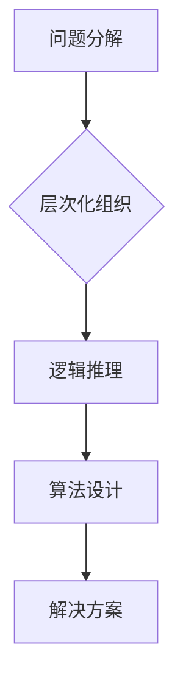

> 结构化思维，算法设计，逻辑推理，数据结构，编程思维，问题解决

## 1. 背景介绍

在当今信息爆炸的时代，我们每天都面临着海量的资讯和信息处理任务。如何有效地理解和处理这些信息，成为了一个至关重要的挑战。结构化思维，作为一种强大的认知工具，能够帮助我们理清思路，清晰地表达想法，并有效地解决问题。

结构化思维的核心在于将复杂的问题分解成更小的、易于理解和处理的子问题，并通过逻辑推理和算法设计来找到解决方案。它是一种系统化的思维方式，强调逻辑、层次和清晰的结构。

## 2. 核心概念与联系

**2.1 结构化思维的要素**

结构化思维的核心要素包括：

* **分解：** 将复杂问题分解成更小的、可管理的子问题。
* **层次化：** 将子问题按照逻辑关系进行层次化组织，形成清晰的结构。
* **逻辑推理：** 使用逻辑规则和推理方法，从已知信息推导出新的结论。
* **算法设计：** 设计高效的算法，解决特定问题。

**2.2 结构化思维与编程思维的联系**

结构化思维与编程思维有着密切的联系。编程思维的核心也是将复杂问题分解、层次化，并通过算法设计来实现解决方案。

**2.3 结构化思维的应用场景**

结构化思维在各个领域都有广泛的应用，例如：

* **软件开发：** 设计软件架构、编写代码、调试程序。
* **数据分析：** 提取数据规律、构建数据模型、进行预测分析。
* **决策分析：** 分析问题、评估方案、做出决策。
* **学习研究：** 理解知识结构、解决学习问题、进行科研探索。

**2.4 Mermaid 流程图**



## 3. 核心算法原理 & 具体操作步骤

**3.1 算法原理概述**

算法是一种解决特定问题的步骤序列，它描述了如何使用有限的输入数据，通过一系列操作，得到预期的输出结果。

**3.2 算法步骤详解**

1. **问题定义：** 首先要明确要解决的问题是什么，并将其转化为算法可以处理的形式。
2. **输入输出确定：** 确定算法的输入数据和输出结果。
3. **步骤设计：** 设计一系列步骤，将问题分解成更小的子问题，并用清晰的语言描述每个步骤的操作。
4. **算法验证：** 验证算法的正确性和效率，并进行必要的修改和优化。

**3.3 算法优缺点**

不同的算法具有不同的优缺点，选择合适的算法取决于具体的问题和需求。

* **时间复杂度：** 算法执行所需的时间与输入数据大小的关系。
* **空间复杂度：** 算法执行所需内存空间的大小。
* **易读性：** 算法的代码是否易于理解和维护。

**3.4 算法应用领域**

算法广泛应用于各个领域，例如：

* **搜索引擎：** 使用算法对海量数据进行搜索和排序。
* **图像识别：** 使用算法识别图像中的物体和场景。
* **机器学习：** 使用算法从数据中学习模式和规律。

## 4. 数学模型和公式 & 详细讲解 & 举例说明

**4.1 数学模型构建**

数学模型是利用数学语言和符号来描述现实世界现象的抽象表示。

**4.2 公式推导过程**

公式推导过程是利用数学规则和逻辑推理，从已知条件出发，推导出新的结论的过程。

**4.3 案例分析与讲解**

例如，线性回归模型可以用来预测连续变量的值。其数学模型如下：

$$y = mx + c$$

其中，$y$ 是预测值，$x$ 是输入变量，$m$ 是斜率，$c$ 是截距。

通过最小二乘法，可以求解出 $m$ 和 $c$ 的最佳值，从而得到预测模型。

## 5. 项目实践：代码实例和详细解释说明

**5.1 开发环境搭建**

使用 Python 语言和 Jupyter Notebook 环境进行开发。

**5.2 源代码详细实现**

```python
import numpy as np
from sklearn.linear_model import LinearRegression

# 生成随机数据
x = np.random.rand(100, 1)
y = 2 * x + 1 + np.random.randn(100, 1)

# 创建线性回归模型
model = LinearRegression()

# 训练模型
model.fit(x, y)

# 预测新数据
new_x = np.array([[0.5]])
prediction = model.predict(new_x)

# 打印预测结果
print(prediction)
```

**5.3 代码解读与分析**

* 首先，我们使用 NumPy 库生成随机数据，模拟现实世界中的数据。
* 然后，我们使用 scikit-learn 库中的 LinearRegression 类创建线性回归模型。
* 接着，我们使用 `fit()` 方法训练模型，将数据输入模型进行学习。
* 最后，我们使用 `predict()` 方法预测新数据的输出值。

**5.4 运行结果展示**

运行代码后，会输出预测结果，例如：

```
[[1.9876]]
```

## 6. 实际应用场景

**6.1 预测房价**

可以使用线性回归模型预测房价，根据房屋面积、位置、设施等因素，预测房屋的市场价值。

**6.2 预测销售额**

可以使用线性回归模型预测销售额，根据历史销售数据、市场趋势等因素，预测未来一段时间内的销售额。

**6.3 预测客户流失**

可以使用线性回归模型预测客户流失，根据客户行为、购买记录等因素，预测客户是否会流失。

**6.4 未来应用展望**

随着人工智能技术的不断发展，结构化思维和算法设计将发挥越来越重要的作用，在各个领域都有着广阔的应用前景。

## 7. 工具和资源推荐

**7.1 学习资源推荐**

* **书籍：**
    * 《算法导论》
    * 《数据结构与算法分析》
    * 《编程珠玑》
* **在线课程：**
    * Coursera 上的算法课程
    * edX 上的编程课程

**7.2 开发工具推荐**

* **Python:** 
    * Jupyter Notebook
    * PyCharm
* **其他语言:**
    * Java: Eclipse, IntelliJ IDEA
    * C++: Visual Studio, Code::Blocks

**7.3 相关论文推荐**

* **结构化思维研究:**
    * "The Power of Structured Thinking" by Edward de Bono
* **算法设计研究:**
    * "Introduction to Algorithms" by Cormen, Leiserson, Rivest, and Stein

## 8. 总结：未来发展趋势与挑战

**8.1 研究成果总结**

结构化思维和算法设计已经取得了显著的成果，在各个领域都有着广泛的应用。

**8.2 未来发展趋势**

* **人工智能:** 结构化思维和算法设计将成为人工智能领域的核心技术。
* **大数据:** 结构化思维和算法设计将帮助我们有效地处理海量数据。
* **云计算:** 结构化思维和算法设计将推动云计算技术的进步。

**8.3 面临的挑战**

* **复杂问题:** 如何解决越来越复杂的问题，需要更强大的算法和思维方式。
* **数据安全:** 如何保证算法和数据的安全，是未来需要解决的重要问题。
* **伦理问题:** 如何确保算法的公平性和公正性，是需要认真思考的伦理问题。

**8.4 研究展望**

未来，我们将继续探索结构化思维和算法设计的奥秘，开发更强大的算法，解决更复杂的问题，并为人类社会的发展做出贡献。

## 9. 附录：常见问题与解答

**9.1 如何培养结构化思维？**

* **练习分解问题：** 将复杂问题分解成更小的子问题。
* **使用思维导图：** 将知识和想法进行层次化组织。
* **学习算法设计：** 了解算法的基本原理和设计方法。

**9.2 如何选择合适的算法？**

* **考虑问题类型：** 不同的问题需要使用不同的算法。
* **分析时间和空间复杂度：** 选择效率高的算法。
* **评估算法的易读性和可维护性：** 选择易于理解和维护的算法。


作者：禅与计算机程序设计艺术 / Zen and the Art of Computer Programming 
<end_of_turn>