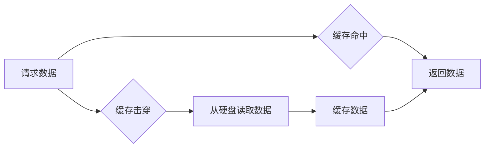

> 缓存机制、数据存储、性能优化、算法设计、系统架构、数据库、网络传输

## 1. 背景介绍

在现代软件系统中，数据访问速度直接影响着系统的性能和用户体验。由于硬盘读写速度远低于CPU处理速度，频繁访问硬盘存储的数据会造成严重的性能瓶颈。为了解决这个问题，缓存机制应运而生。缓存机制是一种将经常访问的数据存储在高速内存中，以便快速访问的技术。

缓存机制广泛应用于各种系统，例如：

* **Web服务器:** 缓存网页内容、静态资源等，提高网页加载速度。
* **数据库:** 缓存查询结果、数据表结构等，减少数据库访问次数。
* **操作系统:** 缓存文件系统数据、进程状态等，提高系统响应速度。
* **应用程序:** 缓存数据结构、计算结果等，提高应用程序运行效率。

## 2. 核心概念与联系

### 2.1 缓存层次结构

缓存机制通常采用多层次结构，从高速到低速依次排列，形成一个缓存层次结构。

* **L1 Cache:** 位于CPU内部，速度最快，容量最小。
* **L2 Cache:** 位于CPU外，速度较L1 Cache慢，容量较大。
* **L3 Cache:** 位于主板上的共享缓存，速度较L2 Cache慢，容量最大。
* **主存:** 位于主板上的随机存取存储器，速度较慢，容量较大。
* **硬盘:** 位于计算机外壳内的永久存储器，速度最慢，容量最大。

### 2.2 缓存命中率和缓存击穿

* **缓存命中率:** 指缓存中能够找到所需数据的比例。命中率越高，缓存机制的效率越高。
* **缓存击穿:** 指缓存中找不到所需数据的事件。当发生缓存击穿时，系统需要从下层缓存或硬盘中读取数据，导致性能下降。

### 2.3 缓存淘汰策略

当缓存空间不足时，需要淘汰一些数据以腾出空间。常用的缓存淘汰策略包括：

* **FIFO (First-In, First-Out):** 淘汰最早进入缓存的数据。
* **LRU (Least Recently Used):** 淘汰最近最少使用的缓存数据。
* **MRU (Most Recently Used):** 淘汰最近最频繁使用的缓存数据。
* **LFU (Least Frequently Used):** 淘汰最少访问的缓存数据。

**Mermaid 流程图**



## 3. 核心算法原理 & 具体操作步骤

### 3.1 算法原理概述

缓存机制的核心算法是根据数据访问频率和缓存空间大小，选择最优的缓存策略，以最大化缓存命中率，最小化缓存击穿。

### 3.2 算法步骤详解

1. **数据访问:** 当系统需要访问数据时，首先检查缓存中是否存在该数据。
2. **缓存命中:** 如果缓存中存在该数据，则直接返回数据，称为缓存命中。
3. **缓存击穿:** 如果缓存中不存在该数据，则需要从下层缓存或硬盘中读取数据，称为缓存击穿。
4. **数据缓存:** 读取到的数据需要被缓存到高速内存中，以便下次访问时能够直接命中。
5. **缓存淘汰:** 当缓存空间不足时，需要淘汰一些数据以腾出空间。

### 3.3 算法优缺点

**优点:**

* 提高数据访问速度，显著提升系统性能。
* 减少硬盘读写次数，延长硬盘寿命。
* 降低网络传输流量，节省网络带宽。

**缺点:**

* 缓存管理需要消耗一定的系统资源。
* 缓存数据可能过时，需要定期更新。
* 缓存击穿会导致性能下降。

### 3.4 算法应用领域

缓存机制广泛应用于各种系统，例如：

* **Web服务器:** 缓存网页内容、静态资源等，提高网页加载速度。
* **数据库:** 缓存查询结果、数据表结构等，减少数据库访问次数。
* **操作系统:** 缓存文件系统数据、进程状态等，提高系统响应速度。
* **应用程序:** 缓存数据结构、计算结果等，提高应用程序运行效率。

## 4. 数学模型和公式 & 详细讲解 & 举例说明

### 4.1 数学模型构建

缓存命中率可以表示为：

$$
H = \frac{N_h}{N_t}
$$

其中：

* $H$ 表示缓存命中率。
* $N_h$ 表示缓存命中次数。
* $N_t$ 表示总访问次数。

### 4.2 公式推导过程

缓存击穿率可以表示为：

$$
C = 1 - H
$$

其中：

* $C$ 表示缓存击穿率。

### 4.3 案例分析与讲解

假设一个系统总访问次数为1000次，其中缓存命中次数为800次，则：

* 缓存命中率 $H = \frac{800}{1000} = 0.8$
* 缓存击穿率 $C = 1 - 0.8 = 0.2$

## 5. 项目实践：代码实例和详细解释说明

### 5.1 开发环境搭建

* 操作系统: Ubuntu 20.04 LTS
* 编程语言: Python 3.8
* 框架: Flask

### 5.2 源代码详细实现

```python
from flask import Flask, request, jsonify

app = Flask(__name__)

# 模拟缓存数据
cache = {}

@app.route('/data/<key>')
def get_data(key):
    if key in cache:
        print(f"Cache hit for key: {key}")
        return jsonify({'data': cache[key]})
    else:
        print(f"Cache miss for key: {key}")
        # 从数据库或其他数据源获取数据
        data = {'key': key, 'value': 'data'}
        cache[key] = data
        return jsonify(data)

if __name__ == '__main__':
    app.run(debug=True)
```

### 5.3 代码解读与分析

* 首先，我们使用Flask框架构建了一个简单的API。
* 然后，我们定义了一个模拟缓存的字典`cache`。
* 当用户请求`/data/<key>`时，我们首先检查`cache`中是否存在该key。
* 如果存在，则直接返回缓存中的数据，并打印"Cache hit"信息。
* 如果不存在，则从数据库或其他数据源获取数据，并将数据缓存到`cache`中，并返回数据。

### 5.4 运行结果展示

当用户多次请求同一个key时，第一次请求会打印"Cache miss"信息，并从数据库获取数据并缓存到`cache`中。第二次请求会打印"Cache hit"信息，并直接从`cache`中返回数据。

## 6. 实际应用场景

### 6.1 Web服务器缓存

Web服务器可以缓存网页内容、静态资源等，提高网页加载速度。例如，当用户访问一个网站时，服务器可以将网页内容缓存到内存中，以便下次用户访问时能够直接从缓存中读取数据，从而减少服务器的负载和提高用户体验。

### 6.2 数据库缓存

数据库可以缓存查询结果、数据表结构等，减少数据库访问次数。例如，当用户查询数据库时，如果查询结果已经缓存到内存中，则可以直接从缓存中读取数据，从而减少数据库的访问次数和提高查询速度。

### 6.3 操作系统缓存

操作系统可以缓存文件系统数据、进程状态等，提高系统响应速度。例如，当用户访问一个文件时，如果文件内容已经缓存到内存中，则可以直接从缓存中读取数据，从而减少硬盘读写次数和提高文件访问速度。

### 6.4 应用程序缓存

应用程序可以缓存数据结构、计算结果等，提高应用程序运行效率。例如，当应用程序需要频繁访问某个数据结构时，可以将数据结构缓存到内存中，从而减少数据结构的创建和销毁次数，提高应用程序的运行效率。

### 6.5 未来应用展望

随着云计算、大数据、人工智能等技术的快速发展，缓存机制将发挥越来越重要的作用。未来，缓存机制将更加智能化、自动化，并与其他技术融合，例如：

* **分布式缓存:** 将缓存数据分布到多个节点上，提高缓存的可用性和扩展性。
* **智能缓存:** 利用机器学习算法，预测数据访问频率，动态调整缓存策略。
* **边缘缓存:** 将缓存数据部署到网络边缘，减少数据传输距离，提高数据访问速度。

## 7. 工具和资源推荐

### 7.1 学习资源推荐

* **书籍:**
    * 《深入理解计算机系统》
    * 《操作系统导论》
    * 《计算机网络》
* **在线课程:**
    * Coursera: Operating Systems
    * edX: Computer Networks
    * Udemy: Cache Optimization Techniques

### 7.2 开发工具推荐

* **Redis:** 高性能的内存数据存储系统，广泛用于缓存。
* **Memcached:** 轻量级的内存对象缓存系统。
* **Varnish Cache:** 高性能的HTTP缓存代理服务器。

### 7.3 相关论文推荐

* **The Case for a Memory-Based Cache**
* **A Survey of Cache Coherence Protocols**
* **Cache Replacement Policies: A Survey**

## 8. 总结：未来发展趋势与挑战

### 8.1 研究成果总结

缓存机制是现代软件系统中不可或缺的一部分，它能够显著提高系统性能和用户体验。通过合理的缓存策略和算法设计，可以有效地减少数据访问时间，提高资源利用率，并降低系统成本。

### 8.2 未来发展趋势

未来，缓存机制将朝着以下方向发展：

* **智能化:** 利用机器学习算法，预测数据访问频率，动态调整缓存策略。
* **分布式化:** 将缓存数据分布到多个节点上，提高缓存的可用性和扩展性。
* **边缘化:** 将缓存数据部署到网络边缘，减少数据传输距离，提高数据访问速度。

### 8.3 面临的挑战

缓存机制的发展也面临着一些挑战：

* **数据一致性:** 在分布式缓存环境下，保证数据的一致性是一个重要的挑战。
* **缓存管理复杂性:** 随着缓存规模的扩大，缓存管理的复杂性也会增加。
* **安全性和隐私性:** 缓存数据可能包含敏感信息，需要采取措施保证其安全性和隐私性。

### 8.4 研究展望

未来，研究人员将继续探索新的缓存算法和架构，以解决上述挑战，并推动缓存机制的进一步发展。


## 9. 附录：常见问题与解答

**1. 缓存击穿如何解决？**

缓存击穿可以通过以下方法解决：

* **预热缓存:** 在系统启动时，预先加载一些常用的数据到缓存中。
* **容错机制:** 当发生缓存击穿时，可以从其他缓存节点或数据库中获取数据。
* **缓存过期策略:** 设置合理的缓存过期时间，定期更新缓存数据。

**2. 如何选择合适的缓存策略？**

选择合适的缓存策略需要考虑以下因素：

* 数据访问频率
* 缓存空间大小
* 系统性能要求
* 数据更新频率

**3. 缓存机制的优缺点是什么？**

**优点:**

* 提高数据访问速度
* 减少硬盘读写次数
* 降低网络传输流量

**缺点:**

* 缓存管理需要消耗一定的系统资源
* 缓存数据可能过时
* 缓存击穿会导致性能下降


作者：禅与计算机程序设计艺术 / Zen and the Art of Computer Programming 
<end_of_turn>