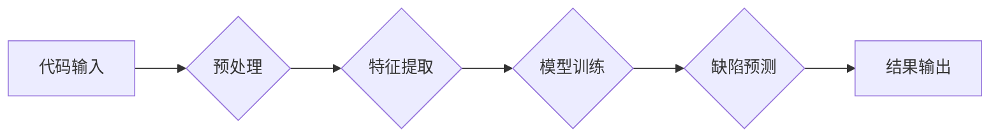

> 代码审查，自动化，人工智能，机器学习，深度学习，软件质量

## 1. 背景介绍

在软件开发领域，代码审查被广泛认为是提高软件质量、降低缺陷率的重要手段。传统的代码审查通常由经验丰富的开发人员手动进行，这种方式虽然有效，但存在着效率低、成本高、主观性强等问题。随着人工智能技术的快速发展，自动化代码审查逐渐成为一种新的趋势，它利用机器学习和深度学习算法，自动分析代码，识别潜在的缺陷和问题，从而提高代码审查的效率和准确性。

## 2. 核心概念与联系

**2.1 代码审查概述**

代码审查是指在软件开发过程中，由多个开发人员对代码进行审查和评估的过程。其目的是发现代码中的潜在缺陷、错误和安全漏洞，并确保代码符合预期的设计规范和编码标准。

**2.2 自动化代码审查**

自动化代码审查是指利用计算机程序自动分析代码，识别潜在的缺陷和问题。它可以帮助开发人员节省时间和精力，提高代码审查的效率和准确性。

**2.3 人工智能与代码审查**

人工智能（AI）技术可以应用于自动化代码审查，提高其智能化水平。机器学习算法可以从大量的代码数据中学习，识别代码中的模式和特征，从而更准确地识别潜在的缺陷和问题。深度学习算法可以进一步提高识别精度，并能够识别更复杂的代码缺陷。

**2.4 核心架构**



## 3. 核心算法原理 & 具体操作步骤

**3.1 算法原理概述**

自动化代码审查的核心算法通常基于机器学习和深度学习技术。常见的算法包括：

* **支持向量机（SVM）:** SVM是一种监督学习算法，可以用于分类和回归问题。在代码审查中，SVM可以用于识别代码中的缺陷类型。
* **决策树:** 决策树是一种树形结构的分类算法，可以用于识别代码中的缺陷类型。
* **随机森林:** 随机森林是一种集成学习算法，由多个决策树组成。它可以提高分类的准确性。
* **深度神经网络:** 深度神经网络是一种更复杂的机器学习算法，可以学习代码中的更复杂的模式和特征。

**3.2 算法步骤详解**

1. **数据收集:** 收集大量的代码数据，包括有缺陷的代码和无缺陷的代码。
2. **数据预处理:** 对代码数据进行预处理，例如去除注释、空格等无关信息，并将其转换为机器可理解的格式。
3. **特征提取:** 从代码数据中提取特征，例如代码结构、语法、变量名等。
4. **模型训练:** 使用机器学习算法对提取的特征进行训练，构建一个能够识别代码缺陷的模型。
5. **模型评估:** 使用测试数据评估模型的性能，例如准确率、召回率等。
6. **模型部署:** 将训练好的模型部署到代码审查工具中，用于自动分析代码。

**3.3 算法优缺点**

* **优点:**
    * 提高代码审查效率
    * 降低代码审查成本
    * 提高代码审查的准确性
    * 识别更复杂的代码缺陷
* **缺点:**
    * 需要大量的代码数据进行训练
    * 模型的准确性取决于训练数据的质量
    * 难以识别所有类型的代码缺陷

**3.4 算法应用领域**

* **软件开发:** 自动化代码审查可以帮助开发人员更快地发现和修复代码缺陷，提高软件质量。
* **安全审计:** 自动化代码审查可以帮助安全审计人员识别代码中的安全漏洞，提高软件安全性。
* **代码复用:** 自动化代码审查可以帮助开发人员识别可复用的代码片段，提高代码复用率。

## 4. 数学模型和公式 & 详细讲解 & 举例说明

**4.1 数学模型构建**

在自动化代码审查中，可以使用机器学习模型来预测代码是否包含缺陷。一个常见的模型是逻辑回归模型，它将代码特征作为输入，输出代码是否包含缺陷的概率。

**4.2 公式推导过程**

逻辑回归模型的输出是一个概率值，该概率值表示代码包含缺陷的可能性。该概率值可以通过以下公式计算：

$$
p(y=1|x) = \frac{1}{1 + e^{-(w^T x + b)}}
$$

其中：

* $p(y=1|x)$ 是代码包含缺陷的概率
* $x$ 是代码特征向量
* $w$ 是模型参数向量
* $b$ 是模型偏置项
* $e$ 是自然对数的底数

**4.3 案例分析与讲解**

假设我们有一个代码片段，其特征向量为 $x = [1, 2, 3]$, 模型参数为 $w = [0.5, 0.2, 0.1]$, 偏置项为 $b = -0.1$. 则代码包含缺陷的概率为：

$$
p(y=1|x) = \frac{1}{1 + e^{-(0.5 * 1 + 0.2 * 2 + 0.1 * 3 - 0.1)}} = 0.73
$$

这意味着该代码片段包含缺陷的概率为 73%。

## 5. 项目实践：代码实例和详细解释说明

**5.1 开发环境搭建**

* Python 3.x
* TensorFlow 或 PyTorch
* Git

**5.2 源代码详细实现**

```python
import tensorflow as tf

# 定义模型
model = tf.keras.models.Sequential([
    tf.keras.layers.Dense(128, activation='relu', input_shape=(num_features,)),
    tf.keras.layers.Dense(64, activation='relu'),
    tf.keras.layers.Dense(1, activation='sigmoid')
])

# 编译模型
model.compile(optimizer='adam',
              loss='binary_crossentropy',
              metrics=['accuracy'])

# 训练模型
model.fit(X_train, y_train, epochs=10)

# 评估模型
loss, accuracy = model.evaluate(X_test, y_test)
print('Loss:', loss)
print('Accuracy:', accuracy)
```

**5.3 代码解读与分析**

* 该代码实现了一个简单的深度学习模型，用于预测代码是否包含缺陷。
* 模型包含三个全连接层，分别具有 128、64 和 1 个神经元。
* 激活函数为 ReLU 和 sigmoid。
* 损失函数为二分类交叉熵，优化器为 Adam。
* 模型训练了 10 个 epochs。

**5.4 运行结果展示**

运行结果将显示模型的损失值和准确率。

## 6. 实际应用场景

**6.1 软件开发公司**

自动化代码审查可以帮助软件开发公司提高代码质量，降低开发成本，并加快软件开发周期。

**6.2 开源项目**

开源项目可以利用自动化代码审查工具来提高代码质量，并吸引更多贡献者。

**6.3 学术研究**

自动化代码审查是人工智能和软件工程领域的研究热点，许多学者正在研究新的算法和方法。

**6.4 未来应用展望**

* **更智能的代码审查:** 利用更先进的机器学习算法，识别更复杂的代码缺陷。
* **个性化代码审查:** 根据开发人员的经验和技能水平，提供个性化的代码审查建议。
* **代码生成:** 利用自动化代码审查的原理，生成高质量的代码。

## 7. 工具和资源推荐

**7.1 学习资源推荐**

* **书籍:**
    * 《深度学习》
    * 《机器学习实战》
* **在线课程:**
    * Coursera: 深度学习
    * Udacity: 机器学习工程师

**7.2 开发工具推荐**

* **SonarQube:** 一个开源的代码质量分析工具。
* **Code Climate:** 一个商业化的代码质量分析工具。
* **DeepCode:** 一个基于人工智能的代码审查工具。

**7.3 相关论文推荐**

* **DeepCode: An AI-Powered Code Review Tool**
* **CodeBERT: A Pre-trained Language Model for Code**
* **CodeSearchNet: A Search Engine for Code**

## 8. 总结：未来发展趋势与挑战

**8.1 研究成果总结**

自动化代码审查技术取得了显著的进展，能够识别多种类型的代码缺陷，提高代码质量。

**8.2 未来发展趋势**

* **更智能的代码审查:** 利用更先进的机器学习算法，识别更复杂的代码缺陷。
* **个性化代码审查:** 根据开发人员的经验和技能水平，提供个性化的代码审查建议。
* **代码生成:** 利用自动化代码审查的原理，生成高质量的代码。

**8.3 面临的挑战**

* **数据不足:** 训练高质量的自动化代码审查模型需要大量的代码数据。
* **模型解释性:** 许多机器学习模型的决策过程难以解释，这使得自动化代码审查的结果难以被接受。
* **代码复杂性:** 随着软件的复杂性不断增加，自动化代码审查的难度也越来越大。

**8.4 研究展望**

未来研究将集中在解决上述挑战，开发更智能、更可靠的自动化代码审查技术。

## 9. 附录：常见问题与解答

**9.1 如何选择合适的自动化代码审查工具？**

选择合适的自动化代码审查工具需要考虑以下因素：

* **功能:** 工具是否支持您需要的代码语言和代码审查功能？
* **性能:** 工具的性能是否满足您的需求？
* **价格:** 工具的价格是否合理？
* **易用性:** 工具是否易于使用和集成到您的开发流程中？

**9.2 如何提高自动化代码审查的准确性？**

提高自动化代码审查的准确性可以通过以下方法：

* **收集更多高质量的代码数据进行训练。**
* **使用更先进的机器学习算法。**
* **结合人工代码审查，以提高准确性。**


作者：禅与计算机程序设计艺术 / Zen and the Art of Computer Programming 
<end_of_turn>