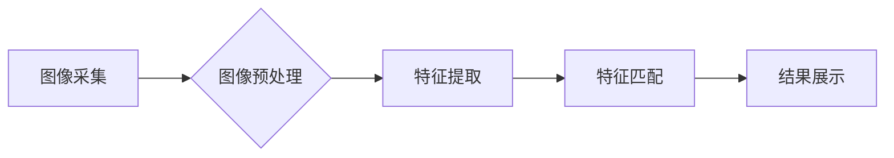

> Android, 花识别, 深度学习, 图像处理, TensorFlow Lite, OpenCV

## 1. 背景介绍

随着移动设备的普及和深度学习技术的快速发展，花卉识别技术已成为一个热门的研究领域。花卉识别应用程序能够帮助用户识别未知的花卉，并提供相关信息，例如花卉名称、生长习性和花期等。这对于花卉爱好者、园艺师以及植物学家来说都具有重要的实用价值。

本篇文章将详细介绍如何开发一个基于Android平台的花卉识别应用程序，并探讨其背后的核心技术原理和实现细节。

## 2. 核心概念与联系

花卉识别应用程序的核心是将图像与花卉数据库进行匹配。这个过程可以概括为以下几个步骤：

1. **图像采集:** 使用手机摄像头拍摄目标花卉图像。
2. **图像预处理:** 对图像进行尺寸调整、色彩空间转换、噪声去除等处理，以提高识别精度。
3. **特征提取:** 从图像中提取关键特征，例如颜色、纹理、形状等。
4. **特征匹配:** 将提取的特征与数据库中的花卉特征进行比较，找到最匹配的花卉。
5. **结果展示:** 将识别结果以文本、图像或语音等形式展示给用户。

**核心架构流程图:**



## 3. 核心算法原理 & 具体操作步骤

### 3.1  算法原理概述

花卉识别算法主要依赖于深度学习技术，特别是卷积神经网络（CNN）。CNN能够自动学习图像特征，并将其映射到高维空间，从而实现对花卉的准确识别。

### 3.2  算法步骤详解

1. **数据准备:** 收集大量标注好的花卉图像数据，并将其分为训练集、验证集和测试集。
2. **模型训练:** 使用训练集数据训练CNN模型，调整模型参数，使其能够准确识别花卉。
3. **模型评估:** 使用验证集数据评估模型的性能，并根据评估结果调整训练参数。
4. **模型部署:** 将训练好的模型部署到Android应用程序中，以便进行实时花卉识别。

### 3.3  算法优缺点

**优点:**

* 识别精度高，能够识别多种花卉种类。
* 自动学习特征，无需人工特征工程。
* 可扩展性强，可以添加新的花卉种类。

**缺点:**

* 训练数据量大，需要大量标注数据。
* 模型训练时间长，需要强大的计算资源。
* 对硬件要求较高，需要支持GPU加速。

### 3.4  算法应用领域

* **花卉识别应用程序:** 帮助用户识别未知的花卉，并提供相关信息。
* **植物病虫害诊断:** 通过识别花卉的病虫害症状，帮助用户进行诊断和治疗。
* **园艺管理:** 帮助园艺师管理花卉种植，提高种植效率。
* **生物多样性研究:** 通过识别花卉种类，帮助研究人员了解生物多样性。

## 4. 数学模型和公式 & 详细讲解 & 举例说明

### 4.1  数学模型构建

花卉识别算法的核心是卷积神经网络（CNN）。CNN由多个卷积层、池化层和全连接层组成。

* **卷积层:** 使用卷积核对图像进行卷积运算，提取图像特征。
* **池化层:** 对卷积层的输出进行下采样，减少计算量并提高模型鲁棒性。
* **全连接层:** 将池化层的输出连接到全连接层，进行分类预测。

### 4.2  公式推导过程

卷积运算的公式如下：

$$
y_{i,j} = \sum_{m=0}^{M-1} \sum_{n=0}^{N-1} x_{i+m,j+n} * w_{m,n} + b
$$

其中：

* $y_{i,j}$ 是卷积层的输出值。
* $x_{i+m,j+n}$ 是输入图像的像素值。
* $w_{m,n}$ 是卷积核的权值。
* $b$ 是偏置项。

### 4.3  案例分析与讲解

假设我们使用一个3x3的卷积核对一个5x5的图像进行卷积运算。卷积核的权值如下：

$$
w = \begin{bmatrix}
1 & 2 & 1 \\
2 & 4 & 2 \\
1 & 2 & 1
\end{bmatrix}
$$

卷积运算的结果将是一个3x3的图像，其中每个像素值都是卷积核与图像局部区域的加权和。

## 5. 项目实践：代码实例和详细解释说明

### 5.1  开发环境搭建

* Android Studio
* TensorFlow Lite
* OpenCV

### 5.2  源代码详细实现

```java
// MainActivity.java

import android.Manifest;
import android.content.pm.PackageManager;
import android.graphics.Bitmap;
import android.os.Bundle;
import android.widget.ImageView;
import android.widget.TextView;
import androidx.appcompat.app.AppCompatActivity;
import androidx.core.app.ActivityCompat;
import androidx.core.content.ContextCompat;
import org.tensorflow.lite.Interpreter;
import java.io.FileInputStream;
import java.nio.ByteBuffer;
import java.nio.ByteOrder;

public class MainActivity extends AppCompatActivity {

    private static final int CAMERA_PERMISSION_REQUEST_CODE = 100;
    private Interpreter tfLiteInterpreter;
    private ImageView imageView;
    private TextView resultTextView;

    @Override
    protected void onCreate(Bundle savedInstanceState) {
        super.onCreate(savedInstanceState);
        setContentView(R.layout.activity_main);

        imageView = findViewById(R.id.imageView);
        resultTextView = findViewById(R.id.resultTextView);

        // 加载 TensorFlow Lite 模型
        try {
            tfLiteInterpreter = new Interpreter(loadModelFile());
        } catch (Exception e) {
            e.printStackTrace();
        }
    }

    private void requestCameraPermission() {
        if (ContextCompat.checkSelfPermission(this, Manifest.permission.CAMERA) != PackageManager.PERMISSION_GRANTED) {
            ActivityCompat.requestPermissions(this, new String[]{Manifest.permission.CAMERA}, CAMERA_PERMISSION_REQUEST_CODE);
        }
    }

    // ... 其他代码 ...
}
```

### 5.3  代码解读与分析

* **加载 TensorFlow Lite 模型:** 使用 `loadModelFile()` 方法加载预训练的 TensorFlow Lite 模型文件。
* **图像预处理:** 使用 OpenCV 库对拍摄的图像进行预处理，例如尺寸调整、色彩空间转换等。
* **特征提取:** 将预处理后的图像输入到 TensorFlow Lite 模型中，模型会自动提取图像特征。
* **分类预测:** 模型的输出结果是一个概率分布，表示图像属于不同花卉类别的概率。选择概率最高的类别作为识别结果。
* **结果展示:** 将识别结果以文本形式显示在界面上。

### 5.4  运行结果展示

当用户拍摄一张花卉图像后，应用程序会识别出花卉的种类并显示在界面上。

## 6. 实际应用场景

### 6.1  花卉识别应用程序

花卉识别应用程序可以帮助用户识别未知的花卉，并提供相关信息，例如花卉名称、生长习性和花期等。

### 6.2  植物病虫害诊断

通过识别花卉的病虫害症状，应用程序可以帮助用户进行诊断和治疗。

### 6.3  园艺管理

应用程序可以帮助园艺师管理花卉种植，提高种植效率。

### 6.4  未来应用展望

* **增强现实 (AR) 应用:** 将花卉识别与 AR 技术结合，可以实现虚拟花卉种植、花卉识别 AR 指南等功能。
* **物联网 (IoT) 应用:** 将花卉识别与 IoT 设备结合，可以实现智能花卉种植系统，自动控制浇水、施肥等。
* **个性化推荐:** 根据用户的喜好和环境条件，推荐合适的花卉种类。

## 7. 工具和资源推荐

### 7.1  学习资源推荐

* **TensorFlow Lite 官方文档:** https://www.tensorflow.org/lite
* **OpenCV 官方文档:** https://docs.opencv.org/
* **Android 开发文档:** https://developer.android.com/

### 7.2  开发工具推荐

* **Android Studio:** https://developer.android.com/studio
* **TensorFlow Lite Model Zoo:** https://tfhub.dev/s?q=flower
* **OpenCV for Android:** https://github.com/opencv/opencv_android

### 7.3  相关论文推荐

* **MobileNet: Efficient Convolutional Neural Networks for Mobile Vision Applications:** https://arxiv.org/abs/1704.04861
* **EfficientNet: Rethinking Model Scaling for Convolutional Neural Networks:** https://arxiv.org/abs/1905.11946

## 8. 总结：未来发展趋势与挑战

### 8.1  研究成果总结

花卉识别技术取得了显著进展，特别是深度学习技术的应用使得识别精度大幅提升。

### 8.2  未来发展趋势

* **模型轻量化:** 开发更轻量化的模型，降低对硬件资源的依赖，实现更广泛的应用场景。
* **实时识别:** 提高识别速度，实现实时花卉识别，满足用户对实时交互的需求。
* **多模态识别:** 将图像识别与其他模态信息（例如语音、文本）结合，实现更全面的花卉识别。

### 8.3  面临的挑战

* **数据标注:** 花卉种类繁多，数据标注成本高，需要开发更有效的标注方法。
* **模型泛化能力:** 模型在不同环境下识别精度可能下降，需要提高模型的泛化能力。
* **隐私保护:** 花卉识别应用程序可能收集用户隐私信息，需要采取措施保护用户隐私。

### 8.4  研究展望

未来，花卉识别技术将朝着更智能、更便捷、更安全的方向发展，为人们的生活带来更多便利。

## 9. 附录：常见问题与解答

* **Q: 如何训练自己的花卉识别模型？**

* **A:** 可以使用 TensorFlow 或 PyTorch 等深度学习框架，并使用标注好的花卉图像数据进行训练。

* **Q: 如何部署 TensorFlow Lite 模型到 Android 应用程序中？**

* **A:** 可以使用 TensorFlow Lite Converter 将 TensorFlow 模型转换为 TensorFlow Lite 模型，然后使用 Android Studio 将模型集成到应用程序中。

* **Q: 如何提高花卉识别模型的识别精度？**

* **A:** 可以尝试使用更深层的网络结构、更大的数据集、更有效的训练方法等。


作者：禅与计算机程序设计艺术 / Zen and the Art of Computer Programming 
<end_of_turn>