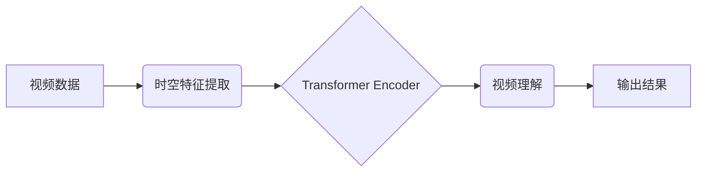

> 视频大模型、视频理解、计算机视觉、深度学习、Transformer、模型训练、工程实践

## 1. 背景介绍

近年来，深度学习技术取得了飞速发展，在图像识别、自然语言处理等领域取得了突破性进展。视频作为一种更丰富、更动态的数据类型，蕴含着更丰富的语义信息，其理解和应用也成为人工智能研究的热点领域。视频大模型作为一种强大的视频理解工具，能够从视频中提取关键信息，理解视频内容，并进行各种高级操作，例如视频分类、目标跟踪、动作识别、视频摘要等。

传统的视频理解方法通常依赖于手工设计的特征和规则，难以捕捉视频中的复杂时空关系。而视频大模型则通过学习大量的视频数据，自动提取视频特征，并建立起视频理解的内在机制，从而能够更准确、更有效地理解视频内容。

## 2. 核心概念与联系

视频大模型的核心概念包括：

* **视频数据:** 视频数据是视频大模型的训练数据，通常包含视频帧、音频信息、字幕等多种信息。
* **时空特征:** 视频数据具有时空特性，视频大模型需要学习视频帧之间的时空关系，才能准确理解视频内容。
* **深度学习:** 深度学习是视频大模型的核心技术，通过多层神经网络，学习视频数据的复杂特征。
* **Transformer:** Transformer是一种新型的神经网络架构，能够有效地学习视频帧之间的长距离依赖关系，在视频理解任务中取得了优异的性能。

**视频大模型架构**



## 3. 核心算法原理 & 具体操作步骤

### 3.1  算法原理概述

视频大模型的核心算法是基于Transformer架构的视频理解模型。Transformer模型通过自注意力机制，能够有效地学习视频帧之间的长距离依赖关系，从而捕捉视频中的复杂时空信息。

### 3.2  算法步骤详解

1. **视频预处理:** 将视频数据预处理，例如帧率调整、分辨率转换、数据增强等。
2. **时空特征提取:** 使用卷积神经网络（CNN）提取视频帧的时空特征。
3. **Transformer编码器:** 将提取的时空特征输入到Transformer编码器中，通过多层自注意力机制和前馈神经网络，学习视频帧之间的长距离依赖关系。
4. **解码器:** 使用Transformer解码器，根据编码器的输出，生成视频理解结果，例如视频分类、目标跟踪、动作识别等。

### 3.3  算法优缺点

**优点:**

* 能够有效地学习视频帧之间的长距离依赖关系。
* 在视频理解任务中取得了优异的性能。
* 能够处理不同长度和分辨率的视频数据。

**缺点:**

* 训练成本高，需要大量的计算资源和训练数据。
* 模型参数量大，部署成本较高。

### 3.4  算法应用领域

视频大模型在以下领域具有广泛的应用前景：

* **视频监控:** 视频分析、异常检测、目标跟踪。
* **视频编辑:** 视频剪辑、视频摘要、视频字幕生成。
* **视频娱乐:** 视频推荐、视频内容理解、虚拟现实体验。
* **医疗保健:** 病人诊断、手术辅助、远程医疗。

## 4. 数学模型和公式 & 详细讲解 & 举例说明

### 4.1  数学模型构建

视频大模型的数学模型主要基于Transformer架构，其核心是自注意力机制。

**自注意力机制**

自注意力机制能够学习视频帧之间的关系，并赋予每个帧不同的权重，从而更好地捕捉视频中的关键信息。

**公式:**

$$
Attention(Q, K, V) = softmax(\frac{QK^T}{\sqrt{d_k}})V
$$

其中：

* $Q$：查询矩阵
* $K$：键矩阵
* $V$：值矩阵
* $d_k$：键向量的维度

### 4.2  公式推导过程

自注意力机制的公式推导过程如下：

1. 将查询矩阵 $Q$、键矩阵 $K$ 和值矩阵 $V$ 进行矩阵乘法，得到一个分数矩阵。
2. 对分数矩阵进行softmax归一化，得到每个帧之间的注意力权重。
3. 将注意力权重与值矩阵 $V$ 进行加权求和，得到最终的输出。

### 4.3  案例分析与讲解

假设我们有一个视频序列，包含三个帧。

* $Q$：查询矩阵
* $K$：键矩阵
* $V$：值矩阵

通过计算 $QK^T$ 和 softmax 归一化，我们可以得到每个帧之间的注意力权重。例如，第一帧与第二帧的注意力权重为 0.6，表示第一帧对第二帧的信息更重要。

## 5. 项目实践：代码实例和详细解释说明

### 5.1  开发环境搭建

* 操作系统：Ubuntu 20.04
* Python 版本：3.8
* 深度学习框架：PyTorch 1.8

### 5.2  源代码详细实现

```python
import torch
import torch.nn as nn

class VideoTransformer(nn.Module):
    def __init__(self, embed_dim, num_heads, num_layers):
        super(VideoTransformer, self).__init__()
        self.encoder = nn.TransformerEncoder(
            nn.TransformerEncoderLayer(embed_dim, num_heads), num_layers
        )
        self.linear = nn.Linear(embed_dim, num_classes)

    def forward(self, x):
        x = self.encoder(x)
        x = self.linear(x[:, 0, :])  # 取最后一个时间步的输出
        return x
```

### 5.3  代码解读与分析

* `VideoTransformer` 类定义了视频Transformer模型。
* `__init__` 方法初始化模型参数，包括嵌入维度 `embed_dim`、注意力头数 `num_heads` 和 Transformer层数 `num_layers`。
* `forward` 方法定义了模型的正向传播过程。
* `encoder` 是 Transformer编码器，用于学习视频帧之间的时空关系。
* `linear` 是全连接层，用于将编码器的输出映射到输出类别。

### 5.4  运行结果展示

训练好的视频Transformer模型可以用于各种视频理解任务，例如视频分类、目标跟踪、动作识别等。

## 6. 实际应用场景

### 6.1  视频监控

视频大模型可以用于视频监控系统，例如：

* **异常检测:** 识别视频中异常行为，例如入侵、火灾、暴动等。
* **目标跟踪:** 跟踪视频中特定目标，例如人员、车辆等。
* **行为分析:** 分析视频中人员的行为，例如行走、停留、互动等。

### 6.2  视频编辑

视频大模型可以用于视频编辑系统，例如：

* **视频剪辑:** 自动剪辑视频，去除冗余部分，生成精简的视频。
* **视频摘要:** 生成视频的摘要，例如关键帧、关键事件等。
* **视频字幕生成:** 自动生成视频的字幕，方便用户观看和理解。

### 6.3  视频娱乐

视频大模型可以用于视频娱乐系统，例如：

* **视频推荐:** 根据用户的观看历史和偏好，推荐相关的视频。
* **视频内容理解:** 理解视频的内容，例如主题、人物、情节等。
* **虚拟现实体验:** 生成虚拟现实视频，提供沉浸式的观看体验。

### 6.4  未来应用展望

视频大模型在未来将有更广泛的应用场景，例如：

* **医疗保健:** 辅助医生诊断疾病、分析手术过程、提供远程医疗服务。
* **教育:** 自动生成视频课程、个性化学习辅导、虚拟课堂互动。
* **智能交通:** 分析交通视频，识别交通违规行为、预测交通流量、优化交通管理。

## 7. 工具和资源推荐

### 7.1  学习资源推荐

* **书籍:**
    * 《深度学习》
    * 《Transformer 详解》
* **在线课程:**
    * Coursera: 深度学习
    * Udacity: 自然语言处理
* **博客:**
    * Jay Alammar's Blog
    * Distill.pub

### 7.2  开发工具推荐

* **深度学习框架:** PyTorch, TensorFlow
* **视频处理库:** OpenCV, FFmpeg
* **云计算平台:** AWS, Google Cloud, Azure

### 7.3  相关论文推荐

* 《Attention Is All You Need》
* 《BERT: Pre-training of Deep Bidirectional Transformers for Language Understanding》
* 《Video Transformer》

## 8. 总结：未来发展趋势与挑战

### 8.1  研究成果总结

视频大模型在视频理解领域取得了显著进展，能够有效地学习视频帧之间的时空关系，并完成各种视频理解任务。

### 8.2  未来发展趋势

* **模型规模和性能提升:** 随着计算资源的不断发展，视频大模型的规模和性能将进一步提升。
* **多模态视频理解:** 将视频与其他模态数据，例如文本、音频、传感器数据等进行融合，实现更全面的视频理解。
* **边缘计算部署:** 将视频大模型部署到边缘设备，实现实时视频理解。

### 8.3  面临的挑战

* **数据标注成本高:** 视频数据标注成本高昂，难以获取高质量的标注数据。
* **模型训练成本高:** 视频大模型训练成本高，需要大量的计算资源和时间。
* **模型解释性差:** 视频大模型的决策过程难以解释，缺乏可解释性。

### 8.4  研究展望

未来研究将重点关注以下方面：

* **高效的数据标注方法:** 开发高效的数据标注方法，降低视频数据标注成本。
* **高效的模型训练方法:** 研究高效的模型训练方法，降低视频大模型训练成本。
* **可解释性增强:** 研究增强视频大模型可解释性的方法，提高模型的透明度和信任度。

## 9. 附录：常见问题与解答

**Q1: 视频大模型的训练数据有哪些？**

**A1:** 视频大模型的训练数据通常包含公开的视频数据集，例如 Kinetics、UCF101、HMDB51 等。

**Q2: 视频大模型的训练需要哪些硬件资源？**

**A2:** 视频大模型的训练需要强大的计算资源，例如 GPU 或者 TPU。

**Q3: 视频大模型的应用场景有哪些？**

**A3:** 视频大模型的应用场景非常广泛，例如视频监控、视频编辑、视频娱乐、医疗保健、教育等。


作者：禅与计算机程序设计艺术 / Zen and the Art of Computer Programming 
<end_of_turn>