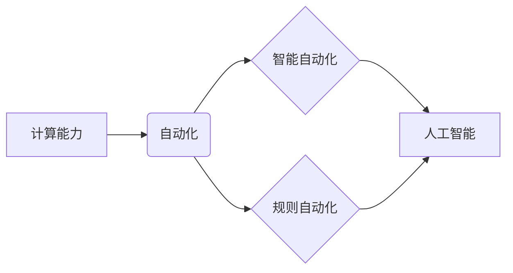

> 计算能力、自动化、机器学习、深度学习、人工智能、算法、效率、成本、未来趋势

## 1. 背景介绍

自动化一直是人类社会进步的驱动力，从工业革命的机械化生产到现代信息技术的数字化管理，自动化技术不断革新，提高了生产效率、降低了成本，并深刻地改变了人类的生活方式。而计算能力的飞速发展，特别是近年来人工智能（AI）的兴起，为自动化领域带来了前所未有的机遇和挑战。

随着摩尔定律的持续演进，计算机处理器性能不断提升，存储容量和网络带宽也得到显著扩展。这些计算资源的丰富，为训练和部署复杂的机器学习模型提供了坚实的基础。同时，深度学习算法的突破性进展，使得机器能够从海量数据中学习，并自动完成复杂的认知任务，如图像识别、自然语言处理、语音识别等。

## 2. 核心概念与联系

**2.1 自动化**

自动化是指利用技术手段，使生产、工作或其他过程无需人工干预即可自动完成的过程。它可以分为：

* **规则自动化:** 基于预先定义的规则和逻辑，自动执行特定任务。例如，根据预设条件自动发送邮件、执行代码部署等。
* **智能自动化:** 利用机器学习等人工智能技术，使系统能够从数据中学习，并自动调整行为，完成更复杂的任务。例如，自动驾驶汽车、智能客服机器人等。

**2.2 计算能力**

计算能力是指计算机系统处理信息的速率和效率。它主要取决于处理器性能、内存容量、存储速度和网络带宽等因素。计算能力的提升是推动自动化领域发展的关键驱动力。

**2.3 人工智能 (AI)**

人工智能是指模拟人类智能行为的计算机系统。它包括多个子领域，如机器学习、深度学习、自然语言处理、计算机视觉等。AI技术为自动化领域带来了更强大的智能化能力，使系统能够更智能地感知、理解和响应环境。

**2.4 核心概念关系图**



## 3. 核心算法原理 & 具体操作步骤

**3.1 算法原理概述**

机器学习算法是人工智能的核心，它使计算机能够从数据中学习，并自动完成任务。常见的机器学习算法包括：

* **监督学习:** 利用标记数据训练模型，预测未知数据。例如，图像分类、文本分类等。
* **无监督学习:** 从未标记数据中发现模式和结构。例如，聚类分析、异常检测等。
* **强化学习:** 通过试错学习，在环境中获得最大奖励。例如，游戏AI、机器人控制等。

**3.2 算法步骤详解**

以监督学习为例，其基本步骤如下：

1. **数据收集和预处理:** 收集相关数据，并进行清洗、转换、特征工程等预处理操作。
2. **模型选择:** 根据任务需求选择合适的机器学习模型。
3. **模型训练:** 利用标记数据训练模型，调整模型参数，使其能够准确预测未知数据。
4. **模型评估:** 使用测试数据评估模型的性能，并进行调优。
5. **模型部署:** 将训练好的模型部署到实际应用场景中。

**3.3 算法优缺点**

* **优点:**

    * 自动化学习，无需人工编程。
    * 能够处理复杂数据，发现隐藏模式。
    * 性能不断提升，应用范围不断扩展。

* **缺点:**

    * 需要大量数据进行训练。
    * 模型解释性较差，难以理解模型决策过程。
    * 容易受到数据偏差的影响。

**3.4 算法应用领域**

机器学习算法广泛应用于各个领域，例如：

* **图像识别:** 人脸识别、物体检测、图像分类等。
* **自然语言处理:** 文本分类、情感分析、机器翻译等。
* **语音识别:** 语音转文本、语音助手等。
* **推荐系统:** 商品推荐、内容推荐等。
* **医疗诊断:** 疾病预测、影像分析等。

## 4. 数学模型和公式 & 详细讲解 & 举例说明

**4.1 数学模型构建**

机器学习模型通常可以看作是输入数据和输出结果之间的映射关系。例如，线性回归模型可以表示为：

$$y = w_0 + w_1x_1 + w_2x_2 + ... + w_nx_n + \epsilon$$

其中：

* $y$ 是预测结果。
* $x_1, x_2, ..., x_n$ 是输入特征。
* $w_0, w_1, w_2, ..., w_n$ 是模型参数。
* $\epsilon$ 是误差项。

**4.2 公式推导过程**

模型参数的学习过程通常使用梯度下降算法。梯度下降算法的目标是找到使模型预测结果与真实结果误差最小化的参数值。

梯度下降算法的基本公式为：

$$w_{i} = w_{i} - \alpha \frac{\partial Loss}{\partial w_{i}}$$

其中：

* $w_i$ 是模型参数。
* $\alpha$ 是学习率。
* $\frac{\partial Loss}{\partial w_i}$ 是损失函数对参数 $w_i$ 的梯度。

**4.3 案例分析与讲解**

假设我们想要训练一个线性回归模型来预测房价。输入特征包括房屋面积、房间数量、地理位置等，输出结果是房价。

我们可以使用梯度下降算法来训练模型，并通过损失函数来评估模型性能。损失函数通常选择均方误差，即预测结果与真实结果的平方差的平均值。

通过不断迭代，模型参数会逐渐收敛到使损失函数最小化的值，从而实现对房价的准确预测。

## 5. 项目实践：代码实例和详细解释说明

**5.1 开发环境搭建**

* 操作系统: Ubuntu 20.04
* Python 版本: 3.8
* 必要的库: numpy, pandas, scikit-learn

**5.2 源代码详细实现**

```python
import numpy as np
from sklearn.linear_model import LinearRegression
from sklearn.model_selection import train_test_split

# 加载数据
data = np.loadtxt('house_data.csv', delimiter=',')
X = data[:, :-1]  # 特征
y = data[:, -1]  # 目标值

# 数据分割
X_train, X_test, y_train, y_test = train_test_split(X, y, test_size=0.2, random_state=42)

# 创建线性回归模型
model = LinearRegression()

# 模型训练
model.fit(X_train, y_train)

# 模型预测
y_pred = model.predict(X_test)

# 模型评估
from sklearn.metrics import mean_squared_error
mse = mean_squared_error(y_test, y_pred)
print(f'Mean Squared Error: {mse}')
```

**5.3 代码解读与分析**

* 首先，我们加载数据并将其分割为训练集和测试集。
* 然后，我们创建线性回归模型并使用训练集进行训练。
* 训练完成后，我们使用测试集进行预测，并计算模型的均方误差来评估模型性能。

**5.4 运行结果展示**

运行代码后，会输出模型的均方误差值，该值越小，模型的预测精度越高。

## 6. 实际应用场景

**6.1 工业自动化**

* **机器人控制:** 机器人可以利用机器学习算法自动完成复杂的任务，例如焊接、喷漆、装配等。
* ** Predictive Maintenance:** 通过分析传感器数据，预测设备故障，提前进行维护，降低停机时间和维修成本。
* **质量控制:** 利用计算机视觉技术，自动识别产品缺陷，提高产品质量。

**6.2 商业自动化**

* **客户服务:** 智能客服机器人可以自动回答客户常见问题，提高服务效率。
* **营销自动化:** 利用机器学习算法，分析客户行为，进行精准营销。
* **财务自动化:** 自动化账单处理、发票识别等财务流程，提高效率和准确性。

**6.3 其他领域**

* **医疗保健:** 自动化诊断、药物研发、患者监测等。
* **教育:** 个性化学习、自动批改作业等。
* **交通运输:** 自动驾驶汽车、交通流量管理等。

**6.4 未来应用展望**

随着计算能力的持续提升和人工智能技术的不断发展，自动化将更加广泛地应用于各个领域，例如：

* **更智能的自动化:** 利用深度学习等更高级的人工智能技术，使自动化系统更加智能、灵活和适应性强。
* **边缘计算自动化:** 将自动化计算能力部署到边缘设备，实现更快速的响应和更低的延迟。
* **协同自动化:** 人工智能与人类协同工作，发挥各自优势，提高工作效率和创造力。

## 7. 工具和资源推荐

**7.1 学习资源推荐**

* **在线课程:** Coursera, edX, Udacity 等平台提供丰富的机器学习和人工智能课程。
* **书籍:** 《深入理解机器学习》、《Python机器学习实战》等书籍。
* **博客和论坛:** Kaggle, Towards Data Science 等平台提供大量机器学习和人工智能相关的博客文章和讨论论坛。

**7.2 开发工具推荐**

* **Python:** 机器学习和人工智能开发的常用语言。
* **TensorFlow:** Google 开发的开源深度学习框架。
* **PyTorch:** Facebook 开发的开源深度学习框架。
* **Scikit-learn:** Python 的机器学习库。

**7.3 相关论文推荐**

* **AlphaGo:** DeepMind 发布的围棋人工智能系统。
* **BERT:** Google 发布的自然语言处理模型。
* **GPT-3:** OpenAI 发布的文本生成模型。

## 8. 总结：未来发展趋势与挑战

**8.1 研究成果总结**

近年来，人工智能技术取得了长足进步，自动化领域也发生了革命性的变化。机器学习算法的突破性进展，使得自动化系统更加智能、高效和灵活。

**8.2 未来发展趋势**

* **更强大的计算能力:** 量子计算、神经形态计算等新兴计算技术将进一步提升计算能力，推动人工智能和自动化领域的发展。
* **更智能的算法:** 深度学习、强化学习等算法将不断发展，使自动化系统更加智能、适应性和创造力强。
* **更广泛的应用:** 自动化将应用于更多领域，例如医疗保健、教育、交通运输等，改变人们的生活方式。

**8.3 面临的挑战**

* **数据安全和隐私:** 自动化系统依赖大量数据，如何保障数据安全和隐私是一个重要的挑战。
* **算法偏见:** 机器学习算法容易受到数据偏差的影响，导致算法偏见，需要采取措施解决这个问题。
* **伦理问题:** 自动化技术的发展引发了一些伦理问题，例如工作岗位替代、人工智能的责任等，需要进行深入探讨和研究。

**8.4 研究展望**

未来，自动化领域的研究将更加注重以下几个方面：

* **开发更安全、更可靠的自动化系统。**
* **解决算法偏见和伦理问题。**
* **探索自动化与人类协同工作的新模式。**


## 9. 附录：常见问题与解答

**9.1 如何选择合适的机器学习算法？**

选择合适的机器学习算法取决于具体的应用场景和数据特点。例如，对于分类问题，可以考虑使用逻辑回归、支持向量机、决策树等算法；对于回归问题，可以考虑使用线性回归、支持向量回归、随机森林等算法。

**9.2 如何评估机器学习模型的性能？**

常用的机器学习模型性能评估指标包括准确率、召回率、F1-score、AUC等。选择合适的评估指标取决于具体的应用场景和任务目标。

**9.3 如何处理机器学习算法中的数据偏差？**

数据偏差是机器学习算法的一个常见问题，可以通过以下方法进行处理：

* 使用更全面、更代表性的数据集。
* 使用