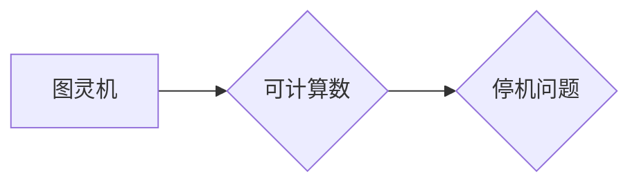

> 图灵机，可计算数，停机问题，计算理论，算法复杂度，逻辑学

## 1. 背景介绍

20世纪30年代，计算机科学正处于萌芽阶段。人们对计算的本质和极限抱有诸多疑问。当时，人们普遍认为，计算是通过机械操作实现的，而机械操作的范围是有限的。然而，随着逻辑学和数学的发展，人们开始意识到，计算可能不仅仅局限于机械操作，而是一种更抽象的、更普遍的现象。

在这个背景下，英国数学家艾伦·图灵（Alan Turing）提出了他的著名论文《On Computable Numbers, with an Application to the Entscheidungsproblem》（关于可计算数及其应用于判定问题），标志着计算理论的诞生。

图灵机是图灵提出的一个抽象模型，它模拟了任何一台计算机的计算过程。图灵机由一个无限长的带、一个读写头和一个状态机组成。带上的符号可以是任何东西，读写头可以读取和写入带上的符号，状态机则控制读写头的动作和状态的转换。通过一系列的规则，图灵机可以执行任何算法。

图灵的论文提出了一个重要的概念：可计算数。可计算数是指可以通过图灵机在有限时间内计算出来的数。图灵证明了，任何一个可以通过算法计算出来的数都是可计算数。

## 2. 核心概念与联系

图灵机、可计算数和停机问题是计算理论的核心概念，它们之间有着密切的联系。

**Mermaid 流程图：**



* **图灵机:**  图灵机是一个抽象的计算模型，它可以模拟任何一台计算机的计算过程。
* **可计算数:** 可计算数是指可以通过图灵机在有限时间内计算出来的数。
* **停机问题:** 停机问题是指判断一个给定的程序是否会在有限时间内停止执行。

图灵机可以用来计算任何可计算数，而停机问题则是判断一个程序是否能够在有限时间内计算出某个可计算数。

## 3. 核心算法原理 & 具体操作步骤

### 3.1  算法原理概述

图灵机的核心算法原理是通过一系列的规则，控制读写头的动作和状态的转换，从而实现对数据的处理。

图灵机的算法可以看作是一个状态机，它由以下几个部分组成：

* **状态集:** 图灵机的状态集是一个有限的集合，每个状态代表图灵机的当前状态。
* **输入符号集:** 图灵机的输入符号集是一个有限的集合，每个符号代表图灵机可以处理的数据。
* **输出符号集:** 图灵机的输出符号集是一个有限的集合，每个符号代表图灵机可以输出的数据。
* **转移函数:** 转移函数是一个从状态集、输入符号集到状态集、输出符号集和读写头移动方向的映射。

### 3.2  算法步骤详解

图灵机的算法执行步骤如下：

1. **初始化:** 将图灵机置于初始状态，并将输入数据加载到带子上。
2. **读取:** 图灵机读取带子上当前位置的符号。
3. **根据转移函数确定下一步动作:** 根据当前状态、读取到的符号和转移函数，图灵机确定下一步的动作，包括：
    * **写入符号:** 将一个新的符号写入带子上。
    * **移动读写头:** 将读写头向左或向右移动。
    * **改变状态:** 将图灵机状态改变到新的状态。
4. **重复步骤2和3:** 图灵机重复步骤2和3，直到达到终止状态。

### 3.3  算法优缺点

**优点:**

* **通用性:** 图灵机可以模拟任何一台计算机的计算过程，因此它具有很强的通用性。
* **简洁性:** 图灵机的模型非常简洁，只需要几个简单的组件就可以实现复杂的计算。
* **完备性:** 图灵机可以计算任何可计算数，这意味着它可以解决任何可以通过算法解决的问题。

**缺点:**

* **效率:** 图灵机的计算效率可能不如实际计算机，因为图灵机是一个抽象模型，没有考虑实际硬件的限制。
* **复杂性:** 尽管图灵机的模型很简洁，但实际实现一个图灵机的程序可能非常复杂。

### 3.4  算法应用领域

图灵机的算法原理被广泛应用于计算机科学各个领域，例如：

* **编译器设计:** 编译器使用图灵机的算法来分析和转换源代码。
* **人工智能:** 人工智能算法也经常使用图灵机的算法原理来模拟人类的思考过程。
* **密码学:** 密码学算法也利用图灵机的算法原理来实现加密和解密。

## 4. 数学模型和公式 & 详细讲解 & 举例说明

### 4.1  数学模型构建

图灵机的数学模型可以描述为一个五元组：

$$M = (Q, \Sigma, \Gamma, \delta, q_0)$$

其中：

* $Q$ 是状态集，是一个有限集。
* $\Sigma$ 是输入符号集，也是一个有限集。
* $\Gamma$ 是带符号集，是一个有限集，包含 $\Sigma$ 和一个特殊的空白符号 $\sqcup$。
* $\delta$ 是转移函数，是一个从 $Q \times \Gamma$ 到 $Q \times \Gamma \times \{L, R\}$ 的映射，其中 $L$ 表示向左移动，$R$ 表示向右移动。
* $q_0$ 是初始状态，属于 $Q$。

### 4.2  公式推导过程

图灵机的计算过程可以描述为一个状态转移序列。

给定一个输入字符串 $w$，图灵机从初始状态 $q_0$ 开始，按照转移函数 $\delta$ 的规则，依次读取带上的符号，写入新的符号，移动读写头，改变状态。

每个状态转移可以表示为一个元组 $(q, a, q', a', d)$，其中：

* $q$ 是当前状态。
* $a$ 是当前读写头读取到的符号。
* $q'$ 是下一个状态。
* $a'$ 是下一个要写入的符号。
* $d$ 是读写头的移动方向，可以是 $L$ 或 $R$。

通过一系列状态转移，图灵机最终会到达一个终止状态，此时计算结束。

### 4.3  案例分析与讲解

例如，考虑一个简单的图灵机，它用来计算一个整数的加法。

* 状态集 $Q = \{q_0, q_1, q_2\}$
* 输入符号集 $\Sigma = \{0, 1\}$
* 带符号集 $\Gamma = \{0, 1, \sqcup\}$
* 转移函数 $\delta$ 可以定义如下：

```
(q_0, 0) -> (q_1, 0, L)
(q_0, 1) -> (q_1, 1, L)
(q_1, 0) -> (q_1, 0, L)
(q_1, 1) -> (q_2, 0, R)
(q_2, 0) -> (q_2, 0, R)
(q_2, 1) -> (q_2, 1, R)
```

* 初始状态 $q_0$

这个图灵机可以用来计算两个整数的加法。

## 5. 项目实践：代码实例和详细解释说明

### 5.1  开发环境搭建

为了实现图灵机的模拟，我们可以使用 Python 语言进行编程。

需要安装 Python 语言环境和必要的库，例如：

* Python 3.x
* NumPy

### 5.2  源代码详细实现

```python
class TuringMachine:
    def __init__(self, states, alphabet, tape, transition_function, initial_state):
        self.states = states
        self.alphabet = alphabet
        self.tape = tape
        self.transition_function = transition_function
        self.current_state = initial_state
        self.head_position = 0

    def step(self):
        current_symbol = self.tape[self.head_position]
        next_state, next_symbol, direction = self.transition_function[(self.current_state, current_symbol)]
        self.tape[self.head_position] = next_symbol
        self.current_state = next_state
        if direction == 'L':
            self.head_position -= 1
        elif direction == 'R':
            self.head_position += 1

    def run(self):
        while self.current_state != 'halt':
            self.step()

# 示例代码
states = {'q0', 'q1', 'q2', 'halt'}
alphabet = {'0', '1'}
tape = ['0'] * 100
transition_function = {
    ('q0', '0'): ('q1', '0', 'L'),
    ('q0', '1'): ('q1', '1', 'L'),
    ('q1', '0'): ('q1', '0', 'L'),
    ('q1', '1'): ('q2', '0', 'R'),
    ('q2', '0'): ('q2', '0', 'R'),
    ('q2', '1'): ('q2', '1', 'R'),
}
initial_state = 'q0'

tm = TuringMachine(states, alphabet, tape, transition_function, initial_state)
tm.run()
print(tm.tape)
```

### 5.3  代码解读与分析

这段代码实现了图灵机的基本功能。

* `TuringMachine` 类定义了图灵机的状态、符号、带、转移函数和当前状态等属性。
* `step()` 方法模拟了图灵机的单步计算过程。
* `run()` 方法模拟了图灵机的运行过程，直到到达终止状态。

### 5.4  运行结果展示

运行这段代码后，会输出图灵机计算后的带内容。

## 6. 实际应用场景

图灵机的理论应用场景非常广泛，例如：

* **计算机科学基础:** 图灵机是计算机科学的基础概念，它帮助我们理解计算的本质和极限。
* **算法设计:** 图灵机的算法原理可以用于设计和分析各种算法。
* **人工智能:** 人工智能算法也经常使用图灵机的算法原理来模拟人类的思考过程。
* **密码学:** 密码学算法也利用图灵机的算法原理来实现加密和解密。

### 6.4  未来应用展望

随着计算机科学的发展，图灵机的理论应用场景将会更加广泛。例如：

* **量子计算:** 量子计算可以利用图灵机的原理，实现更强大的计算能力。
* **脑科学:** 研究人员试图利用图灵机的原理来模拟大脑的计算过程。

## 7. 工具和资源推荐

### 7.1  学习资源推荐

* **《计算理论导论》:**  Alan Turing 的经典著作，介绍了图灵机的概念和应用。
* **《计算机科学导论》:**  许多计算机科学入门书籍都介绍了图灵机的概念。
* **在线课程:**  Coursera、edX 等平台上有一些关于计算理论的在线课程。

### 7.2  开发工具推荐

* **Python:**  Python 是一种非常适合用于编程和模拟图灵机的语言。
* **Jupyter Notebook:**  Jupyter Notebook 是一种交互式编程环境，可以方便地进行图灵机的模拟和实验。

### 7.3  相关论文推荐

* **On Computable Numbers, with an Application to the Entscheidungsproblem:**  Alan Turing 的经典论文，介绍了图灵机的概念和停机问题的证明。
* **The Undecidability of the Halting Problem:**  Alan Turing 的另一篇重要论文，证明了停